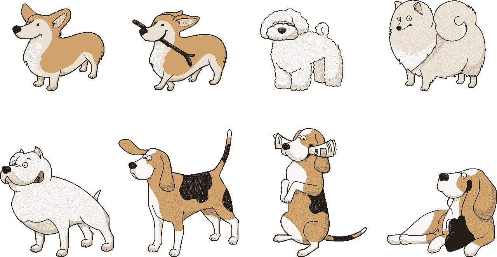
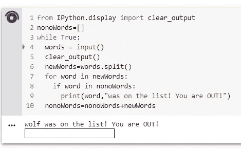
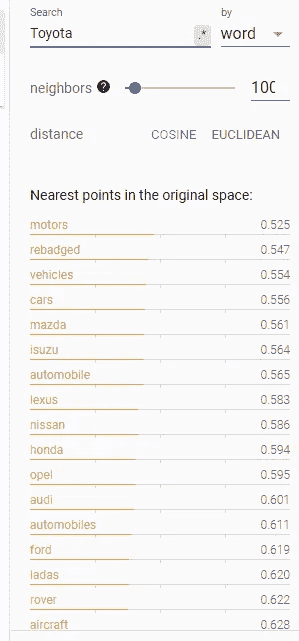
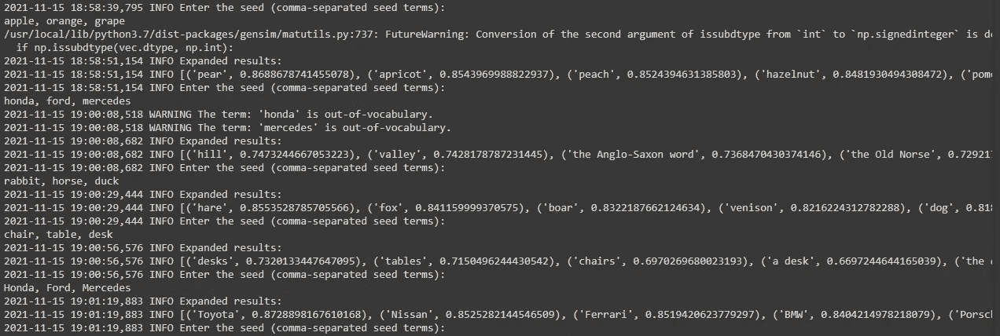

# 机器人游戏

> 原文：<https://towardsdatascience.com/games-for-bots-7a73ad2c70?source=collection_archive---------33----------------------->

## 人工智能很难

## 使用 NLP 列出多组事物



图片由 [GraphicMama-team](https://pixabay.com/users/graphicmama-team-2641041/?utm_source=link-attribution&utm_medium=referral&utm_campaign=image&utm_content=1417208) 从 [Pixabay](https://pixabay.com/?utm_source=link-attribution&utm_medium=referral&utm_campaign=image&utm_content=1417208) 在[这个地址](https://pixabay.com/vectors/dog-animal-corgi-beagle-bolonka-1417208/)拍摄。

在这篇文章中，我们将深入研究在一个计算机化的系统中由人类[参与者](https://en.wikipedia.org/wiki/Actor_(UML)#:~:text=An%20actor%20in%20the%20Unified,is%20external%20to%20the%20subject.%22)执行的任务的自动化。

在 2020 年的一次关闭期间，我为我的孩子创造了一个简单的记忆游戏，让他们在睡觉前玩。记忆游戏是这样的:

1.  选择一个主题(例如，食物)
2.  轮流说出适合该主题的事物的名称(如黄瓜、西红柿)。我们后来添加了一个规则，你只能给未加工的东西命名，因为我们得到了近似的复制品(例如，芝麻面包、洋葱面包、肉桂面包、十字面包等)。).
3.  你命名的每一个事物都被隐藏起来，这样你就能记住哪些事物已经被命名了。如果你连续玩了几个游戏，记得听到了一个名字，但不记得是这个游戏还是之前的游戏，那就更难了。
4.  如果你在游戏中说了别人已经说过的话，你就出局了，不能再轮流上场。

孩子们被鼓励编造答案以推迟就寝时间。这是游戏的代码:

是的，10 行。这就是你所需要的。它在 jupyter 笔记本上运行。

下面是游戏运行的一个简单例子:

```
Player 1: Cucumber
Player 2: Lettuce
Player 1: Banana
Player 2: Celery
Player 1: Apple
Player 2: Cucumber
Computer: Cucumber was on the list! You are OUT!
```

然后一号玩家赢了。



在 Collab 笔记本上运行的记忆游戏示例。图片由作者提供。

我们最终增加了第二个游戏，它更注重词汇而不是记忆，你必须猜一个单词是真是假。真词来自一个大列表，假词来自另一个大列表。

下面是第二个游戏的代码:

像第一个游戏一样，每个人在开始时轮流，越来越少的玩家幸存下来，直到只剩下一个玩家(赢家)。

今年，我对自己说，这些游戏可以作为一个机器学习项目的试验场。第二个游戏可以用字典或其他一些基于记忆的方法来解决。然而，关于第一个游戏(记忆游戏)，你注意到的第一件事是，在代码中没有关于选择什么是好单词的规则。这只是我在我们玩的时候强调我认为有意义的新词。

## 自动化记忆游戏

我们需要做的第一件事是为更结构化的实现准备内存游戏。话题选择(如食物)不在规范范围内。在与人对战的电脑版本中，我们需要明确主题选择。我们可以在游戏开始时从主题中挑选 5 个单词来定义主题，而不是列出每个可能的主题和主题中的单词。这在学术文献中被称为 [**种子集**](https://arxiv.org/abs/1808.08953) 。这方面的研究工作还有很多例子，比如[这个](https://dl.acm.org/doi/abs/10.1145/3331184.3331359)和[这个](https://dl.acm.org/doi/abs/10.1145/3366423.3380284)。

为了使我们的代码能够玩游戏，我们需要让我们的计算机游戏玩家在它还没有看到的主题中选择单词。您可能想知道这项任务有什么新内容。为什么不简单地使用嵌入向量相似性，并获得与某个起始单词相似的单词集？例如，word2vec 和 fasttext 具有相似的单词方法:

```
[word_vectors.most_similar](https://radimrehurek.com/gensim/models/keyedvectors.html) in gensim
[model.get_nearest_neighbors](https://fasttext.cc/docs/en/unsupervised-tutorial.html) in fasttext
```

答案是，词语语境相似不代表话题相似。在找和‘本田’同话题的词时，我们不要‘可靠’这个词。相反，我们想要“丰田”和“特斯拉”这样的词。尽管语义的相似性正在把我们带到我们想要去的地方，但是仅仅是相似的上下文还不足以从我们的主题词种子集中产生一个主题。



在“Word2Vec All”数据集中嵌入单词“Toyota”的投影结果。我们可以在列表中看到飞机、发动机和车辆，它们与单词“Toyota”相关，但不在我们要表达的汽车名称的主题中。图片由作者提供。

最近的工作叫做 FUSE，有一个很好的 MIT 许可，在这里[可以得到](https://github.com/WanzhengZhu/FUSE.git)，来自论文“ [FUSE:通过 Skip-grams 的相干聚类进行多面集合扩展](https://arxiv.org/pdf/1910.04345.pdf)”。虽然他们不提供数据集，但我们可以尝试使用我们自己的维基百科数据集或类似的开源文本数据集。我们首先按照保险丝安装说明中的指示，为 gloVe 和 BERT 抓取预训练模型。这个冒险的完整代码可以在 [**这里**](https://github.com/dcshapiro/seriously-a-repo-just-to-upload-one-file-for-an-article/blob/main/Games_for_Bots.ipynb) **:** 找到

<https://github.com/dcshapiro/seriously-a-repo-just-to-upload-one-file-for-an-article/blob/main/Games_for_Bots.ipynb>  

**我的第一次尝试**是使用[提供的 45471 个句子的数据集](https://github.com/WanzhengZhu/FUSE/tree/master/data)来训练集合扩展模型。它太小了，因此，正如[在代码说明](https://github.com/WanzhengZhu/FUSE#Data)中指出的，它无法生成簇。聚类代码删除小的聚类。我没有试图联系提到的第三方以访问他们的数据集，这似乎是一个私人数据集。

对于我的第二次尝试，我将 NLTK 数据库 gutenberg、就职、brown 和 webtext 合并成一个 186，670 个句子的语料库。FUSE 集群代码仍然会删除小的集群，所以我删除了集群删除代码。结果很差。例如，给定种子词' apple '，' orange '和' grape '，返回的扩展集是['music '，' black '，' musical '，'葡萄'，' white '，' gold '，' live '，'名人'，' green '，' red '，' royal '，' star '，' best '，' rock '，' new '，' commercial '，' radio '，' country '，' tv '，' national']。所以，我计划尝试一个更大的数据集。

对于**我的第三次尝试**，我打算在更大的 [c4 数据集](https://huggingface.co/datasets/allenai/c4)上进行训练，但后来我意识到我可以尝试[另一个预训练库](https://github.com/IntelLabs/nlp-architect)，这一次是来自以色列[英特尔实验室](https://intellabs.github.io/nlp-architect/term_set_expansion.html)。实际上，我把[和](https://arxiv.org/abs/1808.08953)联系到了上面的研究中，但是先尝试了 FUSE。我想那只是我的运气。



英特尔 set 扩展预训练模型的输出示例。图片由作者提供。

英特尔集合扩展解决方案在第一次尝试中就成功了。他们的演示包中还有一个服务器版本和一个用户界面。以下是我最初实验的一些有趣结果:

1.  **种子词:**'苹果'，'橘子'，'葡萄'。**扩展列表:**‘梨’，‘杏’，‘桃’，‘榛子’，‘石榴’，‘樱桃’，‘草莓’，‘李子’，‘薰衣草’，‘杏仁’
2.  **种子词:**'兔'，'马'，'鸭'。**扩展列表:**'野兔'，'狐狸'，'野猪'，'鹿肉'，'狗'，'鹧鸪'，'鸸鹋'，'猪'，'鸽子'，'鹰'
3.  **种子词:'**椅子'，'桌子'，'书桌'。**扩展列表:**‘书桌’，‘桌子’，‘椅子’，‘书桌’，‘梳妆台’，‘木板’，‘沙发’，‘椅子’，‘小桌子’，‘抽屉’。我们现在可以看到，该模型没有认识到一个对象的单数和复数形式是同一事物(例如，“书桌”与“书桌”)。该模型还没有删除停用词(例如，“书桌”与“书桌”以及“椅子”与“椅子”)。这可以通过简单的后处理步骤来解决。
4.  **种子词:**本田、福特、奔驰。**扩展列表:**'山'，'谷'，'盎格鲁-撒克逊词'，'古斯堪的纳维亚语'，'设防的地方'，'福特'，'格伦'，'凯尔特词'，'福特'，'摩尔人'。我们可以看到这个案子非常失败。“本田”和“梅赛德斯”这两个词不在车型词汇表中。这表明该模型区分大小写。由于只剩下单词“ford ”,该模型找到了在单词“ford”附近带有向量的单词。如果我们改为利用汽车品牌名称，我们会得到更好的结果。**种子词:'**本田'，'福特'，'奔驰'。**扩展列表:**'丰田'，'日产'，'法拉利'，'宝马'，'保时捷'，'雷诺'，'捷豹'，'马自达'，'迈凯轮'，'梅赛德斯-奔驰'

注意，汽车名称不像 word2vec 结果那样包含与汽车相关的其他内容。这太棒了！

## 结论

我们现在可以看到，人们玩的某些文字游戏也可以被电脑玩。要做到这一点，需要训练计算机理解主题中包含的单词，集合扩展是实现这一能力的一种很好的方式。这些模型可以微调，也可以从头开始训练。

这篇文章的代码是[，可以在这里找到](https://github.com/dcshapiro/seriously-a-repo-just-to-upload-one-file-for-an-article/blob/main/Games_for_Bots.ipynb)。

如果你喜欢这篇文章，那么看看我过去最常读的一些文章，比如“[如何给人工智能项目定价](https://medium.com/towards-data-science/how-to-price-an-ai-project-f7270cb630a4)”和“[如何聘请人工智能顾问](https://medium.com/towards-data-science/why-hire-an-ai-consultant-50e155e17b39)”还有嘿，[加入快讯](http://eepurl.com/gdKMVv)！

下次见！

——丹尼尔
linkedin.com/in/dcshapiroT21
丹尼尔@lemay.ai