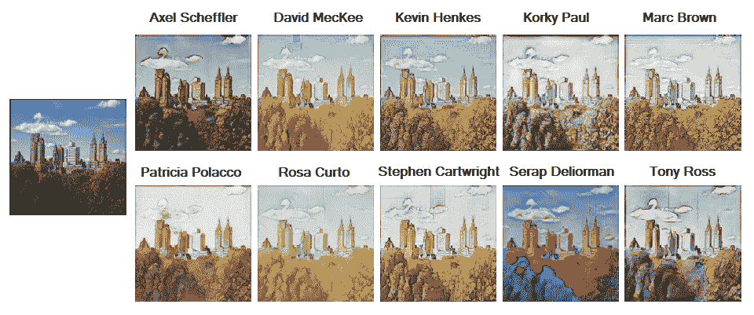
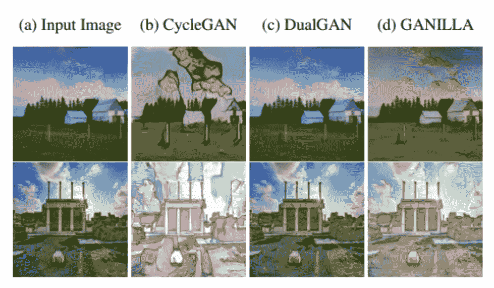
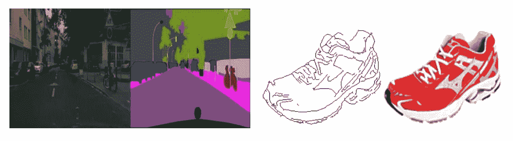
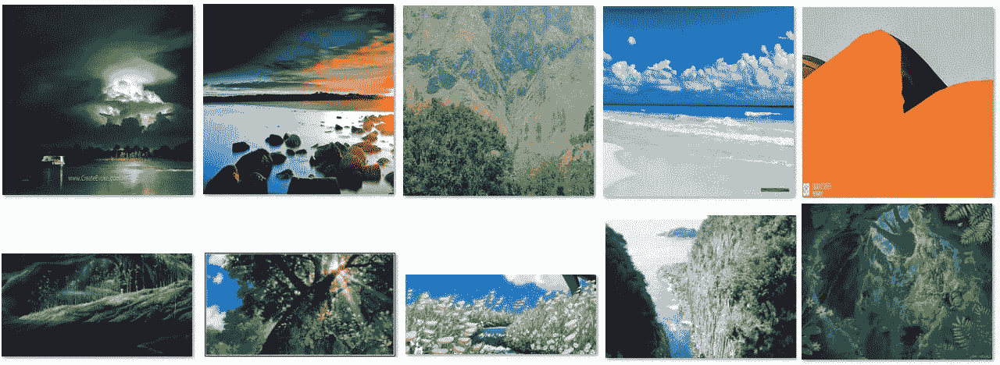
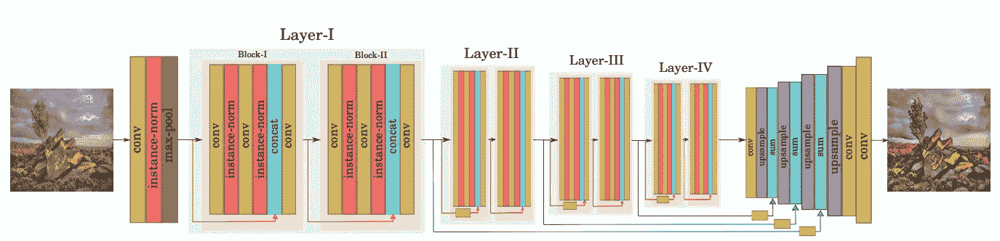
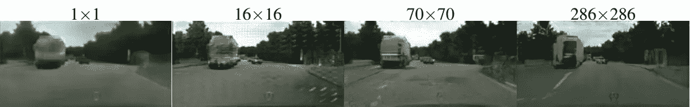
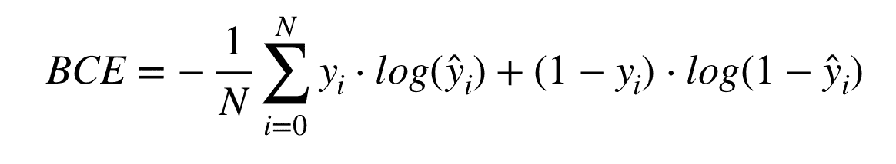
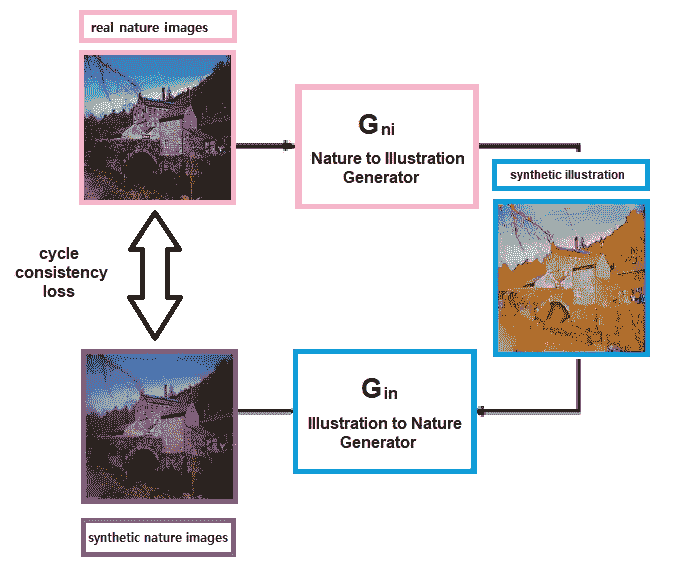
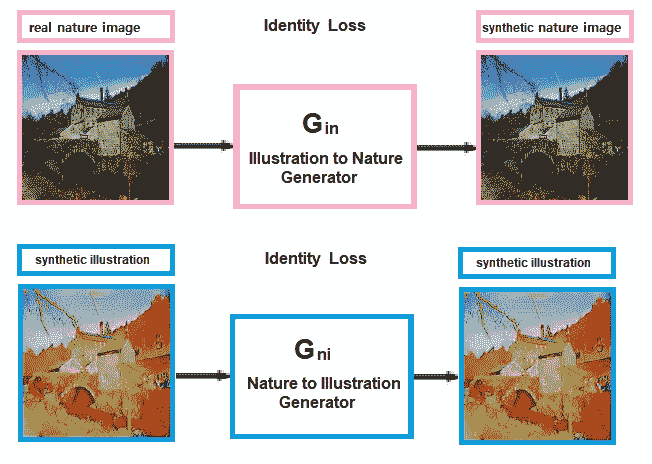
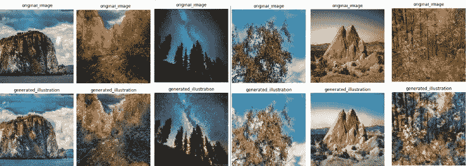

# 加尼拉——幻想增强版

> 原文：<https://towardsdatascience.com/ganilla-fantasy-enhanced-d4918681820c?source=collection_archive---------22----------------------->

## 当人工智能和出色的插图画家携手点燃我们的想象力

***由*** [***李奥达甘***](https://medium.com/@liork.dagan)*[***李龙索夫***](https://medium.com/@lironsoffer)*[***达芙娜******。***](https://medium.com/@dafna.mordechai)**

**在儿童故事中，世界充满了奇迹，疯狂的事情每天都在发生，你发现自己坐在人行道上靠近精灵或仙女也并不罕见。这种魔力在儿童书籍中栩栩如生，伴随着故事可以找到精彩的插图。但是如果机器可以为我们创造这种魔力呢？GANILLA 就是这样一个神经网络，在这篇博文中，我们将向你展示如何做到这一点！**

## **什么是加尼拉？**

**GANILLA 是 GAN ( **生成对抗网络**)的一种，它解决了儿童书籍插图领域的**图像到图像的翻译问题**。在实践中，当你提供一张照片给一个训练有素的 GANILLA 模型时，它会根据特定插图画家的风格输出输入图像的插图。
在下图中，您可以在左侧看到一个输入图像，以及十个不同的输出图像——这是将输入图像输入到十个经过训练的模型的结果，每个模型都使用不同 illustrator 的数据进行训练。**

****

**行动中的加尼拉:一个输入图像，十个不同的输出结果，模仿不同的插图艺术家(图像来源:加尼拉的论文: [arXiv:2002.05638v2](https://arxiv.org/abs/2002.05638v2) )**

**虽然在加尼拉之前就有其他伟大的图像到图像的翻译模型，但这项工作有两个主要的创新点。虽然当前最先进的图像到图像翻译模型成功地传递了风格或内容，但是它们有时不能同时传递两者。在下面的图片中，你可以看到一个例子，其中 GANILLA 保留了原始输入照片的内容和所需插画师的风格。**

****

**与 CycleGAN 和 DualGan 相比，GANILLA 的两个输出示例(图片来源:GANILLA 的论文: [arXiv:2002.05638v2](https://arxiv.org/abs/2002.05638v2) )**

**除了模型本身，本文还介绍了一种新的定量方法来评估图像到插图的模型。他们不是主观地评估图像，而是通过使用单独的分类器定义考虑内容和风格的指标来制定评估过程。**

# **用于不成对图像到图像翻译的数据集**

**当处理图像到图像的翻译问题时，我们的数据可以是两种类型之一:成对图像或不成对图像。配对数据集是一个集合，其中每个输入图像都有一个预定义的输出图像。这是一种标记数据的形式。 [pix2pix 数据集](https://www.kaggle.com/vikramtiwari/pix2pix-dataset)就是成对数据的一个例子。**

****

**来自 [pix2pix 数据集](https://www.kaggle.com/vikramtiwari/pix2pix-dataset)的图像对示例**

**不成对的数据集由来自两个不同域的两个图像池组成，它们之间没有标记，也没有预定义的相关性。领域之间的映射是一个无监督的学习问题。输入域是自然照片，预期输出域是儿童书籍插图。**

****

**一个不成对的数据集:风景照片(第一排)和宫崎骏**(第二排)的插图****

# ****架构概述****

## ****加尼拉发电机****

****模型的核心是发电机。训练时，它将用于推理，即生成器将接收风景照片作为输入，并返回插图图像作为输出。
发电机有两部分；下采样(编码)阶段基于 ResNet，负责从原始图像中提取特征(输入图像内容)。上采样(解码)阶段是特征金字塔网络(FPN)，并且负责从先前提取的信息中创建输出图示(输出图像风格)。
在 GANILLA [中实现的另一个概念是跳过连接](https://theaisummer.com/skip-connections/)。它在下图中用蓝线表示，顾名思义，它连接模型的各个部分，但不是以直接的方式，而是通过跳过一些层，并在模型中不连续的层之间传输信息。****

********

****加尼拉的发电机架构(图片来源:加尼拉的论文: [arXiv:2002.05638v2](https://arxiv.org/abs/2002.05638v2) )****

## ****加尼拉的 D **是首席法官******

****与 GAN 模型一样，训练过程需要一个**鉴别器**来评估发电机输出的质量。从技术上来说，鉴别器是一种分类器，用于评估生成的图像是“真”还是“假”。
随着发生器和鉴别器一起接受训练，两者的作用变得更好、更准确，发生器产生更高质量的图像，而鉴别器在区分真假图像方面变得更好。****

****加尼拉的鉴别器实现了 **PatchGAN，**一种在 [pix2pix](https://arxiv.org/pdf/1611.07004v3.pdf) 论文中介绍的方法。PatchGAN 鉴别器或马尔可夫鉴别器不将整个图像分类为真实或伪造，而是将图像分成 NxN 个片段，并分别对它们进行分类。鉴别器在图像上卷积运行，平均所有响应以提供结果。与对整个图像进行分类相比，PatchGAN 鉴别器具有更少的参数，运行速度更快，同时实施更多的约束，以促进生成的图像中清晰的高频细节。****

****下图比较了不同 n 值的结果。发现 70x70 面片产生的结果最清晰，人眼可看到的拖尾伪影较少，但代价是空间和光谱维度(细节和色彩)的准确性较低。****

********

****PatchGAN 对于不同 N 值的结果(图片来源:pix 2 pix paper:[arXiv:1611.07004 v3](https://arxiv.org/abs/1611.07004v3))****

## ****无监督对偶学习****

****为了从两个域的两组未标记图像中进行训练，GANILLA 使用了在 [DualGAN](https://arxiv.org/pdf/1704.02510.pdf) 论文中介绍的方法。受自然语言翻译双重学习的启发，该方法在训练过程中使用两对生成器和鉴别器。
第一个也是主要的一个，G，是将用于推理的生成器。次要生成器 F 学习相反方向的映射:从目的域(Y，插图)到源域(X，风景照片)。用于训练的损失函数类似于 [CycleGAN](https://arxiv.org/pdf/1703.10593.pdf) 纸上的损失函数。****

## ****损失函数与循环一致性和恒等性****

****加尼拉的损失函数是几个值的和。其中两个是两台发电机的最小最大损耗(BCE)。****

********

****将辅助生成器 F: Y → X 训练成主生成器 G: X → Y 的反函数。这将通过两个损失函数来完成:****

*   ******循环一致性损失:** F(G(x)) ~ x 和 G(F(Y)) ~ Y 由 L1 距离强制。****
*   ******身份丢失:** G(Y) = Y，F(X) = X 也受 L1 距离的影响。****

********

****F(G(X)) ~ X 的循环一致性性质的说明同样适用于 G(F(Y)) ~Y****

********

****恒等性质的说明:G(Y) = Y，F(X) = X****

# ****轮到我们了！****

****在阅读了加尼拉的论文并理解了架构之后，**我们已经从头开始实现了它**，并得到了我们的结果。我们使用相同的景观图像作为我们的源域。对于目的地领域，我们选择了宫崎骏**的作品，那是我们从网上刮下来的。我们的代码可以在这里找到，这里是我们的一些结果:******

************

******我们实现加尼拉模型的例子。上面的图像是原始照片，下面的是模型输出的插图图像******

# ******轮到你了！******

******想开始自己的深度学习副业？不确定从哪里开始？
[这篇博文只为你！](https://medium.com/@liork.dagan/how-deep-is-your-love-or-how-to-choose-your-first-deep-learning-side-project-524f3700813d)******

## ******想从 GANILLA 开始吗？******

******以下是一些有用的网址:******

*   ******[加尼拉纸](https://arxiv.org/abs/2002.05638)。******
*   ******YouTube 频道“[两分钟论文](https://www.youtube.com/watch?v=-IbNmc2mTz4)中关于它的概述。******
*   ******加尼拉[数据集](https://github.com/giddyyupp/ganilla/blob/master/docs/datasets.md)******
*   ******我们实现论文的 [GitHub](https://github.com/liorkdagan-dev/ganilla) 资源库。******
*   ******最初的 [GitHub](https://github.com/giddyyupp/ganilla/) 文件库。******