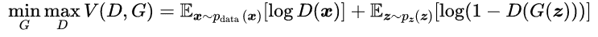
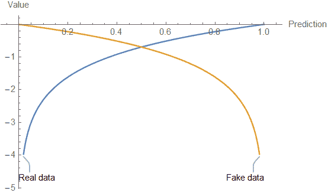
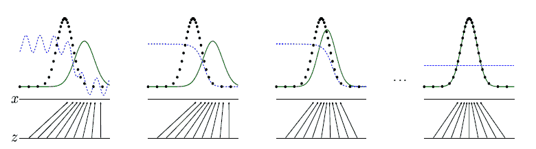
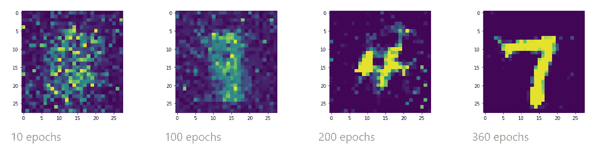
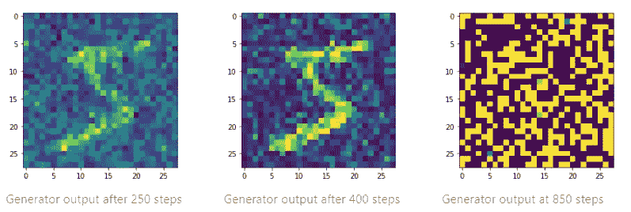

# 从零开始

> 原文：<https://towardsdatascience.com/gans-from-scratch-19e917edf3ea?source=collection_archive---------31----------------------->

## 决斗神经网络

神经网络不仅限于学习数据；他们也可以学习创造它。其中一篇经典的机器学习论文是伊恩·j·古德费勒(Ian J. Goodfellow)、让·普盖-阿巴迪(Jean Pouget-Abadie)、迈赫迪·米尔扎(Mehdi Mirza)等人撰写的 [*生成对抗网络*](https://arxiv.org/abs/1406.2661) (GANs) (2014)。gan 采用两个对立的神经网络的形式，一个学习生成假样本，而另一个试图将真样本与假样本分开。

VQGAN 根据来自 Flickr 的数据训练生成的风景。这些图像都不是真实的。[来源](https://compvis.github.io/taming-transformers/)

复杂的 GAN 模型，如 VQGAN 和其他模型，可以生成任何东西，包括假的风景、人脸，甚至是[《我的世界》](https://arxiv.org/abs/2106.10155v1)世界。

这些是我对第一次介绍 GANs 的经典论文的笔记。

# 设置

gan 基本上是由两个神经网络模型组成的两部分二元分类问题。第一个被称为**生成器**的模型接受仅由噪声组成的输入，并创建与它正在学习伪造的数据形状相同的输出。另一个模型是**鉴别器**，它接受真实和生成的输入，并输出数据是真实还是虚假的预测。

# 失败

理解生成器和鉴别器之间博弈的关键是价值函数和**二进制交叉熵** (BCE)损失之间的联系。

论文中的等式解释了两者的目标。暂时忽略最小值/最大值部分，等式的其余部分描述了**值函数、** *V(D，G)* 。值函数是鉴频器输出的对数的期望值， *D(x)* ，其中 *x* 取自真实数据加上对数的期望值 1 减去作用于所产生输出的鉴频器输出， *D(G(z))* ，其中发生器的输入， *z* 取自噪声。

现在，再次查看最小值/最大值部分，生成器的目标是最小化值函数，而鉴别器的目标是最大化值函数。

但是价值函数和 BCE 有什么关系呢？下面是 BCE 损失的等式，其中 *y* 是真实标签，ŷ是模型预测。因此，如果真数据的标签是 1，假数据的标签是 0，则价值函数变成假数据损失的总和( *y=0* 和*ŷ=d(g(z)*)和真数据损失的总和( *y=1* 和 *ŷ=D(x)* )。等式的一半抵消了每次损失。

基于最小值/最大值约定，减号消失。下面绘制的价值函数说明了这一点。生成器的目标是让鉴别器将假数据误分类为真实数据，将真实数据误分类为假数据，对应于下面蓝色和金色曲线的低(最小)值。鉴别器的目标是正确地对每一个样本进行分类，这两个样本在两条曲线上都具有零值函数(最大值)。

GAN 值函数，发生器工作以最小化这些曲线上的值，而鉴别器试图最大化它们

# 培养

这两个模型一起训练。下面的代码展示了 TensorFlow 中的一个例子。首先，通过绘制一批噪声和一批真实数据来训练鉴别器。鉴频器损耗如前所述进行计算，并更新其权重。接下来，通过绘制另一批随机噪声并使其通过生成器来训练生成器。鉴别器对生成的数据进行分类，并根据生成器欺骗鉴别器的程度对其进行评分。基于该梯度更新发生器权重，并且重复该过程。

随着两个模型的训练，生成数据的分布(绿线)变得看起来像真实数据的分布(黑色虚线),直到鉴别器预测(蓝色虚线)不再能够区分，并预测真实和虚假输入的概率为 50%。

变速发电机输出分配和分类([来源](https://arxiv.org/abs/1406.2661)

以下是在不同训练阶段的一些生成器输出示例。我使用 MNIST 数数据集来构建 GAN。随着时间的推移，随着生成器开始产生看起来像训练集的图像，鉴别器对其预测哪个样本是真的哪个样本是假的越来越没有信心。

不同时期的发电机输出

甘人很难训练。例如，在这个使用来自 MNIST 的单个示例的测试案例中，生成器在几百个步骤之后很快学会了复制示例 5。然而，随着训练的继续，发电机输出迅速偏离。发电机也可以发散回学习率过高的噪声。

不良培训设置导致的示例。发电机培训出现分歧。

管理两个网络之间的平衡也很困难。如果鉴别器太好，可能会导致训练问题，因此可能需要调整训练设置中的参数。

最先进的 GANs 在生成现实内容方面非常强大，可以用于善意和恶意。希望这些笔记有助于理解它们的基本工作原理。

你可以在这里找到我用来学习甘斯[的笔记本](https://github.com/tims457/ml_notebooks/blob/main/gans/gans.ipynb)。

# 参考

*   [甘纸](https://arxiv.org/abs/1406.2661)
*   [伊恩·古德菲勒谈莱克斯·弗里德曼](https://www.youtube.com/watch?v=Z6rxFNMGdn0)