# 甘斯卡皮斯:用人工智能创造新的印象派绘画

> 原文：<https://towardsdatascience.com/ganscapes-using-ai-to-create-new-impressionist-paintings-d6af1cf94c56?source=collection_archive---------11----------------------->

## [实践教程](https://towardsdatascience.com/tagged/hands-on-tutorials)

## 我如何在公共领域用 5000 幅印象派风景画训练 StyleGAN2 ADA

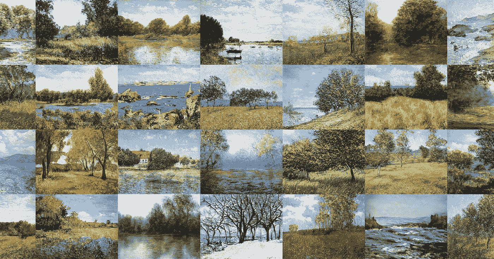

**甘斯卡皮斯样本输出**，图片由作者提供

这是我的第三篇关于尝试用生成性对抗网络(GANs)来创作美术的文章。前两篇文章关注的是[通过](/machineray-using-ai-to-create-abstract-art-39829438076a)[使用图像增强](/creating-abstract-art-with-stylegan2-ada-ea3676396ffb)来创作抽象艺术，但这篇文章关注的是创作印象派风景画。

我把 GANscapes 的所有[源代码](https://github.com/robgon-art/GANscapes)贴在 GitHub 上，把原画贴在 Kaggle 上。你可以在这里使用[谷歌实验室](https://colab.research.google.com/github/robgon-art/GANscapes/blob/main/GANscapes_Image_Generation_with_CLIP_Filter.ipynb)创作新的风景画。

# 先前的工作

已经有几个项目和论文展示了如何使用 GANs 来创作风景画。昆士兰科技大学的 Drew Flaherty 的硕士论文题为“机器学习的艺术方法”，他在论文中使用了原始的 StyleGAN [1]。爱丽丝·薛(Alice Xue)在她的论文“使用生成性对抗网络进行端到端的中国山水画创作”中描述了 SAPGAN[2]。和刘等人在他们的论文中创造了一种轻量级 GAN，“实现更快和稳定的 GAN 训练以实现高保真少量拍摄图像合成”[3]。

下面是 StyleGAN、SAPGAN、Lightweight GAN 和 GANscapes 的绘画样本。

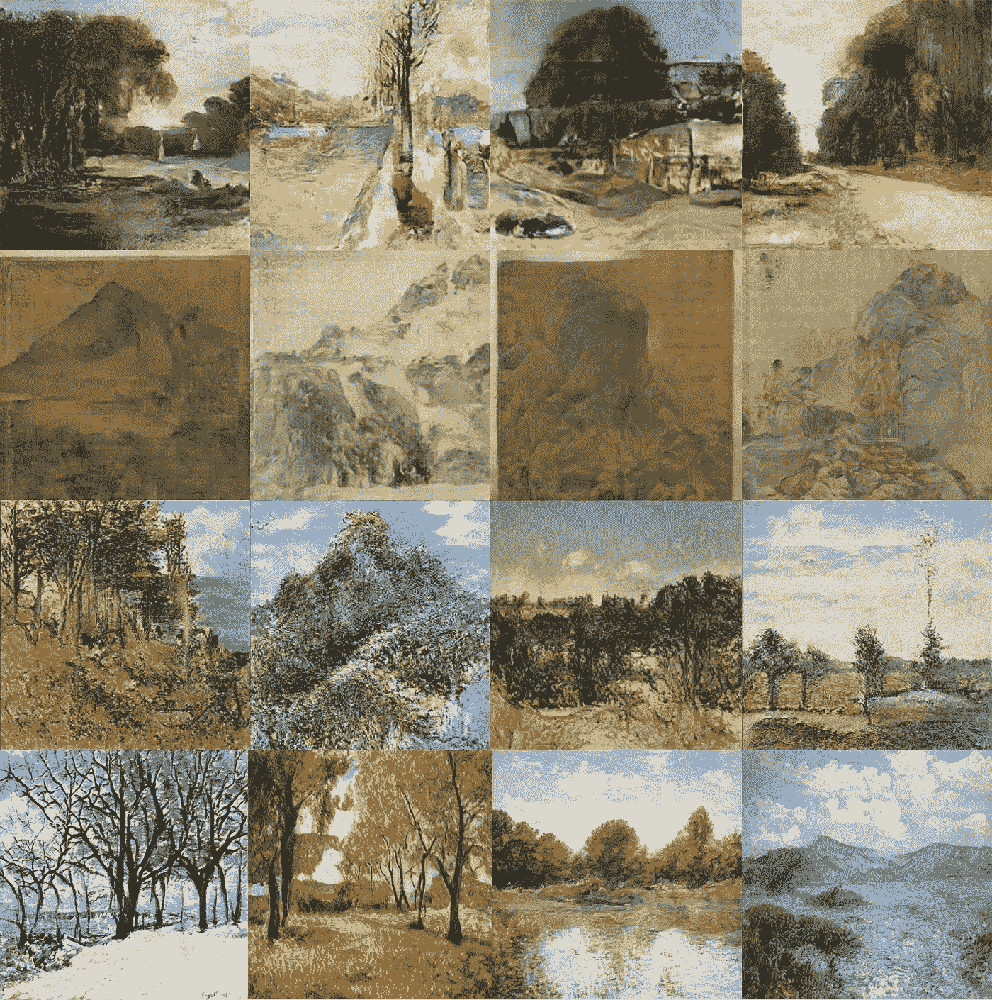

**甘山水样本，**自上而下，**德鲁·弗莱厄蒂训练的风格甘**、爱丽丝·薛的**萨甘**、刘等人的**轻灵甘**、作者的**甘山水**

# GANscapes 概述

GANscapes 是一个利用人工智能的最新进展创造新的印象派风景画的系统。这张图显示了主要的系统组件。

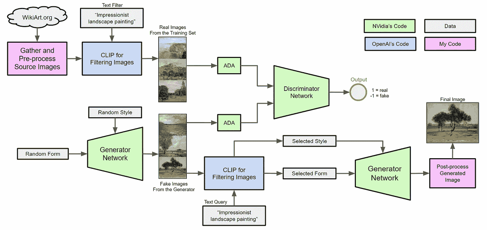

**GANscapes 系统组件，**作者提供的图表

## 组件概述

以下是对 GANscapes 中使用的组件的简要概述。我将在本文后面讨论每个组件的细节。

我从 WikiArt.org 收集了印象派风景画的图片，并对这些图片进行处理以调整长宽比。然后，我使用 OpenAI 的剪辑模型[5]来过滤图像，以保留“好的”

我用这些图像来训练 NVidia 的 StyleGAN2 ADA [6]，它有一个生成器和鉴别器网络。生成器从形式和风格的随机“潜在”向量开始创建新图像，并试图欺骗鉴别器，使其认为输出的图像是真实的。在将真实图像和生成的图像输入鉴别器之前，会使用自适应鉴别器增强(ADA)模块对其进行轻微修改，从而在图片中创建视觉多样性。

我再次使用 CLIP 根据用户提供的文本查询过滤输出图像。我再次使用生成器来创建一个混合了用户选择的样式和形式的图像。最后一步，我对最终图像进行后处理，以调整宽高比。

请务必查看文章末尾附录中的图片集，以查看更多结果。

## 收集图像

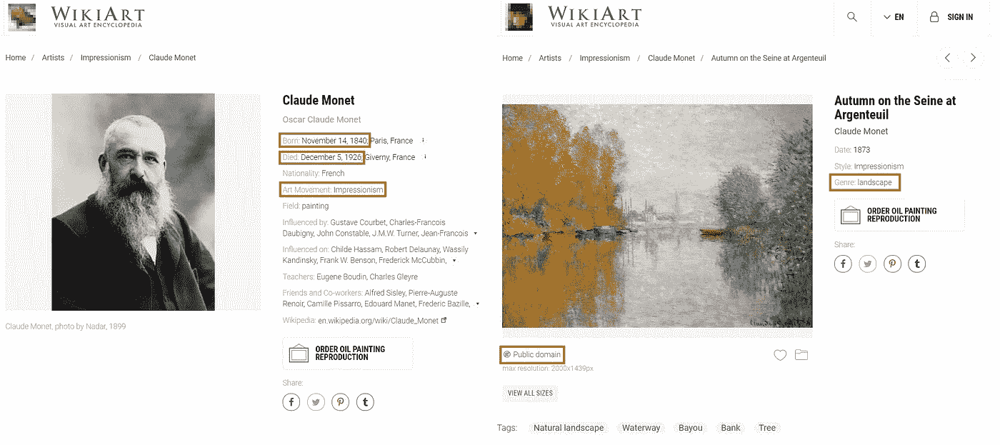

**阿让特伊塞纳河上的克洛德·莫内和他的秋天，**来源 WikiArt.org

我开始在[实验室](https://colab.research.google.com/github/robgon-art/GANscapes/blob/main/1_GANscapes_Gather_Images.ipynb)用自定义的 python 脚本抓取 WikiArt.org 的风景画。该脚本按字母顺序遍历网站上的每个艺术家。它检查艺术家是否被标记为“印象主义”艺术运动的一部分，以及他们是否生于 1800 年之后，死于 1950 年之前。然后，脚本遍历所有艺术家的画作，寻找公共领域中可用的“风景”类型的作品。然后，脚本使用艺术家和绘画名称作为文件名下载每个符合条件的图像，即 Claude-Monet _ landscape-at-giver ny-1 . jpg。系统找到了大约 5，300 幅符合这些标准的绘画。

这是一幅 WikiArt.org 印象派绘画的样本。

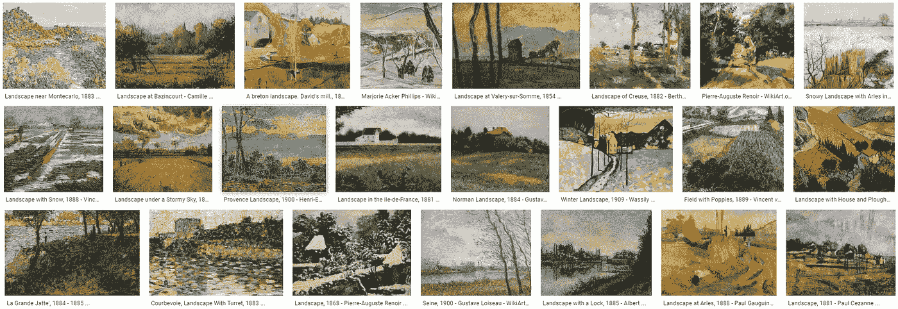

**印象派风景画**，来源 WikiArt.org

## 调整训练图像的纵横比

你会从上面的绘画样本中注意到，它们有不同的长宽比，例如，一些图像比其他图像宽很多。由于 GAN 系统在处理完美的正方形图像时效率更高，因此需要调整源图像的纵横比。通常使用三种技术来进行调整，各有利弊。我将以德加的瓦莱里索姆河湾*景观为例，展示不同的方法。*

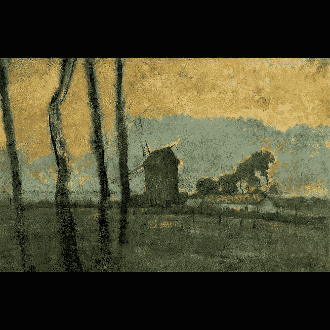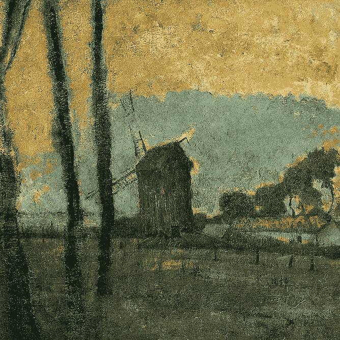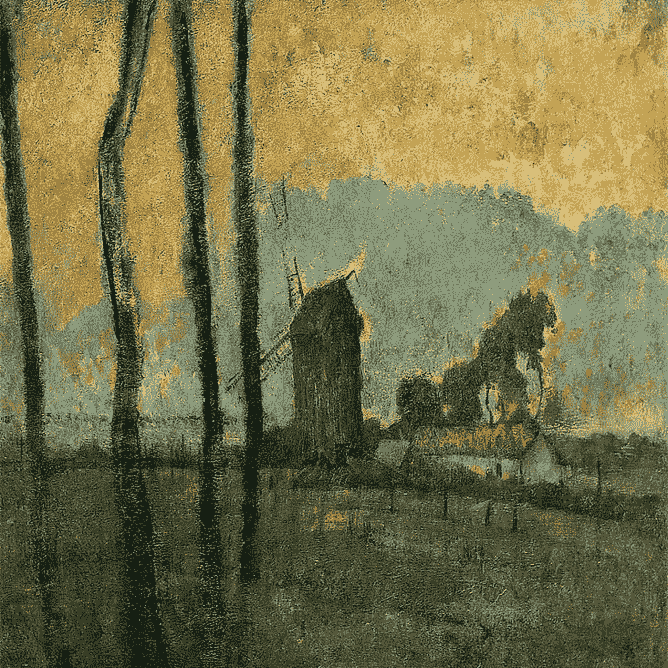

**信箱、中心切割和压缩格式**，图片由德加制作，由作者格式化

上面第一幅图像中的“信箱”格式保持了图像的不剪切和不挤压，但在上下添加了黑条，使图像具有方形形状。信箱格式的问题是，整个图像被有效地缩小了尺寸，失去了分辨率，黑色部分在 GAN 训练中被“浪费”了。

第二个图像是“中心剪切”格式，它被剪切以保持图像的正方形中心。中心切割格式的问题是左右两边的图像明显丢失。

第三个图像被水平挤压成正方形。压缩格式的问题是绘画中的对象被扭曲了。例如，在这张图片中，风车变得更薄了。而且每幅画都会被挤压不同的量，这取决于原始的长宽比。

对于这个项目，我想出了一个混合技术，这似乎是一个很好的妥协。

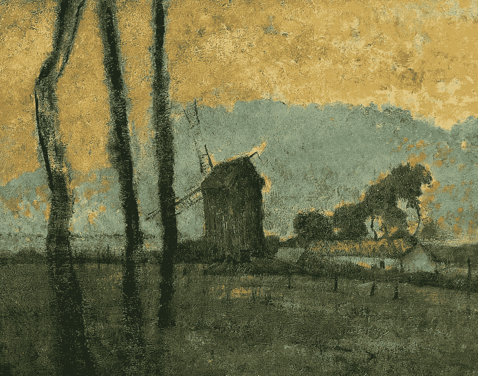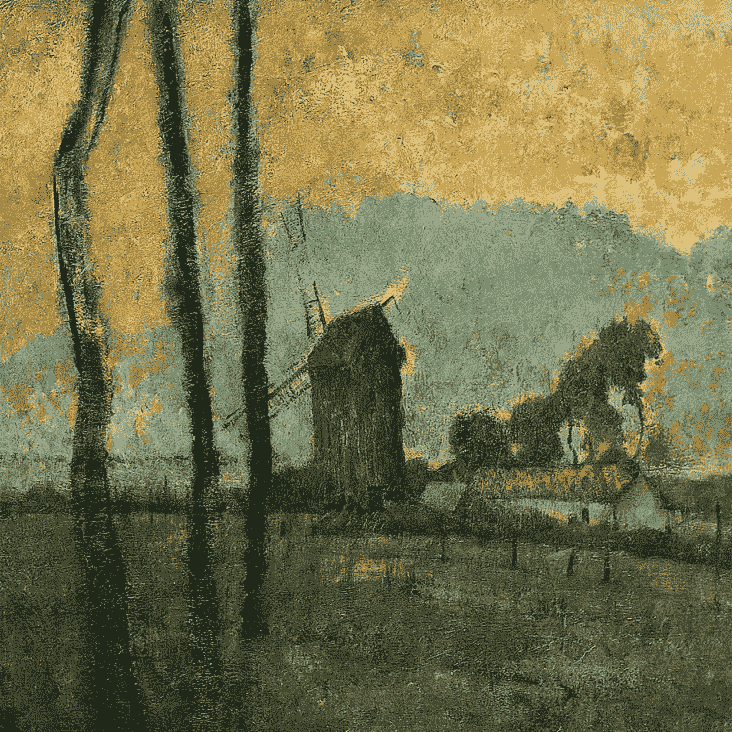

**1.27:1 矩形切割和 1.27:1 挤压格式**，图片由德加制作，作者格式化

我的混合解决方案需要首先确定所有原画的平均长宽比，对于数据集来说是 1.27:1。接下来，我将每张图片裁剪成 1.27:1 的纵横比，拉出一个中心矩形。然后，我将裁剪后的图像水平压缩成分辨率为 1024 x 1024 像素的正方形格式，并将结果图像用于我的训练数据集。当 GAN 产生方形输出图像时，我将其缩放回 1.27:1，以匹配原始格式。这个过程的结果将是无失真的合成生成的图像。

这种“中心矩形”格式似乎是中心切割和挤压格式之间的一个很好的妥协，特别是因为原始的风景画是风景格式。然而，这种方法不能很好地处理横向和纵向混合格式的图像，因为它倾向于中心切割格式。源代码在[的实验室里](https://colab.research.google.com/github/robgon-art/GANscapes/blob/main/2_GANscapes_Process_Images.ipynb)。

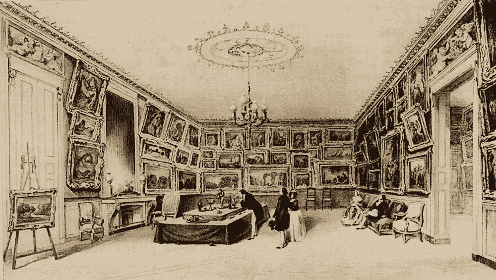

**Durand-Ruel 画廊的主展厅**，Charles-Fran ois Daubigny 的蚀刻作品，来源[https://www.pubhist.com/w30198](https://www.pubhist.com/w30198)

## 使用剪辑判断训练图像

仅仅因为一幅画在 WikiArt 上被标记为印象派画家的风景画，并不意味着它是这样一幅画的好代表。在我之前用 GAN 生成抽象艺术的项目中，我“手动选择”了源图像，这相当耗时(并且让我觉得有点“武断”)。对于这个项目，我使用了一个新的开源人工智能系统，名为 CLIP from OpenAI [5]来进行图像过滤。

OpenAI 设计了两个模型，一个图像编码器和一个文本编码器。他们在带有相应短语的图像数据集上训练这两个模型。模型的目标是使编码图像与编码短语相匹配。

一旦经过训练，图像编码器系统将图像转换为嵌入，即捕获图像一般特征的 512 个浮点数的列表。文本编码器将文本短语转换为类似的嵌入，该嵌入可以与图像嵌入进行比较以进行语义搜索。

对于 GANscapes，我将短语“印象派风景画”中的嵌入内容与 5300 幅画中的嵌入内容进行比较，以找到最符合该短语的图像。源代码在[栏的](https://colab.research.google.com/github/robgon-art/GANscapes/blob/main/3_GANscapes_Filter_Images.ipynb)这里。

根据 CLIP 的说法，以下是符合短语“印象派风景画”的前 24 幅图像。

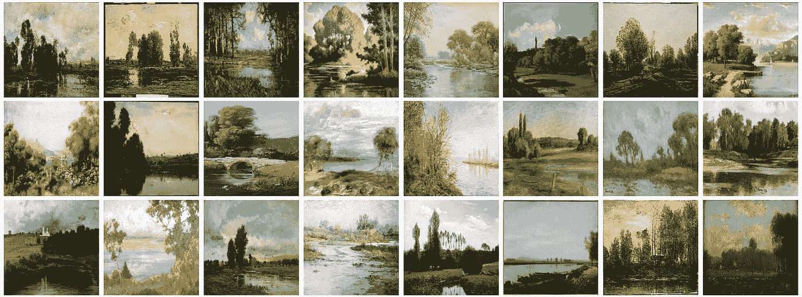

**顶级印象派风景画据剪辑**，图片由作者提供，来源 WikiArt.org

还不错！对树和水的描绘似乎很多，但画风各异。下面是根据剪辑的底部 24 个图像。

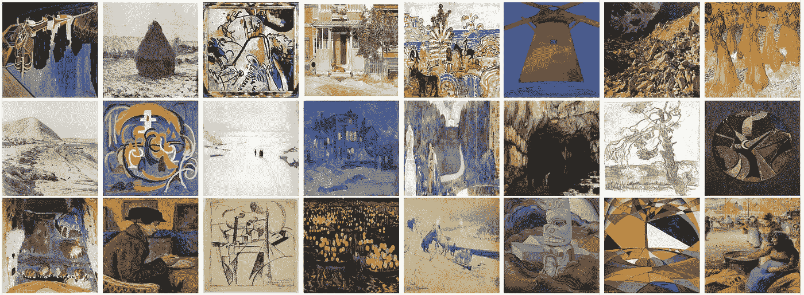

【WikiArt.org】底印象派风景画据剪辑，图片由作者提供，来源

好吧，我明白为什么 CLIP 认为这些图像不符合“印象派风景画”这个短语了除了左边的两张灰度图像，大部分都是人物、建筑、抽象画等。

我看了一下 5000 大关附近的图像，似乎还过得去。所以在这 5314 张图片中，我把最下面的 314 张移到了一个名为“拒绝沙龙”的文件夹中，并把它们排除在训练之外。

## **生成对抗网络**

2014 年，蒙特利尔大学的 Ian Goodfellow 和他的合著者提交了一篇关于 GANs 的论文[7]。他们想出了一种方法来训练两个相互竞争的人工神经网络(ann)来创建逼真的图像。正如我在本文开始时解释的那样，第一个 ANN 称为生成器，第二个称为鉴别器。发生器尝试创建真实的输出。鉴别器试图从来自生成器的假图像中辨别来自训练集的真实图像。在训练过程中，两个 ann 都逐渐提高，效果出奇的好。

去年，我创建了一个名为 [MachineRay](/machineray-using-ai-to-create-abstract-art-39829438076a) 的项目，使用 Nvidia 的 StyleGAN2 在公共领域创作基于 20 世纪绘画的抽象艺术品。此后，Nvidia 发布了新版本的人工智能模型 StyleGAN2 ADA，旨在从有限的数据集生成图像时产生更好的结果。

StyleGAN2 ADA 的一个重大改进是在训练过程中动态改变图像增强的数量。早在 2020 年 1 月，我就写过这方面的改进。

</creating-abstract-art-with-stylegan2-ada-ea3676396ffb>  

## 培训风格 GAN2 ADA

我在 Google Colab Pro 上对 GAN 进行了大约三周的培训。因为 Colab 每 24 小时超时一次，所以我把结果保存在我的 Google Drive 上，从它停止的地方继续。下面是我用来开始训练的命令:

```
!python stylegan2-ada/train.py --aug=ada --mirror=1
--metrics=none --snap=1 --gpus=1 \
--data=/content/drive/MyDrive/GANscapes/dataset_1024 \
--outdir=/content/drive/MyDrive/GANscapes/models_1024
```

我注意到 ADA 变量 *p* 的一个问题，它决定了在训练中使用多少图像增强。因为 *p* 值总是从零开始，系统每天需要一段时间才能回升到 0.2 左右。我在[我的 StyleGAN2 ADA](https://github.com/robgon-art/stylegan2-ada) 的 fork 中修复了这个问题，允许在增强设置为 ADA 时设置 *p* (如果在使用 ADA 时设置了 *p* ，NVidia 的 repo 中的实现将会抛出一个错误。)

下面是我在随后的重启中使用的命令。

```
!python stylegan2-ada/train.py --aug=ada --p 0.186 --mirror=1 \
--metrics=none --snap=1 --gpus=1 \
--data=/content/drive/MyDrive/GANscapes/dataset_1024 \
--outdir=/content/drive/MyDrive/GANscapes/models_1024 \
--resume=/content/drive/MyDrive/GANscapes/models_1024/00020-dataset_1024-mirror-auto1-ada-p0.183-resumecustom/network-snapshot-000396.pkl
```

我用最后使用的 *p* 值和之前保存的模型的*恢复*路径替换了 0.186。

这是一些来自训练有素的 GANscapes 系统的样本。

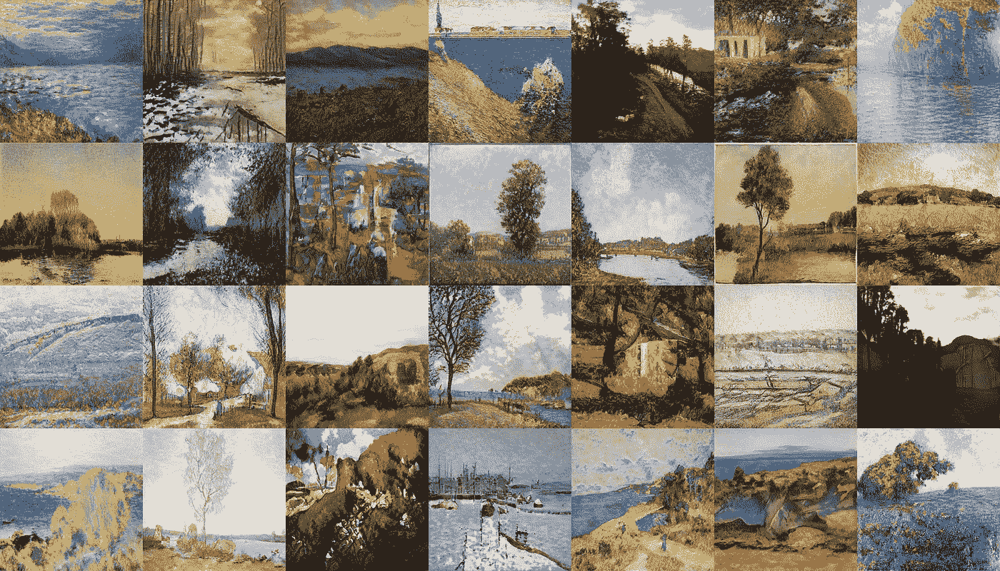

不错！一些生成的绘画看起来比其他的更抽象，但总体来说，质量似乎很好。该系统倾向于很好地描绘自然项目，如树、水、云等。然而，它似乎正在与建筑物、船只和其他人造物体进行斗争。

## 使用剪辑来过滤输出图像

我再次使用剪辑模型来过滤输出图像。该系统生成 1000 幅图像，并输入 CLIP 以获得图像嵌入。用户可以输入一个提示，比如“秋天树林的印象派绘画”，它会被转换成一个嵌入的剪辑文本。系统将图像嵌入与文本嵌入进行比较，并找到最佳匹配。以下是符合“秋日树林”提示的前 6 幅画。

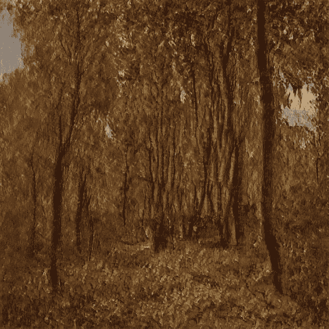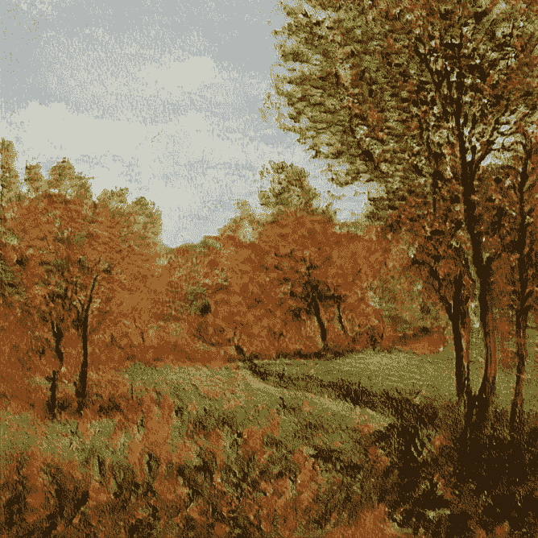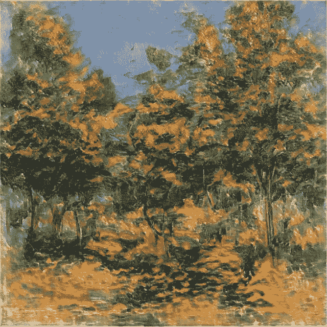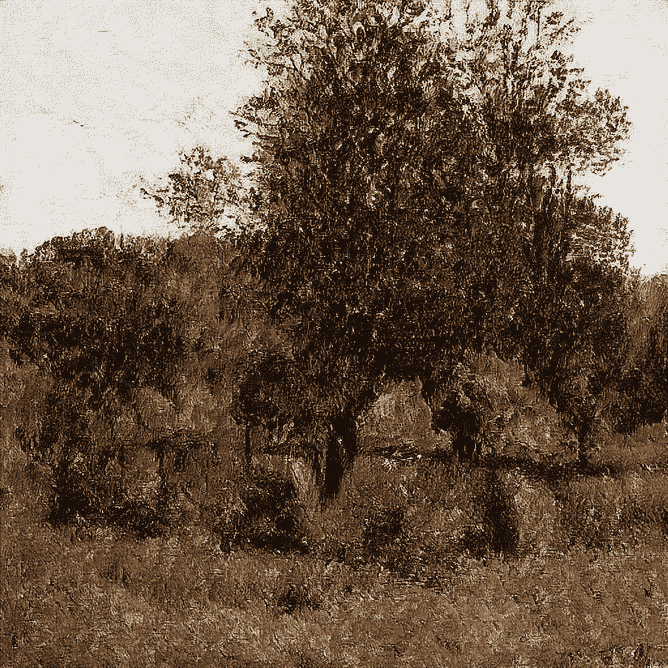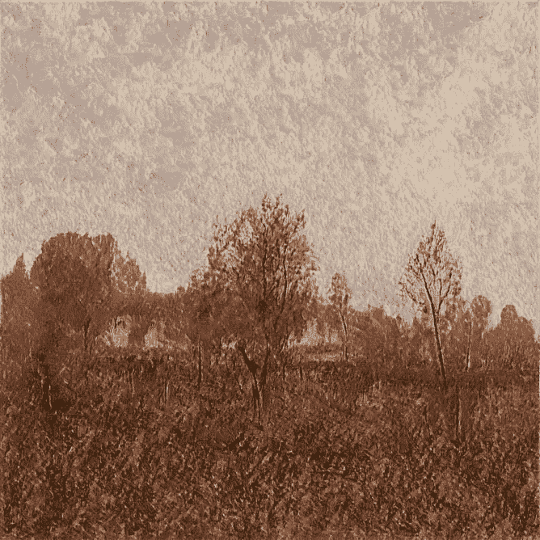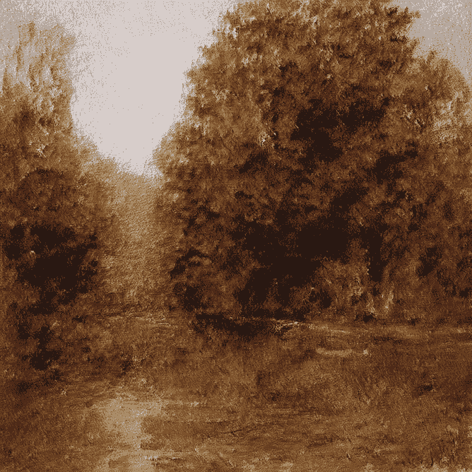

**甘斯卡皮斯秋林系列**，图片由作者提供

系统不仅为提示找到了合适的匹配，而且整体质量似乎也有所提高。这是因为剪辑系统有效地根据这些画与短语“秋天树林的印象派绘画”的匹配程度来对它们进行评级剪辑将过滤掉任何“时髦”的图像。

## 风格混合

你有没有想过 NVidia 为什么把他们的模型命名为 StyleGAN？为什么名字里有“风格”二字？答案在架构中。该模型不仅学习如何基于一组训练图像创建新图像，还学习如何基于训练数据集创建具有不同风格的图像。您可以有效地从一个图像中复制“样式”并将其粘贴到第二个图像中，创建第三个图像，该图像保留第一个图像的形式，但采用第二个图像的样式。这叫做**风格混合**。

我构建了一个 Google Colab，演示了 GANscapes 的风格混合。它基于 NVidia 的 style_mixing.py 脚本。Colab 为它们的形式渲染了七幅风景，为它们的风格渲染了三幅风景。然后它展示了一个由 21 幅风景组成的网格，将每种形式与每种风格混合在一起。请注意，缩略图被水平放大到 1:127 的纵横比。

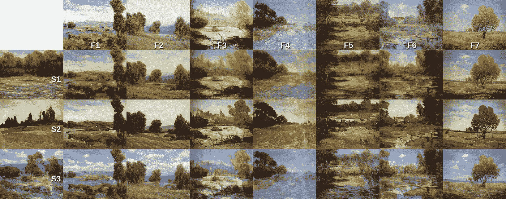

**GANscapes 风格混合**，图片作者

如您所见，表单图像从左到右显示在顶部，标记为 F1 到 F7。样式图像从上到下显示在左侧，标记为从 S1 到 S3。7x3 网格中的图像是表单和样式图像的混合。你可以看到这些树是如何被放置在七种形式的图像中大致相同的位置，并且以不同风格渲染的绘画使用相同的调色板，看起来好像它们是在一年中的不同时间绘制的。

## 图像后处理

我执行了两个后处理步骤，一个温和的对比度调整和图像大小调整，以恢复原始的纵横比。这是代码。

```
import numpy as np
import PIL# convert the image to use floating point
img_fp = images[generation_indices[0]].astype(np.float32)# stretch the red channel by 0.1% at each end
r_min = np.percentile(img_fp[:,:,0:1], 0.1)
r_max = np.percentile(img_fp[:,:,0:1], 99.9)
img_fp[:,:,0:1] = (img_fp[:,:,0:1]-r_min) * 255.0 / (r_max-r_min)# stretch the green channel by 0.1% at each end
g_min = np.percentile(img_fp[:,:,1:2], 0.1)
g_max = np.percentile(img_fp[:,:,1:2], 99.9)
img_fp[:,:,1:2] = (img_fp[:,:,1:2]-g_min) * 255.0 / (g_max-g_min)# stretch the blue channel by 0.1% at each end
b_min = np.percentile(img_fp[:,:,2:3], 0.1)
b_max = np.percentile(img_fp[:,:,2:3], 99.9)
img_fp[:,:,2:3] = (img_fp[:,:,2:3]-b_min) * 255.0 / (b_max-b_min)# convert the image back to integer, after rounding and clipping
img_int = np.clip(np.round(img_fp), 0, 255).astype(np.uint8)# convert to the image to PIL and resize to fix the aspect ratio
img_pil=PIL.Image.fromarray(img_int)
img_pil=img_pil.resize((1024, int(1024/1.2718)))
```

代码的第一部分将图像转换为浮点型，找到每个通道的 0.1%最小值和 0.99%最大值，并放大对比度。这类似于 Photoshop 中的调整色阶功能。

代码的第二部分将图像转换回整数，并将其大小调整为 1.27 比 1 的纵横比。这里有三幅风格混合的画，分别是后期处理前后的。

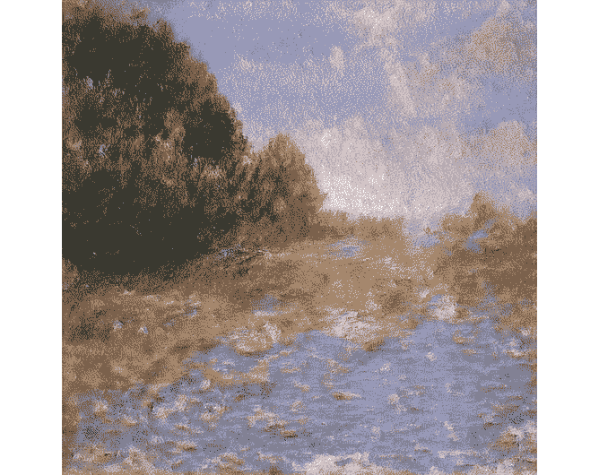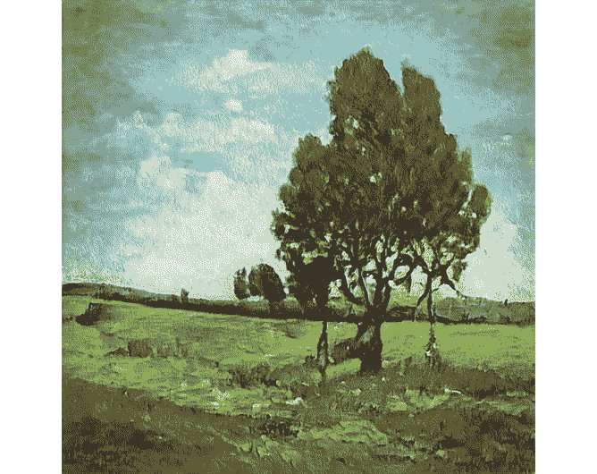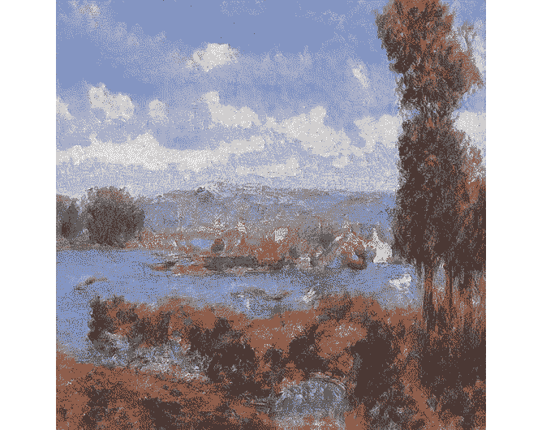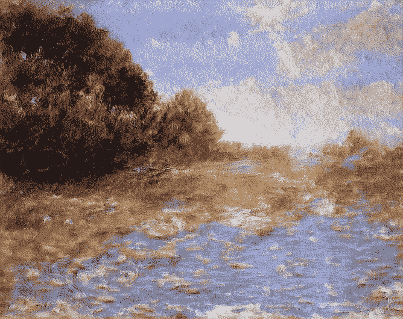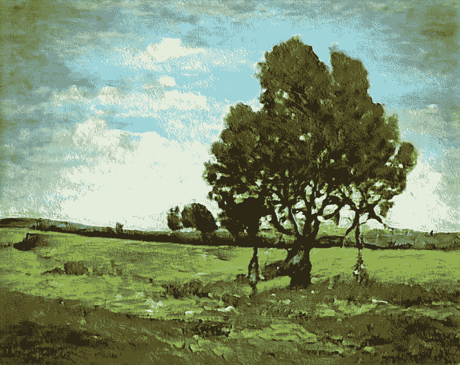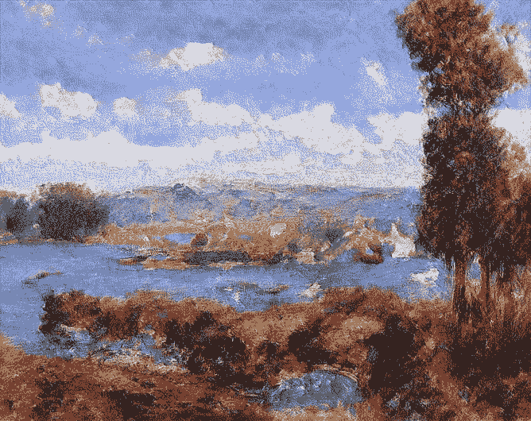

**甘斯卡皮斯 F4S1，F7S2，F1S3** ，图片由作者提供

你可以点击每张图片仔细查看。

# 讨论

GANscapes 创作的风景画的质量可以归功于 StyleGAN2 ADA 和 CLIP 模型。

通过设计，StyleGAN2 ADA 可以在有限的数据集上进行训练，以产生出色的结果。请注意，GANs 生成的图像在图像间连续流动。除非输入图像被标记为分类，否则结果之间没有硬中断。如果输入的潜在向量改变一点，结果图像也会改变一点。如果矢量变化很大，图像也会变化很大。这意味着系统有效地从一个场景变形到所有可能的邻居。有时，这些“中间”图像会有奇怪的伪像，就像一棵树部分溶解在云里。

这就是 CLIP 的用武之地。因为它根据图像与文本查询(即“印象派风景画”)的匹配程度对图像进行评级，所以它倾向于挑选没有奇怪伪像的完整图像。CLIP 模型有效地解决了未标记 gan 的部分变形问题。

# 未来的工作

有几种不同的方法来改进和扩展这个项目。

首先，绘画的质量可以通过一种叫做学习转移的技术来提高。这可以通过首先在风景照片上训练甘，然后继续在风景画上训练来完成。

我可以通过多次迭代 StyleGAN → CLIP → StyleGAN → CLIP 等来改进文本到图像的生成。这可以通过像 CLIPGLaSS [9]中的遗传算法或者梯度下降和反向传播来实现。这与 Victor Perez 在 Medium [10]的文章中描述的训练人工神经网络的方法相同。

最后，最近关于不可替换令牌(NFT)如何被用来验证数字文件所有者的新闻让我想到了一个可能的 NFTs 甘混合体。潜在的收藏者可以出价购买一系列潜在向量，而不是购买单个 JPEG 文件的所有权，这些潜在向量在经过训练的 GAN 中生成图像和/或风格的变化。嘿，你们先在这里读吧，伙计们！

# 源代码

我收集的 5000 幅抽象画可以在 [Kaggle 这里](https://www.kaggle.com/robgonsalves/impressionistlandscapespaintings)找到。这个项目的所有[源代码](https://github.com/robgon-art/GANscapes)都可以在 GitHub 上获得。Kaggle 上绘画的图像和源代码在 [CC BY-SA 许可](https://creativecommons.org/licenses/by-sa/4.0/)下发布。


归属共享相似

# 感谢

我要感谢詹尼弗·林和奥利弗·斯特瑞普对本文的帮助。

# 参考

[1] D. Flaherty，“机器学习的艺术方法”，2020 年 5 月 22 日，昆士兰科技大学，硕士论文，[https://eprints . qut . edu . au/200191/1/Drew _ Flaherty _ Thesis . pdf](https://eprints.qut.edu.au/200191/1/Drew_Flaherty_Thesis.pdf)

[2] A .徐，《端到端的中国山水画创作运用
生成性对抗网络》，2020 年 11 月 11 日，[https://open access . the CVF . com/content/WACV 2021/papers/Xue _ End-to-End _ Chinese _ Landscape _ Painting _ Creation _ Using _ Generative _ Adversarial _ Networks _ WACV _ 2021 _ paper . pdf](https://openaccess.thecvf.com/content/WACV2021/papers/Xue_End-to-End_Chinese_Landscape_Painting_Creation_Using_Generative_Adversarial_Networks_WACV_2021_paper.pdf)

[3] B .刘，Y .朱，k .宋，A. Elgammal，“实现高保真少镜头图像合成的更快和更稳定的 GAN 训练”，2021 年 1 月 12 日，

[4]维基百科，2008 年 12 月 26 日，[https://www.wikiart.org](https://www.wikiart.org/)

[5] A .拉德福德，J. W .金，c .哈勒西，a .拉梅什，g .高，s .阿加瓦尔，g .萨斯特里，a .阿斯克尔，p .米什金，j .克拉克等人，《从自然语言监督中学习可转移的视觉模型》，2021 年 1 月 5 日，[https://cdn . open ai . com/papers/Learning _ Transferable _ Visual _ Models _ From _ Natural _ Language _ Supervision . pdf](https://cdn.openai.com/papers/Learning_Transferable_Visual_Models_From_Natural_Language_Supervision.pdf)

[6] T. Karras，M. Aittala，J. Hellsten，S. Laine，J. Lehtinen 和 T. Aila，“用有限数据训练生成性对抗网络”，2020 年 10 月 7 日，【https://arxiv.org/pdf/2006.06676.pdf 

[7] I .古德费勒，j .普热-阿巴迪，m .米尔扎，b .徐，D .沃德-法利，s .奥泽尔，a .库维尔，y .本吉奥，《生成性对抗性网络》，2014 年 6 月 10 日，【https://arxiv.org/pdf/1406.2661.pdf】

[8] S. Bozinovskim 和 A. Fulgosi，“模式相似性和迁移学习对基本感知机 B2 训练的影响。”信息研讨会会议录，1976 年第 3-121-5 期

[9] F. Galatolo，M.G.C.A. Cimino 和 G. Vaglini，“通过剪辑引导的生成潜在空间搜索从字幕生成图像，反之亦然”，2021 年 2 月 26 日，[https://arxiv.org/pdf/2102.01645.pdf](https://arxiv.org/pdf/2102.01645.pdf)

[10] V. Perez，“使用 CLIP 和 StyleGAN 从提示生成图像”，2021 年 2 月 6 日，[https://towardsdatascience . com/Generating-Images-from-Prompts-using-CLIP-and-style gan-1 F9 ed 495 ddda](/generating-images-from-prompts-using-clip-and-stylegan-1f9ed495ddda)

# 附录—甘斯卡皮斯画廊

这是一组已完成的画。请注意，您可以单击放大任何图像。

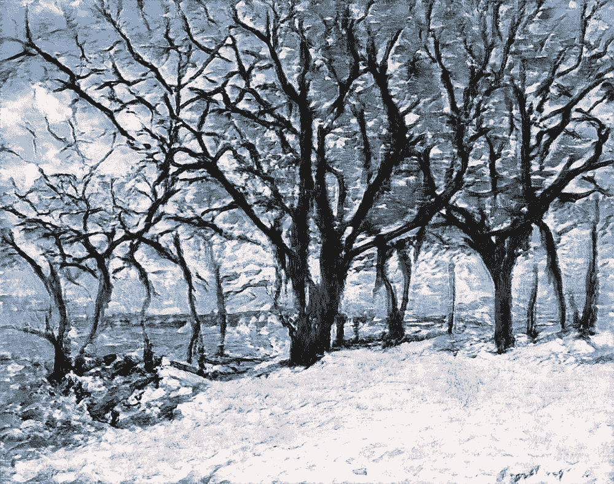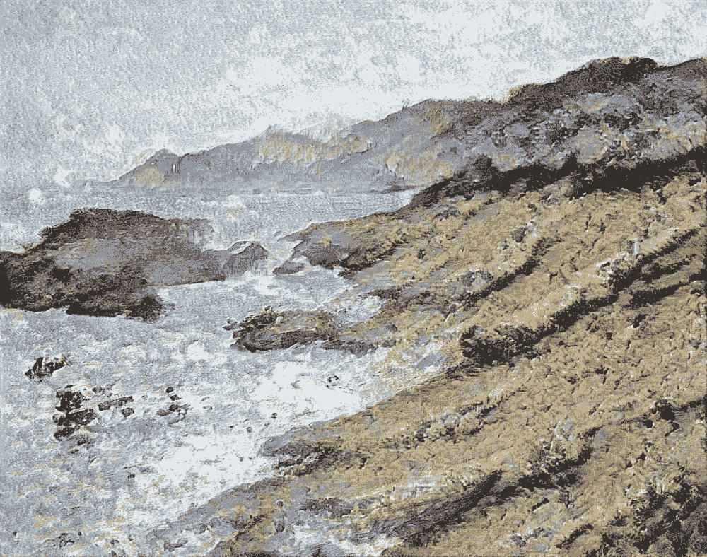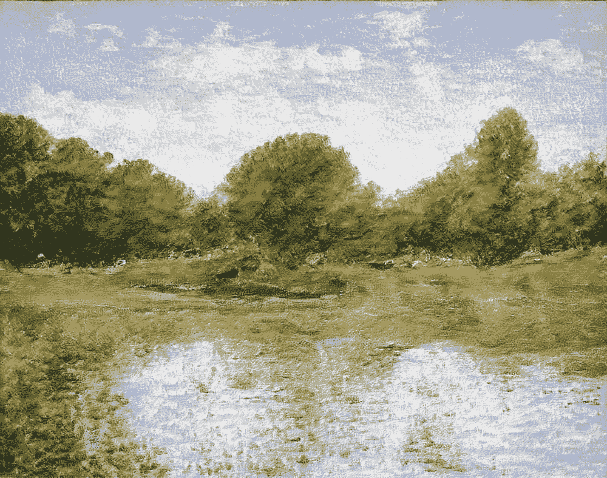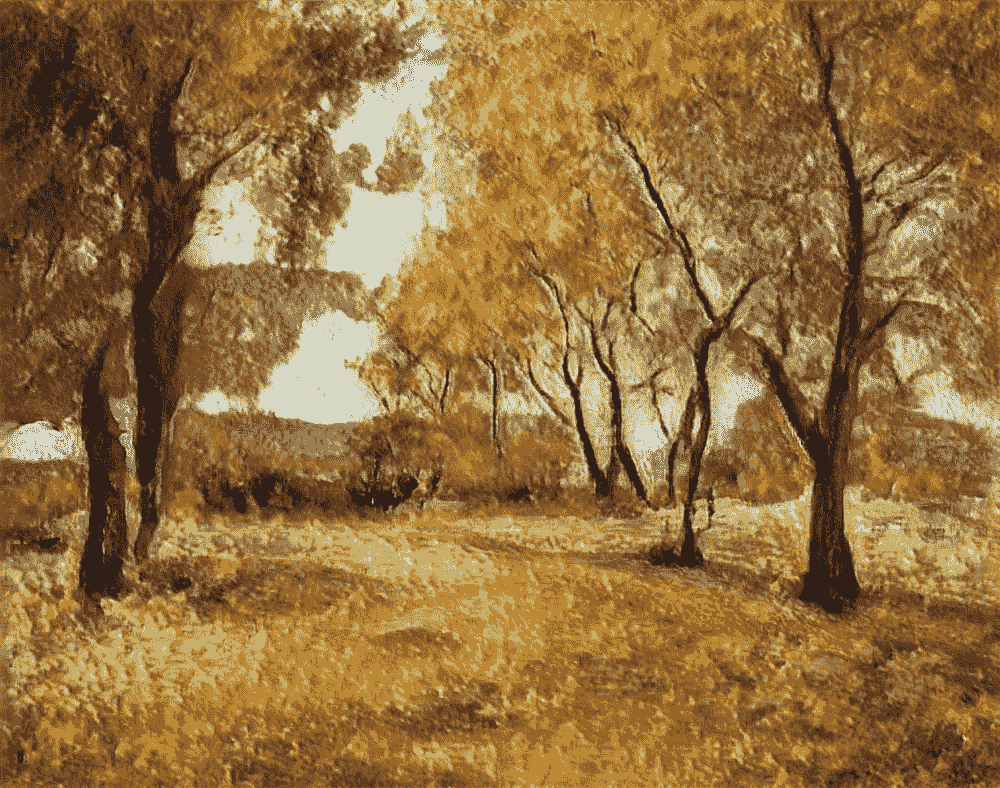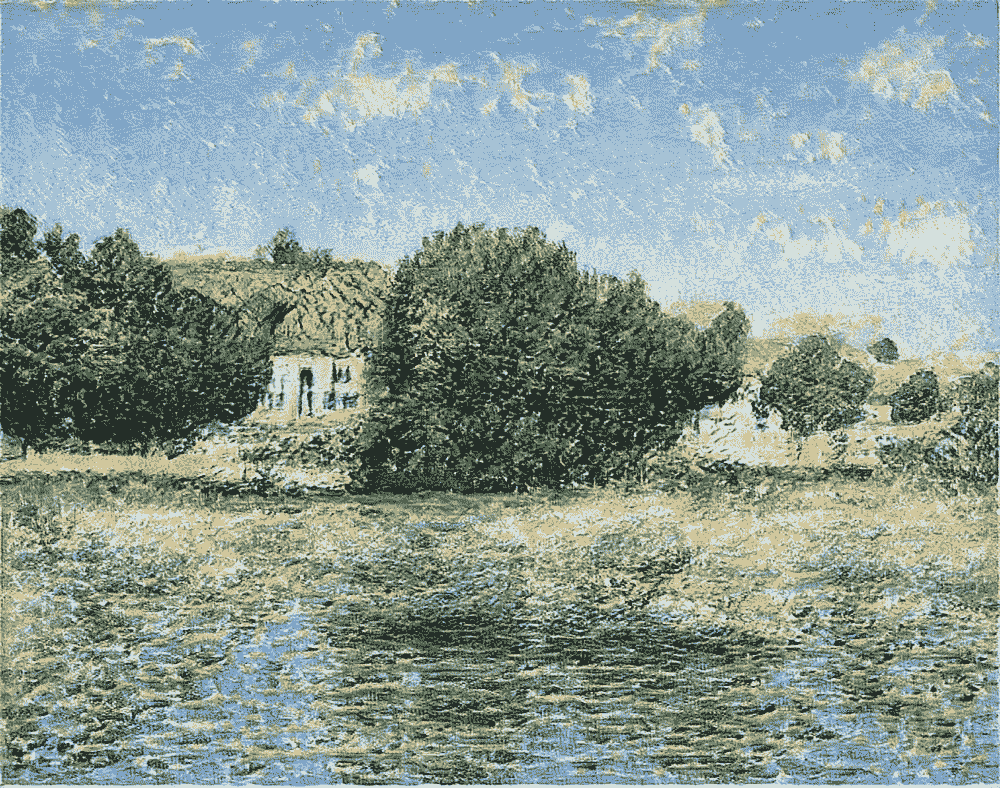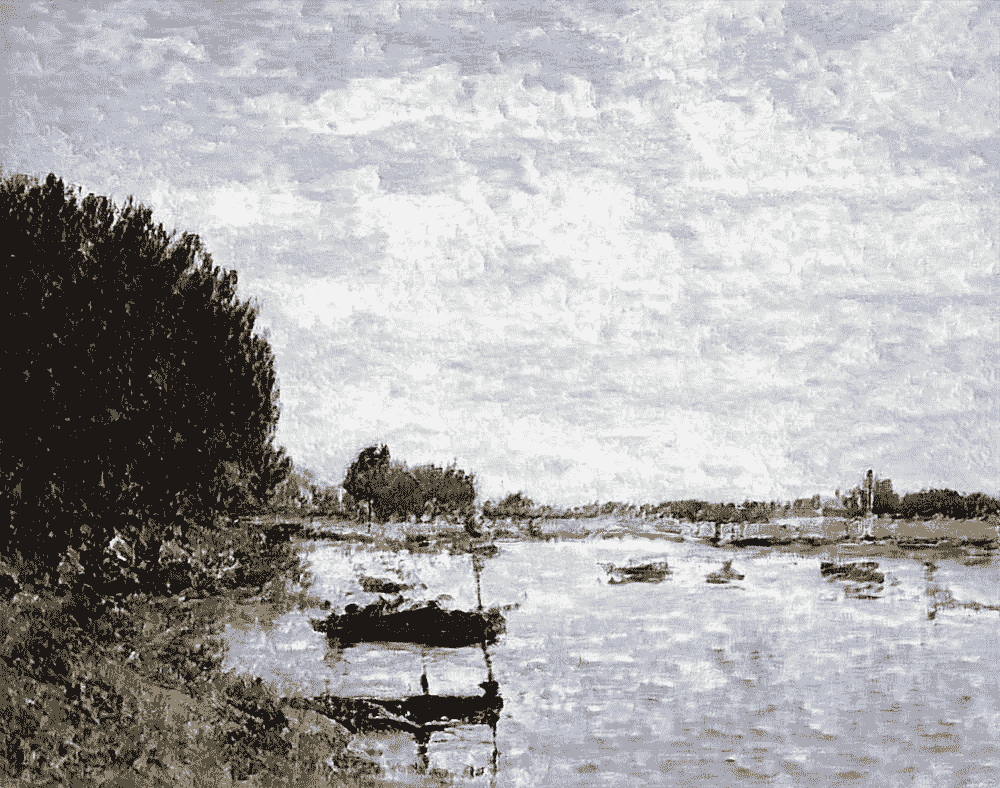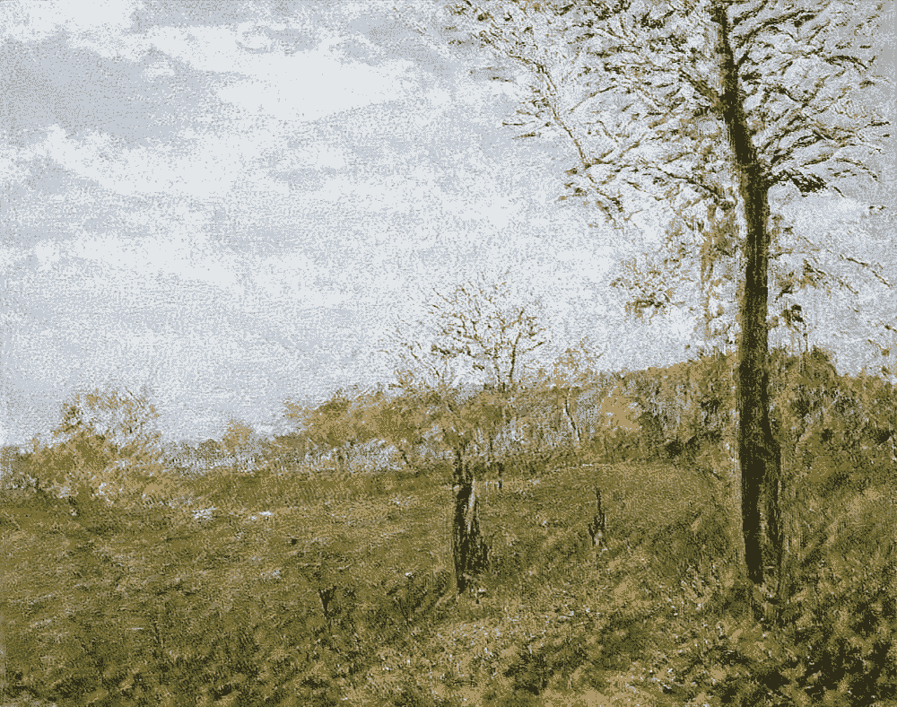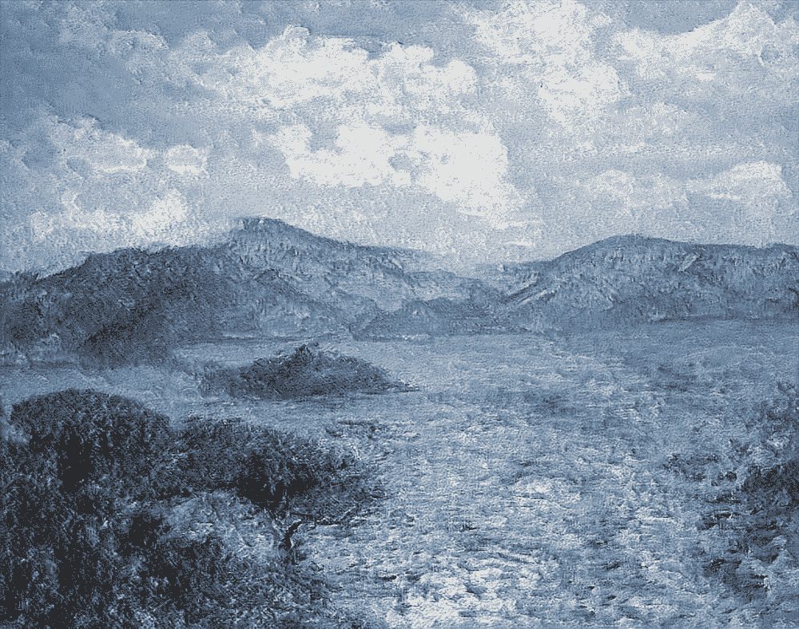

为了无限制地访问 Medium 上的所有文章，[成为会员](https://robgon.medium.com/membership)，每月支付 5 美元。非会员每月只能看三个锁定的故事。