# 甘沙尔:用人工智能创造和管理艺术，以获取乐趣和利润

> 原文：<https://towardsdatascience.com/ganshare-creating-and-curating-art-with-ai-for-fun-and-profit-1b3b4dcd7376?source=collection_archive---------1----------------------->

## 使用 CLIP 和 VQGAN 模型生成 ChromaScapes，即在 OpenSea 上作为 NFT 出售的高质量数字绘画

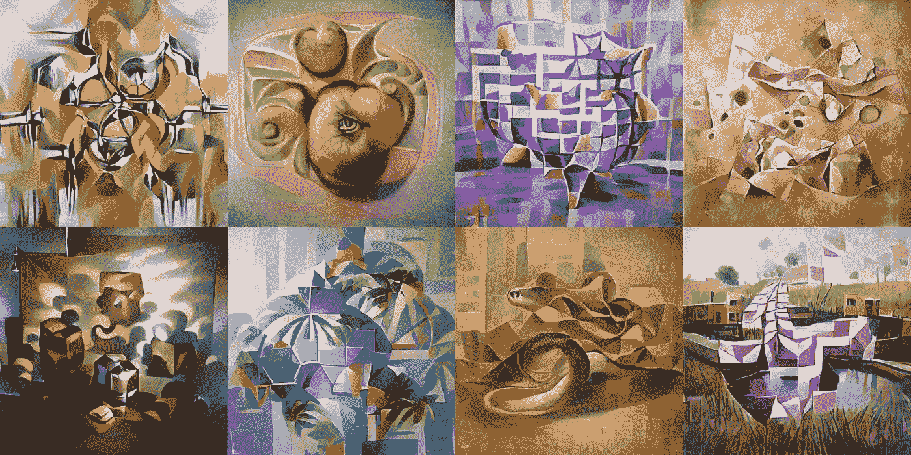

**由 GANshare One 创建的色彩场景样本，**作者提供的图片

2020 年 8 月，我第一次写了关于使用生成性对抗网络(GANs)来创造视觉艺术的文章。为了那个项目， [MachineRay](/machineray-using-ai-to-create-abstract-art-39829438076a?source=user_profile---------13----------------------------) ，我用公共领域的抽象画来训练 NVidia 的 style gan 2【1】创作新的作品。从那以后，我又写了几篇关于使用 GANs 制作艺术作品的文章[。从我收到的反馈中，我可以看出一些读者想学习如何制作数字艺术作品，作为不可替代的代币(NFT)在一个新兴的市场中出售。](https://robgon.medium.com/list/creating-fine-art-with-gans-73476c209de3)

如果你不熟悉加密货币和 NFTs，这里有一个简单的类比。

> 加密货币之于贵金属，就像 NFT 之于宝石一样。

每盎司纯金的价值都是一样的，但每颗钻石都是独一无二的，因此价值也不同。

为了这个项目，我一头扎进了 NFTs 的世界。我不仅创作并出售新创作的数字艺术作品，还出售受过训练的甘的“股份”,让其他艺术家制作他们自己的数字艺术作品，作为非数字艺术作品出售。我把这个概念叫做“GANshare”，我的第一个人工智能模型叫做 GANshare One。

# GANshare One 组件

这是系统的高级示意图，其中简要描述了组件。再往下，你可以找到每个部分的细节。

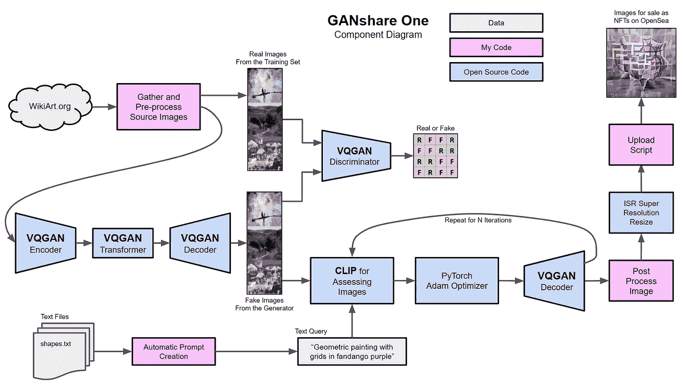

**GANshare 组件图，**作者图片

我开始在公共领域收集来自 WikiArt.org 的 50，000 多幅画。然后我训练了一个新的人工智能模型，名为 VQGAN [2]，是在德国海德堡大学开发的。VQGAN 有一个图像编码器、转换器和解码器，用于创建新图像，还有一个鉴别器，用于检测生成的图像部分是真实的还是生成的。

我使用 VQGAN 根据文本提示创建新的绘画。我从文本文件中自动生成提示，这些文本文件包含绘画风格、几何形状、地理位置的列表，以及大量颜色名称的列表。我使用 OpenAI 的 CLIP model [3]来控制 VQGAN 解码器，使用 Pytorch 库中的 Adam optimizer [4]生成一幅数字绘画来匹配提示。

我使用 ISR 超分辨率 Resizer [5]将图像放大到 1024x1024，并发布到 OpenSea 上作为 NFT 出售。你可以在这里查看艺术品的样品:[https://opensea.io/collection/chromascapes](https://opensea.io/collection/chromascapes)

# GANshare One 系统详情

本节将更详细地讨论我用来构建 GANshare One 系统的组件。

## 收集图像

类似于我为我的[磁铁](/magnet-modern-art-generator-using-deep-neural-networks-57537457bb7)项目所做的，我使用一个定制的 python 脚本从 WikiArt.org 收集绘画作为训练数据。剧本按字母顺序浏览了网站上的每个艺术家。它检查了这些艺术家是否生于 1800 年之后，死于 1950 年之前。然后，它检查每个艺术家的画，以确保它们是在公共领域，然后将它们复制到我的谷歌驱动器的文件夹中。它找到了 52，288 张符合我标准的图片。

这里有一些我用来训练 GANshare One 的原画，来自康定斯基、梵高和毕加索等艺术家。

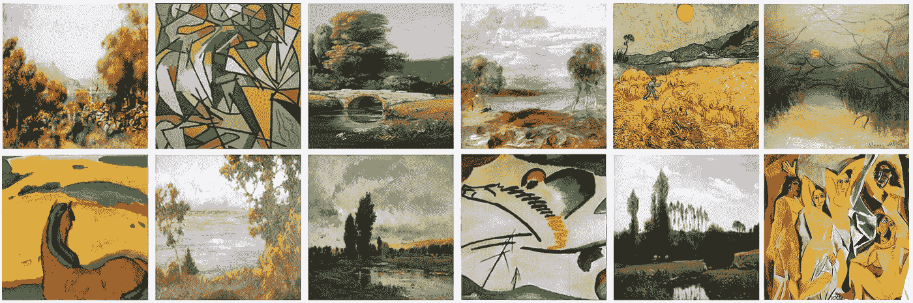

**训练图片**，来源 WikiArt.org

## VQGAN

Esser 等人的矢量量化生成对抗网络(VQGAN)模型是一种用于生成高质量图像的混合 GAN/Transformer 模型[2]。

在他们题为“驯服高分辨率图像合成的变形金刚”的论文中，作者声明他们的方法学习…

> …由上下文丰富的可视部分组成的码本，其组成随后用自回归转换器架构建模。离散码本提供了这些架构之间的接口，基于补丁的鉴别器支持强压缩，同时保持高感知质量。该方法将卷积方法的效率引入到基于变换的高分辨率图像合成中。帕特里克·埃塞尔、罗宾·龙巴赫和比约恩·奥默

这是他们的 VQGAN 架构图。


**VQGAN 架构**，来自 Esser 等人的[驯服变压器用于高分辨率图像合成](https://compvis.github.io/taming-transformers/paper/paper.pdf)。

在我收集了我的训练图像之后，我使用我的 Google Colab Pro [7]帐户使用这个命令来训练 VQGAN:

```
!python main.py -b configs/custom_vqgan.yaml --train True --gpus 0,
```

因为 VQGAN 是一个混合变压器模型，它在训练期间向您显示原始和编码的样本。下面是一组示例图像。

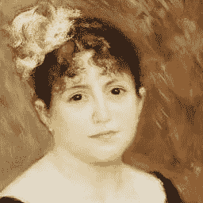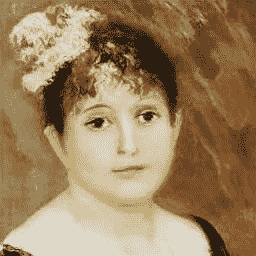

**使用 VQGAN 的原始和重新编码图像**，(左)WikiArt.org，(右)作者

你可以看到模型在重建原始图像方面做得很好，但它似乎对一些面部特征做了自己的事情，如眼睛和嘴巴。

总的来说，我发现 VQGAN 工作得很好。下表比较了经典 GAN 和 VQGAN 的一些特性。

```
**Feature             Classic GAN             VQGAN** Discriminator:      All-or-nothing          Sub-image
Output Image Size:  Fixed Size              Variable Size
Reverse Encoding:   Iterative Process       Trained Encoder
Image Generation:   New Images Look Good    Images Need Steering
```

对于 VQGAN，训练很快，因为图像的每个部分都由鉴别器检查，而传统的 GAN 使用全有或全无的方法进行训练。换句话说，VQGAN 中的鉴别器查看 4x4 网格中的 16 个子图像，并对每个部分给发生器一个向上或向下的大拇指作为改进的反馈。经典 GAN 中的鉴别器为整个图像向发生器提供单个拇指向上或向下。

对于经典的 GANs，输出图像总是固定大小。因为它与“代码本”一起工作，VQGAN 可以输出不同大小的图像。例如，我用 256x256 输入图像训练 VQGAN，并用它产生 512x512 输出图像。

例如，以下是以 256x256 和 512x512 渲染的提示“起伏的农田”的生成图像。

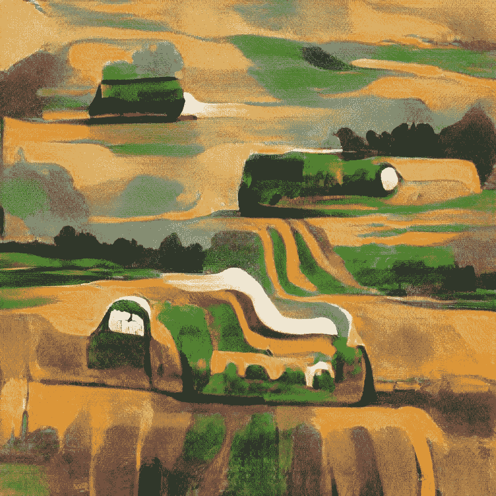

起伏的农田，渲染尺寸为(左)256x256 和(右)512x512，图片由作者提供

请注意 512x512 图像中的更多功能。这是因为 VQGANs 码本中的特征是以 256x256 的比例学习的，并被渲染为对更大画面的较小贡献。512x512 图像的输出类似于将多个晕影合并在一起。

经典的 GANs 没有用于反向编码的内置模型，反向编码是一种在给定任意真实图像的情况下寻找最接近的生成图像的过程。对于经典 GAN 来说，这必须通过迭代方法来完成，并且它并不总是工作得很好。然而，反向编码对于 VQGAN 模型来说很容易，因为它实际上是一种编解码器。它有一个将图像编码成嵌入的模型和一个将嵌入解码成图像的相应模型。

前三点都是 VQGAN 的优势。然而，第四点是很容易从经典的 GANs 产生输出图像。只要给它一些随机数，它就会生成一个好看的图片。但是 VQGAN 没有制作新图像的简单方法。如果给解码器一些随机数，输出的图像就不连贯了。VQGAN 需要由一些其他过程来控制，比如使用剪辑模型生成可识别图像的文本提示。

## OpenAI 的剪辑模型

OpenAI 设计并训练了一个名为 CLIP 的人工智能系统，代表对比语言-图像预训练[3]。CLIP 系统有一个图像和文本编码器，它可以用来执行跨模态语义搜索，例如，你可以使用单词来搜索图像，正如我在我的 [MAGnet](/magnet-modern-art-generator-using-deep-neural-networks-57537457bb7) 项目中所做的那样。

OpenAI 在带有相应短语的图像数据集上训练编码器。训练的目标是使编码图像与编码单词相匹配。一旦经过训练，图像编码器系统将图像转换为嵌入，即捕获图像一般特征的 512 个浮点数的列表。文本编码器将文本短语转换为相似的嵌入，该嵌入可以与图像嵌入进行比较以进行语义搜索。

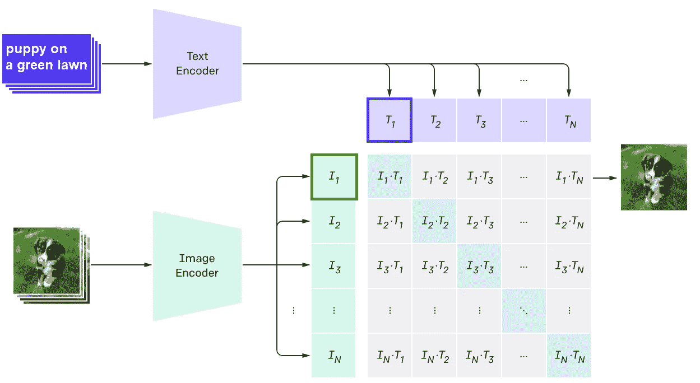

**对比语言-图像预训练(剪辑)**，OpenAI 图像

例如，如果您有一个图像数据库，您可以通过图像编码器运行每个图像，以获得图像嵌入的列表。如果您随后通过文本编码器运行短语“绿色草坪上的小狗”，您可以找到与该短语最匹配的图像。

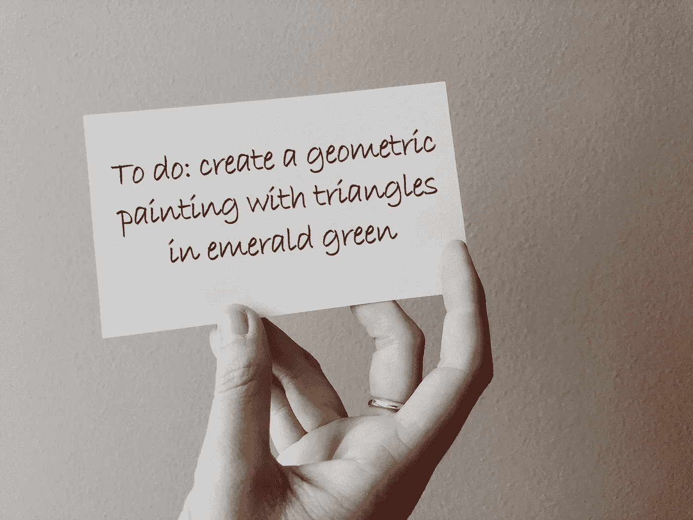

**待办事项清单**，作者图片说明，基于莱克西·詹尼在 [Unsplash](https://unsplash.com?utm_source=medium&utm_medium=referral) 上的一张照片

## 生成提示

如上所述，GANshare 系统使用文本提示创建由 CLIP 控制的图像。比如说，如果你告诉 VQGAN+CLIP 创建一幅“橙色圆圈的抽象画”，它就会创建一幅。

为了画出大量的画，我生成了包含三个不同部分的提示:风格、主题和颜色。

经过试验，我发现这九种风格相当不错:抽象、立体主义、表现主义、野兽派、未来主义、几何、印象派、后现代和超现实主义。

对于主题，我从三个类别中选择:几何形状、地理特征和物体。我从伊万·马洛平斯基的[单词表](https://github.com/imsky/wordlists/tree/master/nouns)开始，为我的形状和地理特征列表做了一些调整。对于我的物品列表，我组合了由 [COCO](https://cocodataset.org/#home) 和 [CIFAR 100](https://www.cs.toronto.edu/~kriz/cifar.html) 检测系统识别的物品列表，得到 181 个物品的列表。

我从维基百科[中抓取了一份颜色名称的详细列表，并稍微编辑了一下，得到了 805 种独特的颜色。](https://en.wikipedia.org/wiki/List_of_colors:_A%E2%80%93F)

这是四个列表中的前七个条目。

```
**shapes.txt   places.txt       things.txt          colors.csv** angles       an archipelago   an airplane         absolute zero
blobs        an atoll         an apple            acid green
circles      a beach          apples              aero
cones        a bay            an aquarium fish    aero blue
cubes        a butte          a baby              african violet
curves       a canal          a backpack          alabaster
cylinders    a canyon         a banana            alice blue
...          ...              ...                 ...
```

这里有一个[链接](https://gist.github.com/robgon-art/8bdaf6593ae4c1d7ed4037064969e818)到 Python 代码，它通过随机选择样式、主题和颜色来生成提示。

下面是代码生成的一些提示。

```
Futurist Painting of a City in Vivid Burgundy Brown
Abstract Painting with Diagonals in Beige Pink
Impressionist Painting with Prisms in Carolina Blue
```

现在我们有了一些有趣的提示，接下来我们将看看如何引导 VQGAN 生成相应的图像。

## 带夹子的转向 VQGAN

在我的 [MAGnet 项目](/magnet-modern-art-generator-using-deep-neural-networks-57537457bb7)中，我使用了一个定制的生成算法，让 CLIP 操纵 StlyeGAN2 的一个变体，根据文本提示创建图像。在这个项目中，我使用了凯瑟琳·克劳森设计的算法，她是一位人工智能/生殖艺术家，在 Twitter 上以 [RiversHaveWings](https://twitter.com/RiversHaveWings) 的身份发布帖子。为了使用 CLIP 控制 VQGAN，她使用 Pytorch 库中的优化器 Adam，Adam 代表自适应矩估计[4]。下面是算法的示意图。

请注意，这里有两个嵌入空间。CLIP 系统使用 512 个数的平面嵌入(表示为 *I* 和 *T* )，其中 VQGAN 使用 256x16x16 个数的三维嵌入，表示为 *Z* 。

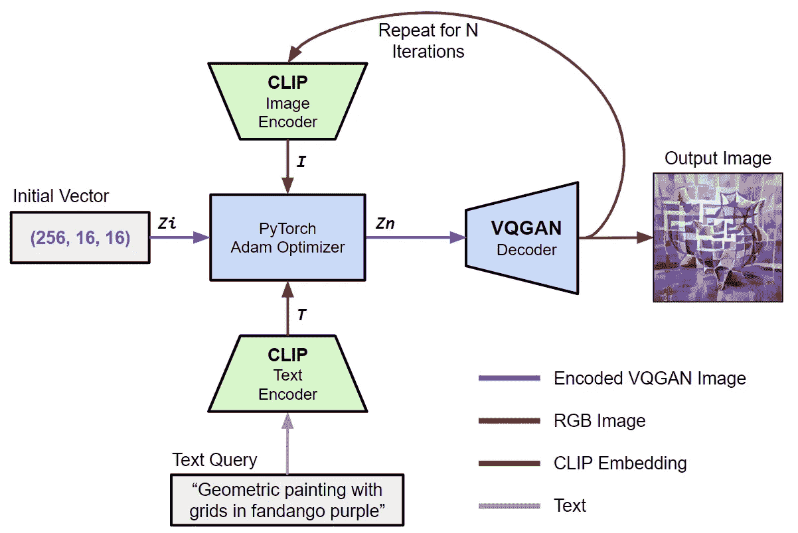

**优化算法**，图片作者

优化算法的目标是产生与文本查询紧密匹配的输出图像。系统首先通过剪辑文本编码器运行文本查询，以获得目标 *T* 。Adam 优化器从初始 VQGAN 向量 *Zi* 开始。它修改向量 *Zn* 以产生一个嵌入了剪辑 *I* 的图像，该图像试图匹配原始目标 *T* 。随着 *I* 接近 *T* ，输出图像将更好地匹配文本查询。

让我们看看该算法与上一节中的提示配合得如何。对于每个提示，我运行系统 200 次迭代。

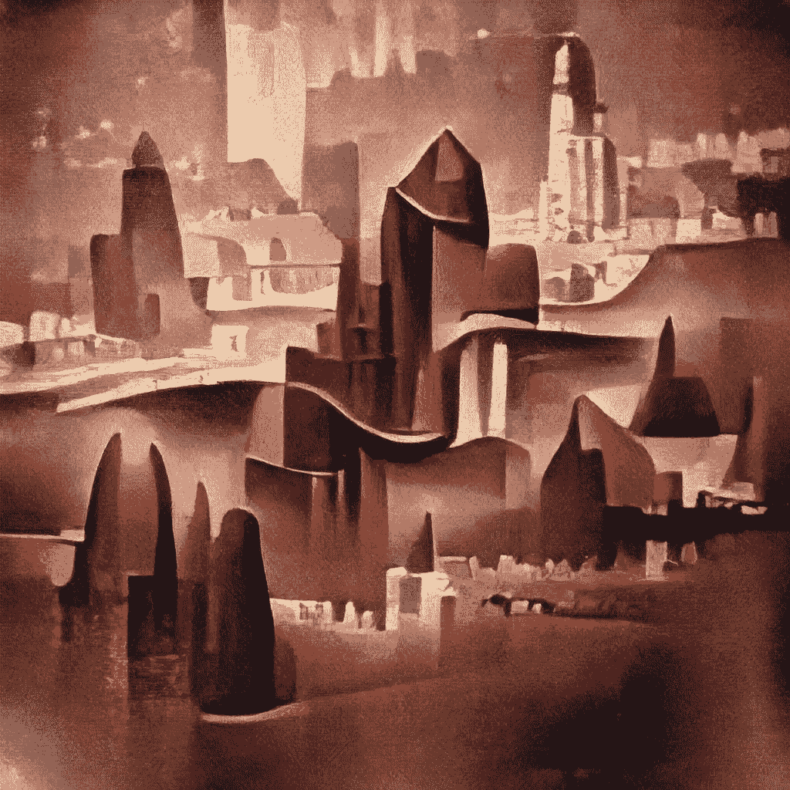

未来主义者用鲜艳的勃艮第棕色画了一座城市

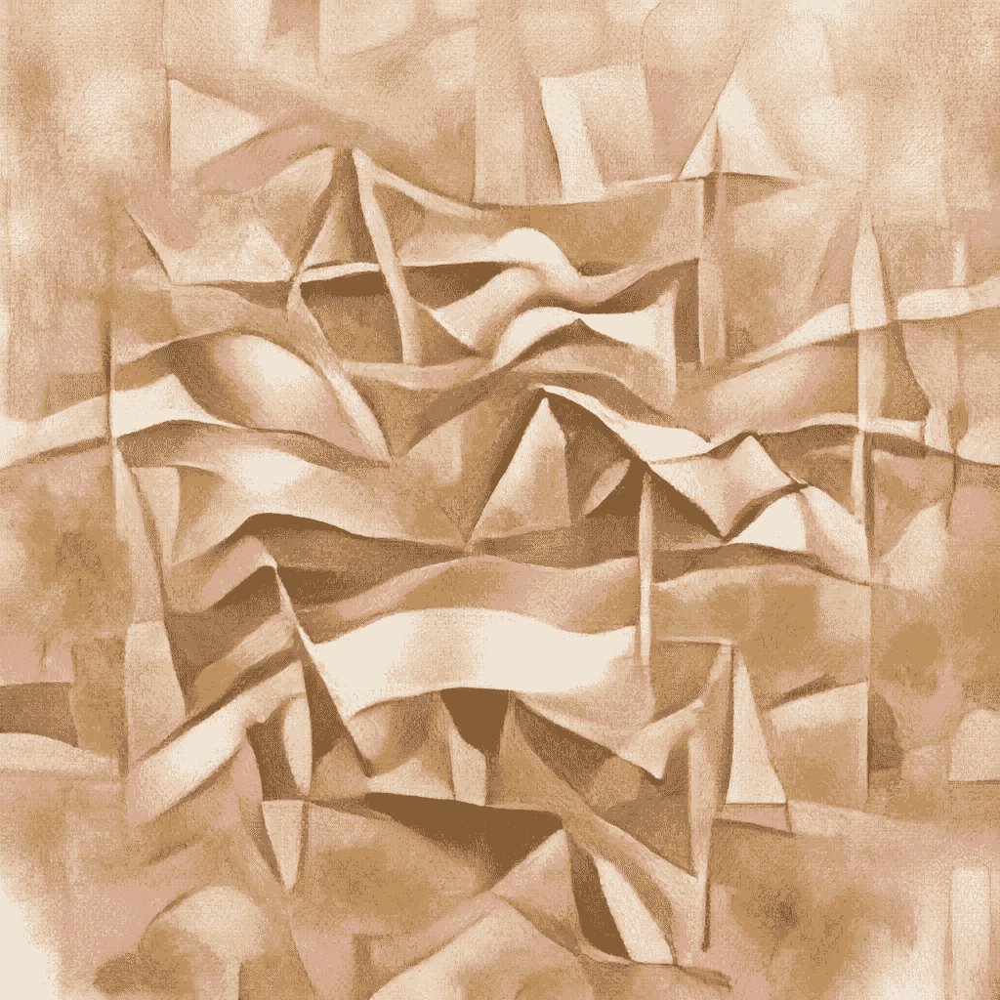

**米色粉色斜线抽象画**，图片由 GANshare One 提供

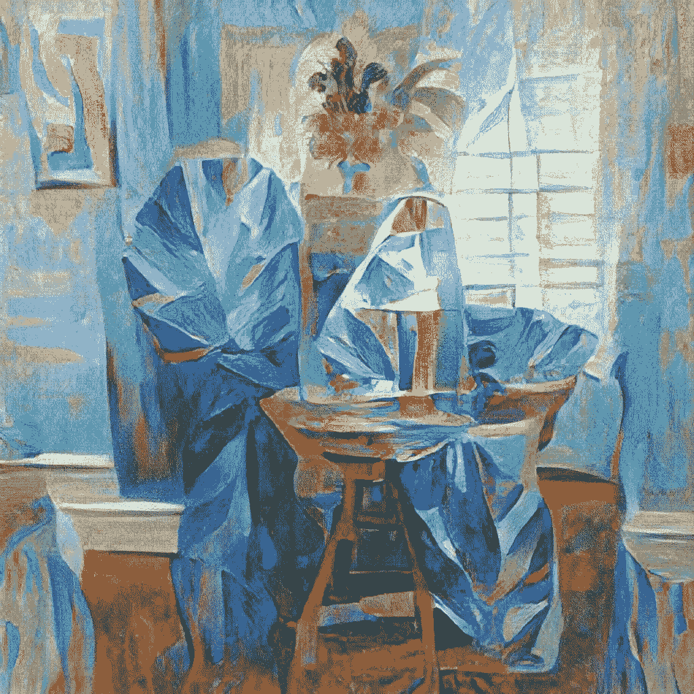

**印象派画家用卡罗莱纳蓝棱镜作画**，图片由 GANshare One 提供

果然，系统创建的图像似乎与提示相符。请注意优化算法是如何即兴发挥的。例如，不清楚第三张图片本身是否包含任何棱镜。但它确实在调色板中显示了一些彩虹色，暗示了光线通过棱镜的效果。

# 结果

在生成了数百幅数字绘画后，我注意到它们并不都是赢家。从形状类别中的提示生成的图像似乎具有最好的产量，即，大约 33%可以被认为是合理的。但地点和事物类别中的图片效果不佳，只有大约 20%的人保留。

下面是我判断的一些样品。

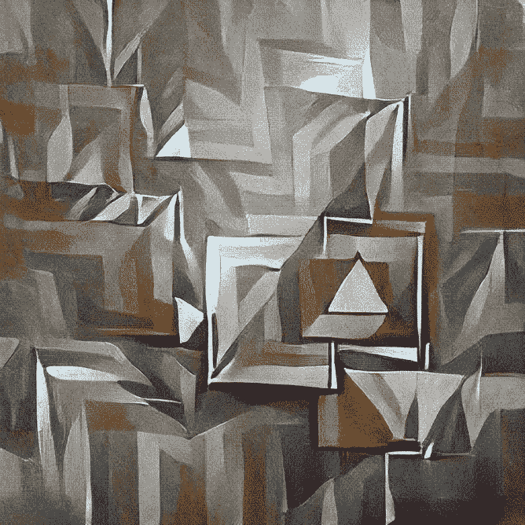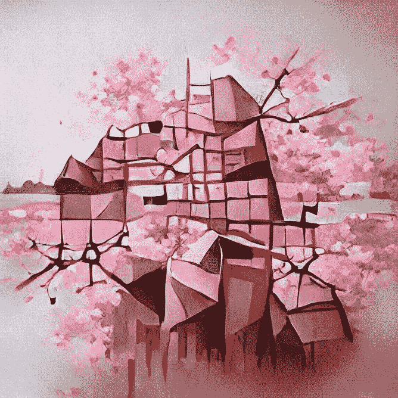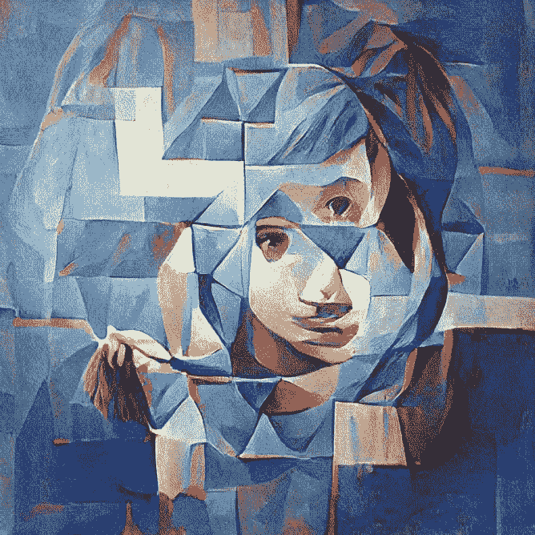

**音速银棕色的对角线几何画**(左)**樱花粉色的城市几何画**(中)**台盼蓝的女孩几何画**(右)，图片由甘沙尔一

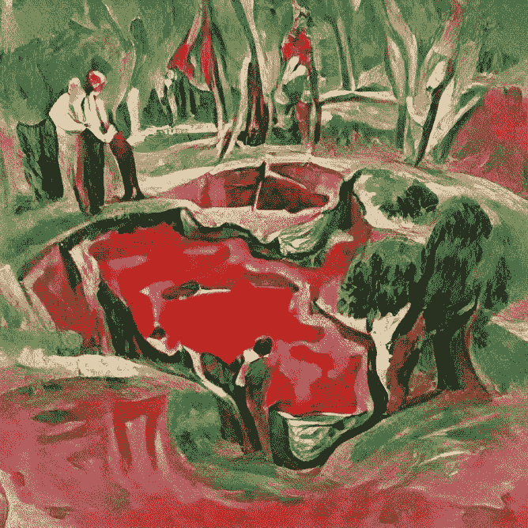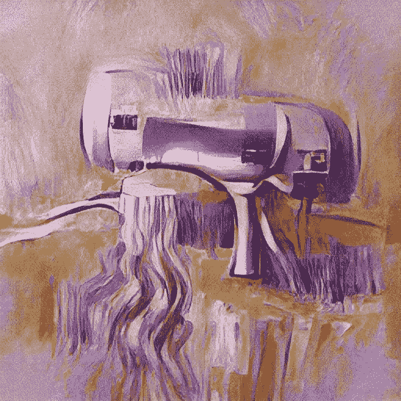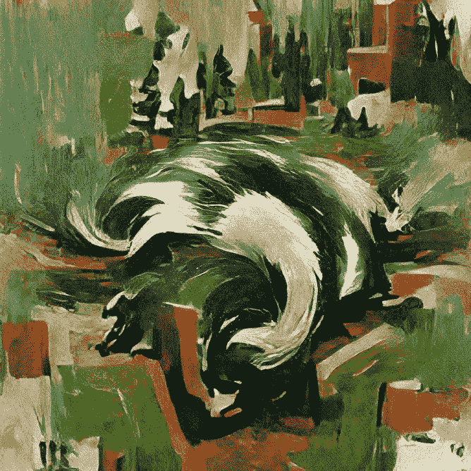

**野兽派的宝石红色池塘画**(左)**薰衣草粉色吹风机抽象画**(中)**松绿色臭鼬抽象画**(右)，图片由甘沙尔一

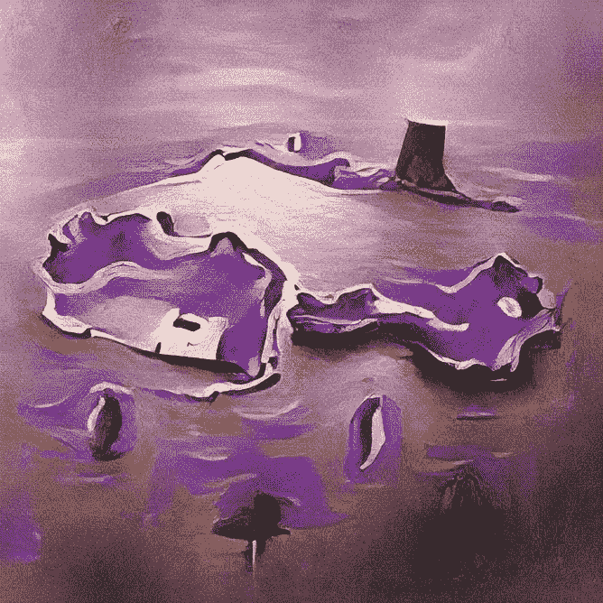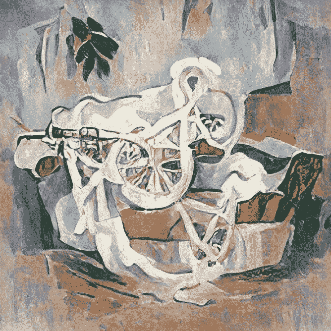

**芦笋棕色松鼠的后现代绘画**(左)**最大紫色岛屿的抽象画**(中)**白粉色野兽派自行车的绘画**(右)，图片由 GANshare One 提供

你可以在这里看到更多结果[。](https://opensea.io/collection/chromascapes)

# 在 OpenSea 上销售 NFT

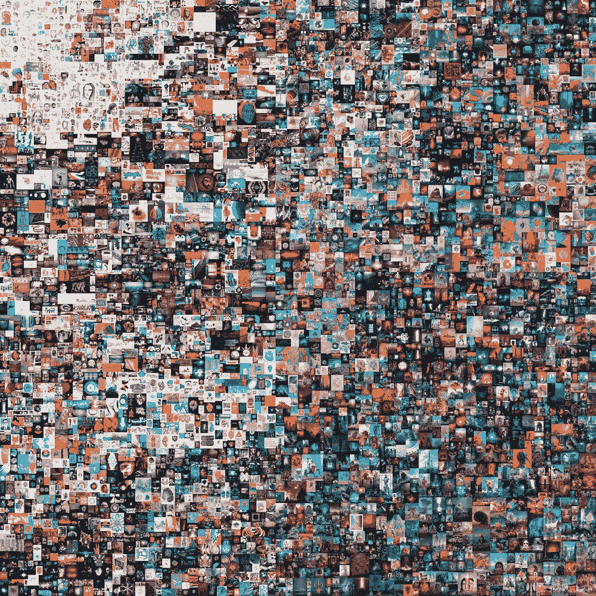

***每一天*** ***—前 5000 天*作者:毕普**，来源:[beeple-crap.com](https://www.beeple-crap.com/)

自从 2021 年 3 月被称为 Beeple 的数字艺术家以 6900 万美元的价格出售了一份 JPG 文件以来，人们对使用区块链出售数字艺术产生了浓厚的兴趣

> 皮普尔的拼贴 JPG 是在二月份作为一种“不可伪造的象征”或 NFT 制作或“铸造”的。一个由计算机系统组成的安全网络将销售记录在一个被称为“区块链”的数字账本上，为买家提供真实性和所有权的证明。大多数人用以太坊加密货币支付。“Everydays”是佳士得售出的第一件纯数字 NFT，它提出接受以太坊付款，这对这家有 255 年历史的拍卖行来说是第一次。——**斯科特·雷伯恩，** [《纽约时报》](https://www.nytimes.com/2021/03/11/arts/design/nft-auction-christies-beeple.html)

我考虑以 NFTs 的形式出售我的数字艺术，在进行了一点研究后，我发现使用多边形区块链[10]的 OpenSea 市场是一个很好的选择。这是出于成本和环境影响的原因。

OpenSea 允许创作者在以太坊区块链或多边形区块链(也称为 MATIC)上发布待售商品。下表显示了以太坊和多边形区块链之间的一些差异。

```
**Feature                      Ethereum         Polygon** Account initializing:        ~US$50           Free
Selling cost:                2.5%             2.5%
Selling items in bundles:    Yes              No
Blockchain validation:       Proof of work    Proof of stake
Environmental impact:        Huge*            Minimal*expected to change in Q1/Q2 2022
```

从表中可以看出，在 OpenSea 上建立一个帐户来销售多边形区块链是免费的，在这里使用以太坊区块链大约需要 50 美元。OpenSea 将从区块链的销售额中抽取 2.5%的销售价格。此外，在多边形区块链上不支持捆绑销售项目。

## NFTs 的环境影响

两个区块链之间的另一个巨大差异是工作证明(PoW)与利益证明(PoS)验证的环境影响。

> 能量消耗是两种共识机制之间的一个主要区别。因为利害关系证明区块链不要求矿工在重复的过程中花费电力(竞争解决相同的难题)，利害关系证明允许网络以低得多的资源消耗运行。—[coinbase.com](https://www.coinbase.com/learn/crypto-basics/what-is-proof-of-work-or-proof-of-stake)

根据多边形…

> …最大的电力公司区块链每年可消耗 35-140 太瓦时的电力，持续消耗 3-15 吉瓦的电力。如果区块链是一个国家，它的年能源消耗将排在第 27 位，高于瑞典、越南和阿根廷。…相比之下，Polygon 的验证器每年大约消耗 0.00079TWh 的电力，大约持续汲取 0.00009GW 的电力，比主要的 PoW 区块链网络的能耗低几个数量级。— [多边形技术](https://blog.polygon.technology/polygon-the-eco-friendly-blockchain-scaling-ethereum-bbdd52201ad/)

经营区块链以太坊的人们清楚地意识到他们对环境的严重影响。他们计划在 2022 年中期转向利益证明验证。

> …[ 2022 年]的升级代表着正式转向利益相关共识。这消除了对能源密集型采矿的需求，取而代之的是使用支撑以太网来保护网络。实现 Eth2 愿景的真正激动人心的一步——更高的可扩展性、安全性和可持续性。——【ethereum.org 

## 建立一个 OpenSea 账户

建立以 NFTs 形式销售数字艺术的平台很容易(而且使用多边形区块链是免费的)。我跟随 OpenSea 的简单指示[来到这里](https://support.opensea.io/hc/en-us/articles/4404029357587-How-do-I-create-and-sell-NFTs-on-Polygon-)。一旦我建立了我的账户，我就把我的数码作品上传到这里，在这里出售，[https://opensea.io/collection/chromascapes](https://opensea.io/collection/chromascapes)

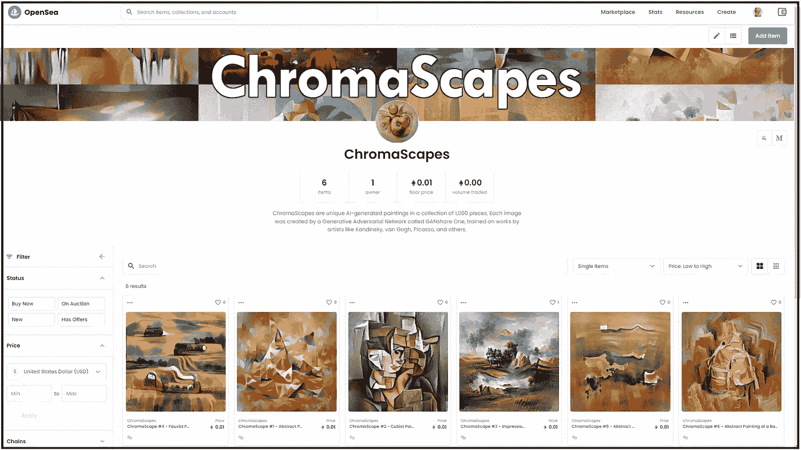

**色彩景观**，作者图片

OpenSea 的一个很酷的特性是能够为待售商品添加属性。购物者可以使用这些属性来定义他们希望看到的商品。对于我的例子，我为生成的绘画添加了以下属性。

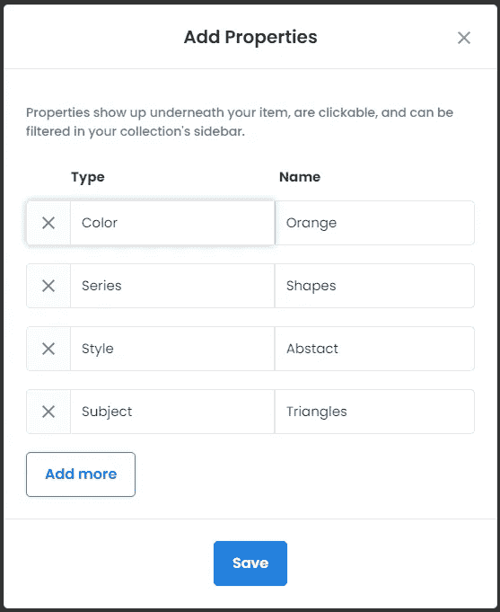

**NFT 房产**，图片作者

如果你有半打左右的项目，用户界面是可以的。但是如果你想卖 100 样东西，直接从 OpenSea 上传并列出要卖的东西是不容易的。

## 使用脚本批量上传项目

尽管 OpenSea 确实有一个 [API](https://docs.opensea.io/reference/api-overview) 来自动完成特定的任务，但是他们的 API 没有自动上传和在他们的市场上销售商品的功能。这是不幸的，因为上传数百个文件将是一个真正的痛苦。

在阅读了 Jim Dees 关于[使用宏程序](https://medium.com/web-design-web-developer-magazine/how-to-post-giant-10-000-sets-of-nfts-on-opensea-2a8efd4c836e)发布 NFT 的文章后，我开始用我喜欢的语言 Python 来做这件事。正确设置后，我发现[的 Selenium WebDriver](https://www.selenium.dev/documentation/webdriver/) 与我本地笔记本电脑上运行的 Chrome 浏览器配合得很好。

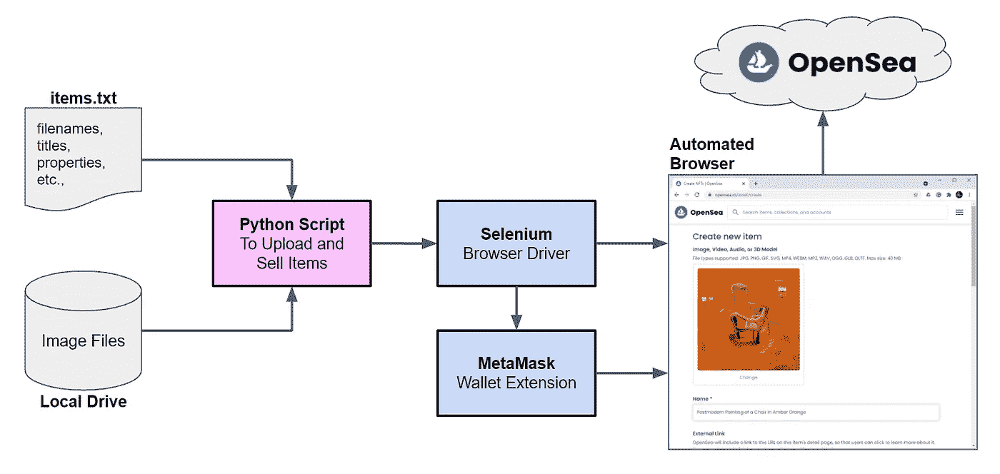

**使用 Selenium 和 Chrome 上传和销售 NFTs** ，作者配图

首先，我在一个文本文件中捕获了 NFTs 的所有元数据。它包括每幅画的文件名、标题和属性。然后，我的脚本使用 MetaMask wallet 登录到我在 OpenSea 上的帐户，并运行列表中的每个项目，执行以下任务:

```
1\. Create a new item in my OpenSea collection
2\. Upload the image file
3\. Enter the name of the item
4\. Enter the description
5\. Enter the properties (i.e. color, style, etc.)
6\. Save the item
7\. Go to sell the item
8\. Enter the price
9\. Post the item for sale
```

这需要一点调整，但我让脚本运行得足够好，可以上传 1，000 个 NFT。

# 甘沙尔

除了以的身份出售好的形象，我还把训练有素的甘的“股份”卖给其他希望创造新形象的艺术家。我为自己保留一股，并在这里卖出另外三股。

OpenSea 在销售 NFT 时允许“锁定内容”。购买 GANshare 后，这些内容将使新的所有者能够创建新的图像，并上传到 OpenSea 或任何其他 NFT 市场进行销售。

# 后续步骤

我在上面提到过,“好的”生成图像的产量只有大约 20%到 33%。运行优化算法超过 200 次迭代可能会改善结果，特别是对于地点和事物类别。此外，可以将剪辑编码器用作自动艺术评论家。查看图像嵌入与“美丽的绘画”这样的短语有多接近，可以提供一种更容易的方法来区分小麦和谷壳。这可以很好地工作，除非你喜欢绿色臭鼬的邋遢画😀。

我还从我的一位评论者奥利弗·斯特瑞普那里得到了一个很好的建议。他问我是否可以训练一个基于语言的人工智能系统来生成高质量的提示，这可能会使它成为一个全自动的艺术生成系统。好主意！

# 源代码

一个用于试验 VQGAN 和 Clip 的 Google Colab 是[这里](https://colab.research.google.com/github/robgon-art/GANshare/blob/main/GANshare_One.ipynb)。

# 感谢

我要感谢詹尼弗·林和奥利弗·斯特瑞普对这个项目的帮助。

# 参考

[1]由 T. Karras、S. Laine、M. Aittala、J. Hellsten、J. Lehtinen 和 T. Aila 编写的 StyleGAN2，(2020)

[2]p . Esser、R. Rombach 和 B. Ommer 的 VQGAN，[驯服高分辨率图像合成的变形金刚](https://arxiv.org/pdf/2012.09841.pdf) (2020 年)

[3]a .拉德福德等人的剪辑，[从自然语言监督中学习可转移的视觉模型](https://cdn.openai.com/papers/Learning_Transferable_Visual_Models_From_Natural_Language_Supervision.pdf) (2021)

[4]d . Kingma 和 J. Ba 的 Adam Optimizer，A [dam:一种随机优化方法](https://arxiv.org/pdf/1412.6980.pdf) (2017)

[5]卡迪纳尔等人的 ISR， [ISR 超分辨率 Resizer](https://idealo.github.io/image-super-resolution/) (2018)

为了无限制地访问 Medium 上的所有文章，[成为会员](https://robgon.medium.com/membership)，每月支付 5 美元。非会员每月只能看三个锁定的故事。