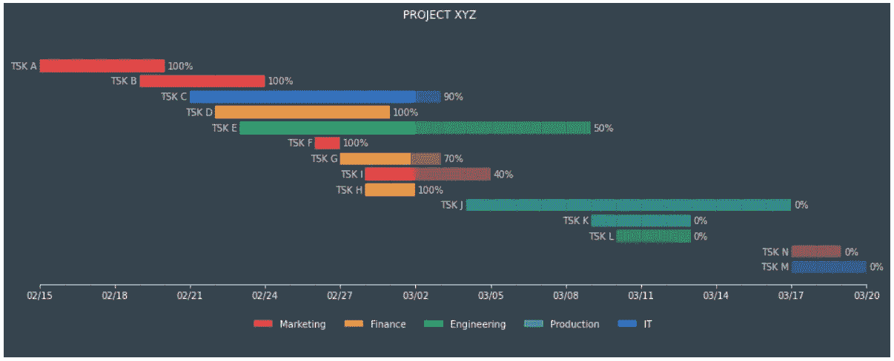
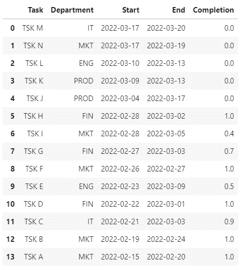
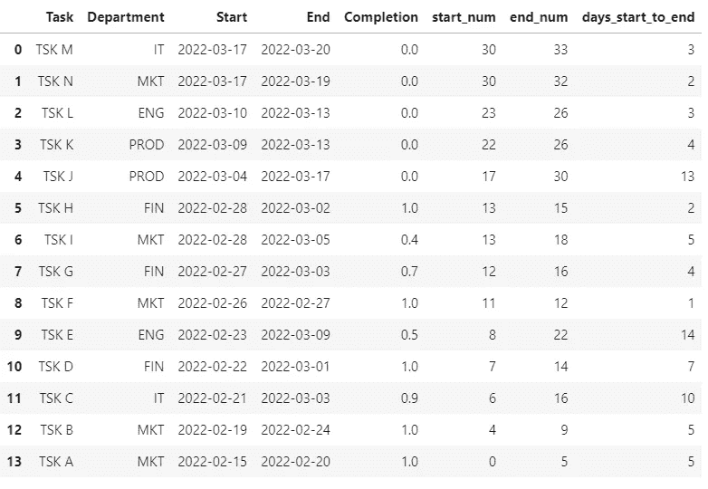
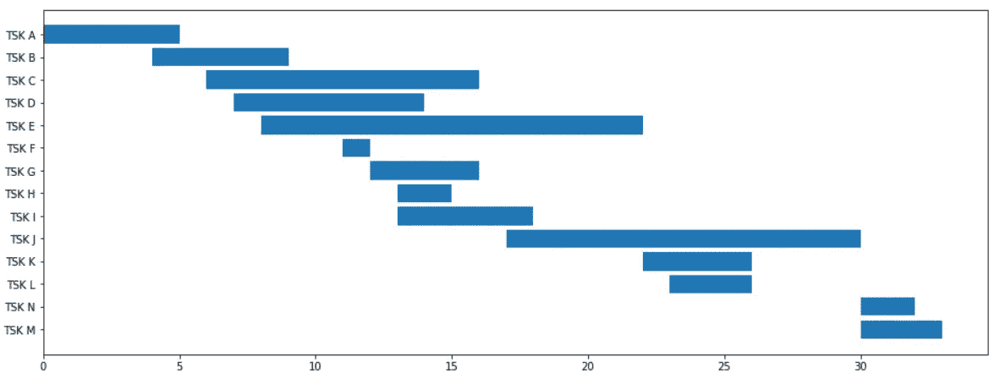
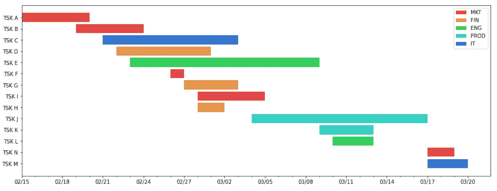
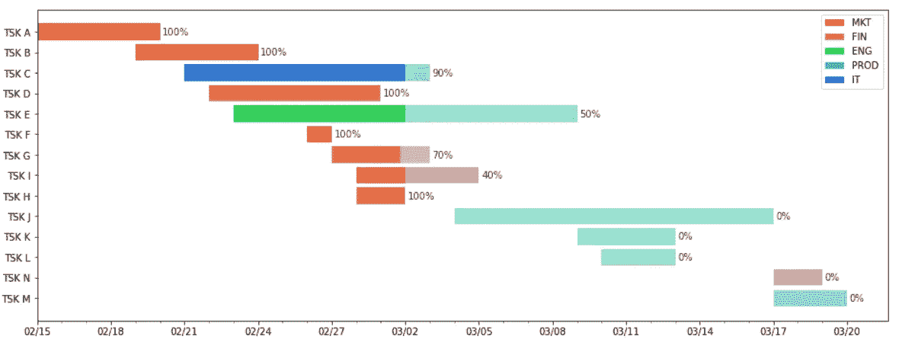
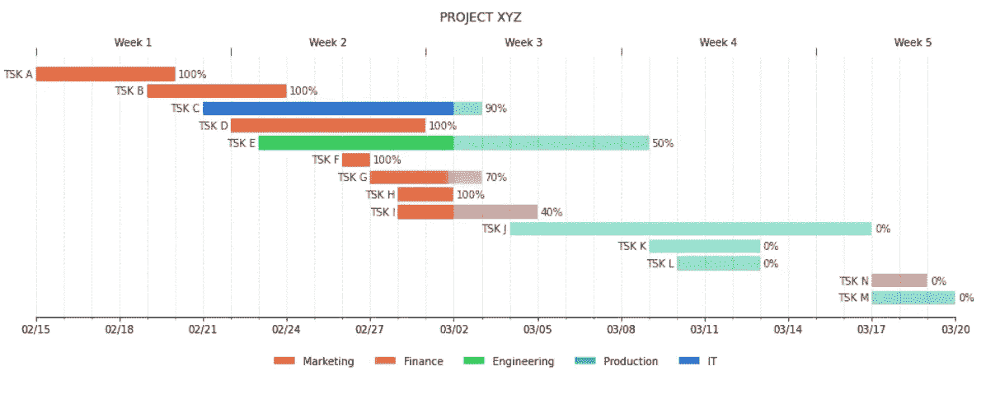
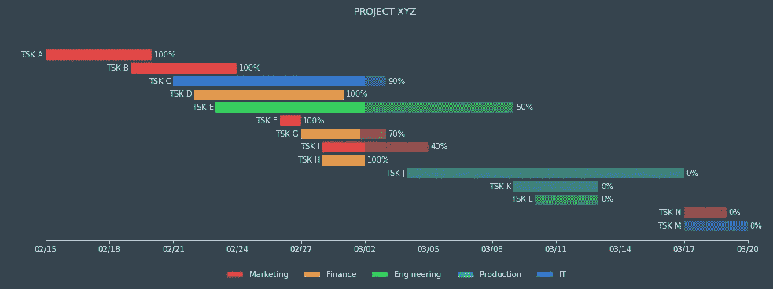

# 用 Python 的 Matplotlib 制作甘特图

> 原文：<https://towardsdatascience.com/gantt-charts-with-pythons-matplotlib-395b7af72d72?source=collection_archive---------2----------------------->

## 用 Python 可视化项目进度指南



作者图片

这种可视化已经有 100 多年的历史，对于项目管理来说仍然非常有用。

亨利·甘特最初创建了用于分析已完成项目的图表。更具体地说，他设计了这种可视化方法来衡量生产率和识别表现不佳的员工。随着时间的推移，它变成了一个计划和跟踪的工具，一旦项目结束，它就被抛弃了。

不可否认的是，自最初设计以来，甘特图已经发生了很大的变化。分析师引入了许多编码来显示部门、任务完成度、依赖性、截止日期等之间的区别。

本文将探讨如何使用 Python、Pandas 和 Matplotlib 创建甘特图。

## 亲自动手

```
import pandas as pd
import matplotlib.pyplot as plt
import numpy as np
```

对于这个例子，我们需要一些虚拟数据；我们将使用的数据集包含任务名称、部门、开始和结束日期以及完成时间等列。

```
df = pd.read_excel('../data/plan.xlsx')
df
```



作者图片

为了使我们的绘图更容易，我们需要获得一些措施。

我们将从项目开始日期的变量开始。

然后，我们将添加一列从项目开始到每个任务开始的天数；这将有助于在 x 轴上定位条形。

任务结束时也是如此；这有助于计算完成任务所需的总天数、条形图的长度，并有助于稍后定位文本。

```
# project start date
proj_start = df.Start.min()# number of days from project start to task start
df['start_num'] = (df.Start-proj_start).dt.days# number of days from project start to end of tasks
df['end_num'] = (df.End-proj_start).dt.days# days between start and end of each task
df['days_start_to_end'] = df.end_num - df.start_num
```



作者图片

现在我们可以绘制一个条形图。y 将是任务名称，宽度是任务开始和结束之间的天数，左边是项目开始到任务开始之间的天数。

```
fig, ax = plt.subplots(1, figsize=(16,6))ax.barh(df.Task, df.days_start_to_end, left=df.start_num)plt.show()
```



作者图片

酷，我们有最简单的甘特图。

我们可以添加许多细节来使我们的图表更有洞察力。我们将从最基本的开始，一个带有日期和颜色的适当的 x 轴来区分各个部门。

```
# create a column with the color for each department
def color(row):
    c_dict = {'MKT':'#E64646', 'FIN':'#E69646', 'ENG':'#34D05C', 'PROD':'#34D0C3', 'IT':'#3475D0'}
    return c_dict[row['Department']]df['color'] = df.apply(color, axis=1)
```

对于 x 轴，我们将每三天添加一个标签，我们还将为每一天添加一个小刻度。

```
**from matplotlib.patches import Patch**fig, ax = plt.subplots(1, figsize=(16,6))ax.barh(df.Task, df.days_start_to_end, left=df.start_num, **color=df.color**)**##### LEGENDS #####**
c_dict = {'MKT':'#E64646', 'FIN':'#E69646', 'ENG':'#34D05C',
          'PROD':'#34D0C3', 'IT':'#3475D0'}
legend_elements = [Patch(facecolor=c_dict[i], label=i)  for i in c_dict]plt.legend(handles=legend_elements)**##### TICKS #####**
xticks = np.arange(0, df.end_num.max()+1, 3)
xticks_labels = pd.date_range(proj_start, end=df.End.max()).strftime("%m/%d")
xticks_minor = np.arange(0, df.end_num.max()+1, 1)ax.set_xticks(xticks)
ax.set_xticks(xticks_minor, minor=True)
ax.set_xticklabels(xticks_labels[::3])plt.show()
```



作者图片

太好了！这张图表比我们之前的版本更有洞察力。

现在让我们将项目的完整性编码到我们的可视化中。

```
# days between start and current progression of each task
df['current_num'] = (df.days_start_to_end * df.Completion)
```

我们将向我们的绘图添加另一个条形，并使用我们刚刚创建的度量作为宽度。

为了提高精确度，我们将在条形的末尾写下完整度的百分比。为了区分完成的和未完成的，我们可以使用条形的 alpha 参数。

```
from matplotlib.patches import Patchfig, ax = plt.subplots(1, figsize=(16,6))# bars
**ax.barh(df.Task, df.current_num, left=df.start_num, color=df.color)**
ax.barh(df.Task, df.days_start_to_end, left=df.start_num, color=df.color, **alpha=0.5**)# texts
**for idx, row in df.iterrows():
    ax.text(row.end_num+0.1, idx, 
            f"{int(row.Completion*100)}%", 
            va='center', alpha=0.8)**##### LEGENDS #####
c_dict = {'MKT':'#E64646', 'FIN':'#E69646', 'ENG':'#34D05C', 'PROD':'#34D0C3', 'IT':'#3475D0'}
legend_elements = [Patch(facecolor=c_dict[i], label=i)  for i in c_dict]
plt.legend(handles=legend_elements)##### TICKS #####
xticks = np.arange(0, df.end_num.max()+1, 3)
xticks_labels = pd.date_range(proj_start, end=df.End.max()).strftime("%m/%d")
xticks_minor = np.arange(0, df.end_num.max()+1, 1)ax.set_xticks(xticks)
ax.set_xticks(xticks_minor, minor=True)
ax.set_xticklabels(xticks_labels[::3])plt.show()
```



作者图片

就是这样！

我们可以改进这种可视化，使其更具吸引力，用另一个轴添加更多信息，绘制网格线，添加标题，等等。



[代号](https://gist.github.com/Thiagobc23/ad0f228dd8a6b1c9a9e148f17de5b4b0) —图片由作者提供



[代号](https://gist.github.com/Thiagobc23/fc12c3c69fbb90ac64b594f2c3641fcf) —图片由作者提供

## 结论

总的来说，这是可视化项目的一种极好的方式，尽管它可能不适合大多数当前的项目管理方法。

甘特图在某种意义上是灵活的，它们可以有许多功能。

您可以分解任务、跟踪绩效指标、依赖性、里程碑、截止日期等等。通过更多的编码、工具提示、向下钻取和文本，可以很容易地向甘特图添加更多的信息。

所有这些信息很容易使我们的图表难以理解，甚至更难维护。

使用敏捷方法，计划是不断变化的。花那么多时间收集和维护这些信息来跟进一个项目需要太多的资源，而且往往会适得其反。

综上所述，它们擅长可视化已完成的项目，比流程图、表格或看板/ Scrum 板更有洞察力，尤其是在审查单个过程或项目时。

感谢阅读我的文章！— [在这里](https://linktr.ee/thiagobc23)你可以找到更多 Python dataviz 教程。