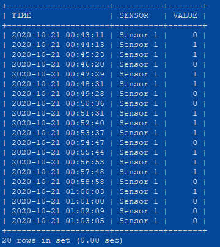
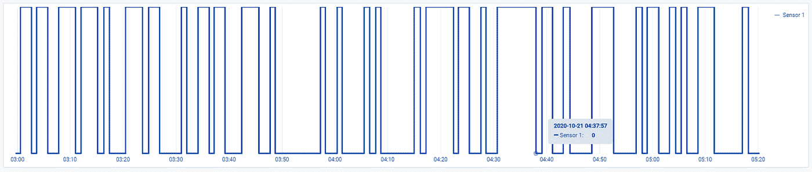
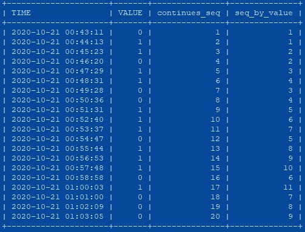
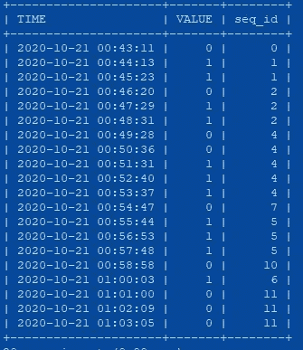
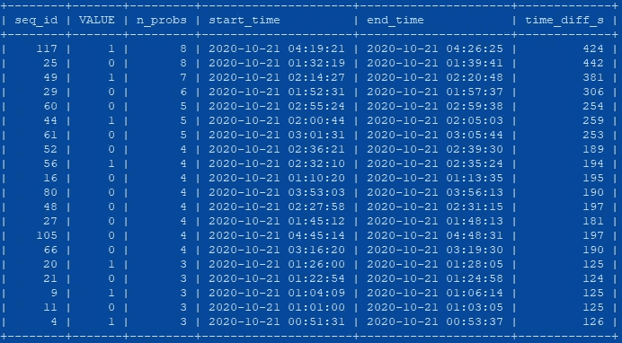
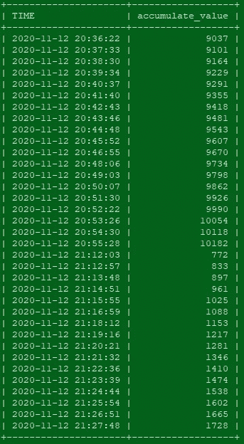
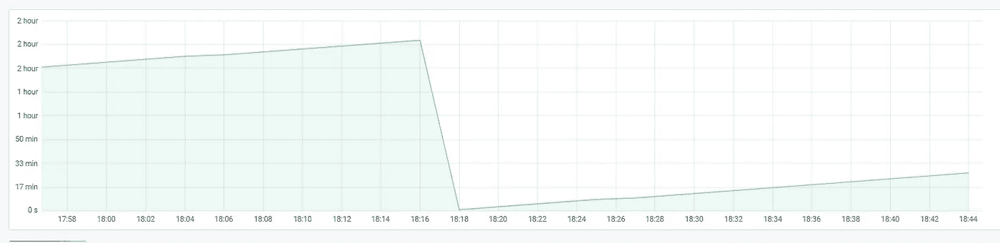
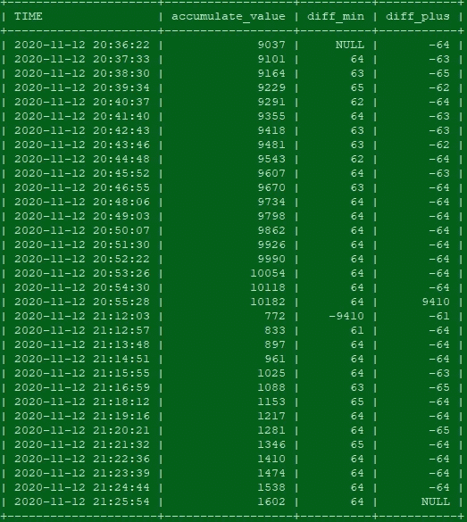

# MySQL 的差距和孤岛问题

> 原文：<https://towardsdatascience.com/gaps-and-islands-with-mysql-b407040d133d?source=collection_archive---------6----------------------->

## 如何用 SQL 分析序列和时间序列，或者如何操作 SQL 语言使其对时间序列更加友好

信用:[朱利叶斯·西尔弗](https://pixabay.com/users/julius_silver-4371822/)

随着世界变得越来越互联，物联网设备在我们的日常生活中占据越来越大的部分，我们周围有如此多的设备和传感器，特别是当其中一些设备和传感器位于并负责敏感功能时，我们必须知道如何监控它们。

监控这些设备的一个重要方面是分析来自传感器数据的统计指标。这些数据通常以具有单一指标的时间序列格式存储，可以是二进制或连续数据，在本文中，我将展示如何使用 SQL 分析这两种选项。

用 MySQL 分析时间序列可能具有挑战性，因为它不是处理这种数据的理想方法。在下面呈现的查询中，有许多子查询会降低查询的效率，因为子查询丢失了原始数据索引。

虽然有更好的方法来处理时间序列数据流，但在许多情况下，来自生产环境的原始数据是使用 MySQL 数据库存储的，因此使用这种方法可以避免漫长而昂贵的 ETL 管道，从而节省时间和金钱。

> 老实说，直到我写这篇文章的参考，我不知道这个问题有一个名字，这是一个已知的问题——差距和岛屿问题。岛的意思是“正常的”序列(在我们的例子中是 1 ),而缺口是成为没有错误和中断的完美序列的障碍。所以我们正在解决一个已知的问题，在我看来，理解了问题就等于解决了一半。

## 二元序列

给定一组数据序列，例如:传感器数据为 0 和 1，1 表示连接，0 表示断开，您希望确定停机时间并更好地了解传感器的行为。信息包括:

序列数据

传感器超时

1.  设备的总停机时间是多少？

2.如何求不间断 1 值序列的最大长度？

3.传感器在两者之间切换多少次？

4.最长的停机/正常运行时间是多久？

5.平均停机时间是多少？

我们可以看到传感器几乎每分钟都在报告。要回答第一个问题“设备停机的总时间是多少？”我们可以估计值为 0 的行数，并乘以 60 秒。汇总这个数量可以为我们提供传感器的总停机时间，但这只是一个估计，如果探测之间存在延迟，并且每两个数据包之间的速率将上升到 70 秒甚至更长，该怎么办？

目前计算这一停机时间的方法是将每个零序列分组，找出第一个和最后一个包之间的时间差，然后汇总这些差异。

这可以通过使用 MySQL 的 4 个简单步骤来解决:

第一步

第一步的结果

在第一步中，我们使用了两个窗口函数，第一个函数 ROW_NUMBER()按时间对数据点进行编号，而第二个函数 ROW_NUMBER()按值对数据点分区进行编号，这意味着第二个函数为每个值提供连续计数(分隔 0 和 1 的序列)。

在第 2 步中，我们将计算*continues _ seq-*seq _ by _ value，并获得每个序列的唯一编号！

现在，我们从传感器获得的数据中的每个序列都有一个唯一的 id！从这里开始，可以很容易地从这些数据中查询统计数据，因为我们对每个停机时间都有一个唯一的名称。基于这种操作，我们可以使用基于值为 0 的 seq _ ids 的`GROUP BY`来回答第一个问题，并将其与我们对`number_row_0 * 60`的估计进行比较

每个序列具有唯一 id 的数据

在上面显示的具体案例中，我们得到了预计停机时间的`number_row_0 * 60 = 9120 secounds`和准确停机时间的`sum(time_diff_s) = 5104 seconds`！

为了回答最大停机时间、平均停机时间等其他问题，我们可以使用以下查询:

## 连续序列

我们的下一个例子展示了带有累积数据的时间序列数据，其中的值可以表示任何累积的指标。例如，传输的数据、自最近一次重启以来的时间、或者从零开始并一直上升的任何度量。(无季节性)

累积值数据集

原始数据超时

在这种情况下，我们可以问自己几个新问题:

1.  计数器重新开始了多少次？
2.  每个序列中的最大值是多少？
3.  每个序列的平均周期是多少？

对于这类数据，我们将使用窗口函数*LEAD*和*LAG*，在我们的第一部分之后，这将更加直观和简单

窗口函数

在步骤 1 中，我们使用了 LEAD window 函数，该函数用于提供当前行之后的行中的值，利用该功能，我们可以计算每个值与下一个值之间的差异——在我们的示例中，这些值是累积的，因此我们希望每个值都比前一个值高。

在第一步之后，我们可以很容易地识别每个序列的开始时间和结束时间，并定义每个序列的行为，只需从`diff_min` [LAG()]中选择负值，从`diff_plus` [LEAD()]中选择正值，然后找到其最大值。

为了计算计数器重新开始的次数，我们只需要从`diff_min`开始计算负值。

**总结**

在这篇文章中，我展示了如何使用 SQL 分析类似序列的数据。第一部分重点介绍离散和二进制数据集，它们仅代表值为 1 和 0 的信号。我展示了如何使用 *ROW_NUMBER* () window 函数为每个 0 / 1 序列提供一个惟一的 id，这使得分析和统计计算更加简单。

第二章集中于连续的数据集，其中的值随着时间的推移而增加。我展示了如何使用 LAG()和 LEAD()窗口函数，并分析这种时间序列数据流。

我希望您发现这个用例的这些解决方案(使用 MySQL 来分析时间序列数据集)有趣且有用，就像我在日常工作中所做的那样。

## 额外阅读

1.  [https://dev . MySQL . com/doc/ref man/8.0/en/window-function-descriptions . html](https://dev.mysql.com/doc/refman/8.0/en/window-function-descriptions.html)
2.  【https://www.mysqltutorial.org/mysql-window-functions/ 
3.  [https://stack overflow . com/questions/58472798/MySQL-how-to-find-the-maximum-length-of-an-uncontinued-sequence-of-a-determined-a-va](https://stackoverflow.com/questions/58472798/mysql-how-to-find-the-maximum-length-of-an-uninterrupted-sequence-of-certain-va)
4.  [https://www . red-gate . com/simple-talk/SQL/t-SQL-programming/The-SQL-of-gap-and-islands-in-sequences/#:~:text = The % 20 word % 20 ' gap ' % 20in % 20th，between % 20 them % 20in % 20a % 20 column](https://www.red-gate.com/simple-talk/sql/t-sql-programming/the-sql-of-gaps-and-islands-in-sequences/#:~:text=The%20word%20'Gaps'%20in%20the,between%20them%20in%20a%20column)。