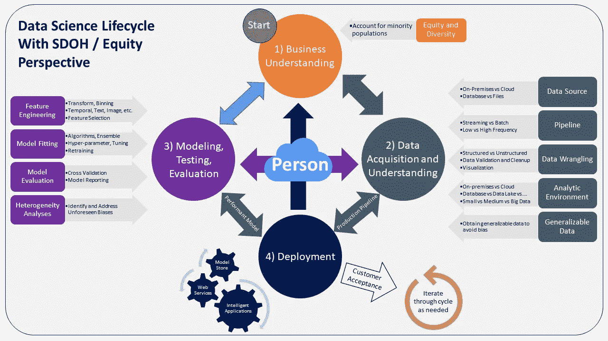

# 垃圾进，垃圾出

> 原文：<https://towardsdatascience.com/garbage-in-garbage-out-721b5b299bc1?source=collection_archive---------13----------------------->

## 拯救世界只是解决这个普遍问题的一个好理由

克拉克·古在 Unsplash 上的照片

*垃圾进，垃圾出*可能是初露头角的数据科学家们对他们即将到来的分析努力所学到的第一课。虽然 GIGO 的精神早在 19 世纪 60 年代就很明显，但实际的短语似乎是由一位名叫 George Fuechsel 的 IBM 程序员在 1962 年创造出来的(Stenson，2016)。他的意思就是它所说的:如果我们把不好的信息放入我们的计算机模型，我们将从它们那里得到不好的信息。预计会有争议、糟糕的见解、糟糕的决策和糟糕的政策接踵而至。

在这篇文章中，我将在机器学习模型的背景下定义垃圾，这些模型被用来解决当今令人烦恼的问题。我们将研究不同类型的垃圾，它们会产生不同大小和意义的问题。我们将从课堂上以及数据科学和统计教科书中提到的基础知识开始。然后，我们将考虑更微妙和更重要的垃圾来源和例子，这些垃圾使解决新冠肺炎疫情或处理许多其他公共卫生、政治、社会、商业或经济问题所需的许多决策和方法变得复杂。我们将描述一些解决 GIGO 问题的方法，并提供一些关于如何将这些方法应用到生活中的想法。

***垃圾到底是什么？***

如果 GI 产量没有了，垃圾会是什么？这个问题的部分答案很简单:坏数据。我指的是以下数据:

错了，

与众不同的是，

太像其余的，或者

失踪了。

第一点背后的逻辑很简单。*错误数据*是错误获得或记录的事实上不正确的值，从而歪曲了分析师想要测量的任何结构。

*与其余数据*差异很大的数据(例如，其值位于均值的两个或两个以上标准偏差处，在任一方向上)通常被称为异常值。有几种方法来定义异常值，但本质上它们有异常高或异常低或其他非典型的值(NIST，2010；麻省理工学院关键数据，2016)。因此，异常值并不常见，但仍然具有影响力，因为这些数据点的极值可能会扭曲分析结果。例如，对一些州和国家的新冠肺炎病例和死亡率的早期预测被发现严重夸大，因为周末的检测和死亡率结果被错误地与下周的检测结果相结合。夸张的下周报告将住院、重症监护病房停留和死亡的时间序列预测拉得太高，导致后来未实现的可怕预测(Ioannidis 等人，2020)。

异常值的识别并不总是简单明了的，尤其是在非正态分布的数据中。调查中出现的例子包括非典型事件，如医院获得性感染或其他医疗保健相关感染的成本分析。这些往往非常昂贵，使整体成本分布向高端倾斜。

然而，对异常值的补救并不总是简单地排除、减少或替换它们。尽管异常值很少且很大，但一些异常值可能确实是底层数据生成过程的真实反映，因此排除、替换或缩减异常值可能会产生不正确的推断。麻省理工学院关键数据团队(2016)对电子健康记录分析中的异常值进行了很好的讨论。一般来说，通过进行多次分析(有异常值和无异常值)可以获得更深刻的见解，从而了解包含少量仍然非常有影响力的观察结果的影响。

*与其余数据*过于相似的数据通常被标记为高度相关或共线。当两个或多个变量高度共线时(即，倾向于以大约相同的速率向相同的方向移动)，它们可能测量相同或非常相似的基本概念。当这样的变量被输入到我们的模型中时(引发了垃圾问题)，我们的模型会遭受多重共线性。这个问题会使模型不稳定，混淆从这些模型中得到的推论，从而产生垃圾。

Belsley、Kuh 和 Welsch (1980)发表了描述多重共线性的起源和解决方案的开创性文本。他们的诊断和补救过程至今仍被频繁使用。在我们的回归模型中，我和我的同事经常测试多重共线性，发现即使是轻微的共线性也会导致有问题的不稳定性，这意味着来自共线变量的系数具有奇怪的高值或低值以及高标准误差。删除一个或多个有问题的变量通常会减少或补救这个问题。其他解决方案，如从共线变量生成主成分或因子得分，也可以在许多应用中使用。还有其他解决方案也有帮助，如套索或岭回归或在分析前将变量居中(Cox，2021)。但是，在删除变量或应用套索或岭回归时要小心，要确保系数减少或删除的变量不会被不当处理。其中一些可能仍然是理论上或概念上正确的因果推理所需要的。

建议测试共线性，并通过改变模型规格来调查模型性能，即使尚未(或几乎)达到公认的共线性阈值。在许多机器学习问题中，一个被广泛接受的表示共线性的阈值被标注为大于 30 的 X’X 矩阵条件索引值。然而，Belsley，Kuh 和 Welsch 反对使用标准的截止值作为条件指数，我和我的同事经常在更低的值(例如，甚至低于 20)发现有问题的共线性。使用其他共线性诊断(如方差膨胀因子(VIFs ))时也发现了类似的模式，因此测试模型对高度共线的输入要素列表中的微小变化的敏感性可能很有启发性。

*缺失数据*如果缺失值的百分比很高，就会出现问题，降低从我们的分析中找到重要结果的能力。如果缺失的模式不是随机的，那么缺失的数据尤其成问题。缺失数据的系统模式意味着剩余数据是系统存在的，这种方式可以从统计分析中产生有偏见的见解(Kalton 和 Kasprzyk，1986)。

例如，从 2020 年 3 月开始的几个月里，密歇根州停止向联邦政府报告阴性新冠肺炎测试的数量，从而无法估计阳性测试的比例(Livengood，2020)。阳性结果的比例是用于跟踪和预测病毒感染的流行病学模型的一个关键特征，因此不正确或缺失的值会导致对病毒传播以及随后的住院和死亡率的错误估计。不幸的是，所有 50 个州的私人检测公司仍然没有被要求向联邦政府报告阴性结果，而且在许多州也没有。这使得制定抗击疫情的最佳政策所需的洞察力生成过程变得更加复杂(Schulte，2020)。

Little 和 Rubin (1987)撰写了关于如何处理缺失数据以及这样做的潜在偏见和优势的开创性文本。十几年后，我发表了一篇关于退伍军人调查数据的多重插补法的应用，以解决他们对等待住院治疗的观点，在一个调查数据集中有几个缺失的观察值(Ozminkowski，1998)。我的多重插补方法试图反映数据的可变性，避免低估标准误差。麻省理工学院关键数据团队(2016)提供了处理缺失数据的最新进展。

***垃圾以多种形式出现***

GIGO 不仅仅指坏数据；这也是对错误思维和/或对偏见反应迟钝的一种暗示。Brian Christian (2020)在他的名为*对齐问题*的书中很好地阐述了这个问题。他指出，人工智能模型中的偏见可能是由于对正在建模的问题缺乏理解。此外，他说，这种偏见很难被发现，发现的时间越长，这种偏见持续的时间越长，范围越广。因此，偏见未被发现的时间越长，这些偏见可能会变得越大越严重，因为它们会伤害更多的人。

照片由 Michal Matlon 在 Unsplash 上拍摄

*其他垃圾来源*

*不正确的理论或概念模型*用作建模的基础，这可能导致建模错误或错误地解释模型结果。例子包括阴谋论和政治或其他干扰，它们要么产生不正确的概念模型，要么阻碍数据收集和科学进程，产生误导或危险的结果。

*对因果关系和因果推理方法的理解有限*，这也导致了糟糕的建模选择、错误的结果解释以及糟糕的社会或经济政策(Maziarz，2020)。

*文档记录不良或无文档记录的代码*，这导致其他开发人员或程序员在模型更新或部署到下游时错过重要细节并犯错误。

*糟糕的研究操作*导致分析师曲解客户需求、应用不正确的理论或概念模型、收集错误或不完整的数据、测试错误的假设、使用不正确的方法或曲解结果。例子包括测试新药物或装置的不正确剂量，导致有偏见的结果(Gillian 等人，2016)。

*未能纳入代表性观点*，导致不完整的概念模型、不能充分代表感兴趣人群的数据、要测试的不完整或不准确的假设和/或对结果的不正确解释(Obermeyer 等人，2020)。

*忽略没有免费的午餐定理*，这可能会导致使用次优模型来生成洞察，如果研究其他模型，这些洞察可能会更加准确、敏感或具体。

*忽略正确使用统计模型所依据的假设*，导致结果不正确。

*构建不良的传播/部署流程*，通常由建模师和工程师之间的误解引起，导致传播或部署不正确或次优的模型。

*一个不适定的问题*(一个有许多不同答案的问题)，导致对目标的误解和可能不想要的结果。一种被称为逆向强化学习的技术可能有助于通过解读研究人员的意图来解决不适定的问题，然后可以指导寻找解决方案。克里斯蒂安(2020，第 255–259 页)描述了吴恩达在这一领域的工作。通过在下述 CRISP-DM 流程的理解业务需求部分花费更多时间，人类也可以更好地解读意图。

*使用错误的统计测试*，例如那些未能控制混杂因素或通过调节打开竞争因果路径的变量而过度控制的测试。Pearl 和 MacKenzie (2018)详细讨论了这个问题及其解决方案。

*高置信度下做出的错误判断*就是垃圾剔除的例子。不过，有时人类的直觉可以解决计算机产生的错误判断。克里斯蒂安(2020 年，第 279 页)描述了一个潜在的引发战争的案例，当时苏联模型错误地预测了美国向苏联领土发射导弹的核发射。幸运的是，一名训练有素的值班军官 Stanislav Petrov 利用他的直觉和训练避免了可能导致 WWIII 的报复！这个故事说明了机器加人类可以比机器单独强很多。对人+机器过程的正式研究被称为合作机器学习。Christian (2020，第 266 页)引用了 Stuart Russell 在这方面的工作。

道德不确定性可能是一种垃圾。如果我们不能就什么是好的或正确的达成一致，我们如何知道相关的政策是否没有垃圾，或者其中可能有多少垃圾？(《基督教》，2020 年，第 305 页)。另一方面，一些不确定性可能是可取的，因为它可以激发更多的调查和多角度的考虑。这可能有助于澄清伦理问题，并为更好(或至少更完整)的分析指明方向。克里斯蒂安(2002 年，第 304-308 页)描述了威尔·麦卡斯基尔在这一领域的工作。

*数据标注不当*是垃圾的来源。如果我们预测模型中的标签是不正确的，那么我们的洞察力将会是错误的。(《基督教》，2020 年，第 315 页)。

*模型假设偏差*(即，对现实中不存在的事物建模)也是一种垃圾。Maziarz (2020)在他的《经济决策的因果推理》一书中描述了几个这样的例子。克里斯蒂安(2020)在他的书的第 324 页也提到了这一点。

*走得快，打破常规*如果我们走得太快，错过了上面提到的任何一个问题，就可能成为垃圾的来源。

***解决方案***

为了指导寻找 GIGO 问题的解决方案，考虑一下数据科学的跨行业标准流程。CRISP-DM 是由一个国际财团在 20 世纪 90 年代开发的，并由 Chapman 等人在 1999 年进行了总结。图片上看起来是这样的:

图 1:https://en . Wikipedia . org/wiki/Cross-industry _ standard _ process _ for _ data _ mining

CRISP-DM 是科学过程的计算机科学渲染。这与高质量的物理和社会科学方法中使用的过程非常相似。一个是从业务理解任务开始，如果做得好，会对客户希望通过分析解决的问题产生坚实的理解。这个迭代任务驱动图中显示的所有后续阶段，其中一些阶段相互加强。该图是不言自明的，因此显而易见的是，任何步骤中的问题(即垃圾)输入都会混淆所有未来或相关的步骤，并导致垃圾输出。因此，解决方案是在每一步都避免错误或其他垃圾。

CRISP-DM 流程已经随着时间的推移而不断完善。一个特别引人注目的修订是由微软的 Jen Stirrup 做出的，并作为“数据科学生命周期”发表(strap，2017)。她的版本和下面的非常相似，这是我根据她的版本创作的，并经许可使用。主要区别如下:

我的版本侧重于健康服务的研究和部署过程。这反映了我的培训和经验，也反映了最近对健康的社会决定因素(SDOH)的关注，包括我们出生、成长、学习、生活、工作、玩耍、崇拜、衰老和以其他方式度过时间的环境的各个方面(美国卫生与人类服务部，健康人 2030)。这些影响了我们的健康，获得医疗保健服务，如 COVID 测试和疫苗，癌症治疗等。SDOHs 也影响医疗服务的质量和治疗的结果。与 SDOH 相关的偏见在我们的模型中制造了垃圾，这可能会导致这些模型产生垃圾。

“数据”不是微软修订版的中心，我开发的精细数据科学生命周期将人作为分析工作的中心焦点。这符合以人为中心的设计原则(IDEO.org，2015)。

此外，我添加了标记为公平和多样性、异质性分析和可归纳数据的框，以指出这些焦点如何帮助避免偏见，并提高对细化的生命周期的理解和洞察力。

我还移动了 box 3，使更多的 box 成为双向的，以记录它们对生命周期其他部分的影响。

为了反映上述内容，我更改了该图的标题，添加了短语“从 SDOH 和公平的角度”

从 GIGO 的角度来看，这个图表的要点是，对细化生命周期的每一步给予更多的思考可以减少垃圾输入错误，从而减少垃圾从我们的分析中出来的可能性。每一步都应该反映和融合各种文化、理论、概念和其他关于人的观点，以及我们如何努力改善每个人的生活。这将有助于我们识别和避免认知偏见、种族主义、年龄歧视、性别歧视和其他不公平现象，否则这些现象可能会渗透到我们的研究设计中，并在我们的分析中引发来自生命周期每一步的偏见。识别和避免这些类型的垃圾将有助于避免糟糕的政策、歧视和糟糕的生活质量。

图 2:作者修改的数据科学生命周期图像，以反映健康的社会决定因素(SDOH)和公平观点

***实施方案***

虽然遵循数据科学的生命周期似乎很简单，但一些评论可以帮助指导这一过程。首先，业务理解任务是最重要的部分。这里的错误会在整个过程中级联，并且肯定会在剩余的过程中产生垃圾。如果不加以纠正，这种垃圾将在部署期间和生命周期的后续迭代中传播。为了避免这种情况，我和同事们完成的许多研究和报告项目都涉及一系列预定的正式会议，至少每季度面对面一次，至少每两周通过电话进行一次。当出现意想不到的问题或疑问时，还会有非正式的电话、短信、即时消息或电子邮件。如果需要，Zoom 及其同类产品可以取代基于电话的会议。在几十年的研究生涯中，我还没有经历过一个更好的方法来识别和解决分析工作中的问题。

这个过程可能看起来会增加研究过程的时间和净成本，但我们的经历正好相反。通过经常看到和听到我们的同事，我们建立了更好的关系，能够看到和听到客户和利益相关者在想什么，我们能够更快地解决冲突或回答问题。人们开始习惯问一些直接的问题来推动项目的进展。这节省了时间和金钱，如果没有足够的对话，这些时间和金钱将会花费在迭代解决方案上。客户更开心了。

其他经验告诉我，在业务理解过程中偷懒是一个非常糟糕的主意。正确地做可以避免前端的垃圾，这些垃圾会导致(有时确实会导致)以后的重大问题。如果您与多个团队合作，例如业务开发、战略团队、产品开发、临床医生、社会服务提供商、工程和营销团队，将每个团队的代表召集在一起是很困难的。然而，如果做不到这一点，可能会导致严重的痛苦和客户不满，损失时间，并造成数十万甚至数百万美元的额外损失。这些人应该从始至终在整个项目中合作。只与这些人中的一些人开会，排除其他人，会增加误解和错误的可能性，这在以后可能是非常昂贵的。

业务理解过程也是努力理解如何避免或解决其他问题的地方。这是应该考虑坚实理论的地方，也是应该进行相关文献回顾的地方，以帮助指导分析过程。不同年龄组、不同性别、不同收入、不同教育、不同文化背景和不同地点的人，如果直接经历了分析要解决的问题，也应该在这个阶段进行咨询。他们的意见应通过上述会议/电话/缩放/电子邮件或文本流程定期获得。

这些业务理解活动有助于识别因果机制和要测试的反事实场景。它们还可以帮助识别可能经历不同因果途径和完全不同结果的亚人群。除了分析整个人群的经历，分析这些亚人群的经历将有助于避免偏见并产生更好的见解。卡内基梅隆大学数据科学和公共政策团队(2018)构建的 Aequitas 开源机器学习审计工具显示了如何解决不同年龄、性别表达、教育水平和收入的人的观点。Spurlock 等人(2020 年)对加州疗养院新冠肺炎患病率的研究说明了亚人群结果如何不同，以及模型结果如何随时间变化。

数据获取和数据理解过程，以及图 2 中提到的建模/测试/评估过程，在很大程度上相互依赖，并且依赖于业务理解任务。这些过程中的错误通过收集错误的数据、不充分或不正确地分析数据，以及未能应用彻底的模型测试和评估过程而注入或产生垃圾。在医疗保健应用中，对健康的社会决定因素或公平的其他相关因素的关注将对这些过程产生重大影响。数据元素的概况、数据质量报告、分析过程和分析结果应与客户和重要亚人群的代表一起审查。如何清理和分析数据的例子比比皆是，在任何优秀的数据科学文本中都可以找到。麻省理工学院关键数据团队(2016)在临床分析领域提供了一个很好的例子。在这些阶段也应该应用 Aequitas 或其他方法来发现和解决偏见。使用敏感性分析来测试群体差异和个体差异，然后在必要时修正数据和/或模型，将会产生更好的结果(Hall 等人，2021，第 46–49 页；麻省理工学院关键数据团队，2016)。

数据科学生命周期的第四个主要阶段是部署，这通常被认为是流程中的最后一步。这是否正确取决于客户、竞争对手和其他利益相关者对生命周期输出的反应。大多数分析模型会随着时间的推移而衰退，这意味着随着新的和不同的数据进入模型，它们的准确性和其他性能指标会下降。退化可能是由于从新群体或亚群体获得数据，或者是由于人类行为的自然进化。Ilro Lee (2021)指出了学习组织心理学的价值，以了解认知偏差和数据科学家可以避免的其他问题。数据科学家制作的许多分析模型旨在预测或解释人类行为，因此理解行为心理学或行为经济学可以帮助减少 GIGO 问题。由于人类的经验和视角会随着时间而改变，部署应该是后续工作的推动者，而不是建模过程的真正结束。

数据科学的生命周期是迭代的，来自客户、竞争对手和其他利益相关方的见解应该激励未来的迭代。这些将引导创新，创造更多有用的见解，减少垃圾的输入和输出。

最后，Obermeyer 等人的算法偏差剧本(2020 年，第 4 页)提供了一个非常有用的 4 步过程，以识别和避免在我们的模型中插入垃圾的系统性偏差。这些包括(我引用一下):

步骤 1:库存算法

第二步:筛选偏见

第三步:重新训练有偏见的算法(或者抛弃它们)

第四步:建立防止未来偏见的结构。

作者详细描述了这些步骤和每个步骤中的子步骤。他们的指南没有行话，并且提供了常识性的解决方案，这使得它简单易懂。绝对值得花时间去了解和遵循他们的系统。

***局限性***

我在这篇文章中的目标只是指出几个可能在我们的模型中产生垃圾的问题，以及如何解决这些问题以避免产生垃圾的一些想法。GIGO 问题的范围很广，人们无法在一篇短文中完整地描述这些问题或它们的解决方案。微软(2021)的研究小组提供了有关数据质量测试和补救工作的更多信息。这里提供的参考资料也会有所帮助。对于更细微的问题，随着偏见检测和负责任的机器学习的应用继续应用，将会学到更多。

还应该注意的是，这里没有提到的许多其他问题可能会产生这样或那样的垃圾。我的同事 Mahil Senathirajah 提到的例子包括以旨在得出特定结论的研究形式出现的故意偏见、科学家或新闻界对结果的不准确或故意的错误报道，以及由于不利的结论而禁止发表研究。在我看来，同行评审期刊中经常出现的避免发表不具有统计学意义的结果的偏见可能也是另一种形式的压制和垃圾。好的研究并不总是揭示统计上的显著关系。

***结论***

GIGO 的精神简单且广为接受，但它的现实只有在我们认识到好的和坏的数据和分析过程之间的区别时才能得到承认。尽管我们尽了最大努力来解决上述问题，但每个数据集和分析方法都包含一些垃圾，没有一个是完美的。分析师尽最大努力发现并解决问题，但他们无法独自完成这项工作。那些设计研究、创建行为理论、创建和/或收集数据的人，以及那些设计、进行和解释分析的人，也扮演着重要的回避工作的角色。

简单地删除垃圾并不总能解决 GIGO 问题。如果垃圾以在模型中产生偏差的变量的形式出现，如果与偏差诱导变量高度相关的其他变量可能拾取那些偏差诱导变量的一些影响，则一些偏差可能会保留。Christian (2020 年，第 57-65 页)用模型说明了这一点，这些模型导致在高犯罪率地区也就是高少数族裔地区加强警察监控。过了一段时间，少数民族种族和犯罪之间的联系被联系在一起，然而种族本身并不是诱发犯罪的因素。

Hall 等人(2021)描述了“负责任的机器学习”的许多原则和应用，可以更好地解决 GIGO 问题。再加上对融合了公平和 SDOH 观点的最新数据科学生命周期的关注，并通过实施算法偏差剧本，我们可以产生分析见解，然后应用这些见解来改善全球数百万人的生活。

***回执***

我要感谢 Mahil Senathirajah 对本文早期草稿的有益评论。他的见解帮助我改进了它。任何遗留的错误都是我的。

***参考文献***

D.A. Belsley、E. Kuh 和 R.E. Welsch,《回归诊断:识别共线性的有影响的数据和来源》( 1980 年),纽约 John Wiley & Sons 公司

页（page 的缩写）Chapman，J. Clinton 和 R Kerber 等人，CRISP-DM 1.0:逐步数据挖掘指南(1999 年)，关于[https://www.the-modeling-agency.com/crisp-dm.pdf](https://www.the-modeling-agency.com/crisp-dm.pdf)

B.克里斯蒂安,《对齐问题》( 2020 年),诺顿公司，纽约州纽约市

J.考克斯，《回归分析中的多重共线性:问题、检测和解决方案》(2021 年)，载于[https://statisticsbyjim . com/Regression/multiple 共线性-in-regression-analysis/](https://statisticsbyjim.com/regression/multicollinearity-in-regression-analysis/)

卡内基梅隆大学的数据科学和公共政策团队， *Aequitas:一个用于机器学习的开源偏见审计工具包* (2018)，在[http://www . datasciencepublicpolicy . org/our-work/tools-guides/Aequitas/](http://www.datasciencepublicpolicy.org/our-work/tools-guides/aequitas/)

G.L. Fell，A. O'Loughlin，P. Nandivada 等人，减少研究性胃肠外药物临床试验中用药错误的方法，(2016)，当代临床试验通讯 4(15):64–67

页（page 的缩写）Hall，N. Gill 和 B. Cox,《负责任的机器学习》( 2021 年),波士顿，MA: O'Reilly Media 公司。

IDEO.org,《以人为本的设计实地指南》( 2015 年), designkit.org

J.P.A .约安尼迪斯、s .克里普斯、M.A .坦纳，《对新冠肺炎的预测已经失败》(2020 年 6 月 11 日)，国际预测机构

G.Kalton 和 D. Kasprzrk D,《缺失调查数据的处理》( 1986 年),调查方法 12；1–16

I. Lee，每个数据科学家都应该学习组织心理学的 4 个理由(2021)，走向数据科学，在[https://Towards Data Science . com/4-Reasons-Why-Every-Data-Scientist-Should-Study-organization-Psychology-a 9411 FD 6030 b](/4-reasons-why-every-data-scientist-should-study-organizational-psychology-a9411fd6030b)

R.J.A. Little 和 D. Rubin,《缺失数据的统计分析》( 1987 年),纽约约翰威利父子公司

C.Livengood，为什么密歇根州不再报告阴性新冠肺炎测试？很复杂*、*(2020 年 3 月 19 日)*克莱恩斯底特律商务*。

米（meter 的缩写））Maziarz,《经济学中的因果哲学:因果推论和政策建议》( 2020 年), Routledge Taylor 和 Francis 集团，纽约

麻省理工学院关键数据，电子健康记录的二次分析，(2016)，施普林格国际出版公司，瑞士湛

美国国家标准与技术研究所，数据中有哪些异常值？工程统计手册(2010 年)，位于[https://www . ITL . NIST . gov/div 898/Handbook/PRC/section 1/PRC 16 . htm](https://www.itl.nist.gov/div898/handbook/prc/section1/prc16.htm)

Z.Obermeyer，R. Nissan，M. Stern 等人，《算法偏差剧本》(2020 年)，芝加哥布斯:应用人工智能中心。同样在[https://www . FTC . gov/system/files/documents/public _ events/1582978/algorithm-bias-playbook . pdf](https://www.ftc.gov/system/files/documents/public_events/1582978/algorithmic-bias-playbook.pdf)

R.Ozminkowski，等待住院治疗:在退伍军人医院的经历(1998 年)，*健康服务管理研究 11:228*–237

J.Pearl 和 D. MacKenzie,《为什么之书:因果的新科学》( 2018 年),纽约基础图书公司

微软研究小组实验平台，数据质量:可信 A/B 测试分析的基础构建模块(2021 年 11 月 9 日)在[https://www . Microsoft . com/en-us/research/Group/Experimentation-Platform-exp/articles/Data-Quality-Fundamental-Building-Blocks-for-trust-A-B-Testing-Analysis/](https://www.microsoft.com/en-us/research/group/experimentation-platform-exp/articles/data-quality-fundamental-building-blocks-for-trustworthy-a-b-testing-analysis/)

F.舒尔特，一些州报告了不完整的新冠肺炎结果，模糊了全貌，(2020 年 3 月 25 日)，凯撒健康新闻

B.Spurlock、C. Harrington、M. Senathirajan 等人(2020 年)，《加州疗养院中的新冠肺炎:与病例和死亡相关的因素》，载于[https://www . chcf . org/publication/新冠肺炎-加州-疗养院-因素-病例-死亡/#建议](https://www.chcf.org/publication/covid-19-californias-nursing-homes-factors-cases-deaths/#recommendations)

R.史丹森，这是第一次有人印“垃圾进，垃圾出”吗？(2016 年 3 月 14 日)Atlas Obscura，在[https://www . atlasobscura . com/articles/is-this-the-first-time-any one-printed-garbage-in-garbage-out](https://www.atlasobscura.com/articles/is-this-the-first-time-anyone-printed-garbage-in-garbage-out)

J.马镫，CRISP-DM 怎么了，有替代方案吗？(2017)，上*[https://jen staple . com/2017/07/01/whats-error-with-crisp-DM-and-is-there-an-alternative/](https://jenstirrup.com/2017/07/01/whats-wrong-with-crisp-dm-and-is-there-an-alternative/.%C2%A0)*

*美国卫生与公众服务部健康促进与疾病预防办公室。健康人 2030:健康的社会决定因素，载于[https://Health . gov/Health ypeople/objectives-and-data/Social-determinators-Health](https://health.gov/healthypeople/objectives-and-data/social-determinants-health)*