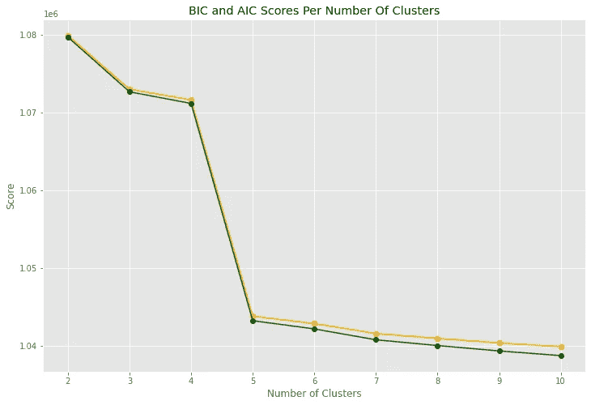

# 用于聚类的高斯混合模型

> 原文：<https://towardsdatascience.com/gaussian-mixture-models-for-clustering-3f62d0da675?source=collection_archive---------11----------------------->

## 扩展 K-Means 以外的聚类知识的初学者指南。


纳蕾塔·马丁在 [Unsplash](https://unsplash.com?utm_source=medium&utm_medium=referral) 上的照片

# 介绍

最近，我在一个项目中使用 K-Means，并决定看看聚类算法还有什么其他选择。我总是觉得埋头拓展我的数据科学技能是一件令人愉快的事情。我决定写这篇文章来分享我在探索拓宽我的聚类知识以包括使用高斯混合模型的过程中所发现的经验。

# 高斯混合模型综述

当听说这种技术时，您可能会想到高斯分布(也称为正态分布)。这正是这种聚类技术的基础。它假设数据点来自多维高斯分布，这些分布可能具有不同的协方差、均值和密度参数。

高斯混合模型基于一种叫做期望最大化或 EM 的算法工作。当给定高斯混合模型的聚类数时，EM 算法试图通过两个基本步骤计算出这些高斯分布的参数。

*   **E-step 根据可用数据对参数进行猜测。**数据点被分配到一个高斯聚类，并计算它们属于该聚类的概率。
*   **M 步骤根据 E 步骤的计算结果更新聚类参数。**根据 E 步骤中的数据点计算聚类的均值、协方差和密度。
*   重复该过程，继续更新计算值，直到达到收敛。

如果你熟悉 K-Means，这个过程在高层次上确实是一样的。类似的流程是进行猜测、计算值，然后重新调整直到收敛。

# 拟合高斯混合聚类模型

对高斯混合的工作原理有了基本的了解后，有趣的部分是开始编码和实验。使用 Python 和 Scikit-Learn，只需几行代码就可以实现一个集群模型。我鼓励你看看高斯混合类的 Scikit-Learn 文档页面。

```
from sklearn.mixture import GaussianMixturegm = GaussianMixture(n_components=n, random_state=123, n_init=10)
preds = gm.fit_predict(X)
```

`n_components`参数是您指定集群数量的地方。`n_init`参数允许您控制算法初始化的次数。聚类在开始时所处的初始位置可以设置算法来挑选坏的聚类参数。通过多次初始化，您减少了仅仅因为初始放置运气不好而聚集在坏簇上的机会。最后，拟合和预测可以在一个步骤中完成，只需对示例中表示为 X 的数据调用`fit_predict()`方法。

# 有多少个集群？

但是我的数据中有多少聚类呢？您可能已经注意到，为了将模型应用于您的数据，您必须为分类数选择一个值。您如何知道哪个集群编号最能代表您的数据？你有几个选择，我会过一遍。

## 反复试验

通常，找到合适的分类编号的最佳方法是尝试不同的分类编号，看看哪一个更适合您的数据。为拟合高斯混合模型挑选聚类数的两个最流行的评估指标是 BIC 和 AIC。BIC 代表贝叶斯信息准则，AIC 代表阿凯克信息准则。计算这两个指标的直觉是，它们倾向于最大化模型似然函数的最简单模型。

计算 AIC 和 BIC 很容易，因为它们是 Scikit-Learn 高斯混合类的内置方法。通过设置一个循环来尝试不同的集群编号并计算 AIC 和 BIC，您可以将这些指标绘制在一起以选择您的集群编号。



BIC 和 AIC 情节(图片由作者提供)

你可以看到 AIC 和 BIC 非常相似。 **BIC 和 AIC 意味着** **最小化**所以选择图表中的低点。这两种方法通常会选择相同的聚类数，但如果它们不同，那么就知道 BIC 比 AIC 更倾向于简单模型，但 AIC 模型往往更好地拟合数据。在本例中，我将选择 5 作为数据的最合适的聚类数，因为在此之后图表将真正趋于平稳。

## 贝叶斯高斯混合模型

我遇到的另一种选择聚类数的方法是使用 Scikit-Learn 中的[贝叶斯高斯混合模型类。当您符合此模型时，它有一个属性来返回错误聚类的权重，错误聚类的权重等于或接近于零，并且基本上会自动移除这些聚类。同样，您只需要几行代码就可以适应这个模型。](https://scikit-learn.org/stable/modules/generated/sklearn.mixture.BayesianGaussianMixture.html)

```
from sklearn.mixture import BayesianGaussianMixture
import numpy as npbgm = BayesianGaussianMixture(n_components=10, n_init=10)
bgm.fit(X)
np.round(bgm.weights_, 2)
```

模型创建完毕，与之前一样拟合，但现在我们可以返回一个聚类权重数组。我自己的实验返回了这个数组:

数组([0.09，0.25，0.16，0.07，0.06，0.24，0.13，0。, 0., 0.])

这让我看到模型基本上已经自动挑选了适当数量的集群，因为不需要的集群被加权为 0。

# 利弊

这些模型的一个优点是它们可以处理更多种类的形状，主要是形成省略号形状的集群。像 K-Means 这样的东西实际上只擅长于近似球形的聚类。有一个`covariance_type`参数允许调整不同形状的簇。然而，对于高斯混合模型来说，类似月牙形的簇仍然难以准确识别。

另一个积极的方面是，这些模型允许软分类。K-Means 是一个硬分类模型，其中每个数据点被分配到一个单独的聚类。然而，高斯混合方法计算属于聚类的数据点的概率。这些概率可以在拟合模型后使用`predict_proba()`方法获得。

我在玩高斯混合模型时发现的一个警告是，它们比 K-Means 模型需要更长的时间来运行，因为它们需要更长的时间来收敛。请注意您使用的数据量以及涉及的要素数量。当特别试验贝叶斯高斯混合类时，它经常给出关于如何不能达到收敛的错误。当这种情况发生时，你可以增加`max_iter`参数，但这也意味着运行时间会更长。请记住，这也可能意味着您的数据不太适合高斯混合聚类风格。

# 结论

这种类型的集群还有很多值得探索的地方。我试图让这成为一个指南，用简单的英语解释概念，让你开始，但我鼓励你查找公式，挖掘正在发生的事情背后的数学。 [Scikit-Learn 集群用户指南](https://scikit-learn.org/stable/modules/clustering)是一个很好的起点。