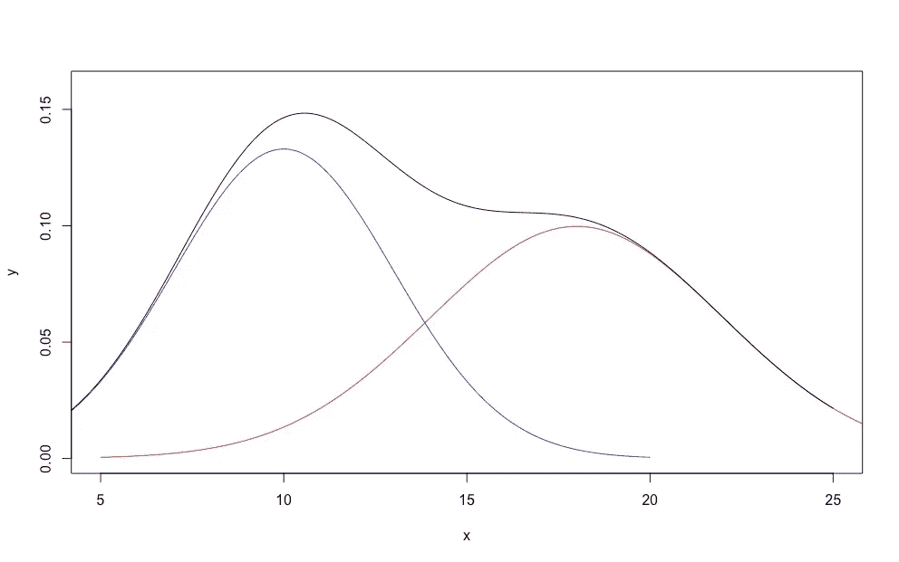
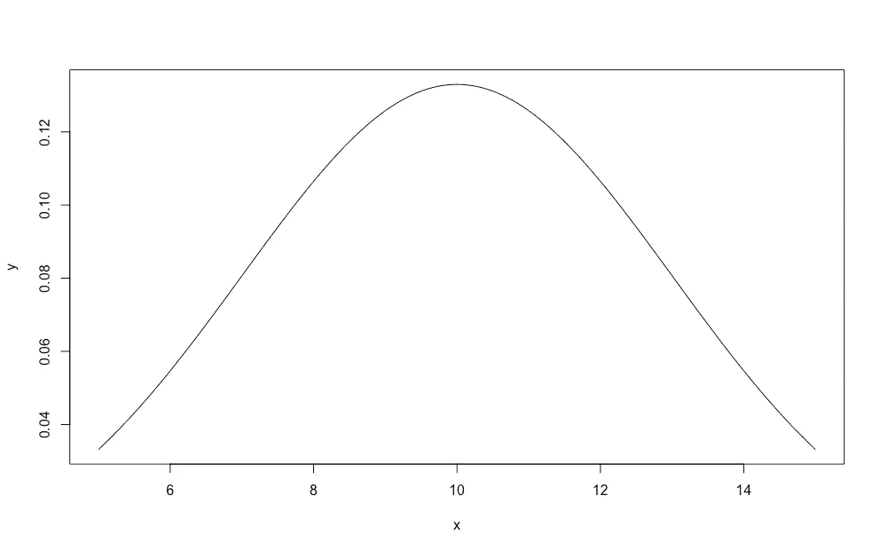
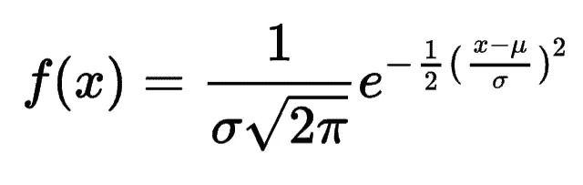
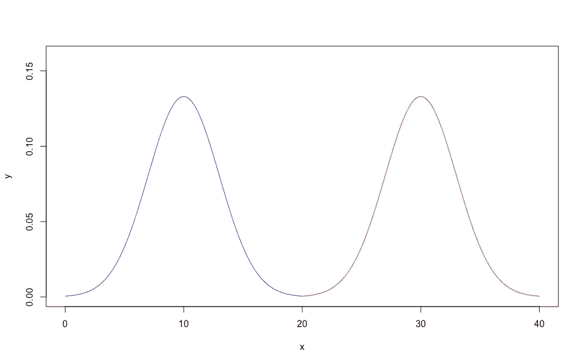
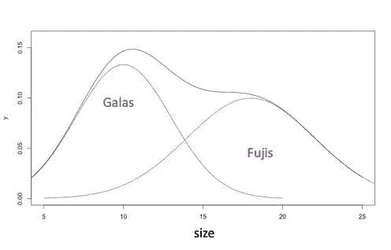
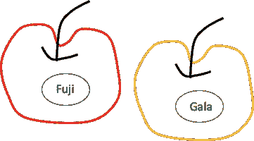
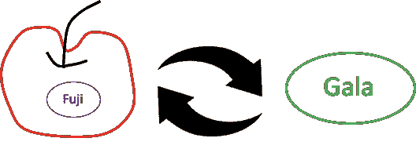
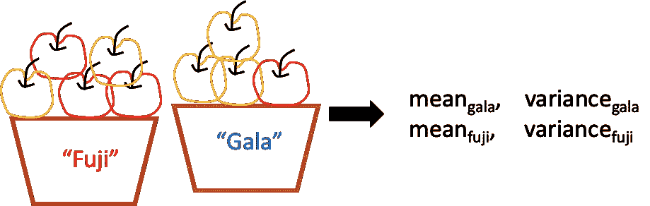

# 基于 Python 的高斯混合模型

> 原文：<https://towardsdatascience.com/gaussian-mixture-models-with-python-36dabed6212a?source=collection_archive---------2----------------------->

## 无监督学习

## 在这篇文章中，我简要介绍了无监督学习方法的概念，高斯混合模型，以及它在 Python 中的实现。


由 [Unsplash](https://unsplash.com?utm_source=medium&utm_medium=referral) 上的 [Edge2Edge 媒体](https://unsplash.com/@edge2edgemedia?utm_source=medium&utm_medium=referral)拍摄

T 何**高斯混合模型** ( ***GMM*** )作为一种**无监督**学习算法用于聚类是众所周知的。这里，“*高斯*是指高斯分布，用均值和方差来描述；*混合*指一个以上高斯分布的混合。

这个想法很简单。假设我们知道一组数据点来自多个不同的高斯模型(对于 *1-d* 数据，高斯模型由均值标量和方差标量描述，对于 *N-d* 数据，由均值向量和方差矩阵描述)，如果我们知道它们的密度函数，我们可以知道每个数据点属于 2 个高斯模型之一的概率(如下例所示)。然后，我们能够将数据点分配给高斯混合中概率最高的一个特定模型。



2 高斯分布的高斯混合密度(图片由作者提供)。

从上面描述的程序，相信你已经注意到了，高斯混合模型中有**两个最重要的**东西。一个是 ***估计高斯混合中每个高斯分量的参数*** (如上图右侧所列)，另一个是 ***确定一个数据点属于哪个高斯分量*** 。这就是为什么聚类只是高斯混合模型最重要的应用之一，但高斯混合模型的核心是密度估计。

为了估计描述高斯混合模型中每个高斯分量的参数，我们必须了解一种叫做 [**期望最大化** ( ***EM*** )算法](https://en.wikipedia.org/wiki/Expectation%E2%80%93maximization_algorithm)的方法。当模型依赖于一些不可观测的潜在变量时，EM 算法被广泛用于参数估计。高斯混合模型中的潜在变量是描述数据点属于哪个高斯分量的变量。由于我们只观察了数据点，这个变量是一个未观察到的潜在变量。

在这篇文章中，我简要描述了**使用 EM 算法**构建高斯混合模型的思想，以及**如何用 Python** 实现该模型。我在学习 EM 的时候，最大的问题是对方程的理解，所以在这篇帖子里我会尽量解释没有很多方程的算法。

## EM 算法在 GMM 中到底做了什么？

简而言之， **EM 算法**是针对高斯参数估计的。为了更好地理解概念，我们从头开始。

显然，在理解高斯混合分布之前，我们必须先理解单个高斯分布。假设我们有一个数据点序列，每个数据点只有一个特征( *1-D* 数据集)。我们可以沿着该特征的轴绘制这些数据点的密度。

例如，我们想通过测量苹果的直径来描述一桶 *Gala* 苹果的大小。我们不想只知道苹果的平均直径，而是想知道苹果大小的整体分布。因此，我们将分布绘制如下。



苹果大小的高斯分布(图片由作者提供)

上面的密度图也可以由下面的等式描述，



高斯分布密度函数(图片来自作者)

其中，μ是均值，σ是标准差。

通常，我们用**均值**和**方差**来描述一个高斯分布。很简单，对吧？

接下来，假设我们不小心把一桶*嘎拉*和一桶*富士*苹果混在了一起。我们这里没有水果专家，所以周围没有人能区分水果和藤茶。我们所能做的仍然是测量苹果的大小。

我们还能把它们分开吗？理论上讲，是的，如果*星系*与*藤球*在大小上有真正的差异。注意，由于我们现在只能测量大小，我们应该祈祷这个唯一的特征能够足够好地分离苹果。

上面描述的情况是可以应用 ***高斯混合模型*** 聚类的现实问题。如果苹果的直径遵循如下所示的两种不同的高斯分布，我们会非常高兴，



两种截然不同的高斯分布(图片由作者提供)

在这种情况下，我们可以简单地应用硬截止来分离这两种苹果。例如，较大的(直径超过 2 英寸)是富士牌的🍎，更小的(直径小于 2 英寸)是嘎拉🍏。

然而，在大多数情况下，我们将观察到如下所示的混合分布。



加拉和富士苹果大小的混合分布(图片来自作者)

在上面的图中，顶部的 ***黑色曲线*** 是我们观察到的苹果大小的*，它代表了我们看不到的两个基本高斯分布。我们来思考一下如何用最直观的方式解决问题。*

***(1)** 如果我们知道两个分布的密度函数参数(均值和方差)，对于每一个苹果，我们可以很容易的得到它属于*富士*的概率，也可以得到它属于*嘎拉*的概率。如果成为*富士*的概率大于成为*春晚*的概率，那么就是*富士*，反之亦然。然而，我们不知道密度函数参数。*

**

*贴着贴纸的苹果(图片由作者提供)*

***(2)** 如果我们突然发现每个苹果上其实已经有贴纸了，我们可以直接估算出*富士*和*嘎拉*的密度函数参数。但是等等，如果我们已经有了贴纸，为什么我们还要费心去做所有的事情呢？然而，真实的情况是，我们没有正确的贴纸，因为水果店老板的儿子玩苹果，把贴纸弄乱了。*

*我在说什么？你以为我疯了是因为上面的点 *(1)* 和点 *(2)* 其实是循环题？我们必须知道其中一个才能解决另一个。*

*实际上，我只是在描述 **EM 算法**的一次迭代。别急，请让我详细解释一下。*

## *EM 算法的思想*

***EM 算法**具有两个主要过程的迭代序列，即 **E 步骤**和 **M 步骤**。 ***E-Step*** 估算潜变量，即每个苹果成为*富士*或 *Gala* 的概率。这个潜在变量影响数据，但不可观察。 ***M 步*** 通过最大化给定数据的似然性来估计分布的参数。似然性描述了一组参数与给定数据的匹配程度，我们希望得到它的**最大**值(与给定数据最匹配，也称为 ***最大似然估计*** )。*

*所以，EM 算法的真正过程应该是这样的，*

***EM EM EM EM EM EM EM EM…***

*让我们回到我们正在讨论的具体问题上来。*

*水果店老板的儿子帮我们完成了 EM 算法的 ***初始化步骤*** ，即**随机**给数据点(苹果)分配标签(贴纸)。这个想法是，因为我们不能直接分离数据点，我们只是给一个初始化的猜测。从现在起，我们应该让这个小男孩远离苹果。*

*好了，现在我们来执行 EM 算法中的 ***E 步*** 。由于我们直接来自 ***初始化步骤*** ，我们已经有了每个苹果成为*富士*或者 *Gala* 的概率。对于一个贴有*富士*贴纸的苹果，它成为*富士*的概率等于 1，成为*嘎拉*的概率等于 0。*

*但是，如果我们来自于之前的一个 ***M 步*** ，我们就需要用两个高斯的密度函数(从之前的 M 步估计)重新计算成为*富士*或者*加拉*的概率。如果之前贴有*富士*的苹果碰巧成为*嘎拉*的概率大于成为*富士*的概率，那么我们就用新的*嘎拉*贴纸替换当前的贴纸。如果之前的标签和当前的概率没有不一致，我们就保持标签不变。*

**

*估计概率，必要时更换标签。(图片由作者提供)*

*好了，现在我们来执行 EM 算法中的 ***M 步*** 。不管是哪个迭代，我们已经在苹果上有了初始/更新的标签(贴纸)。我们可以用给定的标签直接估计出*富士*和*加拉*分布的高斯参数。基本上，我们只根据贴有“*富士*的苹果来估计*富士*高斯参数，然后根据贴有“*嘎拉*的苹果来估计*嘎拉*高斯参数。从理论上讲，我们找到了在给定苹果贴纸的情况下使可能性最大化的参数集。*

**

*给定当前标签，最大化可能性。(图片由作者提供)*

*然后，我们反复重复上述两个步骤，直到苹果的分配**不再变化**(严格来说，直到**可能性**函数中的**变化**非常**小**)。*

*这就是 EM 算法在现实问题中的完整过程。你觉得苹果分离任务中的 EM 算法怎么样？很难吗？我用了很多方程式吗？不是真的，对吧？*

## *提高执行力的技巧*

*如果你真的思考苹果分离任务，你会意识到里面有很多现实问题。*

*例如，商店老板的小儿子只是随机地发起苹果贴纸**而不记得他做了什么。那么，我的苹果分离任务会因为不同的苹果贴纸初始分配而有很大的不同吗？另外，只看大小应该很难区分*嘎拉*和*富士*吧？***

*第一个问题的答案肯定是肯定的。理论上，对于*的 ***EM 算法*** ，并不能保证每次随机初始化都会导致相同的最终结果。为了解决这个问题，从一些不那么随机的“初始化”开始可能是一个好的选择。如果这个小男孩只是玩了 1/4 的苹果，而不是把所有的苹果贴纸都弄乱了，现在的开始可能会导致一个稳定得多的分离。**

**对于第二个问题，当然最好有更多的功能。例如，小男孩不仅玩苹果的贴纸，还咬每个苹果(假设他能够以定量的方式记录每个苹果的味道)。然后，对于每个苹果，我们都有大小和味道，这可能会导致更好的分离。**

**具有二维数据的高斯分布可以被可视化为特征空间中的椭圆。下面的 GIF 显示了具有三个高斯分量的高斯混合模型的 EM 算法的过程。你可以把它想象成一项任务，根据每个苹果的已知大小和味道，将*富士*、*旮旯*和*甜脆*苹果分开。**

**GMM 上 EM 算法的过程 GIF(免费 GIF 来自 Tenor[https://Tenor . com/view/Gaussian-mixture-models-EM-method-math-gauss-computer-science-nerd-GIF-15288262](https://tenor.com/view/gaussian-mixture-models-em-method-math-gauss-computer-science-nerd-gif-15288262))**

**上面 GIF 中的 *X 轴*和 *Y 轴*可以分别是标准化的大小和标准化的味道。可以看到初始化的三个组件是如何逐渐移动到特定的 apple 集群的。**

## **如何用 Python 实现？**

**相对于理解 GMM 中 EM 算法的概念，Python 中的实现非常简单(感谢强大的包 scikit-learn)。**

```
****import** **numpy** **as** **np**
**from** **sklearn.mixture** **import** GaussianMixture# Suppose Data X is a 2-D Numpy array (One apple has two features, size and flavor)GMM = GaussianMixture(n_components=3, random_state=0).fit(X)**
```

*****Gaussian mixture***是函数， ***n_components*** 是底层高斯分布的个数， ***random_state*** 是初始化的随机种子， ***X*** 是我们的数据。这里的 ***X*** 是一个 ***二维*** *NumPy* 数组，其中每个数据点有两个特征。**

**拟合数据后，我们可以检查任何具有这两个特征的数据点(苹果)的预测聚类。**

```
**GMM.predict([[0.5, 3], [1.2, 3.5]])**
```

**有时，高斯分量的数量并不明显。我们可以通过使用 [AIC](https://en.wikipedia.org/wiki/Akaike_information_criterion) 或 [BIC](https://en.wikipedia.org/wiki/Bayesian_information_criterion) 作为标准来调整它(可能会在未来的帖子中进一步解释)。**

```
**aic(X)
bic(X)**
```

**就是这样！**的概念与实现 *GMM* 中的**Python*中的***。希望有帮助。****

**如果你觉得文章过于简单笼统，又偏爱更多的方程和数学，可以参考以下优秀帖子，这里</gaussian-mixture-models-explained-6986aaf5a95>*[*这里*](https://www.mygreatlearning.com/blog/gaussian-mixture-model/) ，这里<https://stephens999.github.io/fiveMinuteStats/intro_to_em.html>*。****

## ***参考资料:***

***<https://scikit-learn.org/stable/modules/generated/sklearn.mixture.GaussianMixture.html#sklearn.mixture.GaussianMixture>  <https://en.wikipedia.org/wiki/Expectation%E2%80%93maximization_algorithm>  <https://machinelearningmastery.com/expectation-maximization-em-algorithm/>  </gaussian-mixture-models-explained-6986aaf5a95>  

Christine Jou 在 [Unsplash](https://unsplash.com?utm_source=medium&utm_medium=referral) 上拍摄的照片***