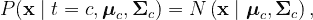

# (高斯)朴素贝叶斯

> 原文：<https://towardsdatascience.com/gaussian-naive-bayes-4d2895d139a?source=collection_archive---------9----------------------->

## (高斯)朴素贝叶斯模型介绍，包括理论和 Python 实现

(高斯)朴素贝叶斯模型的决策边界图解。图片作者。

# 内容

这篇文章是我将要发表的一系列文章的一部分。你可以通过点击[这里](https://cookieblues.github.io/guides/2021/04/01/bsmalea-notes-3b/)在我的个人博客上阅读这篇文章的更详细版本。下面你可以看到该系列的概述。

## 1.机器学习导论

*   [(一)什么是机器学习？](/what-is-machine-learning-91040db474f9)
*   [(b)机器学习中的模型选择](/model-selection-in-machine-learning-813fe2e63ec6)
*   [(c)维度的诅咒](/the-curse-of-dimensionality-5673118fe6d2)
*   [(d)什么是贝叶斯推理？](/what-is-bayesian-inference-4eda9f9e20a6)

## 2.回归

*   [(a)线性回归的实际工作原理](/how-linear-regression-actually-works-theory-and-implementation-8d8dcae3222c)
*   [(b)如何使用基函数和正则化改进您的线性回归](/how-to-improve-your-linear-regression-with-basis-functions-and-regularization-8a6fcebdc11c)

## 3.分类

*   [(a)分类器概述](/overview-of-classifiers-d0a0d3eecfd1)
*   [(b)二次判别分析(QDA)](/quadratic-discriminant-analysis-ae55d8a8148a)
*   [(c)线性判别分析](/linear-discriminant-analysis-1894bbf04359)
*   **(d)(高斯)朴素贝叶斯**

# 设置和目标

我们已经了解了二次判别分析(QDA)和线性判别分析(LDA ),前者假设特定于类的协方差矩阵，后者假设类之间共享协方差矩阵，现在我们将了解(高斯)朴素贝叶斯，它也略有不同。

如果你没有看过我在 QDA 上的帖子，我强烈推荐它，因为 Naives Bayes 的推导是相同的。

朴素贝叶斯假设特征是独立的。这意味着**我们仍然假设特定类别的协方差矩阵(如在 QDA)，但是协方差矩阵是对角矩阵**。这是因为假设特征是独立的。

因此，给定一个具有相应目标变量 *t* 的 *N* 输入变量 **x** 的训练数据集，(高斯)朴素贝叶斯假设**类条件密度**是正态分布的

其中 ***μ*** 是**类特定均值向量**，而**σ**是**类特定协方差矩阵**。利用贝叶斯定理，我们现在可以计算后验概率

然后我们将把 x 分类到类中

# 衍生和培训

这种推导实际上与从 QDA 推导特定类别的先验矩阵、均值矩阵和协方差矩阵是一样的。你可以在我之前关于 QDA 的文章[这里](/quadratic-discriminant-analysis-ae55d8a8148a)找到出处。

唯一的区别是，我们必须将特定于类的协方差矩阵中除对角线以外的所有内容都设置为 0。因此，我们得到以下结果

其中 diag 表示我们将不在对角线上的每个值都设置为 0。

# Python 实现

下面的代码是我们刚刚讨论过的(高斯)朴素贝叶斯的简单实现。

下面是一个图表，其中包含数据点(颜色编码以匹配其各自的类)、我们的(高斯)朴素贝叶斯模型找到的类分布，以及由各自的类分布生成的决策边界。

数据点的图表，其各自的类别用颜色编码，通过我们的(高斯)朴素贝叶斯模型找到的类别分布，以及从类别分布得到的决策边界。图片作者。

注意，虽然在 LDA 的情况下判定边界不是线性的，但是类别分布是完全圆形高斯分布，因为协方差矩阵是对角矩阵。

# 摘要

*   朴素贝叶斯是一个**生成**模型。
*   (高斯)朴素贝叶斯假设**每个类遵循高斯分布**。
*   QDA 和(高斯)朴素贝叶斯的区别在于**朴素贝叶斯假设特征**的独立性，这意味着**协方差矩阵是对角矩阵**。
*   记住，LDA 有一个共享的协方差矩阵，其中**朴素贝叶斯有特定于类的协方差矩阵**。