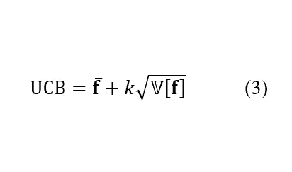

# 高斯过程:物理主动学习的第一步

> 原文：<https://towardsdatascience.com/gaussian-process-first-step-towards-active-learning-in-physics-239a8b260579?source=collection_archive---------21----------------------->

马克西姆·齐亚丁诺夫&谢尔盖·加里宁

*美国田纳西州橡树岭橡树岭国家实验室纳米材料科学和计算科学与工程中心*

尽管在研究对象和研究方法上存在极大的差异，但一些任务在多个科学领域是共同的。其中一项任务就是插值。想象一下，测量一些感兴趣的属性，比如温度(如果你是气象学家)或土壤成分，或者某个地区有用矿石的存在(如果你是地质学家)。在(通常很少)数量的测量点之间插入这些数字以获得适合人眼的 2D 图是非常有用的。这可以使用多种方法来实现，包括样条、核密度近似、神经网络拟合和许多其他方法。然而，当这样做时，第二个自然的问题是这些插值的不确定性，或者它们在多大程度上是可信的。在进行测量的位置，不确定性明显最小，但是当远离测量点时，不确定性会增加。最后，第三个也可能是最有趣的问题是，我们能否利用插值函数及其不确定性的知识来指导我们的搜索策略。换句话说，给定在几个位置的感兴趣的财产的测量，我们能选择测量的下一个点吗——基于预期的奖赏或得到一个的概率。所有这些问题都可以使用高斯过程(GP)和基于 GP 的贝叶斯优化以有原则的方式来解决。

类似的问题，尽管定义在不同的参数空间，出现在多个其他科学领域。寻找具有有趣和有用性质的材料通常意味着探索二元、三元和四元相图，即 1D、2D 和 3D 组成空间。调整显微镜以获得最佳分辨率意味着调整几个控制参数，例如尖端偏压和隧道电流(对于扫描隧道显微镜)或驱动偏压和设定点(对于压电响应力显微镜)。即使在理论/模拟中，我们也经常希望通过调整少量交换参数来探索特定哈密顿量的相图。显然，所有这些问题都可以通过网格搜索来解决，即评估我们的系统或运行显微镜，或为每个参数组合合成一个材料样本。同样明显的是，这是极其不切实际的。例如，对于材料合成，如果我们想要研究每 1%浓度的成分，我们将需要 100 个二元体系的样品、三元体系的 10⁴样品和四元体系的 10⁶样品。那需要一段时间！

在物理科学中，这些问题通常使用直觉、近似方法和实验/模拟的组合来解决。例如，为了将伊辛哈密顿量的相图定义为温度的函数，可以使用近似方法来获得非常高和非常低的温度下的系统行为。类似地，可以分析系统的普适类及其在相变附近的行为。剩下的任务是找到相关的转变温度和临界指数，来描述系统在其附近的行为。在实验科学中(例如，调整显微镜)，当参数改变时，通常对系统的行为有很好的预期。最后，材料科学家使用热力学理论和测量的结合来探索少量迭代内的相图。然而，这些方法是非常异构和特定于领域的。数据科学家会怎么做？

解决这些问题的方法是高斯过程。这种方法的正式定义和讨论可以在许多优秀的公开出版物和教科书中找到，特别是由 [Rasmussen 和 Williams](http://www.gaussianprocess.org/gpml/) 编写的。在这里，我们想提供一个稍微不寻常的方法来描述 GP，集中在实验如何提高我们对世界的理解，以及这些知识如何编码在正式的数学结构中。

想象在低维参数空间上定义一个标量函数(或感兴趣的属性)。这可以是全球范围内的温度、三相图中的材料硬度或磁性，或者显微镜图像中的对比度。在任何测量(或计算)之前，我们都不知道函数的可能值，也就是说，一切皆有可能。在测量了几个位置上的函数值后，严格地说，我们只知道这些位置上的值，别的什么都不知道。然而，假设我们感兴趣的函数值在整个参数空间中以某种方式相关是合理的。在物理学中，我们经常寻找一些特定的函数形式，要么是现象学的，要么是由基本物理定律规定的。但是，从数据科学的角度来看，我们假设相邻位置的函数值之间的关系是由一个核函数定义的，例如 exp(-(*xᵢ*-*xⱼ*)/2*l*)。后者被称为径向基函数，是 GP 中最常见的核函数之一。参数 *l* 定义了过程的特征长度尺度，通常从数据中推断出来。

更正式地，给定数据集 *D* ={ *xᵢ* ， *yᵢ* }， *i* =1，…, *N，*其中 *x* 和 *y* 是输入特征和输出目标，高斯过程可以由以下概率模型定义:

其中 *MVN* 是多元正态分布， **m** 是先验均值函数(通常选择某个常数)， **K** 是我们的核函数，具有(超)参数 *σ* 和 *l* ，我们为其选择了弱信息对数正态先验。我们还假设存在正态分布的观测噪声， **ϵ** ~ *正态* (0，*s*t30】I，这样 **y** ₙₒᵢₛᵧ **=y + ϵ.**实际上，我们把它吸收到核函数的计算中。

建立模型和先验分布后，下一步是获得新的/未知数据的预测后验概率。这里，我们从 NumPyro 的概率编程库中使用哈密顿蒙特卡罗(HMC)算法获得 GP 模型参数的后验样本。然后，我们在提供的新输入点 Xₙₑᵥᵥ:从模型输出的多元正态后验样本中进行采样

其中 ***θ*** *ⁱ* 是包含核超参数和模型噪声的单个 HMC 后验样本。

让我们看看它是如何工作的，对于一个简单的 1D 函数，我们得到一些稀疏的噪声观测。

图一。周期函数 sin(10 *x* )的噪声观测。作者图。

给定图 1 中观察到的数据，我们对等式(1)中定义的模型运行 HMC，以获得模型参数的后验样本。然后，我们根据等式(2)在-1 和 1 之间的点的密集均匀网格上计算后验预测分布。结果如下所示:

图二。在等式 2a 中，GP 预测从多元正态后验样本中取样。还显示了取样平均值的质量中心(等式 2b)。作者图。

请注意，与许多其他插值方法相比，GP 的一个独特之处在于它提供了关于预期函数值和每个预测点的不确定性的信息。后者只是抽样预测中的方差(或标准差)。对于图 2 中的数据，我们将得到-0.75 到-0.25 之间的较大不确定性，因为在该区域没有观测值。请注意，GP 模型在预测该区域的平均函数值方面仍然做得很好。

在继续讨论如何使用不确定性来导航参数空间之前，让我们快速看看如果我们改变一个核函数会发生什么。具体来说，我们将用 exp(-2 sin(*π*(*xᵢ*-*xⱼ*)/*p*/*l*)形式的周期核替换我们的 RBF 核，在周期*p*~*uniform*(0.1，1.0)上具有均匀的先验。然后，我们重新运行 HMC，并重新计算我们的后验预测分布。周期性内核的结果如下所示。

图 3。基于周期核的 GP 预测。作者图。

显然，现在的预测要好得多(而且模型对它们也更有把握了！).这表明适当的 GP 核的选择可以由问题的物理学来指导。

GP 预测的平均函数值和相关的不确定性可以用于导出所谓的采集函数，用于在参数空间中选择下一个测量点。一种常用的获取函数被称为置信上限(UCB ),本质上是预测平均值和不确定性的线性组合，

其中*k*0 用于最小化问题，而*k*0 用于最大化问题。

下面我们用一个简单的 1D 例子来说明采集功能是如何工作的。假设我们想要最小化某个黑盒函数，我们有大约 16 个噪声观测值(图 4)。如果不考虑不确定性，我们的下一个测量点将在 0.15 左右，这似乎是基于可用观测值和 GP 重建的函数的最小值。然而，在 0.4 和 0.6 之间有相对较高的不确定性，以及在~0.65 以上，所以可能还有另一个更深的最小值藏在那里。UCB 采集功能将这种不确定性考虑在内，并输出下一个测量点(约 0.5°)。然后，我们在该点执行测量，更新我们的观察值，并且(如果必要的话)“重新训练”我们的 GP 模型，以导出另一个获取函数来获得下一个测量点。利用已测量点附近的区域和探索“未知”之间的平衡(或权衡)是贝叶斯优化的核心。当然，还有许多其他更复杂的获取函数，我们建议感兴趣的读者参考 Nando de Freitas 的[关于贝叶斯优化的综述](https://www.cs.ox.ac.uk/people/nando.defreitas/publications/BayesOptLoop.pdf)。

图 4。对于 *k* = -2(右)，未知目标函数的 GP 预测(左)和导出的 UCB 采集函数(见等式 3)。作者图。

为了说明真实物理系统的贝叶斯优化过程，我们探索伊辛模型的相图，正如在我们最近的论文中详细描述的那样。这里，我们使用基于 GP 的贝叶斯优化和 UCB 获取函数来有效探索晶格哈密顿量的参数空间，并绘制特定宏观功能最大化的区域。在下面的图 5 中，我们通过单独的快照展示了在次近邻伊辛模型中发现热容量最大化的参数空间区域的例子。可以看到，该算法在感兴趣的区域上快速归零，允许以有效的(与常规网格搜索相比)方式发现具有最高热容量的区域。

图 5。伊辛模型中基于 GP 的热容量贝叶斯优化。显示的是 GP 在步骤 100、200、300、400 和 600 发现的所有点，以及全网格模拟(“地面实况”)。作者图。

总之，这里我们介绍高斯过程和贝叶斯优化方法，并举例说明它们的实现和实际物理问题的应用。除了对伊辛模型的分析，GP 还被用于研究铁电体中的[磁滞回线](https://doi.org/10.1063/5.0011917)，[在自动合成中探索混合钙钛矿的成分空间](https://doi.org/10.1021/acsenergylett.0c01749)，[在扫描探针、电子显微镜和光谱学中实现超分辨率](https://doi.org/10.1063/5.0013847)，甚至[控制操作显微镜](https://pubs.acs.org/doi/abs/10.1021/acsnano.0c10239)探索铁电薄膜中的极化动力学。

然而，尽管 GP 功能强大，这里讨论的一个简单实现还是有许多明显的局限性。第一个也是最明显的一个是，GP 运行的参数空间往往是相当低维的，最佳性能通常限于< 6 D 空间。第二个限制是相关性的结构是由核函数定义的，尽管已经提出了大量的核函数，包括各向异性的和周期的，但是这些核函数中的大多数本质上都是唯象的。最后，它往往是计算密集型的。

然而，在许多情况下，基本的 GP 方法可以很容易地扩展到其他方向。例如，深度神经网络和高斯过程的结合产生了一系列[深度内核学习](https://arxiv.org/abs/1511.02222)方法，这些方法结合了深度学习的表达能力和 GP 的灵活性。也可以通过用预期系统行为的概率模型替换 GP 的常数均值函数来直接注入先验物理知识。袖手旁观为未来的博客文章关于 DKL 和 sGP 在物理科学中的应用！

也请查看我们的 [GPim](https://github.com/ziatdinovmax/GPim) 和 [gpax](https://github.com/ziatdinovmax/gpax) 软件包，将 GPs 应用于科学数据，重点是成像和光谱学。最后，在科学界，我们感谢资助这项研究的赞助商。这项工作在橡树岭国家实验室纳米材料科学中心(CNMS)进行并得到支持，该中心是美国能源部科学用户设施办公室。您可以使用[此链接](https://my.matterport.com/show/?m=MT819FqAwbT)进行虚拟漫游，如果您想了解更多，请告诉我们。

可执行的 Google Colab notebook 带有文中讨论的基本 GP 示例，可从这里[获得](https://colab.research.google.com/github/ziatdinovmax/notebooks_for_medium/blob/main/GP_for_medium.ipynb)。