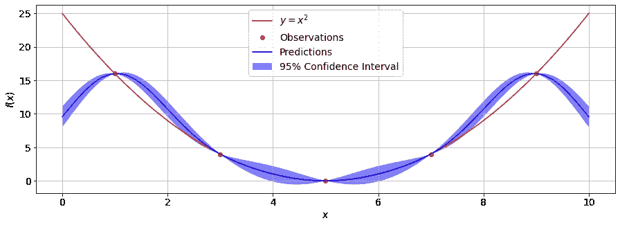

# 高斯过程模型

> 原文：<https://towardsdatascience.com/gaussian-process-models-7ebce1feb83d?source=collection_archive---------2----------------------->

## 能够模拟复杂行为的简单机器学习模型

[高斯过程](https://en.wikipedia.org/wiki/Gaussian_process)模型与更受欢迎的机器学习算法如[线性回归模型](https://en.wikipedia.org/wiki/Linear_regression)、[基于树的模型](https://en.wikipedia.org/wiki/Decision_tree)或[基于感知器的模型](https://en.wikipedia.org/wiki/Perceptron)相比，可能是不太为人所知的机器学习算法之一。这是不幸的，因为高斯过程模型是少数几个可以解析求解同时仍然能够对相对复杂的系统建模的机器学习模型之一。

尽管目前在更广泛的机器学习和数据科学社区中相对缺乏人气，但高斯过程模型已经在一些领域中找到了各种用途，例如[地质统计学](https://en.wikipedia.org/wiki/Kriging)和[昂贵评估函数的优化](https://en.wikipedia.org/wiki/Bayesian_optimization)，例如深度学习神经网络的超参数搜索，或[激光优化](https://arxiv.org/pdf/1909.05963.pdf)。今天，我将向您展示高斯过程模型是如何工作的，并教您如何使用 Python 创建自己的高斯过程回归模型！


亚利桑那国家公园。Andrew Coelho 在 [Unsplash](https://unsplash.com/?utm_source=unsplash&utm_medium=referral&utm_content=creditCopyText) 上拍摄的照片。

# 高斯过程

高斯过程模型假设观察目标 *yₙ* 的值具有以下形式:

*yₙ*=*f*(**x**t26】ₙ)+*eₙ*，

其中*f*(**x**ₙ)是产生被观察目标的某个函数，**x**t8】ₙ是一组 *φ* 输入中的第 *n* 行**x**=**x**₁、 **x** ₂、**x**ᵩ观察到 *yₙ* 给定*f*(**x**t32】ₙ)的条件概率为正态分布:

*p*(*yₙ*|*f*(**x**ₙ)=*n*(*yₙ*|*f*(**x***ₙ*)， *σ* )，

其中 *σ* 为 *eₙ* 的标准差。由于假设噪声对于每个样本都是独立的，因此以**(**x【75】)的φ*** 值为条件， *φ* 观测目标值**y**=【*y*₁、 *y* ₂、……y*ᵩ*]ᵀ的联合概率分布*

**p*(**y**|**|*f***(**x**)=*N*(**y**|**|*f***(**x**)， **σ** )，*

*其中**σ=***σ***I**是大小为 *φ* × *φ的对角矩阵。**

*为了对 **y** 做出预测，我们需要确定边际概率分布***p*(**y**)。这个概率分布可以通过使用积分将条件分布*p*(**y**|**|*f***(**x**))边缘化于分布*p*(***f***(**x**)来获得:***

****p*(**y**)=∫*p*(**y**|***f***(**x**)*p*(***f***(**x**)d***f***(**x**)。***

***分布*p*(***f***(**x**))定义为均值为 **0** 且协方差核矩阵 **K** 大小为 *φ* × *φ* 的高斯分布:***

****p*(***f***(**x**)=*N*(***f***(**x**)|**， **K** )。*****

*****协方差矩阵 **K** 由 **x** 中两行之间的距离组成，并假设相似的输入应在 **y** 中产生相似的目标值。矩阵 **K** 中的每个元素计算如下:*****

*******K** [ *n* ，*m*=*k*(**x**t82】ₙ，**x**t86】ₘ)，*****

*****其中 *k* 是稍后定义的函数。使用上面的*p*(***f***(**x**))的等式，我们可以执行 *p* ( **y** )中涉及的积分来获得解:*****

******p*(**y**)=∫*p*(**y**|***f***(**x**)*p*(***f***(**x**)d **σ**)*N*(***f***(**x**)|**0**，**K**d***f***(**x**)*****

*****其中得到的协方差矩阵具有以下形式:**C**=**K**+**σ**=**K**+*σ***I**。因此， **C** 中的各个元素可以写成: **C** [ *n* ，*m*=*k*(**x***ₙ*，**x***ₘ*+*σδₙₘ*。*****

# *****二次指数核*****

*****可以使用用于*k*(**x**t38】ₙ，**x**t42】ₘ)的各种协方差核函数，例如顾名思义基本上是常数的[常数核](https://scikit-learn.org/stable/modules/generated/sklearn.gaussian_process.kernels.ConstantKernel.html#sklearn.gaussian_process.kernels.ConstantKernel)，广泛使用的二次指数核(也称为[径向基函数(RBF)](https://en.wikipedia.org/wiki/Radial_basis_function) ，或者通常用于对周期性数据建模的[周期性核](https://scikit-learn.org/stable/modules/generated/sklearn.gaussian_process.kernels.ExpSineSquared.html)。*****

*****在本文的其余部分，我们将使用二次指数核。这个内核是由成对的样本(**x**t52】ₙ，**x**ₘ)在 **x** 中计算出来的:*****

******k*(**x***ₙ*，**x***ₘ*)= exp(-| |**x***ₙ*-**x***ₘ*| |/2*l【t79)、******

*****其中 *L* 是一个内核超参数，为了方便起见，我们将其设置为 1。*****

# *****新观测值的概率分布*****

*****对于目标的 *φ* 观测值**y**=【*y*₁、 *y* ₂、……y*ᵩ*]ᵀ对应一组 *φ* 输入值**x**=【**x**₁、 **x** ₂、… **x** *ᵩ* ]ᵀ这一步需要我们确定概率分布*p*(*yᵩ*₊₁|**y**)的参数(即均值和协方差)。*****

*****为了确定*p*(*yᵩ*₊₁|**y**)的参数，我们从分布 *p* ( **y** ')，其中 **y** ' = [ *y* ₁， *y* ₂，… y *ᵩ* ， *yᵩ* ₊₁]ᵀ是一个长度为的向量从上面的 *p* ( **y** )的解，我们得到*p*(**y**’)的相应解:*****

******p*(**y**')=*N*(**y '**|**0**， **C'** )，*****

*****其中大小为 *φ* +1× *φ* +1 的新协方差矩阵**C’**具有以下结构:*****

*******C'** = [[ **C** ， **k** ，
..…….[ **k** ᵀ， *c* ]] **，*******

*****其中**c**=**k**+*σ***I**是来自上面的原始 *φ* × *φ* 协方差矩阵， **k** 是长度为 *φ* 的向量，其元素由:**k***n*给出 而 *c* 是包含 **x** *ᵩ* ₊₁与自身的协方差的标量:*c*=*k*(**x***ᵩ*₊₁，**x***ᵩ*₊₁)+*σ*。*****

# *****高斯过程预测*****

*****如前所述，高斯过程是少数几个具有从[条件概率](https://en.wikipedia.org/wiki/Conditional_probability)获得的解析解的机器学习模型之一，如下所示。*****

*****如果我们有一些正态分布的*n*(**r**|***μ***，**σ**)随机变量的向量 **r** ，分割成两个任意长度的子向量:**r**=【**r***ᵤ*， **r** *ᵥ* ， 然后对于条件分布**p*(**r***ᵤ*|**r**|*ᵥ*)均值***μ***(**r***ᵤ*|**r*ᵥ*和协方差**σ**********

*******μ***(**r***ᵤ*|**r***ᵥ*)=***μ****ᵤ*+**σ***ᵤᵥ***σ******

******σ**(**r**t100】ᵤ|**r**t104】ᵥ)=**σ***ᵤᵤ*-**σ***ᵤᵥ***σ***ᵥᵥ*⁻**σ【t119******

****其中***μ****ᵤ*/***μ****ᵥ*是包含**r***ᵤ*/**r***ᵥ*和**σ**元素均值的向量****

****对于我们的情况，**r**ᵤ对应于新的观测值，而**r**ᵥ对应于旧的一组 *φ* 观测值。因此新旧观测值之间的协方差**σ**ᵥᵤ是带有元素的向量**k**k*n**= k*(**x**t24】ₙ、**x**ᵩ₊₁)，旧观测值的协方差**σ** *m*=*k*(**x***ₙ*，**x***ₘ*)+*σδₙₘ*新观测值的协方差***ᵤᵤ*是标量***c*=*k*( 根据我们上面的定义***μ****ᵤ=****μ****ᵥ=***0**。********

******把一切放在一起，条件概率分布*p*(*yᵩ*₊₁|**y**)是一个均值为的高斯分布:******

*******μ*=**k**ᵀ**c**⁻**y**，******

******和方差:******

*******s*=*c*-**k**ᵀ**c**⁻**k**。******

# ******在 Python 中实现高斯模型******

******上面的分析解决方案可以很容易地用 Python 实现！首先，我们创建一个函数来计算输入特征*φ*x=【**x**₁、 **x** ₂、… **x** *ᵩ* ]ᵀ:的二次指数核矩阵******

********K** [ *n* ，*m*]=*k*(**x***ₙ*，**x***ₘ*)= exp(-|**x***ₙ*-******

********此外，为了简化起见，我们假设 *σ* = 0，使得 **C** = **K.**********

```
******import numpy as npdef RBF_kernel(xn, xm, l = 1):
    """
    Inputs:
        xn: row n of x
        xm: row m of x
        l:  kernel hyperparameter, set to 1 by default
    Outputs:
        K:  kernel matrix element: K[n, m] = k(xn, xm)
    """
    K = np.exp(-np.linalg.norm(xn - xm)**2 / (2 * l**2))
    return Kdef make_RBF_kernel(X, l = 1, sigma = 0):
    """
    Inputs:
        X: set of φ rows of inputs
        l: kernel hyperparameter, set to 1 by default
        sigma: Gaussian noise std dev, set to 0 by default
    Outputs:
        K:  Covariance matrix 
    """
    K = np.zeros([len(X), len(X)])
    for i in range(len(X)):
        for j in range(len(X)):
            K[i, j] = RBF_kernel(X[i], X[j], l)
    return K + sigma * np.eye(len(K))******
```

******新的预测平均值*μ*=**k**ᵀ**c**⁻**y**和协方差*s*=*c*-**k**ᵀ**c**⁻**k**可使用以下函数计算得出。******

```
******def gaussian_process_predict_mean(X, y, X_new):
    """
    Inputs:
        X: set of φ rows of inputs
        y: set of φ observations 
        X_new: new input 
    Outputs:
        y_new: predicted target corresponding to X_new
    """
    rbf_kernel = make_RBF_kernel(np.vstack([X, X_new]))
    K = rbf_kernel[:len(X), :len(X)]
    k = rbf_kernel[:len(X), -1]
    return  np.dot(np.dot(k, np.linalg.inv(K)), y)def gaussian_process_predict_std(X, X_new):
    """
    Inputs:
        X: set of φ rows of inputs
        X_new: new input
    Outputs:
        y_std: std dev. corresponding to X_new
    """
    rbf_kernel = make_RBF_kernel(np.vstack([X, X_new]))
    K = rbf_kernel[:len(X), :len(X)]
    k = rbf_kernel[:len(X), -1]
    return rbf_kernel[-1,-1] - np.dot(np.dot(k,np.linalg.inv(K)),k)******
```

# ******用高斯过程模型进行预测******

******现在我们需要做的就是用一些数据来测试这个算法！我们使用一个简单的公式*y =*(*x*-5)*得到 5 个数据点:`[1, 3, 5, 7, 9]`。对于`5.5`的新输入值，我们预测 *y* 的值。*******

```
******def f(x):
    return (x-5) ** 2# Training data x and y:
X = np.array([1.0, 3.0, 5.0, 7.0, 9.0])
y = f(X)
X = X.reshape(-1, 1)# New input to predict:
X_new = np.array([5.5])# Calculate and print the new predicted value of y:
mean_pred = gaussian_process_predict_mean(X, y, X_new)
print("mean predict :{}".format(mean_pred))# Calculate and print the corresponding standard deviation:
sigma_pred = np.sqrt(gaussian_process_predict_std(X, X_new))
print("std predict :{}".format(sigma_pred))mean predict :0.277673949912025
std predict :0.4150417380004999******
```

******我们也可以检查高斯过程模型中使用的 **K** 的值。******

```
******for i in make_RBF_kernel(X):
    for j in i:
        print("{:.3f}".format(j), end = ", ")
    print()1.000, 0.135, 0.000, 0.000, 0.000, 
0.135, 1.000, 0.135, 0.000, 0.000, 
0.000, 0.135, 1.000, 0.135, 0.000, 
0.000, 0.000, 0.135, 1.000, 0.135, 
0.000, 0.000, 0.000, 0.135, 1.000,******
```

******作为明智的检查，我们可以使用`sklearn`中的`GaussianProcessRegressor`来检查我们的算法是否有效！******

```
******from sklearn.gaussian_process import GaussianProcessRegressorgpr = GaussianProcessRegressor()
gpr.fit(X, y)gpr_mean, gpr_std = gpr.predict(X_new.reshape(-1, 1), 
                                return_std = True)print("sklearn pred: {}".format(gpr_mean))
print("sklearn std: {}".format(gpr_std))sklearn pred: [0.27767395]
sklearn std: [0.41504174]******
```

******同样，我们也可以检查`sklearn`使用的核矩阵的值。注意`sklearn`使用原始核矩阵的 [Cholesky 分解](https://en.wikipedia.org/wiki/Cholesky_decomposition)，以便使用以下公式优化计算: **K** = **LL** ᵀ.******

```
******for i in np.dot(gpr.L_, gpr.L_.T):
    for j in i:
        print("{:.3f}".format(j), end = ", ")
    print()1.000, 0.135, 0.000, 0.000, 0.000, 
0.135, 1.000, 0.135, 0.000, 0.000, 
0.000, 0.135, 1.000, 0.135, 0.000, 
0.000, 0.000, 0.135, 1.000, 0.135, 
0.000, 0.000, 0.000, 0.135, 1.000,******
```

******我们的模型和`sklearn`的模型对于新输入`x = 5.5`都有相同的`0.278` 预测和`0.415`标准差！核矩阵也是一样的！******

# ******在训练数据之外进行预测******

******现在让我们看看如果我们在训练数据范围外使用`x`的值会发生什么。例如:如果`x = 15`发生了什么？******

```
******X_new = np.array([15])mean_pred = gaussian_process_predict_mean(X, y, X_new)
print("mean predict :{}".format(mean_pred))sigma_pred = np.sqrt(gaussian_process_predict_std(X, X_new))
print("std predict :{}".format(sigma_pred))mean predict :2.396794716305008e-07
std predict :0.9999999999999999******
```

******我们发现现在预测的标准差要大得多，预测值几乎是 0。虽然高斯过程模型非常擅长在训练集的范围内插值数据，但是它们不擅长在该范围外外推。******

# ******绘制模型的 95%置信区间******

******使用预测平均值和相应的标准差，我们可以为整个输入值范围 *x* 创建并绘制模型的 95%置信区间。******

```
******import matplotlib.pyplot as plt# Range of x to obtain the confidence intervals.
x = np.linspace(0, 10, 1000)# Obtain the corresponding mean and standard deviations.
y_pred = []
y_std = []for i in range(len(x)):
    X_new = np.array([x[i]])
    y_pred.append(gaussian_process_predict_mean(X, y, X_new))
    y_std.append(np.sqrt(gaussian_process_predict_std(X, X_new)))

y_pred = np.array(y_pred)
y_std = np.array(y_std)plt.figure(figsize = (15, 5))
plt.plot(x, f(x), "r")
plt.plot(X, y, "ro")
plt.plot(x, y_pred, "b-")
plt.fill(np.hstack([x, x[::-1]]),
         np.hstack([y_pred - 1.9600 * y_std, 
                   (y_pred + 1.9600 * y_std)[::-1]]),
         alpha = 0.5, fc = "b")
plt.xlabel("$x$", fontsize = 14)
plt.ylabel("$f(x)$", fontsize = 14)
plt.legend(["$y = x^2$", "Observations", "Predictions", "95% Confidence Interval"], fontsize = 14)
plt.grid(True)
plt.xticks(fontsize = 14)
plt.yticks(fontsize = 14)
plt.show()******
```

************

******高斯过程模型的 95%置信区间。******

******不用单独检查每个新输入的标准偏差，使用这样的图形可以让我们很容易地查看模型对其预测最有信心和最没有信心的地方！******

# ******更高级的协方差核******

******在本文中，我们使用二次指数核来计算我们的协方差核矩阵 **K** 。然而，还有许多其他的内核函数，它们可能会为某些类型的数据带来更好的性能。例如，存在一个周期内核，它对于周期数据表现得非常好！如果你想了解更多关于这些更先进的内核，请阅读我关于[高斯过程内核](/gaussian-process-kernels-96bafb4dd63e)的文章！******

# ********闭幕词********

******今天在这篇文章中，我们探索了高斯过程是如何工作的，并使用 Python 创建了我们自己的高斯过程回归模型！高斯过程模型非常强大，在学术界和工业界都被广泛使用。作为一个工业应用的例子，在以后的文章中，我将向您展示如何使用基于高斯过程的优化器来确定最佳激光参数，以获得特定的激光功率输出！******

# ******参考******

******[1] C. M. Bishop (2006)， [*模式识别与机器学习*](https://www.microsoft.com/en-us/research/uploads/prod/2006/01/Bishop-Pattern-Recognition-and-Machine-Learning-2006.pdf) ，Springer。
【2】[https://sci kit-learn . org/stable/modules/Gaussian _ process . html](https://scikit-learn.org/stable/modules/gaussian_process.html)
【3】[https://sci kit-learn . org/stable/modules/generated/sk learn . Gaussian _ process。GaussianProcessRegressor.html](https://scikit-learn.org/stable/modules/generated/sklearn.gaussian_process.GaussianProcessRegressor.html)******