# 基于第一原理的高斯过程回归

> 原文：<https://towardsdatascience.com/gaussian-process-regression-from-first-principles-833f4aa5f842?source=collection_archive---------5----------------------->

## [思想和理论](https://towardsdatascience.com/tagged/thoughts-and-theory)

## 高斯过程回归是一类非常强大的机器学习算法。在这里，我们从基本原理开始介绍。

***高斯过程回归*** (GPR)是一类非常强大的机器学习算法，与当今许多最先进的机器学习模型相比，它依赖很少的参数来进行预测。因为 GPR 是(几乎) ***非参数*** ，所以它可以有效地应用于解决各种各样的监督学习问题，即使在数据很少的情况下。借助 PyTorch 和 TensorFlow 等最先进的自动微分框架，学习 GPR 并将其应用于大量复杂的监督学习任务变得前所未有的简单。

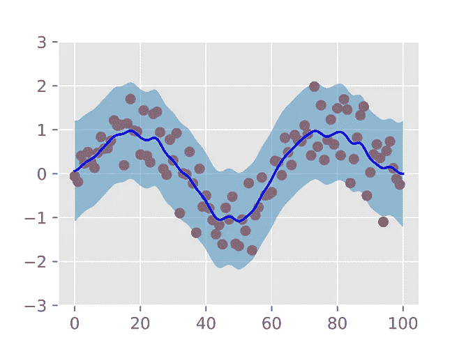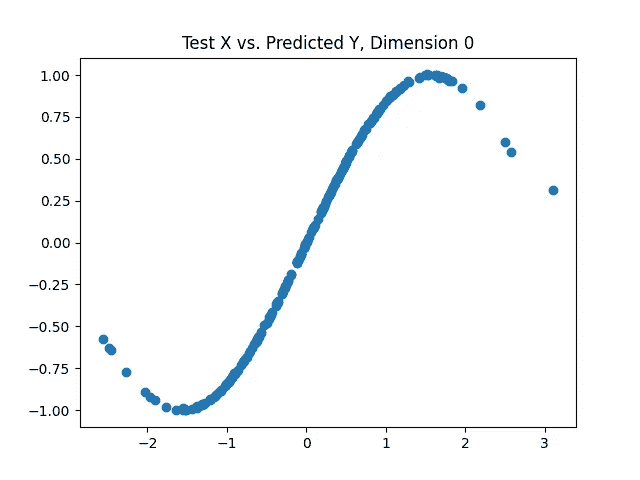

从左到右:(a)在训练点(显示为绿色)上训练的 GPR 模型的预测均值(蓝色线)和置信区间(浅蓝色区间)，(b)在 Ackley 测试函数上训练的 GPR 模型的预测均值，(c)在正弦训练数据上训练的 GPR 模型的预测均值。图片来源:作者。

在本文中，我们将从**第一原理**开始讨论高斯过程回归(GPR)，使用来自机器学习、最优化和贝叶斯推理的数学概念。我们将从高斯过程开始，用它来形式化如何用 GPR 模型进行预测，然后讨论 GPR 模型的两个关键因素:协方差函数和超参数优化。最后，我们将在下面的数学推导的基础上，讨论一些直观的方法来查看 GPR。

如果你也想看到这些想法以学术风格的论文呈现，请点击这里的链接**。我们开始吧！**

# **什么是高斯过程？**

**在讨论 GPR 之前，我们先来探讨一下什么是高斯过程。高斯过程属于随机/随机过程类别，它定义了在空间和/或时间中演化的随机变量的实现。**

**严格地说， ***高斯过程***(***GP***)是随机变量的集合，使得这些变量的任何子集都是联合高斯的[1]。为了将 ***d*** 随机变量的集合表示为联合高斯，我们可以通过将它们表示为:**

**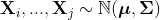**

**其中 ***d*** 是子集中随机变量的个数， ***μ*** 是均值的向量，**σ**是这些随机变量之间的协方差矩阵。写成高斯密度，随机变量的一组实现 **x = (xi，…，xj)** 联合高斯意味着:**

**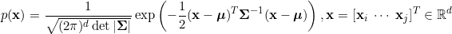**

*****GP*** 的一个概念化是，它定义了函数*【1】上的***分布:给定一个完全由均值和协方差函数指定的高斯过程，我们可以根据下式从高斯过程中在点 **x** 处对函数进行采样:******

***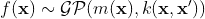***

***其中 f()是我们从 ***GP*** 中采样的函数，m()是均值函数，k(，)是协方差函数，是核函数的子类。这被称为 GPs 的功能空间视图[1]。***

***将数据集表示为 ***GP*** 在机器学习[1]、信号处理[3]和概率推理中有多种应用。***

***现在我们已经介绍了什么是高斯过程，我们准备开始讨论如何将这个概率随机过程框架用于回归！***

# ***高斯过程回归***

***高斯过程的一个应用是通过监督学习来执行回归，因此被命名为高斯过程回归。这种回归可以概念化为核化贝叶斯线性回归，其中核参数化由协方差/核函数的选择以及用于进行预测的数据来确定[1]。这就是 GPR 的“重量-空间观点”[1]。***

***高斯过程回归也可以在前述的函数空间视图中概念化，其中学习者通过学习在 **x** 处实现*的**均值**和**协方差**函数来学习函数[1]的分布，由 f( **x** 表示。****

****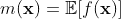************

****f( **x** )给定的一个 ***GP*** 的实现对应一个 ***随机变量*** 。指定这些功能后，可以根据以下公式从 ***GP*** 中对 f( **x** )进行采样:****

********

****这是对取决于位置 **x** 的随机变量 f( **x** )进行采样的形式化(对于空间应用；对于时间序列应用，f( **x** )可能取决于时间 t)。****

****f( **x** )的平均值的估计值作为观察目标值 y 的**线性组合产生。用于产生这些均值估计的加权系数是独立于目标值** 的 ***，将高斯过程回归模型放入*线性平滑器*【1】的类别中。*******

***给定由 ***N*** 个观察值组成的**训练**数据集:***

***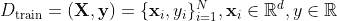***

***以及由***N’***点组成的**测试**数据集:***

***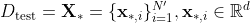***

***GPR 预测目标 在测试点**X**∫上的 ***后验高斯分布，方法是在给定观测训练数据的情况下计算该高斯分布的参数。我们可以把这种预测看作是对每个测试点的高斯分布的准确预测。******

***我们将首先考虑无*噪声预测的情况，然后用这种情况来概括模型中对于 ***噪声的观测目标值*******

******请注意以下衍生的定义:******

1.  ******m()代表一个均值函数******
2.  ******k(，)是一个核/协方差函数******
3.  ********X** 是训练特征的(N，d)矩阵******
4.  ********X**∫**是测试点的(N’，d)矩阵********
5.  **********y** 是训练目标的(N，1)向量********
6.  ********f** 是高斯过程在训练特征 **X** 上的实现的(N，1)向量******
7.  ********f**∫**是高斯过程在测试点**X**∑上的实现的(N’，1)向量********
8.  ******Cov()是一个协方差运算符******
9.  ******σ是正的超参数，表示高斯过程的协方差噪声。******

******我们现在准备好推导 GPR 的预测了！******

## ******无噪声预测******

******在我们开始之前，让我们回忆一下我们的目标:**预测测试点 X∫**处目标 f∫的高斯分布。******

******在无噪声的情况下，观察到的训练目标***y**和高斯过程 **f** 的*实现函数值相等。换句话说，我们直接观察高斯过程在点 **X** 的采样函数。********

******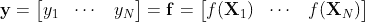******

******给定上面定义的训练和测试数据集，高斯过程函数在训练和测试数据集上的联合分布(分别为 **f** 和**f**∫)由[1]给出:******

******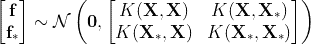******

******其中右边的协方差矩阵是核相似性矩阵的块矩阵。******

******虽然联合分布给出了关于**f**∫如何与 **f** 相关的一些见解，但是在这一点上还没有对预测**f**∫进行推断。我们感兴趣的不是这种联合分布，而是测试点**X**∫处预测 GP 实现**f**∫的 ***后验分布*** 。这就是贝叶斯推理的概念发挥作用的地方:我们将 ***限定*** 我们在训练数据上的测试点的先验分布，以便改进我们对测试点的高斯均值和方差参数的估计。******

******该后验分布可以通过在训练数据集 **f** 的已实现目标上的测试点**f**∫处调节高斯过程的预测实现来计算。除了调节 **f** 之外，我们还调节训练输入 **X** 和测试输入**X***。******

******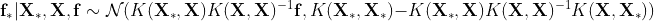******

******因此，我们可以将测试点**X**∫处的**均值**和**协方差**预测写成:******

******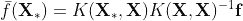************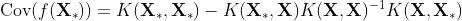******

******这些估算说明了什么？******

1.  ********预测均值**:这是作为训练集 **f** 上高斯过程的实现的*线性组合来估计的。这个线性组合的系数由 ***距离*** 确定，在 ***内核空间*** 中，在测试点**X**∫和训练点 **X** 之间。直观地说，这意味着在内核空间中更接近于**X**∫的训练样本在预测均值中具有更强的“发言权”。这些系数也通过训练集 **X** 中的输入之间的逆核相似性 ***缩放*** 。*******
2.  ********预测协方差**:这被估计为测试点之间的核距离**X**∫减去训练输入 **X** 前后的逆 ***核距离*** 的二次形式乘以训练和测试输入之间的 ***核距离*** 。******

******在某些应用中，均值函数不必为零，可以写成广义 m()。在这种情况下，使用非零均值函数，测试点的预测**均值**和**协方差**估计值变为:******

******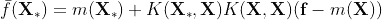******************

## ******在有噪声的情况下进行预测******

******在高斯过程回归的许多应用中，通常将训练目标 **y** 建模为高斯过程**f**【1】的*噪声实现*，其中噪声由零均值高斯参数化，正噪声协方差值由σ给出。******

******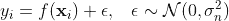******

******这个σ是一个可以优化的超参数(参见下面的超参数优化部分)。******

******使用上面的预测方程以及我们对噪声目标值 **y** 的定义，我们可以表达观测到的训练目标 **y** 的联合分布，以及在测试点**X**∫的高斯过程**f**∫的预测实现:******

************

******使用与上述相同的条件直觉和过程，我们可以将预测的高斯过程实现的条件分布**f**∫以观察到的训练目标 **y** 为条件表示为:******

************

******这是一个很大的解构，但预测均值和协方差的公式与之前基本相同，只是在反向训练核相似性项中添加了对角噪声。******

************************

******添加协方差噪声的一个实际考虑是，它可以确保括号中的矩阵在 GPR 超参数优化期间保持半正定，这进而允许括号中的矩阵是可逆的。******

******上述推导描述了 GPR 如何进行预测的精确分析框架。然而，这些方程的一些元素仍然是相当黑盒子，如核/协方差矩阵和协方差噪声。在下面的章节中，我们将讨论 GPR 的这些重要元素。******

## ******协方差函数******

************

******考虑协方差函数的一种方式是，它们通过双线性映射测量空间中的点有多接近。照片由 [Siora 摄影](https://unsplash.com/@siora18?utm_source=medium&utm_medium=referral)在 [Unsplash](https://unsplash.com?utm_source=medium&utm_medium=referral) 上拍摄******

******协方差函数是 GPR 模型的重要组成部分，因为***这些函数根据观测训练点 **X** 和测试点 **X** 之间的 ***核距离*** 来衡量训练点*** 对预测测试目标的贡献。回想一下上一节，将 GPR 预测概念化的一种方法是作为一种*线性平滑*机制:预测的**意味着在测试点**X***实际上可以表示为:********

***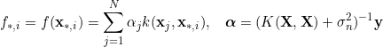***

***因此，**预测均值**是观测目标值 y 的**线性组合，具有由测试点和训练点之间的*核距离确定的*，训练点的平均贡献被考虑。*******

*****以下是 GPR 文献中经常使用的一些协方差函数示例[1]:*****

1.  *******平方指数(SE) /径向基函数(RBF)核**与**自动相关性判定(ARD)**【4】。ARD 能够为每个输入维度学习单独的长度尺度，因此适合于在每个维度中具有可变尺度和输出灵敏度的高维输入空间。该协方差函数由下式给出(其中**θ**是长度标度的对角矩阵):*****

**********

*****2.**具有 ARD 的有理二次(RQ)核:**RQ 核可以被概念化为 **SE** 核的无限混合，其中混合权重由正超参数α [1]控制。*****

*****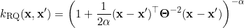*****

*****3.**带 ARD 的 Matérn 内核:**在某些条件下，这种内核允许完美的插值[1]。请注意，ν是一个超参数，用于确定插值中允许的不连续程度，K 是二阶贝塞尔函数，γ()是伽马函数。*****

*****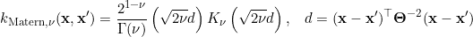*****

## *****高斯过程回归模型是完全非参数的吗？*****

*****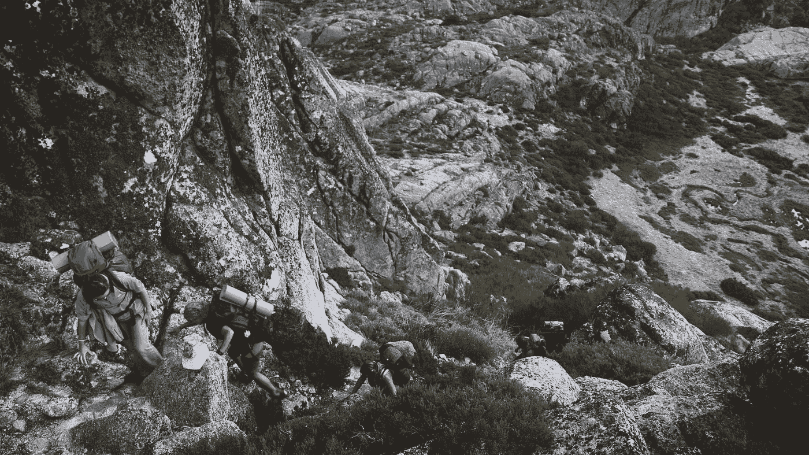*****

*****为了优化我们的 GPR 模型的超参数，我们可以使用**梯度上升**优化方法。照片由[迪奥戈·塔瓦雷斯](https://unsplash.com/@diogotavares?utm_source=medium&utm_medium=referral)在 [Unsplash](https://unsplash.com?utm_source=medium&utm_medium=referral) 上拍摄*****

*****尽管高斯过程回归模型被认为是*非参数*，但其超参数，如长度尺度【1】，会显著影响其预测能力，因此应进行优化，以最大化*预测样本外性能*。幸运的是，像许多其他监督学习模型一样，这些超参数可以使用 ***梯度方法***【1】进行优化。*****

****优化 GPR 模型超参数的目标是*【1】。然而，由于这种边际似然性具有指数项，因此通常通过最大化边际对数似然性来执行这种优化，以便导出解析梯度更新[1]。由于边际对数似然函数是边际似然函数的严格单调变换，最大化边际对数似然的超参数集也将最大化边际似然。*****

*****由一组超参数 **θ** 参数化的边际对数似然由下式给出(当对观察目标中的噪声建模时):*****

*****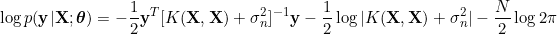*****

*****如上所述，为了优化 GPR 模型的超参数，计算关于 **θ** [1]的边际对数似然的导数:*****

*****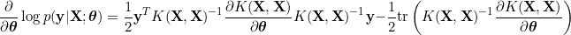**********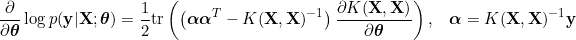*****

*****然后，使用 ***梯度上升*** 方法(如 Adam【5】)将这些导数用于更新 GPR 模型的超参数。这会导致表格的渐变更新:*****

****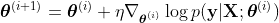********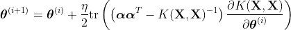****

****在 GPR 的超参数已经在观察的训练数据集( **X** ， **y** )上被优化之后，GPR 模型准备在测试数据集**X**∑上执行 ***后验推断*。******

## ****回顾****

****到目前为止，我们已经讨论了:(I)GPR 模型如何进行预测，(ii)GPR 的协方差函数，以及这些函数在确定点之间的相似性/距离方面发挥的关键作用，以及(iii)我们如何优化 GPR 模型的超参数以提高其样本外性能。****

****接下来，为了加强我们的直觉，我们来讨论一下 GPR 的其他一些解释。****

# ****我们还可以从哪些方面思考 GPR？****

****与其他机器学习技术和算法一样，高斯过程回归(GPR)有许多解释。这里有几个与我们上面讨论的相关。GPR 是一种算法，它:****

1.  ****计算联合多元高斯*分布的一个 ***测试集*** 给定一个 ***训练集*。**这被形式化为从高斯过程中采样一个函数。*****
2.  ****将 d 维输入( ***特征*** )空间中的点插值到 m 维输出( ***目标*** )空间中。在一定条件下，这些(测试)预测插值点是现有(训练)点的*线性组合*！****
3.  ****给定过去和现在，预测未来的平均值和标准差。****
4.  ****在由协方差函数(半正定核)参数化的高维特征空间中执行回归。****

****让我们用直觉和应用上面的数学推导来讨论每一个。****

## ******1。联合多元高斯后验******

****也许这就是高斯过程回归中“高斯”的由来。这种机器学习技术将数据建模为源自高斯过程。回想一下，高斯过程是被认为是联合高斯的 ***N*** 个随机变量的集合。****

****“后”在这里是什么意思？嗯，像其他监督机器学习模型一样，GPR 依赖于同时拥有 ***训练*** 和 ***测试*** 数据。该模型与训练数据拟合， ***预测*** ，以****分布*** 的形式(在本例中，高斯后验分布)被定义为对 ***测试*** 集的预测的条件分布，条件是来自*集的观测值)。******

*******2。插值*******

***************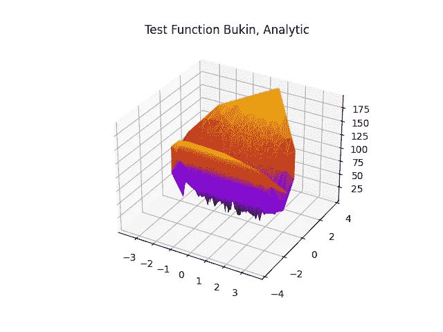**********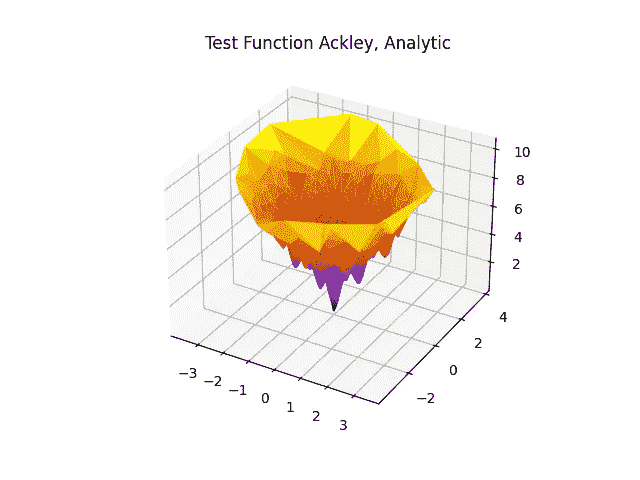*****

*****插值/克里金法[2]是高斯过程回归的最早应用之一[2]！插值代表了 GPR 的一个主要用例，因为我们可以使用现有的点来插值新点的均值和协方差。*****

*****GPR 也可以作为非参数插值方法！这在空间统计字段[2]中也被称为**克里金法**，它允许从一维和多维**输入**中内插一维和多维**输出**。*****

*****这里，当计算预测平均值时，使用与上面相同的思想来执行插值:通过取最近的训练点的组合来估计插值点，并且通过它们的核距离(“相似性”)来加权它们。与“较远”的点相比，“较近”的点对新点的预测贡献更多的输出。*****

*******3。利用过去和现在预测未来*******

*****GPR 是时间序列预测的常用工具，因为它能够捕捉时间行为，允许自动测量和加权两个时刻的“接近”程度。*****

*****回想一下，由于我们预测的是高斯后验分布，并且高斯分布完全由其均值和方差参数确定，因此从 GPR 进行预测所需的全部工作就是预测未来时间的均值和方差。*****

*****预测这些量实际上是非常强大的-从中可以提取置信区间(均值+/ sqrt(方差))，以及感兴趣的量随时间的预测平均值/期望值。*****

*****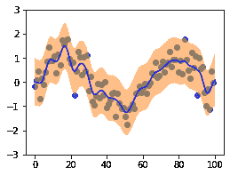*****

*****时间序列**均值**和**方差**预测使用高斯过程回归的一个例子。图片来源:作者。*****

## *****4.用协方差函数度量高维特征空间中的“接近度”*****

*****GPR 的最后一个令人兴奋的解释是，它是有效的贝叶斯回归，其特征空间由一组可能无限维的基函数组成！*****

*****这个结果是 ***默塞尔定理*** *的一个推论。*该定理的部分陈述如下:*****

****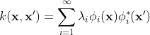****

****函数φ( **x** )及其共轭φ*(**x’**)是核(在我们的例子中是协方差)函数k( **x** ，**x**’)的**本征函数**。这些本征函数是特殊的，因为在一个度量上对它们进行积分，例如概率密度 p( **x** 或勒贝格度量[1] **，**导致本征函数本身，由一个称为**本征值的数来缩放，**在这里由λ来表示。我们可以把上面的这个表达式看作是我们的核[1]的一个*广义傅立叶级数*表示。请注意，这意味着我们可以有无限数量的基函数**来将我们的输入转换成特征。这和**内核诡计**原理相似。******

****将该结果与上述线性平滑函数结果相结合，我们可以将潜在预测的表达式重写为特征值-特征函数组合的加权和:****

****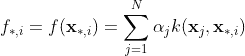********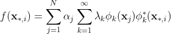********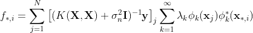********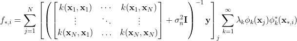********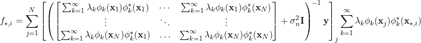****

****上面的结果有什么关系？我们已经表明，用于形成预测的输出的线性组合由在训练和测试点应用的协方差函数的 ***本征函数*** 和 ***本征函数*** 确定。除了选择协方差函数和协方差噪声，**这里的预测完全由数据本身决定**！这说明了为什么高斯过程回归被认为是 ***非参数*** 。****

****即使特征函数分析不是你真正喜欢的，这里也有一个重要的要点: ***GPR 通过协方差函数*** 将我们的标准贝叶斯回归设置转换成一个无限维的特征空间！根据协方差函数的选择，这可以承认****无限的表现力*** 为我们的 GPR 模型。这是 GPRs 如此强大和通用的一部分，适用于广泛的监督机器学习任务。*****

# ****我怎样才能学到更多？****

****下面是一些(非常有帮助的)资源，可以帮助你开始。这个清单当然不是详尽无遗的:****

1.  ****[**机器学习的高斯过程**](http://www.gaussianprocess.org/gpml/chapters/RW.pdf)**【1】**:一本数学上严谨的高斯过程教科书。这本书着重于 GPR 背后的概率和几何理论，如核，协方差函数，测量，估计和再生核希尔伯特空间(RKHSs)。****
2.  ****[**内核指南**](https://www.cs.toronto.edu/~duvenaud/cookbook/) :这是一本很好的 GPR 学习指南，你可以问自己:“我应该使用什么 GPR 协方差函数？”本指南结合了直觉和数学的严谨性。****
3.  ****[**自动相关性确定**](https://link.springer.com/content/pdf/10.1007%2F978-1-4471-0847-4.pdf)**【ARD】**:如协方差函数部分所介绍的，ARD 对于具有可变特征尺度和跨输入维度的输出敏感度的 GPR 问题特别有用。****

# ****总结和回顾****

****在本文中，我们介绍了高斯过程(GPs)和高斯过程回归(GPR)模型，以及它们的一些理论和直观基础。****

****在我们下一篇关于 GPR 的文章中，我将回顾一些 GPR 模型的**应用**和**实现资源**。****

****要查看更多关于强化学习、计算机视觉、机器人和机器学习的内容，请关注我。感谢您的阅读！****

# ****感谢****

****感谢 [CODECOGS](https://codecogs.com/) 提供了极其有用的[内联方程渲染工具](https://codecogs.com/latex/eqneditor.php)，也感谢 Carl Edward Rasmussen 开源了机器学习的教材*高斯过程*。****

# ****参考****

****[1]卡尔·爱德华·拉斯姆森和克里斯托弗 K. I .威廉姆斯。2005.机器学习的高斯过程(自适应计算和机器学习)。麻省理工学院出版社。****

****[2]奥利弗，玛格丽特和理查德·韦伯斯特。"克里金法:地理信息系统的一种插值方法."《国际地理信息系统杂志》4.3(1990):313–332。****

****[3]奥本海姆、艾伦五世和乔治·c·韦尔盖塞。*信号，系统&推理*。哈洛:皮尔森，2017。打印。****

****[4]胡斯迈尔 D. (1999)自动相关性确定(ARD)。条件概率估计的神经网络。神经计算的前景。伦敦斯普林格。[https://doi.org/10.1007/978-1-4471-0847-4_15](https://doi.org/10.1007/978-1-4471-0847-4_15)****

****[5]金玛、迪德里克 p .和吉米巴。"亚当:随机最优化的方法."arXiv 预印本 arXiv:1412.6980 (2014)。****