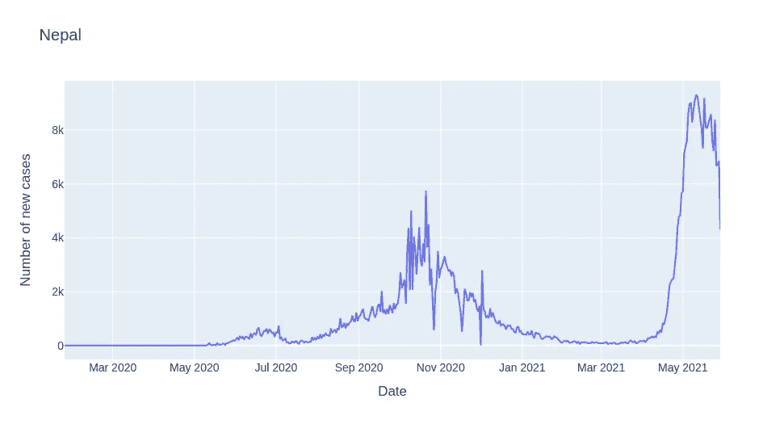
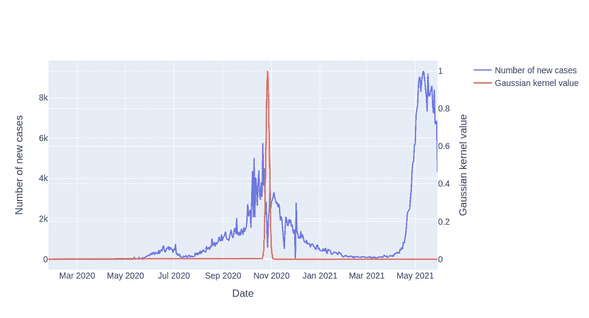
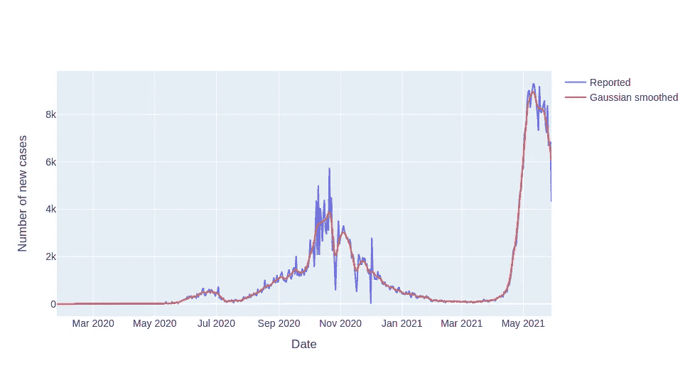

# 时间序列数据的高斯平滑

> 原文：<https://towardsdatascience.com/gaussian-smoothing-in-time-series-data-c6801f8a4dc3?source=collection_archive---------4----------------------->

## 用 Python 学习时间序列数据中高斯平滑的内部工作原理

# 时序数据

顾名思义，时间序列数据是时间索引数据。数据点是在不同的时间戳收集的。通常，我们会在 x 轴上显示小时、天或年等时间变量，在 y 轴上显示我们正在收集的数据。时间序列数据的一个例子是相对于天数的新新冠肺炎病例数。

## 观察数据与真实数据

观察数据是我们观察到的数据点。它们是数据生成/报告过程的结果。另一方面，真实的数据是真相，是世界上正在发生的事情的真实价值。让我用新冠肺炎新案例的例子来区分一下。每天出现的新病例是*报告的*新病例。它们可能不等于真正的新病例数。这是因为一些新案例可能没有被报告，一些积压的案例可能已经被添加到今天的新案例中。

下面，我们看到*尼*的新增病例*的时序图。我们注意到少数地方突然出现峰值和下降，这可能是报告不足和/或报告积压的结果。

因此，在处理这些数据时，减少噪音是有帮助的。通过将数据点与其相邻数据点进行平均来减少此类时间序列数据中的噪声的过程称为平滑。有许多技术可以降低噪声，如简单移动平均、加权移动平均、核平滑器等。我们将学习并应用*高斯核平滑器*进行平滑或去噪。

# 高斯核

核定义了用于取相邻点平均值的函数的形状。高斯核具有高斯曲线的形状。高斯曲线具有以下形状:

来源:维基共享资源

正如在高斯曲线中看到的，近点(在上面的曲线中大约为 0)将被赋予更高的权重，而远点将被赋予更低的权重。

高斯核的数学表达式如下所示:

来源:[维基百科](https://en.wikipedia.org/wiki/Kernel_smoother)

其中， *b* 定义内核的宽度。

# 平滑过程

为了进行平滑，我们逐点处理数据。对于每个点，我们计算核函数值，并计算由核函数值加权的数据点的加权平均值。

这里用一个例子来理解一下。我们采用之前显示的尼泊尔 COVID 新病例数据。

2020 年*10 月 27 日*新增病例数为 *570 例*，而前一天新增病例数为 *1741 例*，后一天新增病例数为 1954 例。570 不太可能是当天新增病例的真实数字。让我们尝试使用高斯核平滑器来平滑新的案例数。

首先，我们来计算基于*2020 年 10 月 27 日*的高斯核值。

我们这里任意取了 *b* = *2* 。我们认为+2/-2 天的高斯核宽度占用了很大比例的邻居数据。

上图显示了与日期相关的高斯核值。精确日期和邻近日期被赋予最高权重(接近 1)，而较远的日期被赋予接近 0 的权重值。

我们将核值标准化，这样我们就不会增加新的案例数量。我们通过将高斯核值除以所有高斯核值的总和来实现。然后，我们将*新案例*列与*高斯核值*列进行逐元素相乘，并将它们相加，以获得*平滑后的*案例数。

我们得到平滑后的病例数: *2036* 。当日报告病例数为 *570* 。我们预计平滑会增加当天的病例数，事实也确实如此。这样，我们可以减少数据中存在的噪声，使其看起来更加平滑。

让我们对所有的数据点进行平滑处理。

我们完成了将*高斯核平滑*应用于新病例的数量。让我们看看新的平滑后的新案例数与以前的新案例数相比如何。

我们可以在上面的图中看到平滑的线几乎没有噪音。平滑减弱了急剧下降和峰值。因此，我们使用高斯核平滑器实现了我们想要做的。选择 *b* 对我们得到的平滑程度有影响。如果我们将 *b* 增加到 *4* ，我们会得到更平滑的数据。然而，我们应该小心选择更高的 *b* 值，因为重要的尖峰、下降可能会丢失。让我们看看 *b* 的值等于 *4* 的平滑图。

正如所料，我们得到了一个更平滑的图形。

我们理解了高斯内核平滑器的内部工作原理，甚至看到了它在 Python 中的实现。我们在平滑的时候调整了超参数 *b* 并且看到了它的效果。我们了解到超参数 *b* 应该仔细选择。

如果您正在尝试对时间序列数据进行建模，平滑可能是您想要尝试的第一件事，因为它可以减少噪音并可能使您的模型更好。继续平滑，继续建模！此外，在新冠肺炎期间保持距离，并采取预防措施以保持安全。:)

**尼泊尔的 COVID 数据取自数据* *中的* [*我们的世界。*](https://ourworldindata.org/covid-vaccinations)