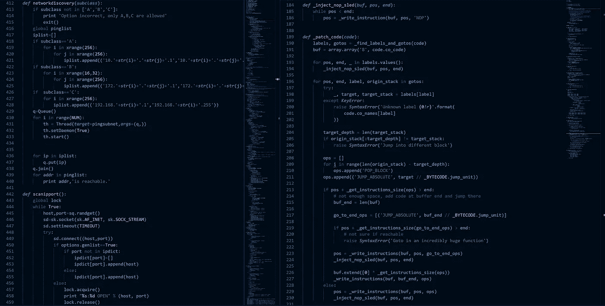
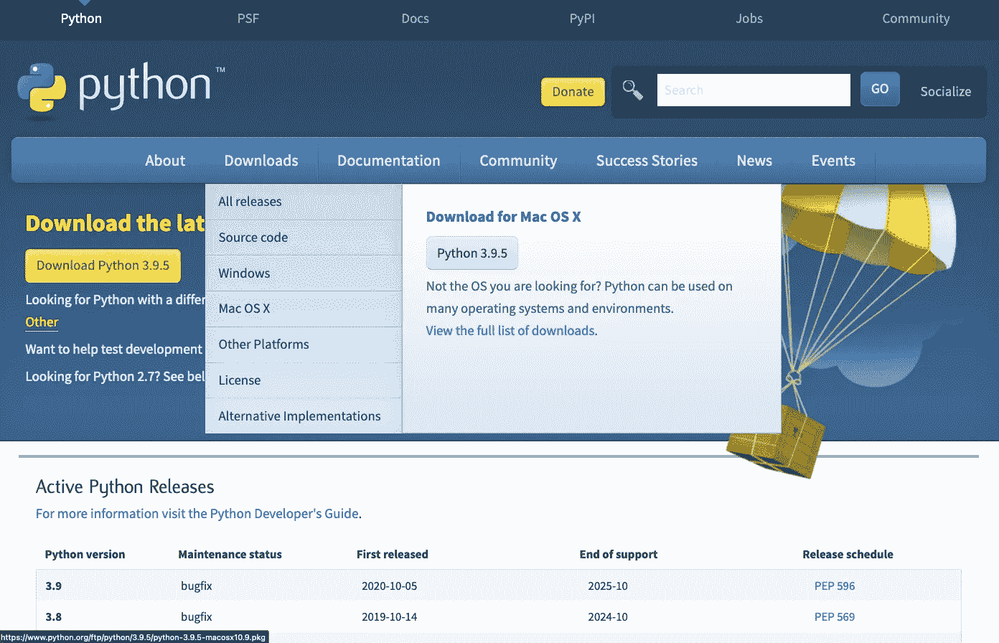
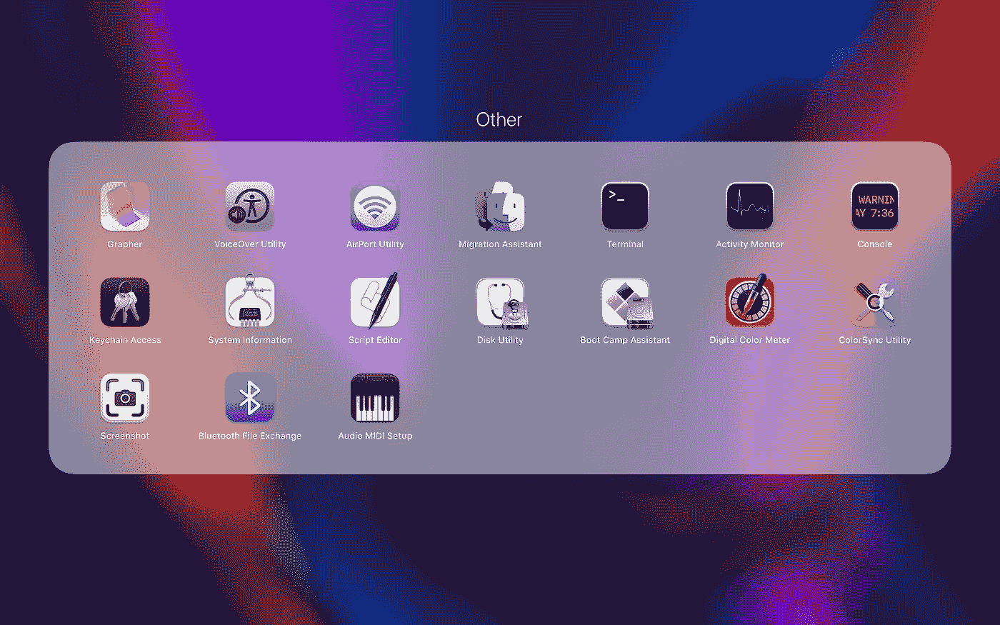
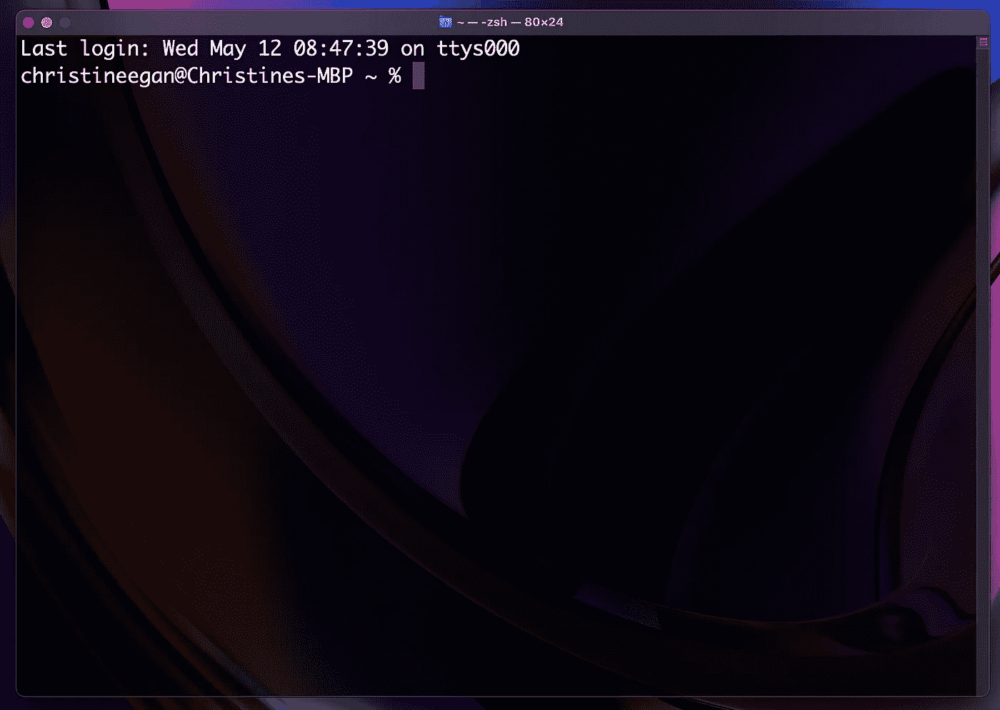
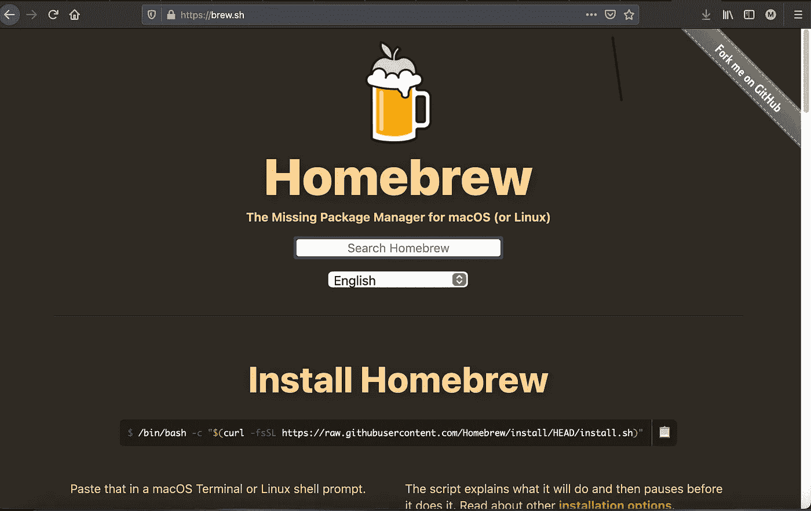

# 使用 macOS Big Sur 在 Python 中进行数据科学项目的一般设置

> 原文：<https://towardsdatascience.com/general-setup-for-data-science-projects-in-python-with-macos-big-sur-65784fc20231?source=collection_archive---------23----------------------->

## 为初学者安装 CLT、Xcode、Hombrew、Python 和 Pip



图片由来自 [Pixabay](https://pixabay.com/?utm_source=link-attribution&utm_medium=referral&utm_campaign=image&utm_content=5091352) 的 [Aaron Olson](https://pixabay.com/users/aaronjolson-4628445/?utm_source=link-attribution&utm_medium=referral&utm_campaign=image&utm_content=5091352) 拍摄

## **一.你好 Python**

Python 2.7.7 将开箱安装在您的 Mac 上。它应该在一个名为**/System/Library/framework/Python . framework**的文件夹中，与操作系统所需的其他几个 Python 2 版本放在一起。帮自己一个忙，不要修改该文件夹中的任何内容，因为后台进程可能会依赖于它们，这可能会导致系统崩溃。要在项目中使用 Python，您需要下载 Python 的新版本。

导航至**[**python.org**](https://www.python.org/)**>下载> Mac OS X** 并下载当前版本(3.9.5，截至 2021 年 5 月)。如果你愿意，你可以使用图形化的安装程序。**

****

**[https://www.python.org/downloads/](https://www.python.org/downloads/)**

**软件包下载完成后，安装程序应该会立即启动。安装完成后，您将可以使用最新版本的 Python。**

## ****二。迎接终端****

**前往**发射台>其他>终端。****

****

**Mac OS Big Sur 上的 Launchpad >其他屏幕**

**为了让您的生活更轻松，您可以将终端放在您的 dock 中，以便经常使用。**

**还有一些其他方法可以访问“终端”。要从桌面打开终端，可以使用快捷键 **command +空格键**到打开 Spotlight Search，然后在搜索栏中输入“终端”并点击 return。如果您希望在“终端”中打开更多的终端窗口，您可以使用 **command +T** 打开一个新标签，使用 **command + N** 打开一个新的终端窗口。**

****

**Mac OS 中的终端**

## ****三世。安装 CLT 和 Xcode****

**现在，需要安装命令行工具和 Xcode 才能在 Mac 上使用 Homebrew 和其他工具。在终端中输入以下内容:**

```
% xcode-select — install
```

**下载所有内容可能需要一点时间。如果沿途出现任何提示，请按照它们的指示进行操作。**

## ****四。安装自制软件****

**家酿称自己为“macOS(或 Linux)缺失的软件包管理器”在这种情况下，家酿正在实践它的主张，因为我们需要继续我们的安装。**

****

**[https://brew.sh/截图](https://brew.sh/)**

**通过在终端中输入以下内容来安装 Homebrew:**

```
% mkdir homebrew && curl -L [https://github.com/Homebrew/brew/tarball/master](https://github.com/Homebrew/brew/tarball/master) | tar xz — strip 1 -C homebrew
```

**这将自动在你的**/usr/本地目录**中安装自制软件。**

## ****用自制软件安装 Python(和 Pip)****

**家酿已经安装，现在是时候确保家酿有自己的 Python 了。**

```
% brew install python@3.9
```

**家酿将安装自己的最新版本的 Python。Pip 是下载 Python 时附带的一个包管理器。接下来，我们将使用 Homebrew 和 Pip 来安装 Python 数据科学项目所需的其他包。**

****六。我们做了什么？**
1。安装了最新版本的 Python。
2。向终端介绍我们自己。
3。已安装 Xcode 和命令行工具。
4。安装自制软件。
5。安装了一个专门为家酿的 Python 版本，用的是家酿。现在我们还有匹普。**

**这是你需要开始用 [Pyenv](https://pypi.org/project/pyenv/) 管理你的 Python 版本和用 [Virtualenv](https://pypi.org/project/virtualenv/) 管理你的虚拟环境的基础。查看下一个教程，[使用 Pyenv 和 Virtualenv](https://christineegan42.medium.com/virtual-environments-for-python-data-science-projects-on-mac-os-big-sur-with-pyenv-and-virtualenv-60db5516bf06) 在 macOS Big Sur 上进行 Python 数据科学项目的虚拟环境，了解如何操作。**