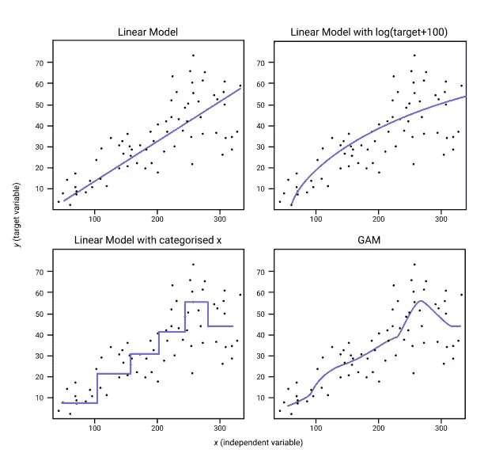
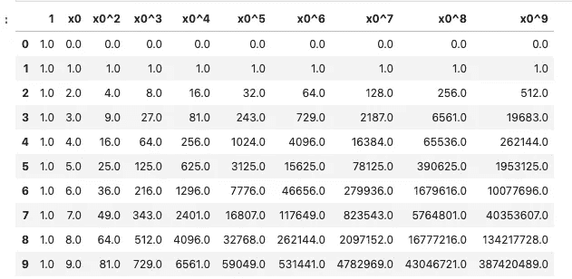
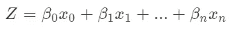
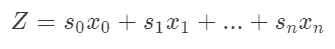
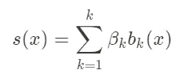
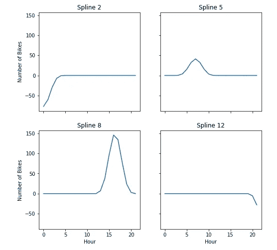
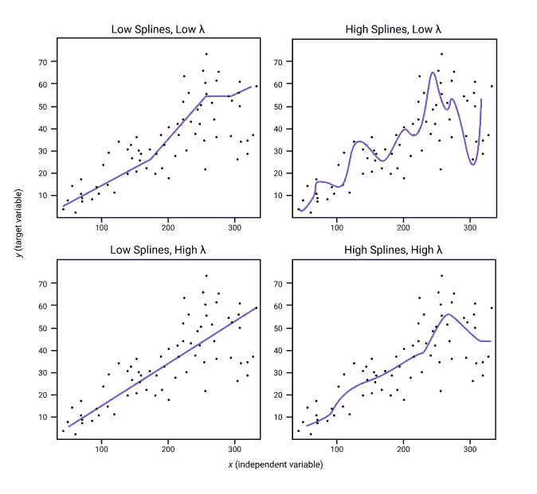

# 什么是广义加性模型？

> 原文：<https://towardsdatascience.com/generalised-additive-models-6dfbedf1350a?source=collection_archive---------1----------------------->

## 以及您为什么需要了解它…



使用线性模型与 GAM 的效果。图片作者。

# 介绍

线性模型被认为是模型的瑞士军刀。我们可以进行许多调整，以使模型在各种条件和数据类型下表现良好。

广义加性模型(gam)是一种适应，它允许我们在保持可解释性的同时对非线性数据建模。

# 目录

*   [什么是 GAM？](#c407)
*   [数据集](#4a2c)
*   [用线性回归估计非线性函数](#232f)
*   [GAMs 是如何工作的？](#fb90)
*   [将 GAMs 应用于自行车数据集](#64f7)
*   [游戏玩家如何工作第二部分](#6dcc)
*   [使用 PyGAM 实现线性 GAM](#6b0a)
*   [结论](#a505)

# 什么是 GAM？

GAM 是一个线性模型，与广义线性模型(如线性回归)相比有一个关键的区别。允许游戏者学习非线性特征。

> gam 放宽了关系必须是简单加权和的限制，而是假设结果可以通过每个特征的任意函数的和来建模。

为此，我们简单地用一个允许非线性关系的灵活函数替换线性回归的β系数(我们将在后面研究数学)。

这种灵活的功能称为**花键**。样条是复杂的函数，允许我们为每个特征建立非线性关系模型。许多样条的总和形成一个 GAM。结果是一个高度灵活的模型，仍然具有线性回归的一些解释能力。

让我们了解一下如何在没有 gam 的情况下对非线性特征建模。

# 资料组

这篇文章将使用经典的自行车共享数据集，可以从 [Kaggle](https://www.kaggle.com/c/bike-sharing-demand) 下载。该数据集跟踪华盛顿特区的自行车租赁数据

这篇文章的笔记本在这里:

[](https://github.com/AdamShafi92/GAM) [## 亚当沙菲 92/GAM

### 探索广义加性模型探索广义加性模型游戏中期后配套笔记本…

github.com](https://github.com/AdamShafi92/GAM) 

# 用线性回归估计非线性函数

**世界不是线性的。这意味着线性回归并不总是代表我们在现实中看到的。有时线性关系是足够好的估计，但通常不是。**

让我们来看看一天中每小时**的**自行车租金中位数

正如所料，这不是线性的。那么如果我们拟合一个简单的线性回归会发生什么呢？

还是那句话，不出所料，这行没有太大意义。它没有抓住我们的关系，我们不能真正使用这个模型。

值得注意的是，我确实做了一点小手脚，我没有对小时进行编码，这意味着模型将每个值都视为递增，然而我认为我的观点仍然有效..

让我们试着把这模拟成一种非线性关系。为此，我们使用*小时*变量创建多项式特征，例如小时、小时等。随着多项式的**阶**变得更高，我们使用更多的变量，因此对于 5 阶，我们使用 x，x，x ,x⁴和 x⁵.



多项式特征。图片作者。

在本例中，我让**在**小时 0-21**和**预测小时 22-23 训练**模型。**

我们可以看到，x 模型比线性模型做得更好，高阶模型能够很好地模拟我们的关系，挑选出早上和下午的峰值。

然而，如果我们看看预测点(22 小时和 23 小时)……灾难！我们曾经遇到过 [**龙格效应**](https://en.wikipedia.org/wiki/Runge%27s_phenomenon) **。**

> 龙格现象发现，当我们使用高阶多项式时，函数的边缘可能会振荡到极值，这意味着具有多项式特征的模型并不总是会产生更好的值。

如果我们看看我们的 x ⁰模型，我们可以看到，一旦它预测到什么，橙色线就会射向平流层。**这不好。它不仅不准确，还凸显出我们不知道这个模型会对看不见的数据做什么。如果我们想要部署这个模型，并让这个简单的模型变得几乎完全不可理解，这是一个巨大的风险。**

那么我们如何用一个简单的模型来模拟这种非线性关系呢？

**进入 GAM。**

# GAM 的作品是怎么做的？

## 从直线到样条曲线

让我们暂时回到我们的线性回归。该方程由变量的**线性组合之和定义。每个变量被赋予一个权重β并相加。**



线性回归方程。图片作者。

在 GAMs 中，我们放弃了可以使用变量的线性组合来计算我们的目标的假设，只是简单地说我们可以使用变量的非线性组合，用 *s、*表示“**平滑函数**”。



广义加性模型(GAM)方程。s 是一个光滑函数。作者图片

但是这是什么呢？我们用下面的等式定义它，这里我们看到β回来了，它表示同样的东西；一个砝码。我们的另一个术语， *b* 是在*基础上的扩展*。基展开就是我们之前对多项式所做的，取 x⁰，x，x 等。还有其他的基函数，它们可以是多维的。



光滑函数方程。图片作者。

最棒的是，我们可以在方程中为每个变量设置权重和函数。这比我们的线性回归灵活得多，线性程度也低得多。

这个**平滑函数**也被称为**样条。**不幸的是，样条真的很难定义，它们本质上是覆盖小范围的多项式函数。如果我们将样条可视化，它们会更容易理解。这里有一个 4 条样条线的例子，来自 GAM，我们将很快拟合！



从自行车数据集中的 GAM 拟合中随机选择 4 条样条曲线。图片作者。

如你所见，这些都是小范围的平滑函数。它们在外观上可以变化，甚至可以是线性的。让我们将 GAM 应用于我们的问题，并尝试理解样条函数，而不是通过更多的理论。

> “定义这些样条函数的方法多得令人困惑。如果您有兴趣了解更多有关定义样条曲线的所有方法，我祝您旅途愉快”
> 
> - *Christoph Molnar，可解释机器学习*

[点击这里查看克里斯托弗的书](https://christophm.github.io/interpretable-ml-book/extend-lm.html)

# 将 gam 应用于自行车数据集

让我们继续用一个游戏来解决前面的问题

如你所见，GAM 在评估我们的函数方面做得更好。它遵循曲线，在我们预测的点上(22 小时和 23 小时)，没有龙格现象的迹象。

那么这是如何工作的呢？我们使用了 12 个**花键。**还记得我们上面看到的 4 条样条线吗？我们可以查看整个特征空间中的所有 12 个。

这看起来不像与我们的曲线相关，这是因为每个样条函数**也有一个权重**。我们可以将函数输出乘以系数，以了解模型在 24 小时内的表现。

现在这看起来更像我们的曲线！希望这是直观的原因。**曲线只是我们个人样条的总和**！不要忘记顶部绿色的截距术语。

这是单个变量的问题，但是 GAM 可以很容易地应用于多个变量。我们甚至可以选择每个变量的样条**数量——我们不需要每个变量都有相同的数量。我们也可以手动编程变量之间的交互。**

# GAM 理解第二部分

关于游戏还有很多需要理解的地方，我将在以后的文章中讨论。这里我们只看了一个变量。GAM 的工作对很多人来说都很好，但是我们以后再看这个。以下是主要概念的概述

## 摇摆

波动就是我们的线有多波动。这是描述这个的正确术语！我们包含的样条越多，我们的线相对于我们的特征就越扭曲。这样做的问题是，它将开始过度适应我们的数据。我们需要找到正确数量的样条曲线，这样模型就可以学习问题，并很好地概括。

## 防止过度拟合

幸运的是，我们不仅仅需要猜测样条的数量。我们有另一个参数叫做*λ，λ。*这不利于我们的样条曲线。λ越高，我们的线就越不摆动，直到它变成一条直线。

在下图中，我们可以看到使用大量的样条和低 *λ* 导致一个非常**摆动**线。



样条和λ值的比较。图片作者。

一般的经验法则是使用大量的**样条**并使用**λ**(λ)值的交叉验证来找到最通用的模型。记住，我们可以为模型中的每个变量设置不同的**样条**和**λ**值。

## 链接功能

很像常规的广义线性模型，链接函数可以用于不同的分布；用于分类问题的 *Logit* 函数或用于对数转换的 *Log* 。

## 分布

我们还可以选择不同的分布，如泊松分布、二项式分布、正态分布。

## 张量积

我们可以在游戏中设计互动。这被称为张量积。这样我们就可以模拟变量之间的相互作用，而不是孤立地考虑每个变量。

# 使用 PyGAM 实现线性 GAM

根据我的研究，似乎 R 中的 [*mgcv* 包最适合 GAMs。但是，我更喜欢 Python 两个最好的选择是](https://cran.r-project.org/web/packages/mgcv/mgcv.pdf) [Statsmodels](https://www.statsmodels.org/stable/gam.html) 和 [PyGAM](https://pygam.readthedocs.io/en/latest/index.html) 。

以下是如何使用 PyGAM 来适应 GAM。这是假设您的数据已经过清理和预处理，可以进行建模，并且您的数据已经拆分为训练数据集和测试数据集。

```
import numpy as np
import pandas as pdfrom pygam import GAM, LinearGAM, s, f, te# your training and test datasets should be split as X_train, X_test, y_train, y_testn_features = 1 # number of features used in the model
lams = np.logspace(-5,5,20) * n_features
splines = 12 # number of splines we will use# linear GAM for Regressiongam = LinearGAM(
                s(0,n_splines=splines))
     .gridsearch(
                X_train.values, 
                y_train.values,
                lam=lams)
gam.summary()print(gam.score(X_test,y_test))
```

PyGAM 有更多的深度，因为它提供了多种游戏类型。查看 PyGAM 文档，了解其他类型的 GAM(例如用于分类)和不同的可用地块类型。

[](https://pygam.readthedocs.io/en/latest/notebooks/tour_of_pygam.html) [## pyGAM - pyGAM 文档之旅

### 广义可加模型是光滑的半参数模型，其形式为:\[g(\mathbb{E}[y|X]) = \beta_0 +…

pygam.readthedocs.io](https://pygam.readthedocs.io/en/latest/notebooks/tour_of_pygam.html) 

# 结论

这是一次短暂的 GAMs 之旅！希望你现在知道什么是**样条**，以及我们如何使用它们来建模**非线性数据**。因为我们可以理解我们的模型将如何对看不见的数据做出反应，我们必须明确地包括交互，游戏被认为是相对**可解释的**。

> 当我们需要非线性数据的可解释模型时，gam 是最好的。

在我的下一篇关于 GAMs 的文章中，我们将通过一个更复杂的分类问题的视角来看待波动、过度拟合、分布、连接函数和张量积。

## 了解更多信息

[](/5-project-ideas-91da0da17b31) [## 启动您的数据科学职业生涯的 5 个项目创意

### 成功项目的框架。

towardsdatascience.com](/5-project-ideas-91da0da17b31) 

## 将我的内容直接发送到您的收件箱！

[](https://adamsh.substack.com/p/coming-soon) [## Data Siens:机器学习技巧、诀窍和教程的资源。

### 欢迎来到亚当的数据西恩斯。我是一名数据科学家，有 5 年的分析经验。我喜欢谈论任何事情…

adamsh.substack.com](https://adamsh.substack.com/p/coming-soon)