# 广义优势估计:数学与代码

> 原文：<https://towardsdatascience.com/generalized-advantage-estimate-maths-and-code-b5d5bd3ce737?source=collection_archive---------6----------------------->

由 [Unsplash](https://unsplash.com?utm_source=medium&utm_medium=referral) 上的 [Edge2Edge 媒体](https://unsplash.com/@edge2edgemedia?utm_source=medium&utm_medium=referral)拍摄

在我的文章实现 [**阶段策略梯度(PPG)算法**](/phasic-policy-gradient-ppg-part-2-c93afeaf37d4) 中，我有一个关于广义优势估计(GAE)的问题，所以我想我应该在这里跟进一些额外的细节😊

[**这里是原文**](https://arxiv.org/abs/1506.02438) 。我将更直观地描述这个理论，并解释如何用代码实现它。如果你想尝试这个和其他 RL 技术，请查看我的开源库， [**Pearl**](https://github.com/LondonNode/Pearl) 。

总之，这种方法允许我们估计强化学习中的优势和价值函数，并且容易控制偏差方差权衡。让我们开始吧！

# 设置场景

我们正在尝试教一些代理解决一个环境(例如，一个游戏)。为了做到这一点，代理人必须了解其行动的预期结果。在这里，我们将正式方程，将给予代理这一信息。

## 轨道

当代理浏览环境状态时，它收集奖励，告诉它刚刚采取的行动是好是坏。随着时间的推移，一个代理人遇到的行动、状态和奖励的序列被称为轨迹，我们在这里用符号 **τ** 来定义它。

## 返回

在一个轨迹的终点，我们可以回头看，看到轨迹中每一步的未来回报的贴现总和，也称为**回报**。更正式地说，回报是这样定义的:

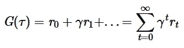

作者图片:轨迹的回归

**γ** 术语引入的折扣是一个介于 0 和 1 之间的数字。我们想这么做有几个原因:

1.  从数学上来说，奖励的无穷大可能不会收敛到一个有限值，并且很难用等式来处理。折扣因素对此有所帮助。
2.  更直观地说，未来的奖励不会带来直接的好处。我们更喜欢即时的满足感；其实我们在给股票和衍生品定价的时候也是这么做的！

## 价值函数

价值函数 **V** 定义为一个状态的预期收益:

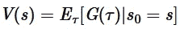

作者图片:价值函数

代理应该偏好具有较高值的状态，因为这些状态具有与其相关联的较高的预期总轨迹回报。几乎每个强化学习算法都会用到这一点。

## 优势函数

优势函数 **A** ，是从状态中给定动作的期望回报中减去状态(值)的期望回报。更直观地说，它告诉我们所采取的行动与总体预期回报相比有多好或多差:

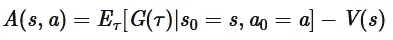

作者图片:优势功能

为什么我们用这个，而不仅仅是在一个状态下给定一个动作的预期收益(第一项)？直观地说，该指标在蒙特卡洛运行中具有较低的方差，因为减去确定性值函数通常会导致较小的量值。

# 偏差方差权衡

首先，让我们开始一些定义:

*   **偏差**:有偏差的估计量不能很好地代表/符合原始度量。从形式上讲，如果估计量的期望值等于原始度量，则估计量是无偏的。
*   **方差**:方差较大的估计量，其值的分布范围较大。理想情况下，无偏估计量应该具有较低的方差，以便始终如一地匹配输入的原始度量。在形式上，这是衡量相同的方差的任何随机变量的衡量。

不幸的是，我们通常没有价值函数或优势函数的精确形式。让我们使用神经网络来模拟价值函数，因为这仅需要状态输入而不是状态动作输入。鉴于此，**我们如何用一个不完美的价值函数估计器来估计优势函数？**首先，注意:

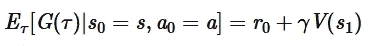

作者图片

也就是说，一个状态下给定一个动作的预期收益，等于动作状态对的回报(这里假设是确定性的)加上下一个状态的贴现预期收益。

因此，优势可以估计为:

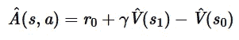

作者图片:优势函数的时间差异(TD)估计

注意，这个估计量高度依赖于价值函数估计量。如果这个有高偏差，那么 TD 估计也会有高偏差！

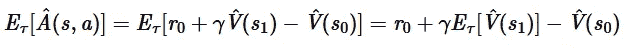

图片作者:如果价值函数估计有偏差，则 TD 估计有偏差

理想情况下，我们希望尝试绕过这个问题。在强化学习设置中，我们通常在每次更新的环境中采取 **n** 个步骤。因此，延长额外时间步长的 TD 估计值相当容易:

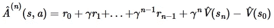

作者图片:超过 **n** 步的扩展优势评估

这样做减少了偏差，因为我们增加了来自完全优势函数的不依赖于价值函数估计的项的比例，并且我们将第 n 个状态的价值估计的幅度缩放了小得多的数。

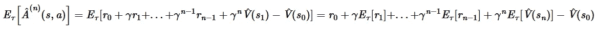

作者图片:回报期望项与原始优势函数相匹配

然而，这样做也有不利的一面。随着许多额外项的加入，新的估计量具有增加的方差。

总之，扩展 TD 估计以包括更多的奖励步骤以增加方差为代价减少了估计量的偏差。我们可以在 1 和 n 之间选择任意一个数字，来放入扩展的优势估计， **A^{(i)}(s，a)。**问题是，我们如何挑选这个数字？

# GAE 方程

一个很好的解决方案是只取 1 和 n 之间的一个指数平均值作为扩展优势估计器的输入。让我们直接从纸上看最终的形式，其中 **δ_t** 是时间步长 **t** 的 TD 优势估计。

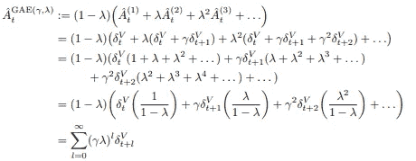

[1]广义优势估计

这里， **λ** 是指数权重折扣。重要的是，**这是控制偏差方差权衡的杠杆！**注意，如果我们将其设置为 0，那么我们将得到 TD 优势估计(高偏差、低方差)，如果我们将其设置为 1，这相当于选择 **i = n** 作为扩展优势估计(低偏差、高方差)。

# 密码

GAE 在 Python 中的实现如下所示:

是我的错觉还是事情出奇的简单？这就是指数平均的美妙之处！它可以容易地实现，并且在计算上是线性的😁

诀窍是从末尾开始，然后往回算，这样我们就不会一遍又一遍地计算相同的量。让我们用一个 **n** 步进轨迹来更清楚地展示这一点:

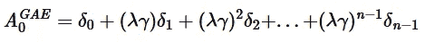

作者图片

因此:

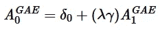

作者图片

此外，请注意此处添加了“完成”标志，表示一集是否已经结束(0 =完成，1 =未完成)。包括这一点很重要，这样我们在计算当前剧集中某一步的优势时就不会考虑未来剧集的奖励。

唷！坚持到了最后🎉🎉

如果您觉得这篇文章有用，请考虑:

*   跟踪我🙌
*   [**订阅我的邮件通知**](https://medium.com/subscribe/@rohan.tangri) 永不错过上传📧
*   使用我的媒介 [**推荐链接**](https://medium.com/@rohan.tangri/membership) 直接支持我并获得无限量的优质文章🤗

促销的方式，让我知道你对这个话题的想法和快乐学习！！

# 参考

[1]使用广义优势估计的高维连续控制，作者:约翰·舒尔曼、菲利普·莫里茨、谢尔盖·莱文、迈克尔·乔丹、彼得·阿比尔:[https://arxiv.org/abs/1506.02438](https://arxiv.org/abs/1506.02438)