# 广义注意机制:大鸟的理论基础和一般变形金刚模型

> 原文：<https://towardsdatascience.com/generalized-attention-mechanism-bigbirds-theoretical-foundation-and-general-transformers-models-9fb87bdac3b2?source=collection_archive---------11----------------------->

美国宇航局在 [Unsplash](https://unsplash.com/s/photos/network?utm_source=unsplash&utm_medium=referral&utm_content=creditCopyText) 拍摄的照片

作为一个小背景， [**BigBird**](https://arxiv.org/abs/2007.14062) 是 [Google Research](https://research.google/pubs/pub49533/) 最近发布的一个模型，它可以处理比以前可能的更长的文本序列。

BigBird 在处理了一整天的长文本序列后([BigBird](https://www.flickr.com/photos/62424772@N08/11504478233)BY[J . Fei nberg](https://www.flickr.com/photos/62424772@N08)CC BY 2.0)

以下是这种模式值得大肆宣传的几个原因。我喜欢这些属性甚至不是自然语言处理中出现的常见主题，但它显示了它的潜力:

1.  正是[图灵完成](https://en.wikipedia.org/wiki/Turing_completeness)。
2.  它在基因组学研究方面取得了最先进的成果。
3.  它在使用变形金刚处理长文本序列方面击败了其他 SotA 模型，比如曾经主宰场景的 [Longformer](https://arxiv.org/abs/2004.05150) 。

但是除了它的能力有多深远之外，这篇论文本身读起来非常有趣。作者深入研究了该模型的数学基础，以证明该设计的合理性，以及他们如何解释该模型的优越性能。

在本文中没有得到足够讨论的一个概念是 ***广义注意机制*** 。

## 变形金刚通常是如何解释的

这个概念本身只不过是观看变形金刚模型的另一种方式。通常，当我们谈论变形金刚模型和它们的**注意力机制**时，它们被想象成这样:

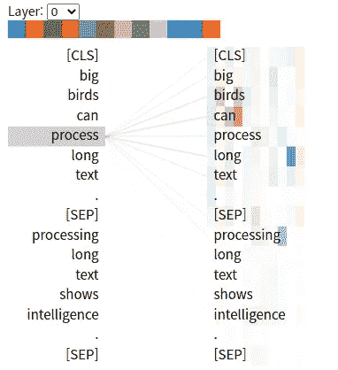

作者使用 [BertViz](https://github.com/jessevig/bertviz) 进行可视化

变形金刚从标题为 [***注意*** *的论文开始，这就是你所需要的全部*](https://papers.nips.cc/paper/2017/file/3f5ee243547dee91fbd053c1c4a845aa-Paper.pdf) ，这可能是今天 NLP 中引用最多的一篇论文。中心思想是这样的: ***对一个句子中的一个标记的分析包括查看其他标记的整个集合*** *，*，除了对每个标记进行基于注意力的加权。

你很难找到变形金刚模型的其他可视化形式。有一整套像 [**BertViz**](https://github.com/jessevig/bertviz) 这样的工具和库，可以让你像这样制作变形金刚模型的可视化。

但是，如果我告诉你，这些可视化并没有公正的变形金刚的真实本性呢？这些流行的可视化方法忽略了关于注意力机制本质的核心属性。

这篇论文建议我们，思考变形金刚如何处理序列的正确方式是把它看作 ***图形运算*** 。

# 广义注意机制

***广义注意机制*** 背后的思想是，我们应该把序列上的注意机制看作图形操作。

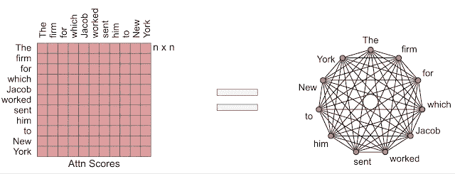

来自 Avinava Dubey 的谷歌人工智能博客 BigBird

[***关注是你所需要的全部***](https://proceedings.neurips.cc/paper/2017/file/3f5ee243547dee91fbd053c1c4a845aa-Paper.pdf) 背后的中心思想是，模型在处理每个令牌的同时，关注序列中的每一个其他令牌。那么，如果我们把记号看作图上的节点，注意每一个其他的记号意味着该节点与图中的每一个其他节点相连。

换句话说，传统的变形金刚模型可以另外表示为一个 ***全连通图*** 。事实上，它们是 ***加权的*** 全连通图，其中权重是我们大肆宣传的关注分数。

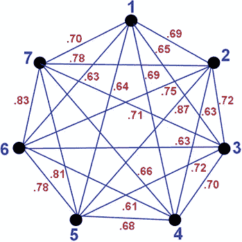

这篇[论文](https://www.researchgate.net/figure/a-Undirected-fully-connected-weighted-Graph-G-b-Adjacency-Matrix-of-G_fig1_320116922)中的加权全连通图示例。

这种替代方案，*用图论的方法来观察变压器如何处理序列中的记号是非常强大的，因为我们可以直接应用数学家们已经开发了几个世纪的图论中的强大工具。*

*这是大鸟设计的核心指导思想。*

# *全连通图有多痛苦*

*BigBird 是出于处理长文本序列的需要。如果你以前用过变形金刚模型，这可能是 NLP 中的一个明显的问题。您会直接知道即使模型有数十亿个参数，最多也只有 1024 个标记。*

*我对变形金刚形象化的另一个问题是:*

**

*作者使用 [BertViz](https://github.com/jessevig/bertviz) 进行可视化*

*或者这些:*

*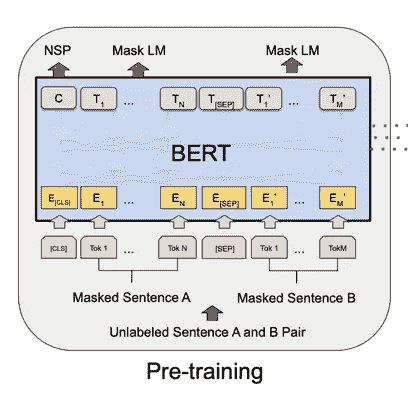*

*出自原来的[伯特论文](https://arxiv.org/pdf/1810.04805.pdf)。*

*是 ***他们*** ***没有恰当地捕捉到变形金刚模型背后的*** 处理有多激烈。*

*一旦你把它们想成是完全连通的图，这就变得更加清楚了。*

*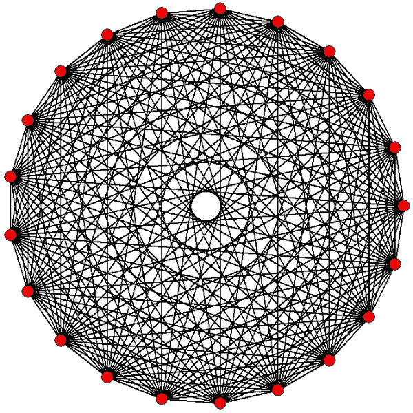*

*[汤姆·鲁恩](https://upload.wikimedia.org/wikipedia/commons/d/dd/20-simplex_graph.png)，公共领域，通过维基共享*

*这是一个只有 20 个节点的完整图！你能想象 1024 个节点的完整图形会是什么样子吗，更不用说 BigBird 能够处理 4000 多个令牌了？*

*上图中的每条边代表一个计算，上图中所有计算的集合只针对一层。*

# *利用图论:图稀疏化*

*幸运的是，在计算机科学和数学的其他领域，这是一个古老的问题。BigBird 建议做的事情本质上是利用这些工具，当涉及到具有大量节点的图形时，我们看到这些工具正在其他领域中使用。*

> *这种将自我关注视为完全连通图的观点允许我们利用现有的图论来帮助降低其复杂性。降低自我关注的二次复杂度的问题现在可以被看作是一个**图稀疏化问题**——来自 [BigBird 论文](https://arxiv.org/pdf/2007.14062.pdf)。*

*以下是对 BigBird 使用的方法的综合介绍:*

*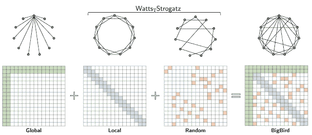*

*来自 Avinava Dubey 的谷歌人工智能博客文章*

*下面的矩阵是**邻接矩阵**。它们是将图形数据结构表示为具有数值的矩阵的有用方式，其中每个位置的正值表示两个节点之间的连接。*

*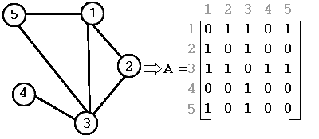*

*邻接矩阵的例子，来自 nl.wikipedia 的 [Yepke，](https://upload.wikimedia.org/wikipedia/commons/3/3b/AdjacencyMatrix.png) [CC BY-SA 3.0](https://creativecommons.org/licenses/by-sa/3.0) ，通过维基共享*

*我们现在知道 BigBird 的指导原则是**稀疏化变形金刚**模型的计算图，这样处理更长的序列是一个更现实的目标。*

*我们需要一个比原始全连通图简单得多的图的设计，它仍然保留了节点之间有意义的连接。*

*以下是设计此最佳图表的步骤。*

## ***1。鄂尔多斯-雷尼模型:最简单的随机图***

*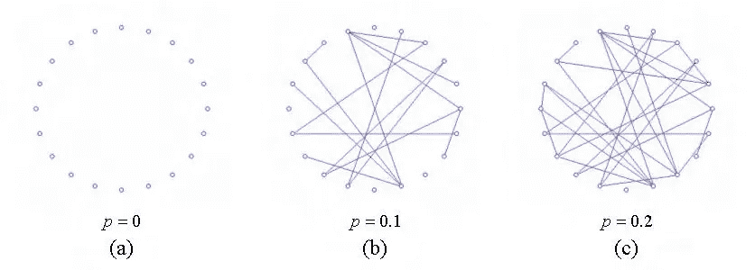*

*来自 [ResearchGate](https://www.researchgate.net/figure/Erdoes-Renyi-model-of-random-graph-evolution_fig10_313854183) 的一个帖子*

*这只是随机和独立地挑选连接节点的边的概念。如果问题是我们有太多的连接，那么这就是随机丢弃大多数连接的方法。*

*这种方法实际上比预期的更有效**,因为两个变得不连接的令牌仍然可能共享信号**,因为它们可能具有它们都连接到的其他节点。由于变压器需要多层处理，这些连接可以复合足够多的令牌，以充分地相互连接。*

> *因此，**这样的随机图在光谱上接近完整图**，并且它的第二特征值(邻接矩阵的)离第一特征值相当远。这一特性导致图中随机游走的快速混合时间，这非正式地表明信息可以在任意一对节点之间快速流动——来自论文。*

## *2.瓦特和斯特罗加兹模型:参照的局部性*

*一般来说，单词之间的接近度是自然语言处理中的一个重要因素。直观地说，一个给定标记的大部分信息都可以被它周围的人找到。*

*一个简单的随机图错过了这种结构，因为它固有地在整个图中产生相等的稀疏度——紧邻一个标记的单词被认为是数千个标记之外的单词的概率相等。*

*因此，解决方案是考虑一种“滑动窗口”方法:*

*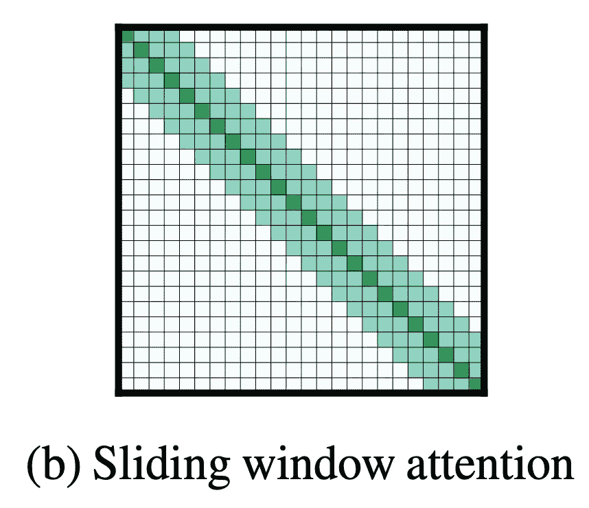*

*来自[龙前纸业。](https://arxiv.org/pdf/2004.05150v2.pdf)*

*因为我们知道单词周围的记号在分析单词时肯定会很重要，**我们简单地保证对每个记号的 n 个最近的记号的全部关注。这实际上是以前在为长文档应用变形时提出的，尤其是在 [Longformer](https://arxiv.org/pdf/2004.05150v2.pdf) 中。***

*虽然这不是一个完美的类比，但我认为可以将其比作网络中的集线器:*

*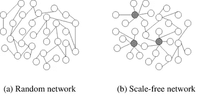*

*来自[马克西姆](https://commons.wikimedia.org/wiki/File:Scale-free_network_sample.png)、 [CC BY-SA 3.0](https://creativecommons.org/licenses/by-sa/3.0) 的本地枢纽示例，通过维基共享*

*通过这些窗口，我们围绕每个令牌创建了**注意力**集群。结合简单的随机图方法，这些注意力的**“本地中枢”**被随机连接到整个文档中的一些标记。这使我们既能实现图的稀疏化，又能在分析中保持一定的局部性。*

*然而，作者指出，简单的随机图和滑动窗口图的组合不足以让该模型显示 BERT 级性能。*

*毫不奇怪，这种方法很难赶上 BERT 的性能，因为稀疏图包含的分析量本质上比全连通图少。但下面的最后一个组件显然是核心组件，至少在经验上，它允许 BigBird 显示出类似于 BERT 的性能，尽管它很稀疏。*

## *3.全局令牌*

*之前我们注意到:*

> *…[**]两个未连接的节点** ]仍然可能共享信号，因为它们可能都连接到其他节点。…这些连接可以复合到足以使令牌彼此**充分连接**。*
> 
> *“因此，**这种随机图在光谱上接近完整图**……这非正式地表明信息可以在任何一对节点之间快速流动”*

*我们打了一个比方，滑动注意力窗口创造了局部注意力中心。*

*对于全局令牌，我们指定一个令牌列表，让**处理文档中的所有令牌**。虽然 BERT 被设计成每个令牌照顾其他令牌，但是 BigBird 被设计成只有少数指定数量的令牌这样做。*

*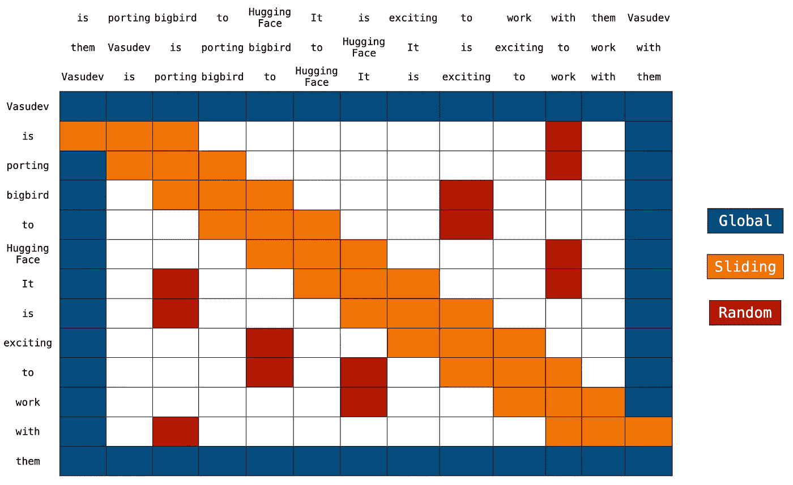*

*完整的大鸟来自 [HuggingFace 的博客](https://huggingface.co/blog/big-bird)*

*这是有用的，有几个原因，其中一些作者没有明确指出:*

1.  *全局记号(类似于 BERT 中的[CLS]记号)通常非常有用，因为虽然它们只是序列的另一个记号，但是它们本身能够表示完整的输入序列。如果没有全局标记，就很难生成一个表示整个文档的向量。*
2.  *虽然作者没有明确提到这一点，但我相信这是另一个非常重要的结果。关于未连接的令牌(由于随机图的构造)仍然通过跳过相互邻居来共享信号的想法， ***全局令牌保证这是真的*** 。在添加全局令牌之前，对彼此非常重要的两个令牌实际上可能是断开的，并且只能共享由于跳过太多节点而显著减弱的信号。**现在有了全局令牌，它们被保证最多相距两跳**，因为全局令牌被保证是图中的共同节点。*

*最后，下面是作者提供的最终图表，它很好地总结了这一点:*

*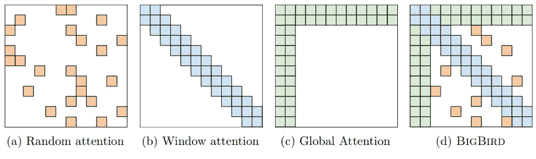*

*出自[大鸟论文](https://arxiv.org/pdf/2007.14062.pdf)。*

*单纯看 BigBird 注意力的最后一张图，即使有很多空连接，直观上也不会让我们觉得太在意它们——好像没有它们处理就完全没问题了。这有点像原始全连通图的信息最大化缩减。*

*但随着这种减少，BigBird 能够处理的序列远远超过以前的 1024 个限制，甚至达到 4096 个，而不会像完全连接的同行那样损失太多性能。*

*我想很多读者可能也会看最后一张图，并想知道他们如何能够在 GPU 中表示这样的计算图。这是一个完全不同的话题，作者利用了非常聪明的方法“阻断稀疏注意力”来做到这一点。这是另一个话题，一个彻底的解释(用代码！)可以在一篇 [Huggingface 的博文](https://huggingface.co/blog/big-bird)中找到。*

*感谢阅读！*