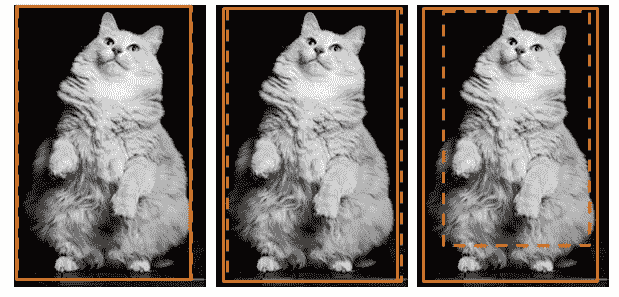
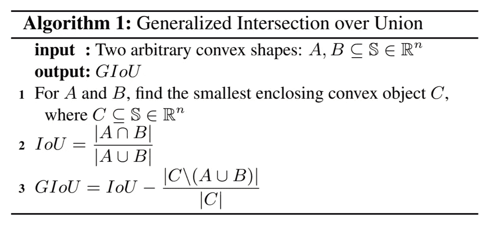
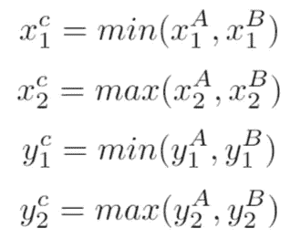

# 火炬视觉目标检测的广义 IoU 损失

> 原文：<https://towardsdatascience.com/generalized-iou-loss-for-object-detection-with-torchvision-9534029d1a89?source=collection_archive---------11----------------------->

## 关于如何在 Torchvision 对象检测中使用 GIoU 自定义损失函数的教程

使用 GIoU 损失函数后目标检测的改进([来源](https://images.unsplash.com/photo-1598896130238-5606c05ec207?ixid=MnwxMjA3fDB8MHxwaG90by1wYWdlfHx8fGVufDB8fHx8&ixlib=rb-1.2.1&auto=format&fit=crop&w=334&q=80)

在对象检测任务中，最常见的评估度量是 IoU，这促使我们在训练中最小化这样的度量，看看我们是否取得了一些进展。Hamid Rezatofighi 和他的同事表明，使用广义 IoU ( ***GIoU*** )损失函数优于使用其他标准损失函数的最先进的对象检测方法。

我不想浪费你的时间解释什么是***IoU******GIoU***。如果你在这里，你可能对这些功能很熟悉。你可以在这里找到完整的描述。

在[火炬视觉](https://github.com/pytorch/vision)物体检测模型中，RCNN 家族中的默认损失函数是[平滑 L1 损失函数](https://pytorch.org/docs/stable/generated/torch.nn.SmoothL1Loss.html)。模型中没有改变损失函数的选项，但是如果您对使用平滑 L1 损失不感兴趣，可以简单地定义您的自定义损失并将其替换为平滑损失。

# GIoU 损失函数

我们计划计算以下 GIoU:

IoU 和 GIoU(查看更多详情[此处](https://giou.stanford.edu/GIoU.pdf))

Torchvision 提供了边界框的交集和并集计算，这使得计算 GIoU 变得非常容易。

我们可以通过从`torchvision.ops.boxes`导入`_box_inter_union`来直接计算盒子的交集和并集。

为了计算包围盒子的最小凸形的面积，首先我们找到 ***C:*** 的坐标

然后，我们计算它的面积(下面代码的第 17 行)。

**GIoU 损失为: *1- GIoU*** *。*

物体检测的 GIoU 损失函数(类似于 [fvcore](https://github.com/facebookresearch/fvcore/blob/master/fvcore/nn/giou_loss.py) )

# 火炬视觉中的自定义损失函数

主 RCNN 框架在`[roi_heads.py](https://github.com/pytorch/vision/blob/main/torchvision/models/detection/roi_heads.py)`中完成，FastRCNN 和 MaskRCNN 损失函数位于此处。因此，要使用您的自定义损失函数，您需要从`roi_heads`导入它并用您的自定义函数替换它，正如我在下面代码的第 22 行中所做的:

FastRCNN 的自定义损失函数

# 摘要

在这篇短文中，您可以找到使用 GIoU loss 函数通过 Torchvision 进行物体检测所需的全部内容。

**参考文献:**

[1] [并集上的广义交集:包围盒回归的度量和损失](https://giou.stanford.edu/GIoU.pdf)

 [## 加入媒体阅读伟大的教程和故事！

### 我写机器学习、深度学习和数据科学教程。升级阅读更多。

sciencenotes.medium.com](https://sciencenotes.medium.com/membership) 

杰瑞米·哈里斯，[拉胡尔·阿加瓦尔](https://medium.com/u/e8cce06956c9?source=post_page-----9534029d1a89--------------------------------)，[大卫·麦克](https://medium.com/u/1d81a71197ab?source=post_page-----9534029d1a89--------------------------------)，[库马尔·什里达尔](https://medium.com/u/c7ad13abfbb7?source=post_page-----9534029d1a89--------------------------------)