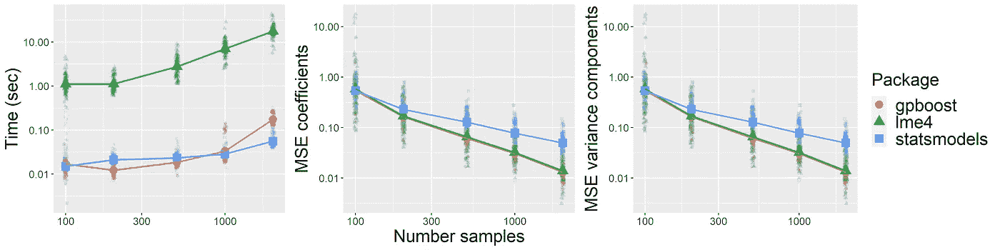
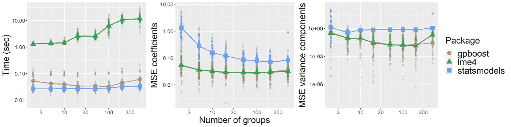
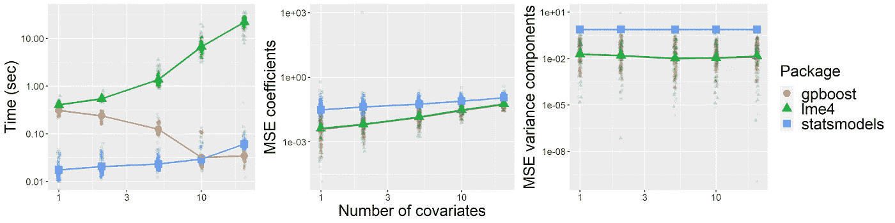
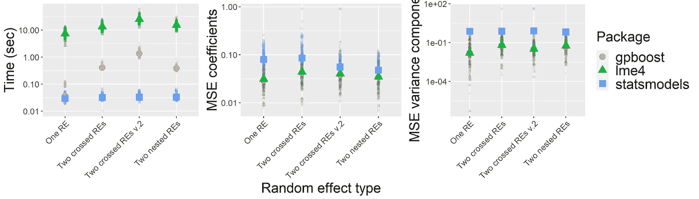
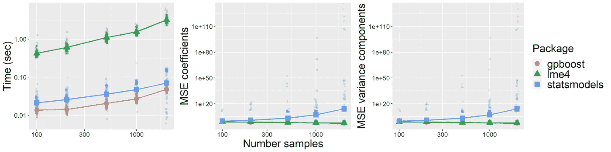

# 用 GPBoost 实现 R 和 Python 中的广义线性混合效果模型

> 原文：<https://towardsdatascience.com/generalized-linear-mixed-effects-models-in-r-and-python-with-gpboost-89297622820c?source=collection_archive---------5----------------------->

## [思想和理论](https://towardsdatascience.com/tagged/thoughts-and-theory)

## “lme4”和“statsmodels”的介绍和比较



图 gpboost、lme4 和 stats 模型的比较:**估计时间和单水平随机效应模型的系数和方差参数的均方误差(MSE)** 对于**变化的样本数**

[**GPBoost**](https://github.com/fabsig/GPBoost) **是一个最近发布的 C++软件库，它允许在 R 和 Python 中拟合广义线性混合效果模型**。本文展示了如何使用相应的 [R](https://github.com/fabsig/GPBoost/tree/master/R-package) 和 [Python](https://github.com/fabsig/GPBoost/tree/master/python-package) `**gpboost**`包来实现这一点。此外，我们对`lme4` R 包和`statsmodels` Python 包进行了比较。**在模拟实验中，我们发现** `**gpboost**` **比** `**lme4**` **R 包****快很多(有些情况下快 100 倍以上)。令人不安的是，** `**statsmodels**` **Python 包经常错误地估计模型。**

# 简介:广义线性混合效应模型

[广义线性混合效应模型(GLMMs)](https://en.wikipedia.org/wiki/Generalized_linear_mixed_model) 假设响应变量 *y* 遵循已知的参数分布 *p(y|mu)* ，并且该分布的参数 *mu* (通常是平均值)与所谓的固定效应 *Xb* 和随机效应 *Zu* 的总和相关:

> y ~ p(y |μ)
> 
> mu = f( Xb + Zu)

*   *y* 是响应变量(又名标签，因变量)
*   *Xb* 是固定效应， *X* 是具有预测变量(又名特征、协变量)的矩阵， *b* 是系数
*   *Zu* 是随机效应，其中 *u* 假设遵循多元正态分布，而 *Z* 是将 *u* 与样本相关联的矩阵
*   *f()* 是一个链接函数，确保 *mu = f( Xb + Zu )* 在适当的范围内(例如，对于二进制数据，平均值必须在 0 和 1 之间)

GLMM 与广义线性模型(GLM)的区别在于随机效应的存在。例如，随机效果可以由具有潜在嵌套或交叉分组结构的分组(又名群集)随机效果组成。因此，[随机效应也可以被看作是一种建模高基数分类变量](https://arxiv.org/abs/2105.08966)的方法。此外，随机效应可以包括例如用于对空间数据建模的高斯过程。与仅使用固定效应相比，随机效应的优势在于，当例如组或类别的数量相对于样本大小较大时，可以更有效地估计模型。[线性混合效应模型(LMEs](https://en.wikipedia.org/wiki/Mixed_model) )是 GLMMs 的一个特例，其中 *p(y|mu)* 是高斯的， *f()* 仅仅是恒等式。

# **使用 GPBoost 在 R 和 Python 中建模 glm ms**

我们简要地展示了 R 和 Python `gpboost`包如何通过 GLMMs 用于推断和预测。更多细节，我们参考 [GitHub 页面](https://github.com/fabsig/GPBoost)，特别是 [R](https://github.com/fabsig/GPBoost/blob/master/R-package/demo/generalized_linear_Gaussian_process_mixed_effects_models.R) 和 [Python](https://github.com/fabsig/GPBoost/blob/master/examples/python-guide/generalized_linear_Gaussian_process_mixed_effects_models.py) GLMM 的例子。

## 装置

CRAN 和 PyPI 上有`gpboost` R 和 Python 包，可以按如下方式安装**:**

**Python:**

**R:**

## 模型估计

由于可能性(应该最大化的数量)不能以封闭的形式写下来，因此 GLMMs 的估计是一项重要的任务。GPBoost(版本 0.6.3)的当前实现基于拉普拉斯近似。Python 和 R 中的模型估计可以如下进行:

**Python**

```
gp_model = gpb.GPModel(group_data=group_data, likelihood="binary")
gp_model.fit(y=y, X=X)
gp_model.summary()
```

**R**

```
gp_model <- fitGPModel(group_data=group_data, likelihood="binary",                               
                        y=y, X=X)
summary(gp_model)
```

在哪里

*   `group_data`是具有分类分组变量的矩阵或向量，指定随机效应结构。如果有多个(交叉或嵌套)随机效应，相应的分组变量应该在`group_data`的列中
*   `y`是一个带有响应变量数据的向量
*   `X`是一个具有固定效应的矩阵协变量数据
*   `likelihood`表示响应变量的分布(例如，似然性=“二元”表示具有概率单位链接函数的伯努利分布)

估计后，`summary()`函数显示随机效应和固定效应系数 *b* 的估计方差和协方差参数。

## 固定效应系数的近似 p 值

获取 GLMMs 中固定效应系数的 p 值是一项有些模糊的工作。由于不可能首先精确地计算出可能性，人们不得不依赖于多重渐近论证。即，p 值可以是(非常)近似的，应持保留态度。然而，由于`lme4`和`statsmodels`包允许计算近似标准偏差和 p 值，我们还展示了如何使用`gpboost`依靠与`lme4`相同的方法来实现这一点。简而言之，必须启用`"std_dev": True` / `std_dev=TRUE`，以在拟合模型时计算近似标准差，然后使用如下所示的近似 Wald 测试。

**Python**

```
gp_model = gpb.GPModel(group_data=group, likelihood="binary")
gp_model.fit(y=y, X=X, params={“std_dev”: True})
coefs = gp_model.get_coef()
z_values = coefs[0] / coefs[1]
p_values = 2 * stats.norm.cdf(-np.abs(z_values))
print(p_values) # show p-values
```

**R**

```
gp_model <- fitGPModel(group_data=group_data, likelihood="binary",                               
                        y=y, X=X, params=list(std_dev=TRUE))
coefs <- gp_model$get_coef()
z_values <- coefs[1,] / coefs[2,]
p_values <- 2 * exp(pnorm(-abs(z_values), log.p=TRUE))
coefs_summary <- rbind(coefs, z_values, p_values)
print(signif(coefs_summary, digits=4)) # show p-values
```

## 预言；预测；预告

可以通过调用如下所示的`predict()`函数来获得预测。

**Python**

```
pred = gp_model.predict(X_pred=X_test, group_data_pred=group_test,
                        predict_var=True, predict_response=False)
print(pred['mu'])  # predicted latent mean
print(pred['var']) # predicted latent variance
```

**R**

```
pred <- predict(gp_model, X_pred=X_test,
                 group_data_pred=group_test,
                 predict_var=TRUE, predict_response=FALSE)
pred$mu # predicted latent mean
pred$var # predicted latent variance
```

在哪里

*   `group_data_pred`是带有分类分组变量的矩阵或向量，用于进行预测
*   `X_pred`是对其进行预测的具有固定效应协变量数据的矩阵
*   `predict_var`(布尔型)表示除平均值外，是否还应计算预测方差
*   `predict_response`(布尔型)表示是否应预测响应 *y* 或潜在 *Xb + Zu* 。即随机效应部分也被预测。如果`group_data_pred`包含新的、未观察到的类别，相应的随机效应预测将为 0。

# 与`lme4`和`statsmodels`的对比

下面，我们做一个模拟研究来比较`gpboost`(版本 0.6.3)与`lme4`(版本 1.1–27)和`statsmodels`(版本 0.12.2)。重现完整模拟研究的代码可在[这里](https://github.com/fabsig/Comparison_GLMM_Packages)找到。我们对所有包都使用默认选项。特别是，所有软件包都使用拉普拉斯近似来近似(边际)似然性。**我们评估了计算时间和方差参数的准确性，以及根据均方根误差(RMSE)测量的固定效应系数估计值。**关于后者，我们预计只会看到微小的差异，因为理论上，所有软件包都依赖于相同的统计方法，只是在具体的软件实现上有所不同。

## 模拟设置

作为基线设置，我们使用以下模型来模拟数据:

1.  n=1000 个样本
2.  每组 10 个样本(即 100 个不同的组)
3.  10 个固定效应协变量加上一个截距项
4.  单水平分组随机效应模型
5.  具有概率单位连接函数的二元伯努利似然

当改变这些选择中的每一个而保持所有其他选择不变时，我们煽动结果如何变化。具体来说，我们如下改变这些选择:(1 .)样本数:100，200，500，1000，2000，(2。)组数:2，5，10，20，50，100，200，500，(3。)协变量个数:1，2，5，10，20，(4。)嵌套和交叉随机效应模型，以及(5。)泊松概率而不是二进制概率。方差 1 用于随机效应。协变量 *X* 从均值为 0 的正态分布中取样，选择方差，使固定效应和随机效应之间的信噪比为 1，除截距为 0 外，真实回归系数均为 1。对于上述模型选择的每个组合，我们模拟 100 次数据，并使用三个不同的软件包估计相应的模型。参见[此处](https://github.com/fabsig/Comparison_GLMM_Packages)了解模拟研究的更多细节。所有计算都在一台配备 2.9 GHz 四核处理器的笔记本电脑上运行。

## 结果

结果用下面的五个数字表示。注意，我们在对数标度上绘制结果，因为例如`lme4`和`gpboost`之间的计算时间差异非常大。我们观察到以下发现。首先，`statsmodels`给出了 RMSEs 非常大的参数估计，即非常不准确的估计。这是令人不安的，因为从理论上讲，所有三个软件包应该做“同样的事情”。此外，`gpboost`比`lme4`快得多，随机效应的维度越高，固定效应协变量的数量越多，差异就越大。例如，对于具有 100 组、1000 个样本和 20 个协变量的二元单级随机效应模型，`gpboost`平均比`lme4`快大约 600 倍。正如所料，`gpboost`和`lme4`具有几乎相同的 RMSEs，因为两个包使用相同的方法。


**不同数量的样本 n**



**改变组数**



**改变协变量的数量**



**不同的随机效果模型**



**泊松可能性和样本数量的变化**

*注意:* `*gpboost*` *对于可以并行化的操作，使用 C++中的 OpenMP 并行化。但是主要的计算瓶颈是 Cholesky 分解的计算，并且该操作不能并行化。即* `*lme4*` *和* `*gpboost*` *计算时间的巨大差异不是并行化*的结果。

# **结论**

[GPBoost](https://github.com/fabsig/GPBoost) 是一个最近发布的 C++软件库，它允许在 R 和 Python 中拟合广义线性混合效果模型。如上图所示，`gpboost`比`lme4` R 包快很多。令人不安的是，`statsmodels` Python 包经常导致非常不准确的估计。除了本文中考虑的分组随机效应，GPBoost 还允许对高斯过程建模，例如空间或时间随机效应，以及组合的分组随机效应和高斯过程模型。此外，GPBoost 支持随机系数，例如随机斜率或空间变化系数。最后，除了 LMMs 和 GLMMs，GPBoost 还允许学习非线性模型，而无需使用[树提升](https://en.wikipedia.org/wiki/Gradient_boosting)对固定效果采取任何函数形式；详见这两篇关于将树提升与[分组随机效果](/tree-boosted-mixed-effects-models-4df610b624cb)和[高斯过程](/tree-boosting-for-spatial-data-789145d6d97d)或 [Sigrist (2020)](https://arxiv.org/abs/2004.02653) 和 [Sigrist (2021)](https://arxiv.org/abs/2105.08966) 结合的博文。