# 广义线性模型解释清楚

> 原文：<https://towardsdatascience.com/generalized-linear-models-clearly-explained-5c51993e41a4?source=collection_archive---------8----------------------->

## [实践教程](https://towardsdatascience.com/tagged/hands-on-tutorials)

## 是什么造就了 GML·GML？

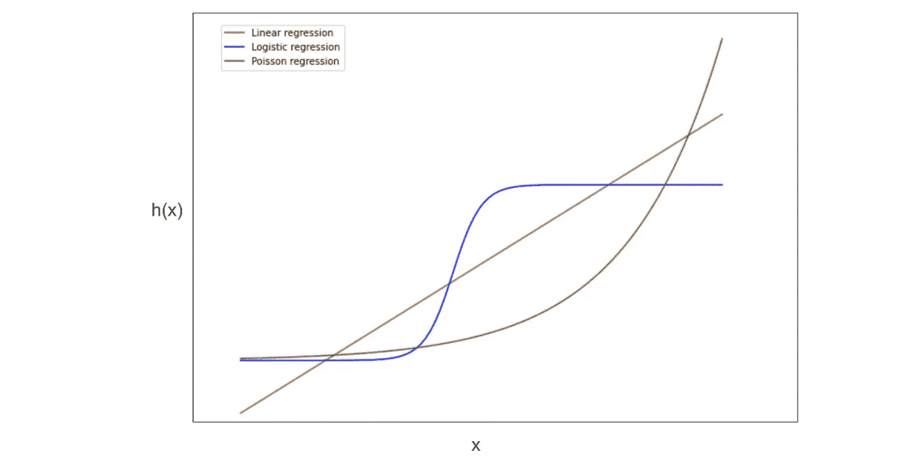

GLMs(作者图片)

广义线性模型是一组具有一些共同属性的模型。这些共同的属性是:

1.  给定输入 x，响应变量(即标签)的分布是指数分布族的一员。
2.  指数族分布的自然参数是θ(即模型参数)和输入数据的线性组合。
3.  在预测时，给定 x 的模型输出是该 x 的分布的期望值。

如果一个模型具有这三个特征，它就是广义线性模型。

在深入研究之前，本文假设您知道什么是线性回归和逻辑回归。

现在，来看看这三个特征的含义。

## I .给定 x 的响应变量的分布是指数分布族的一员。

当进行线性回归或逻辑回归时，我们假设响应变量的分布属于一个指数族。这意味着给定一组特征(x)，结果是某个值(y)。该值(y)的概率遵循指数族分布。在线性回归的情况下，我们假设给定 x 的 y 的分布是具有一些均值μ和方差σ的高斯分布。

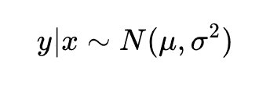

在线性回归中，响应变量 y 的分布是正态分布

正如我们马上会看到的，高斯分布是指数分布族的一部分。

如需进一步阅读，请查看我关于线性回归的[概率解释](/probabilistic-interpretation-of-linear-regression-clearly-explained-d3b9ba26823b)的文章。

 [## 线性回归的概率解释解释清楚

### 最小二乘法背后的原因

towardsdatascience.com](/probabilistic-interpretation-of-linear-regression-clearly-explained-d3b9ba26823b) 

**什么是指数分布族？**

如果分布的概率密度函数(PDF)可以写成以下形式，则该分布属于指数族:

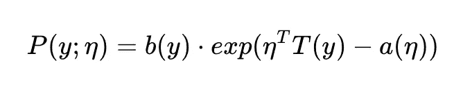

PDF 集成到 1。

在上面的 PDF 方程中，eta (η)被称为分布的自然参数。

高斯(或正态)分布属于指数族。

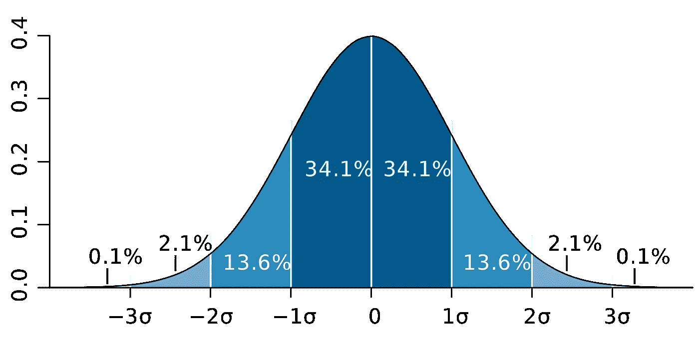

高斯分布(图片来自[维基百科](https://en.wikipedia.org/wiki/Normal_distribution#/media/File:Standard_deviation_diagram.svg))

方差为 1 的高斯分布的 PDF 为:

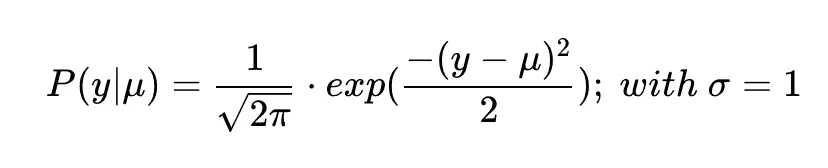

方差为 1 的高斯分布

希腊字母μ是分布的平均值。这里，μ称为分布的**正则参数**。我们将在下面看到平均值μ是如何与自然参数η相联系的。

从上面的等式，经过一些代数排列，我们得到:

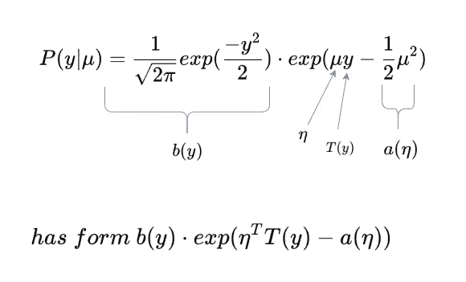

因此，高斯分布具有指数族所需的形式。

对于高斯分布，正则参数μ等于自然参数η。

伯努利分布也属于指数族。

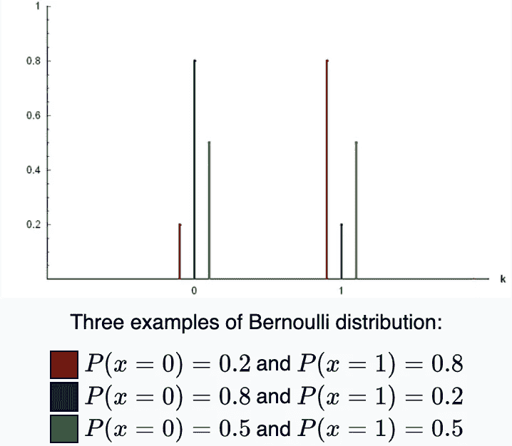

伯努利分布(图片来自[维基百科](https://en.wikipedia.org/wiki/Bernoulli_distribution)

伯努利分布的 PDF 为:

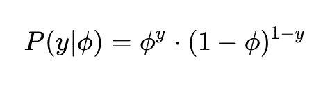

这里，正则参数φ(φ)是 y 为 1 的概率。我们现在需要把这个 PDF 写成指数族的形式:

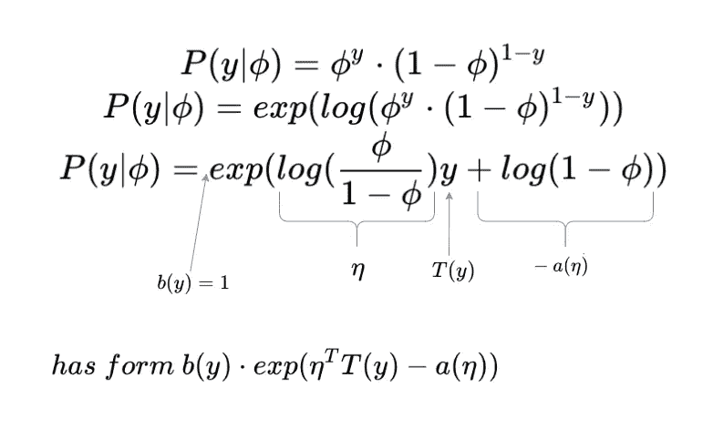

对于伯努利分布，自然参数 eta 就是所谓的“对数优势”。

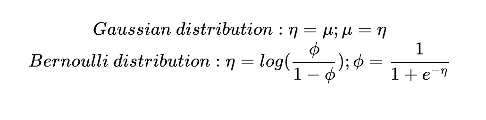

规范参数和自然参数之间的联系

自然参数可以表示为正则参数的函数。这个函数称为规范链接函数。类似地，正则参数可以表示为自然参数的函数。这个函数称为规范响应函数。我们稍后将看到自然参数和规范参数在线性和逻辑回归中的作用。

现在，看第二个属性。

## 二。指数族分布的自然参数是θ和输入数据的线性组合

这条线基本上意味着 eta 可以表示为θ乘以输入数据。

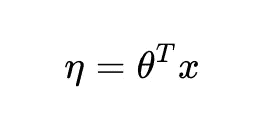

当进行线性或逻辑回归时，我们正在训练一个模型，以找到给定一组数据的“最佳”θ。

这意味着，为了使 GLM 成为一种有用的学习算法，我们希望输入数据和该数据结果分布的自然参数之间存在线性关系。

## 三。在预测时，给定 x 的模型输出是该 x 的分布的期望值

当进行线性或逻辑回归时，我们训练一个模型来预测给定数据的结果。

在线性回归的情况下，我们训练一个模型来预测给定 x 的高斯分布的平均值。高斯分布的平均值是高斯分布的期望值。因此，对于给定的 x，模型的输出是该 x 的分布的期望值。

在逻辑回归的情况下，数据点 x 的预期结果是一个概率。这个概率就是伯努利分布的期望值。

**我们可以用自然参数来求一个分布的期望值。**

在线性回归的情况下:

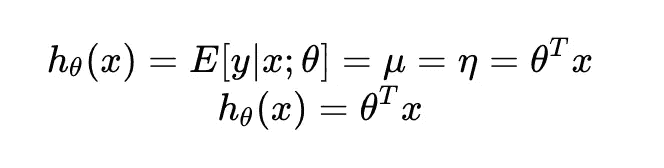

线性回归模型

在逻辑回归的情况下:

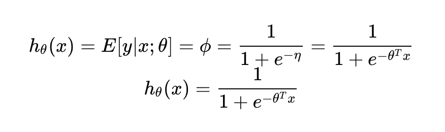

逻辑回归模型

广义线性模型就是具有上述 3 个属性的模型。“线性”部分来自于自然参数(η)是模型参数(θ)和输入数据的线性组合。

## 为什么 GLM 有用

在指数分布的家庭中有额外的好处。

1.  损失函数是凸的。换句话说，有一个全局最小值(而不是几个局部最小值)。因此，梯度下降将收敛到全局最小值。
2.  所有 glm 使用相同的公式来更新梯度下降中的θ。

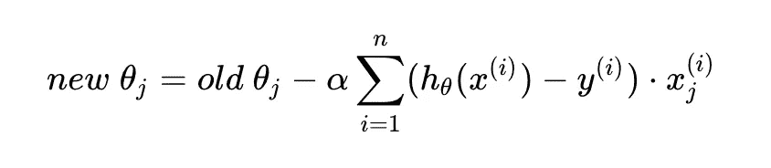

所有 glm 的梯度下降规则

只要插上右边的 h(x)就可以做梯度下降了。我们前面已经看到，h(x)是自然参数的函数，自然参数是θ乘以 x。

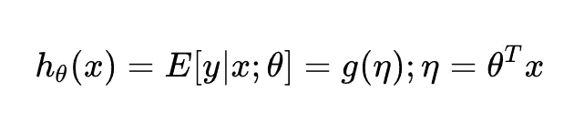

GLM 在其核心