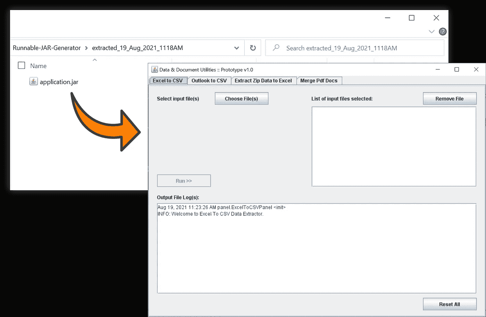

# 通过 3 个简单的步骤生成一个独立的可运行 JAR 文件(没有 Eclipse IDE、CMD/Shell 终端命令)

> 原文：<https://towardsdatascience.com/generate-a-standalone-runnable-jar-file-in-3-simple-steps-no-eclipse-ide-cmd-shell-terminal-cf87b6cf0e20?source=collection_archive---------13----------------------->

## 便携式 Java 应用程序和特定数据提取工具的理想选择

作为我上一篇关于用 Java 从 Excel 和 Outlook 文件中提取数据的文章[的后续，我分享了我在工作场所实施 Java](/extracting-data-from-excel-and-outlook-files-with-java-7979eb64edff) [内部数据提取工具](https://github.com/incubated-geek-cc/data-extraction-with-Java)时所面临的情景约束，其中❝ **40%的用户无法打开他们的 Windows CMD/Shell 终端/PowerShell 终端** ❞，因此发现用以下命令运行任何 Java 应用程序都是一个挑战:

```
java -jar <name of jar file>
```

由于使应用程序尽可能容易执行是至关重要的(理想情况下只需双击鼠标🖱️)，我想我应该分享一种从 JAR 文件生成 runnable JAR 的简单方法。这种方法既不依赖于 [Eclipse IDE](https://www.codejava.net/coding/how-to-create-executable-jar-file-with-resources-and-dependencies-using-maven-in-eclipse) 的导出功能，也不需要包装实用程序，如 [Launch-4j](http://launch4j.sourceforge.net/) 。*请注意，本文假设您的 Java 应用程序是用 GUI 构建的，并且有要打包的外部 JAR 库。*

# 简单来说，JAR 文件和可运行 JAR 之间的区别在于，JAR 文件是一个需要命令行才能运行的 Java 应用程序，而可运行 JAR 文件可以通过双击直接执行。


[达里奥·门德斯](https://unsplash.com/@dariomen?utm_source=medium&utm_medium=referral)在 [Unsplash](https://unsplash.com?utm_source=medium&utm_medium=referral) 上的照片

对于初学者来说，注意 JAR 文件本质上是另一种类型的[归档文件格式(其他更广为人知的归档文件格式有 Zip、7z、Rar 等)是很有用的。)](https://www.sysinfotools.com/blog/different-types-archive-files-format/)。考虑到这一点，在我创建的一个简单的基于 UI 的应用程序(可以在我的 [GitHub](https://github.com/incubated-geek-cc/Runnable-JAR-Generator) 上找到)中，实现了下面的 Java 代码片段:

作者代码片段|一个实用函数，用于将 JAR 文件中的目录、子目录和文件提取到外部文件夹中

作者代码片段|将应用程序 JAR 和外部 JAR 依赖项中的内容提取到一个文件夹中，并配置清单。MF 通过指定可运行 JAR 输出的目标入口点，即应用程序的主类。

**注:**完整的源代码可以在[这里](https://github.com/incubated-geek-cc/Runnable-JAR-Generator/tree/main/src/executablejargenerator)找到。请随意使用它，调整它/改进它以供您自己使用，☺

# **最后，输出可运行 JAR 的 3 个步骤如下:**


作者图片|在[应用程序上运行的 3 个步骤的图示](https://github.com/incubated-geek-cc/Runnable-JAR-Generator/blob/main/RunnableJARGenerator.jar) | **(1)** 输入 JAR 文件(通常通过 NetBeans IDE 等其他方式输出和构建)； **(2)** 正确指定主类(极其重要！); **(3)** 选择所有外部 JAR 库，这些库将被打包为最终输出可运行 JAR 中的依赖项

此后，*“创建可运行 JAR>>”*被选中，**请注意，这可能需要几分钟的时间(取决于您的应用程序的大小和您上传的外部 JAR 依赖项的数量)**。最后，当输入被成功处理以生成所需的 runnable JAR 时，用户将得到通知:


Image by Author | Runnable JAR 已经根据用户的输入成功生成。选择❛Ok❜后，应自动显示包含最终输出的文件夹。



作者图片|应用程序在标题为“extracted _*<timestamp>*”的文件夹中输出可运行的 JAR 文件。要测试 JAR 是否正确生成，继续双击，您应该能够看到您的应用程序按预期运行。

仅供参考:用于演示上述内容的示例文件位于[演示文件夹](https://github.com/incubated-geek-cc/Runnable-JAR-Generator/tree/main/demo)，而示例输出位于[extracted _ 19 _ Aug _ 2021 _ 1118am](https://github.com/incubated-geek-cc/Runnable-JAR-Generator/tree/main/extracted_19_Aug_2021_1118AM)。

# 这就对了！没有”。jar …”命令或包装类/库需要将所有依赖项与应用程序生成的类打包在一起。只需提取、合并和更新清单。MF 文件，就是这样！

# 非常感谢你的阅读，希望有人觉得这有用！❤

[](https://geek-cc.medium.com/membership) [## 通过我的推荐链接加入灵媒——李思欣·崔

### 获得李思欣·崔和其他作家在媒体上的所有帖子！😃您的会员费直接…

geek-cc.medium.com](https://geek-cc.medium.com/membership)