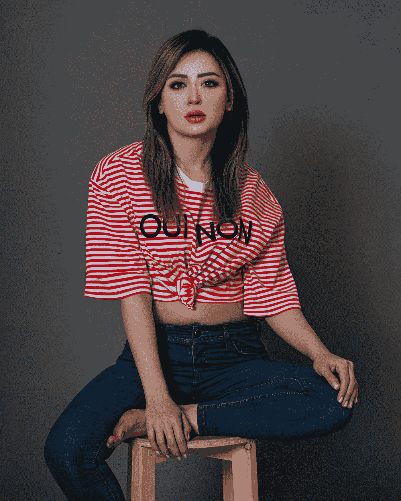
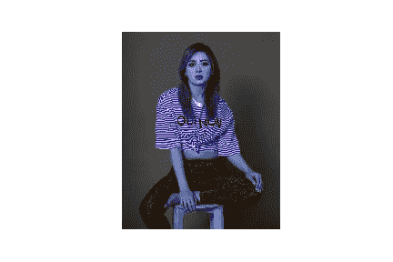
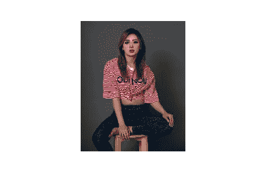
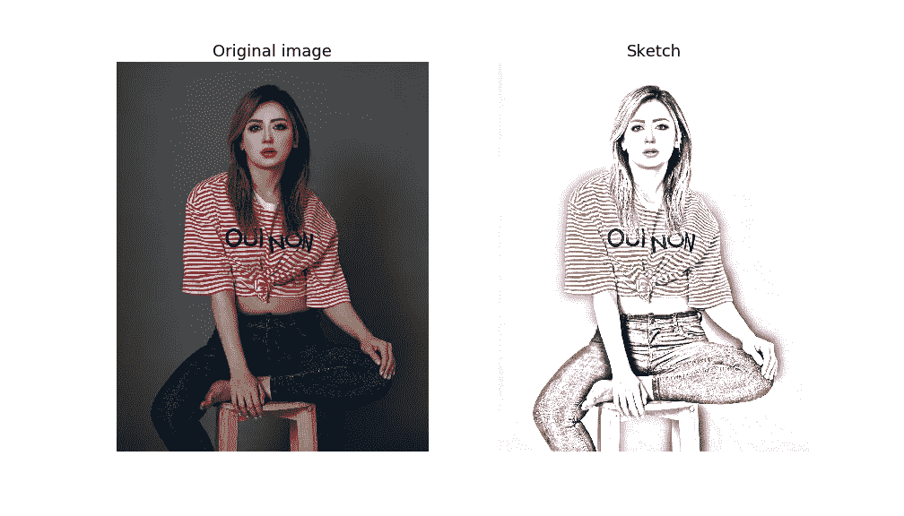
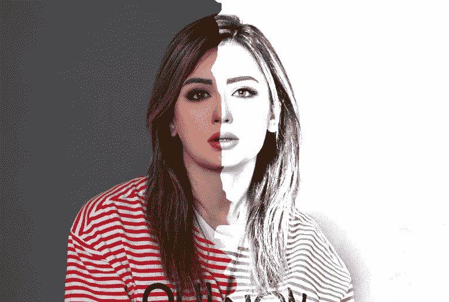

# 用 Python 从照片生成铅笔草图

> 原文：<https://towardsdatascience.com/generate-pencil-sketch-from-photo-in-python-7c56802d8acb?source=collection_archive---------2----------------------->

## 使用 OpenCV 的图像处理教程，带代码

## 导入库

[*OpenCV*](https://docs.opencv.org/master/index.html) 是项目需要的唯一库。
我们也将使用 [*matplotlib*](https://matplotlib.org/) 库进行一些可视化，这将在后面中[讨论。](#8970)

```
import cv2
import matplotlib.pyplot as plt
```

## 阅读照片

以下命令可用于使用 OpenCV 读取图像。

```
img=cv2.imread("photo.jpg")
```

该命令读取当前文件夹中的文件*photo.jpg*，并在内存中存储为 *img* 。

## 使用 OpenCV 显示图像

使用 OpenCV 显示图像不是很直接。以下命令可用于显示照片。

```
cv2.imshow(‘original image’,img)
cv2.waitKey(0)
cv2.destroyAllWindows()
```

执行此命令时，下面的照片将在一个新窗口中打开，标题为“原始图像”



[拉明卡](https://unsplash.com/@raaminka?utm_source=medium&utm_medium=referral)在 [Unsplash](https://unsplash.com?utm_source=medium&utm_medium=referral) 上拍照

# 使用 Matplotlib 显示

当每次必须显示图像时打开新窗口，并且为了进一步执行代码必须删除新窗口时，这不是很方便。为了避免这些麻烦，我们可以使用 *matplotlib* 库的 *pyplot* 模块来显示 *Jupyter* 笔记本本身中的图像。

以下命令可用于使用 matplotlib 显示 cv2 图像。

```
plt.imshow(img)
plt.axis(False)
plt.show()
```



Matplotlib 的输出

## Matplotlib 与 OpenCV

我们可以观察到使用 matplotlib 显示的图像与原始图像不一致。这是因为 OpenCV 使用 BGR 配色方案，而 matplotlib 使用 RGB 配色方案。我们可以使用以下任何一种方法将 BGR 图像转换成 RGB。

## 将 BGR 转换为 RGB:方法 1

```
plt.imshow(img[:,:,::-1])
plt.axis(False)
plt.show()
```



matplotlib 的输出

## 将 BGR 转换为 RGB:方法 1

使用 *OpenCV* 的 *cvtColor* 方法。

```
RGB_img = cv2.cvtColor(img, cv2.COLOR_BGR2RGB)
plt.imshow(RGB_img)
plt.axis(False)
plt.show()
```


matplotlib 的输出

# 将图像转换为铅笔草图

将照片转换为铅笔草图包括以下步骤:

## 步骤 1:转换为灰色图像

使用 OpenCV 的 cvtColor 函数。

```
grey_img=cv2.cvtColor(img, cv2.COLOR_BGR2GRAY)
```

## 步骤 2:反转图像

可以通过以下两种方法之一反转图像

```
invert_img=cv2.bitwise_not(grey_img)
#invert_img=255-grey_img
```

## 第三步:模糊图像

对图像应用*高斯模糊*。函数的第二个参数是内核大小，如果应该是一对奇数。
内核越大，图像越模糊，会失去其细微的特征。
为了创建草图，我们只需要图像中的突出特征(对比边缘)。
对于小图像，*内核大小*(3，3)，(5，5)等。就足够了，而对于较大的图像，较小的内核大小不会产生任何影响。
可以通过试错法选择合适的内核大小。

```
blur_img=cv2.GaussianBlur(invert_img, (111,111),0)
```

## 步骤 4:反转模糊图像

重复步骤 2

```
invblur_img=cv2.bitwise_not(blur_img)
#invblur_img=255-blur_img
```

## 第五步:素描

可以通过在灰度图像和反模糊图像之间执行逐位分割来获得草图。

```
sketch_img=cv2.divide(grey_img,invblur_img, scale=256.0)
```

详细解释逐位划分超出了本文的范围。
你可以在这里获得[更多关于图像算法的信息。](http://Refer this page for more information on image arithmetic.)

## 步骤 6:保存草图

```
 cv2.imwrite(‘sketch.png’, sketch_img)
```

## 步骤 7:显示草图

```
cv2.imshow(‘sketch image’,sketch_img)
cv2.waitKey(0)
cv2.destroyAllWindows()
```

## 原始图像与草图

我们可以把原图和草图并排展示出来进行对比。

```
plt.figure(figsize=(14,8))plt.subplot(1,2,1)
plt.title('Original image', size=18)
plt.imshow(RGB_img)
plt.axis('off')plt.subplot(1,2,2)
plt.title('Sketch', size=18)
rgb_sketch=cv2.cvtColor(sketch_img, cv2.COLOR_BGR2RGB)
plt.imshow(rgb_sketch)
plt.axis('off')
plt.show()
```



原始图像与生成的草图

# 创建草图功能

我们可以将所有东西放在一起创建一个草图功能:

来自 GitHub Gist 的 img2sketch 功能代码

## 资源:

本教程的代码可以从我的 [GitHub Repo](https://github.com/hashABCD/Publications/tree/main/Medium/imagetr_opencv) 中获得。

如果你喜欢视频格式的内容，你可以看看这个 YouTube 教程。

如何从照片生成草图的视频教程

## 成为会员

我希望你喜欢这篇文章，我强烈推荐 [**注册*中级会员***](https://abhijithchandradas.medium.com/membership) 来阅读更多我写的文章或成千上万其他作者写的各种主题的故事。
[你的会员费直接支持我和你看的其他作家。你也可以在媒体](https://abhijithchandradas.medium.com/membership)上看到所有的故事。

## 相关文章:

[](/create-and-read-qr-code-using-python-9fc73376a8f9) [## 使用 Python 创建和读取二维码

### 如何使用 python 制作和读取二维码的简单分步指南

towardsdatascience.com](/create-and-read-qr-code-using-python-9fc73376a8f9) 

由 [Raamin ka](https://unsplash.com/@raaminka?utm_source=medium&utm_medium=referral) 在 [Unsplash](https://unsplash.com?utm_source=medium&utm_medium=referral) 上拍摄的原始照片以及计算机生成的草图