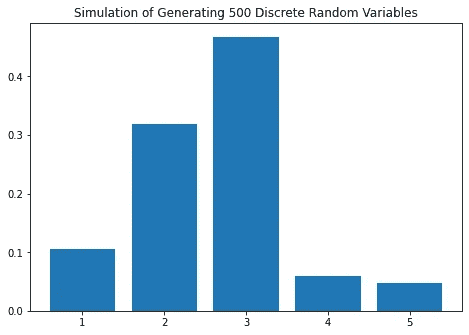

# 用 Python 中的逆变换方法生成随机变量

> 原文：<https://towardsdatascience.com/generate-random-variable-using-inverse-transform-method-in-python-8e5392f170a3?source=collection_archive---------7----------------------->


由 [Unsplash](https://unsplash.com?utm_source=medium&utm_medium=referral) 上的 [Edge2Edge 媒体](https://unsplash.com/@edge2edgemedia?utm_source=medium&utm_medium=referral)拍摄

## “从均匀到任何随机变量”，这是个神奇的词。

**动机**

在仿真理论中，生成随机变量成为最重要的“积木块”之一，其中这些随机变量大多是由均匀分布的随机变量生成的。可以用来产生随机变量的方法之一是逆变换方法。在本文中，我将向您展示如何使用 Python 中的**逆变换**方法生成随机变量(离散和连续的情况)。

**概念**

给定随机变量 U 其中 U 均匀分布在(0，1)中。假设我们想要生成随机变量 X，其中累积分布函数(CDF)为


逆变换方法的思想是通过使用其逆 CDF 从任何概率分布生成随机数，如下所示。


**对于离散型随机变量，步骤略有不同。**假设我们想要生成一个离散随机变量 X 的值，该变量具有一个概率质量函数(PMF)


要生成 X 的值，生成一个随机变量 U，其中 U 均匀分布在(0，1)中，并设置


根据上面的步骤，我们可以创建如下的逆变换方法的算法。


逆变换方法的算法(图片由作者提供)

**实施:连续 r.v .案例**

首先，我们实现了这种生成连续随机变量的方法。假设我们要模拟一个服从均值为λ的指数分布的随机变量 X(即 X~EXP(λ))。我们知道指数分布的概率分布函数是


CDF 如下所示。


然后，我们可以把逆向 CDF 写成如下。


在 Python 中，我们可以通过编写如下代码来简单地实现它。

```
### Generate exponential distributed random variables given the mean 
### and number of random variables
def exponential_inverse_trans(n=1,mean=1):
    U=uniform.rvs(size=n)
    X=-mean*np.log(1-U)
    actual=expon.rvs(size=n,scale=mean)

    plt.figure(figsize=(12,9))
    plt.hist(X, bins=50, alpha=0.5, label="Generated r.v.")
    plt.hist(actual, bins=50, alpha=0.5, label="Actual r.v.")
    plt.title("Generated vs Actual %i Exponential Random Variables" %n)
    plt.legend()
    plt.show()
    return X
```

我们可以通过运行下面的一些例子来尝试上面的代码。**请注意，由于我们要生成随机变量，结果可能会有所不同。**

```
cont_example1=exponential_inverse_trans(n=100,mean=4)
cont_example2=exponential_inverse_trans(n=500,mean=4)
cont_example3=exponential_inverse_trans(n=1000,mean=4)
```


生成的与实际的 100 个指数随机变量(图片由作者提供)


生成的与实际的 500 个指数随机变量(图片由作者提供)


生成的与实际的 1000 个指数随机变量(图片由作者提供)

看起来很有趣。我们可以看到，产生的随机变量有一个非常相似的结果，如果我们比较它与实际的。你可以调整均值(**请注意，我为 expon.rvs()函数定义的均值是指数分布**中的一个比例参数和/或生成的随机变量的数量，以查看不同的结果。

**执行:离散 r.v .案**

对于离散随机变量情况，假设我们想要模拟一个离散随机变量情况 X，它遵循以下分布


用于示例的离散随机变量分布的 PMF(图片由作者提供)

首先，我们用这几行代码编写函数，为一个样本生成离散随机变量。

```
### Generate arbitary discrete distributed random variables given 
### the probability vector
def discrete_inverse_trans(prob_vec):
    U=uniform.rvs(size=1)
    if U<=prob_vec[0]:
        return 1
    else:
        for i in range(1,len(prob_vec)+1):
            if sum(prob_vec[0:i])<U and sum(prob_vec[0:i+1])>U:
                return i+1
```

然后，我们用这些代码行创建一个函数来生成许多随机变量样本。

```
def discrete_samples(prob_vec,n=1):
    sample=[]
    for i in range(0,n):
        sample.append(discrete_inverse_trans(prob_vec))
    return np.array(sample)
```

最后，我们通过这几行代码创建一个函数来模拟结果，并与实际结果进行比较。

```
def discrete_simulate(prob_vec,numbers,n=1):
    sample_disc=discrete_samples(prob_vec,n)
    unique, counts=np.unique(sample_disc,return_counts=True)

    fig=plt.figure()
    ax=fig.add_axes([0,0,1,1])
    prob=counts/n
    ax.bar(numbers,prob)
    ax.set_title("Simulation of Generating %i Discrete Random Variables" %n)
    plt.show()

    data={'X':unique,'Number of samples':counts,'Empirical Probability':prob,'Actual Probability':prob_vec}
    df=pd.DataFrame(data=data)
    return df
```

我们可以运行下面的一些例子来看看结果。**同样，注意结果可能会不同，因为我们想要生成随机变量。**

```
prob_vec=np.array([0.1,0.3,0.5,0.05,0.05])
numbers=np.array([1,2,3,4,5])dis_example1=discrete_simulate(prob_vec, numbers, n=100)
dis_example2=discrete_simulate(prob_vec, numbers, n=500)
dis_example3=discrete_simulate(prob_vec, numbers, n=1000)
```


生成的与实际的 100 个离散随机变量(图片由作者提供)



生成的与实际的 500 个离散随机变量(图片由作者提供)


生成的与实际的 1000 个离散随机变量(图片由作者提供)

```
In[11]: dis_example1
Out[11]: 
   X  Number of samples  Empirical Probability  Actual Probability
0  1                  8                   0.08                0.10
1  2                 35                   0.35                0.30
2  3                 50                   0.50                0.50
3  4                  5                   0.05                0.05
4  5                  2                   0.02                0.05In[12]: dis_example2
Out[12]: 
   X  Number of samples  Empirical Probability  Actual Probability
0  1                 53                  0.106                0.10
1  2                159                  0.318                0.30
2  3                234                  0.468                0.50
3  4                 30                  0.060                0.05
4  5                 24                  0.048                0.05In[13]: dis_example3
Out[13]: 
   X  Number of samples  Empirical Probability  Actual Probability
0  1                108                  0.108                0.10
1  2                290                  0.290                0.30
2  3                491                  0.491                0.50
3  4                 51                  0.051                0.05
4  5                 60                  0.060                0.05
```

结果有意思！我们可以看到，随着随机变量样本数量的增加，经验概率越来越接近实际概率。尝试使用不同数量的样本和/或不同的分布进行实验，以查看不同的结果。

**结论**

就是这样！这种逆变换方法是统计学中非常重要的工具，特别是在模拟理论中，我们希望在给定均匀分布在(0，1)中的随机变量的情况下生成随机变量。研究案例本身非常广泛，从生成经验 CDF 到预测分析，您都可以使用这种方法。

下期帖子再见！

**作者联系方式**

领英:[拉登·奥勒留和希卡·维亚迪努格罗霍](https://www.linkedin.com/in/raden-aurelius-andhika-viadinugroho-b84b19163/)

**参考文献**

[1]谢尔登·m·罗斯，[模拟，第 5 版](https://www.sciencedirect.com/book/9780124158252/simulation) (2013)，爱思唯尔

[2]谢尔登·m·罗斯，[工程师和科学家概率统计导论，第 5 版](https://www.sciencedirect.com/book/9780123948113/introduction-to-probability-and-statistics-for-engineers-and-scientists) (2014)，爱思唯尔

[3][https://Stephens 999 . github . io/five minute stats/Inverse _ transform _ sampling . html #:~:text = Inverse % 20 transform % 20 sampling % 20 is % 20a，P(X%E2%89%A4x)。](https://stephens999.github.io/fiveMinuteStats/inverse_transform_sampling.html#:~:text=Inverse%20transform%20sampling%20is%20a,P(X%E2%89%A4x).)