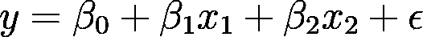
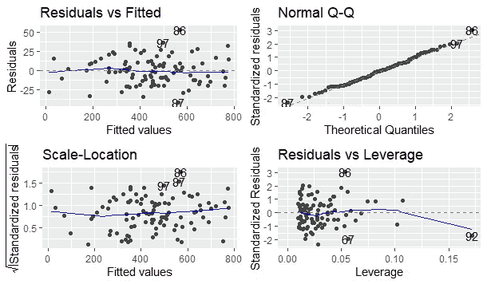
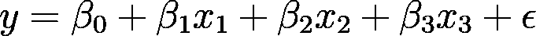
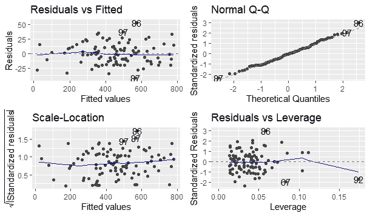
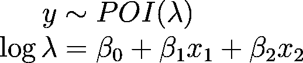
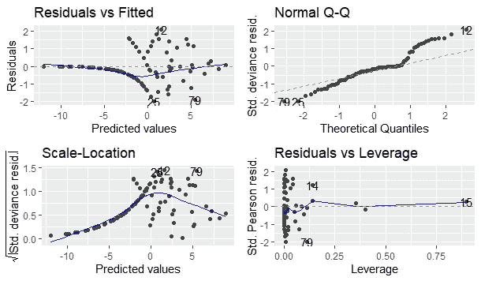

# 为 R 中的线性模型生成模拟数据集

> 原文：<https://towardsdatascience.com/generate-simulated-dataset-for-linear-model-in-r-469a5e2f4c2e?source=collection_archive---------5----------------------->


由 [CHUTTERSNAP](https://unsplash.com/@chuttersnap?utm_source=medium&utm_medium=referral) 在 [Unsplash](https://unsplash.com?utm_source=medium&utm_medium=referral) 上拍摄的照片

## 当真实数据集很难找到时，模拟一下。

## 动机

近年来，随着计算能力的增加，关于机器学习(ML)的研究也在增加。因此，在一些 ML 模型中有了很大的发展——如果不是发明一个新的模型的话——表现得比传统模型更好。

研究人员在尝试实现所提出的模型时通常会遇到的一个主要问题是缺乏符合模型假设的正确的真实世界数据集。或者在另一种情况下，真实世界的数据集是存在的，但是数据集本身非常昂贵并且难以收集。

为了克服这些问题，研究人员通常会生成一个遵循模型假设的模拟数据集。该模拟数据集可用作建模过程中模型或真实数据集替换的基准，其中模拟数据集比真实数据集更具成本效益。本文将解释如何使用 r 为线性模型生成模拟数据集。

## 这个概念

生成模拟数据集的过程可以解释如下。首先，我们指定想要模拟的模型。接下来，我们确定每个自变量的系数，然后模拟遵循概率分布的自变量和误差。最后，根据模拟的自变量(及其预定系数)和误差计算因变量。

为了在实践中更好地理解这个过程，这里我将给出一些使用 r 为线性模型生成模拟数据集的实现。

## 实施:线性回归

对于第一个示例，假设我们想要模拟以下线性回归模型



其中 x_1 遵循均值为 50、方差为 9 的正态分布，x_2 遵循均值为 200、方差为 64 的正态分布，误差遵循均值为 0、方差为 16 的正态分布。也假设 b0、b1 和 b2 分别是 150、-4 和 2.5。我们可以通过编写如下代码来模拟它**(注意不同的种子，结果可能不同)**。

```
> summary(m1)Call:
lm(formula = y1 ~ x1 + x2)Residuals:
    Min      1Q  Median      3Q     Max 
-41.782 -12.913  -0.179  10.802  53.316Coefficients:
             Estimate Std. Error t value Pr(>|t|)    
(Intercept) 154.23621   10.71954   14.39   <2e-16 ***
x1           -3.98515    0.19636  -20.30   <2e-16 ***
x2            2.47327    0.02714   91.14   <2e-16 ***
---
Signif. codes:  0 ‘***’ 0.001 ‘**’ 0.01 ‘*’ 0.05 ‘.’ 0.1 ‘ ’ 1Residual standard error: 17.96 on 97 degrees of freedom
Multiple R-squared:  0.9885, Adjusted R-squared:  0.9883 
F-statistic:  4179 on 2 and 97 DF,  p-value: < 2.2e-16
```



使用模拟数据集对第一个示例模型进行诊断检查(图片由作者提供)

从模型`m1`可以看出，模型是显著的(基于总体检验的 p 值)，每个自变量(x1 和 x2)和常数都是显著的(基于每个变量中的 p 值)。我们还可以看到，估计的系数非常接近每个系数的预定值。

## 实施:带分类自变量的线性回归

现在，对于第二个示例，假设我们想要模拟以下线性回归模型



其中 x_1 和 x_2(及其系数)、error 和 b0 与第一个示例相同，但 x_3 是一个二进制分类变量，遵循二项式分布，成功概率(在 R 中表示为 1)为 0.7，b3 为 5。使用与之前相同的种子，我们可以通过编写如下代码行来模拟它。

```
> summary(m2)Call:
lm(formula = y2 ~ x1 + x2 + x3)Residuals:
    Min      1Q  Median      3Q     Max 
-41.914 -12.804  -0.065  10.671  53.178Coefficients:
             Estimate Std. Error t value Pr(>|t|)    
(Intercept) 153.84275   11.32094  13.589   <2e-16 ***
x1           -3.98432    0.19751 -20.173   <2e-16 ***
x2            2.47330    0.02728  90.671   <2e-16 ***
x3            5.46641    4.11890   1.327    0.188    
---
Signif. codes:  0 ‘***’ 0.001 ‘**’ 0.01 ‘*’ 0.05 ‘.’ 0.1 ‘ ’ 1Residual standard error: 18.05 on 96 degrees of freedom
Multiple R-squared:  0.9885, Adjusted R-squared:  0.9882 
F-statistic:  2758 on 3 and 96 DF,  p-value: < 2.2e-16
```



从模型`m2`可以看出，模型是显著的，每个自变量(除了 x_3)和常数都是显著的(基于每个变量中的 p 值)。

## 实施:计数回归

对于最后一个例子，假设我们想要模拟下面的计数线性模型(具体来说是泊松回归模型)



其中 x_1 服从均值为 2、方差为 1 的正态分布，x_2 服从均值为 1、方差为 1 的正态分布，b0、b1、b2 分别为 5、-4、2.5。与前两个示例的不同之处在于，我们需要首先使用上面的等式计算λ的对数，并对其求幂以计算因变量。我们可以通过编写如下代码来模拟它。

```
> summary(m3)Call:
glm(formula = y3 ~ x1 + x2, family = poisson(link = "log"))Deviance Residuals: 
     Min        1Q    Median        3Q       Max  
-1.99481  -0.58807  -0.14819   0.00079   2.08933Coefficients:
            Estimate Std. Error z value Pr(>|z|)    
(Intercept)  5.02212    0.03389   148.2   <2e-16 ***
x1          -3.96326    0.02871  -138.0   <2e-16 ***
x2           2.48380    0.02950    84.2   <2e-16 ***
---
Signif. codes:  0 ‘***’ 0.001 ‘**’ 0.01 ‘*’ 0.05 ‘.’ 0.1 ‘ ’ 1(Dispersion parameter for poisson family taken to be 1)Null deviance: 90503.729  on 99  degrees of freedom
Residual deviance:    69.329  on 97  degrees of freedom
AIC: 283.21Number of Fisher Scoring iterations: 4
```



从模型`m3`中，我们可以看到变量和模型常数是重要的，并且我们可以看到估计的系数与每个系数的预定值相比也非常接近。

## 结论

就是这样！您已经学习了如何在 r 中为线性模型生成模拟数据集。本文中的示例只是如何进行模拟数据集生成过程的一些简单实现。在实际应用中，您可以生成更复杂的模拟数据集，并将其用于一些具有交互效果的线性模型或一些高级 ML 模型。

像往常一样，如果您有任何问题，请随时提问和/或讨论！我的下一篇文章再见！

## 作者的联系人

领英:[拉登·奥勒留和希卡·维亚迪努格罗霍](https://www.linkedin.com/in/raden-aurelius-andhika-viadinugroho-b84b19163/)

中:【https://medium.com/@radenaurelius】T4

## 参考

[1]s . m .罗斯(2013 年)。 [*模拟，第 5 版*](https://www.sciencedirect.com/book/9780124158252/simulation) 。爱思唯尔。

[2][https://book down . org/rd Peng/rprogdatascience/simulation . html # simulating-a-linear-model](https://bookdown.org/rdpeng/rprogdatascience/simulation.html#simulating-a-linear-model)

[3]巴拉尔迪，p .，曼吉利，f .，和齐奥，E. (2013 年)。[使用模拟数据调查基于模型和数据驱动的预测方法的不确定性处理能力](https://www.sciencedirect.com/science/article/pii/S0951832012002591?casa_token=VIZMOmD3vBwAAAAA:miZcBKZp_5HIzzVw1UcVQfsbrgvWv59piCov8XtcrtGgA-TMdcYfVI9tab0ioZ3PexsflwXY)。*可靠性工程&系统安全*，第 112 卷，第 94–108 页。

[4]奥尔蒂斯-巴里奥斯，硕士，伦德斯特伦，法官，辛诺特，法官，热尔佩和圣安娜(2020 年)。[用模拟数据补充真实数据集:基于回归的方法](https://link.springer.com/article/10.1007/s11042-019-08368-5)。*多媒体工具和应用*，第 79 卷，第 34301–34324 页。