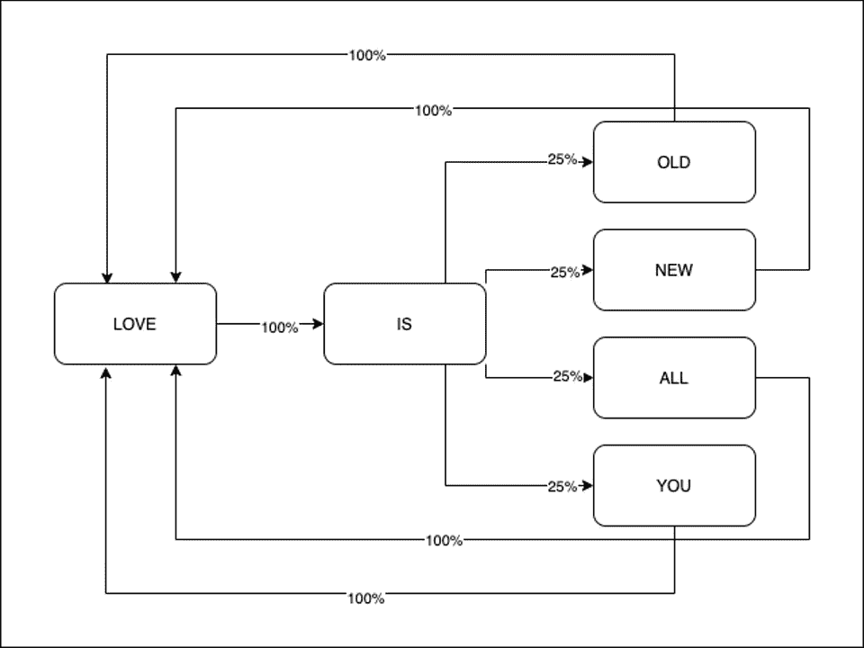
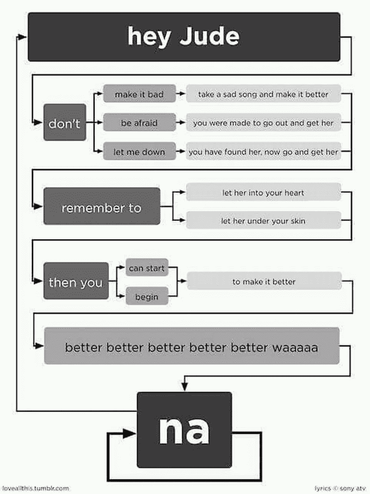

# 使用马尔可夫链生成披头士歌词

> 原文：<https://towardsdatascience.com/generate-unedited-beatles-lyrics-using-markov-chain-b7968c49584f?source=collection_archive---------26----------------------->

[费多尔](https://unsplash.com/@fmdevice)在 [Unsplash](https://unsplash.com) 上拍照

我非常喜欢披头士。我希望他们写更多的歌词…但是等等，我是一个程序员，我可以根据他们的唱片目录生成新的歌词！让我们看看怎么做。

*🎤昨天……我所有的烦恼都显得那么遥远。*

哦，等等，这是一篇文章，你听不到我唱歌！(幸好😄)

我们将创建一个程序，将许多歌词作为输入，并在每次执行时产生一个新的歌词。

非常熟练的数据科学家和程序员最终会用 **TensorFlow** 或类似的东西创建一个**AI**…但是我们想让它变得简单！我们将使用一种叫做**马尔可夫链**的算法。

# 为什么使用马尔可夫链算法？

很高兴你问了！
维基百科将**马尔可夫链**描述为:

*“描述一系列可能事件的随机模型，其中每个事件的概率仅取决于前一事件达到的状态”*

寥寥数语，让我们来看看以下披头士的歌词:

*“爱是古老的；爱是新的，爱是一切，爱是你。*

让我们把上面的句子分解成单词。

现在回答以下问题:

1.  “爱”这个词在上面的句子中重复了多少次？
2.  哪些词紧挨着“爱”这个词？
3.  “是”这个词重复了多少次？
4.  哪些词紧挨着“是”这个词？

在我们回答了这些问题之后，我们可以清楚地想象下面的图表:

因此，根据上面的图表，我们可以知道:

1.  在“爱”这个词之后，有 100%的可能性会遇到“是”这个词
2.  在单词“是”之后，有 25%的可能性会遇到下列单词之一:“旧的”、“新的”、“所有的”、“你”

现在，想象对一首更复杂的歌曲做同样的研究，比如 **Hey Jude** :

*“嘿，裘德，不要让它变坏
唱一首悲伤的歌，让它变好
记得让她进入你的心里
然后你就可以开始让它变好*

嘿，裘德，不要害怕从你让她进入你的皮肤的那一刻起，你就被迫走出去得到她

*无论何时你感到痛苦
嘿，裘德，不要把世界扛在肩上* 

因为你知道，通过让自己的世界变得更冷来装酷的人是傻瓜

*娜娜娜娜……*

*嘿，裘德，不要让我失望
她已经找到你，现在去得到她
记得让她进入你的心
然后你可以开始让它变得更好*

*尽情释放，尽情投入
嘿，裘德，开始
你在等人和你一起表演
难道你不知道只有你自己
嘿，裘德，你会做
你需要的动作就在你的肩膀上
啦，啦，啦，啦……*

*嘿，裘德，不要让它变坏
选一首悲伤的歌，让它变得更好
一旦你让她进入你的心
那么你就可以开始让它变得更好*

*娜娜娜……”*

一位 Reddit 用户贴了一张关于这首歌的有趣的流程图，这将节省我很多工作:

[Reddit](https://www.reddit.com/r/ProgrammerHumor/comments/f27xpu/flowchart_hey_jude/) 上的流程图“嘿，裘德”

你能看到我要去哪里吗？我们想要估计每个单词出现在另一个单词旁边的概率。给定这个值，我们将能够根据一个给定单词在另一个给定单词之后出现的概率来组成新的句子。

# 构建马尔可夫链

我们将在**类型脚本**中构建马尔可夫链，以便在编译阶段之后在我们的浏览器中运行。

如果您不习惯 TypeScript 语法，不要担心！理解起来会毫不费力。

我们将从定义马尔可夫链接口开始:

我们的类将有三个公共方法:

1.  `add`:它会让我们给自己的模型添加越来越多的歌词。
2.  `train`:它会训练我们的模型。一个模型基本上是一个对象，它保存了一个给定单词和它旁边的所有单词之间的所有关系。
3.  `generate`:它会根据我们的模型返回给定长度的新歌词。

现在我们可以开始构建我们的`MarkovChain`类了:

如你所见，在我们的类中，我们还想指定两个私有变量。

第一个是`data`。它会将我们添加的所有歌词存储为一个唯一的字符串。

第二个是`model`。这个对象应该是这样的:

(如果你想知道为什么`'new'`要加引号，那是因为它是 JS 中的保留关键字)。

正如您可能已经猜到的那样，`model`存储了`data`中的每个单词，以及它们后面的所有单词。

让我们开始实现`add`方法:

通过这种方法，我们希望将输入字符串附加到`data`变量上。请注意，我们还在`txt`变量后添加了一个空格，以连接给定歌词的最后一个词和下一个词的第一个词。

现在继续使用`train`方法。
首先，我们要确保在开始培训之前已经插入了一些数据。然后，我们想从我们的`data`中删除所有的特殊字符(不包括单引号)。

这样，下面的输入字符串:`'hey there! I\'m trying the Markov Chain for the first time!!!'`将被转换成:`['hey', 'there', 'i\'m', 'trying', 'the', 'markov', 'chain', 'for', 'the', 'first', 'time']`。

现在我们要训练我们的模型，所以我们基本上要循环每个令牌。如果给定的令牌在我们的模型中还不存在，我们将添加它(并添加一个空数组作为值)。否则，我们将把下一个令牌作为一个值放入当前模型数组中。

厉害！现在我们可以训练我们的模型了。
现在我们需要添加`generate`方法。

我们还将添加一个名为`getRandomElement`的私有 helper 函数，它将从给定的数组中返回一个随机元素。

如您所见，这些方法非常简单。
首先，我们要检查用户是否已经对模型进行了训练。
之后，我们开始从模型中获取一个随机单词。
然后我们想要循环`x`次，其中`x`是我们想要创建的最终歌词的长度。

在每一个循环中，我们都希望得到前面实例化的`newWord`变量旁边的一个单词。

然后，我们将这个单词连接到`result`字符串。然后我们要检查这个词在我们的模型中是否有它自己的后继词。
如果是，我们用后继者重新实例化`randomWord`变量；否则，我们随机取一个新词。

一旦循环结束，我们返回结果字符串，就这样！

下面是完整的实现:

# 玩我们的新玩具

现在我们的类已经准备好了，我们可以如下使用它:

你也可以从 [GitHub](https://github.com/Hackdoor-io/articles-codebase/tree/master/articles/generate-inedited-beatles-lyrics-using-markov-chains) 下载代码！
尽情享受！