# 用 Python 生成你想要的任何东西

> 原文：<https://towardsdatascience.com/generate-whatever-you-want-in-python-3db8dea7bdd4?source=collection_archive---------24----------------------->


照片由 [Pixabay](https://pixabay.com/photos/tulips-flowers-tulip-field-5097405/) 上的[迈克尔 _ 卢嫩](https://pixabay.com/users/michael_luenen-2998623/)拍摄

## 随机库—从基础到高级

无论您使用 Python 做什么，您都可能需要生成一些随机数据，比如数字和字符串。如果您是数据科学家或数据分析师，这一点尤为重要。事实上，不仅是随机的，而且是我们想要的特定形状。

在本文中，我将重点介绍 Python 内置库——random。等等，不要不扫描就关闭这一页。我知道你们大多数人都知道如何使用随机图书馆。但是，我几乎保证，会有你可能不知道的高级。它们有时会非常方便和有用。

本文将从三个方面介绍随机库的主要特性——随机整数、随机选择和从某些发行版中随机选择。此外，本文中的所有代码都基于随机库中的所有函数都已被导入，如下所示。

```
from random import *
```

# 随机整数


图片由 [adriano7492](https://pixabay.com/users/adriano7492-6485549/) 在 [Pixabay](https://pixabay.com/photos/dice-game-role-playing-game-2788986/) 上拍摄

## 基本用法

随机库最常见的用法肯定是生成随机整数。我们可以很容易地在如下范围内生成一个随机整数。

```
randint(start, end)
```

“开始”和“结束”的数字都包括在内。我们可以通过如下循环 10 次来测试这个函数。

```
[randint(1, 3) for i in range(10)]
```

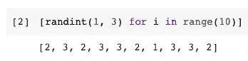

上面的代码从范围[1，3]中生成了 10 个整数。这是`randint()`的基本用法。

## 使用步长从范围生成

大多数开发人员似乎不会过多地使用函数`randrange()`。这里有一个要解决的样本问题。

> 生成 20 个介于 1 和 9 之间的奇数。

你会怎么做？或许生成一个包含所有可能数字的列表，然后随机选择？嗯，这是可行的，但肯定有更好的方法来做到这一点。那就是使用`randrange()`功能。

我很确定你会知道如何使用`range()`函数，这是 Python 中的内置函数之一。我刚刚在 for 循环中用它作为计数器。如果我们想用它来生成一个奇数列表，我们可以这样做。

```
range(1, 10, 2)
```

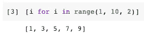

这只是一个例子，因为功能`range()`和`randrange()`的用法和参数完全相同。因此，要解决我们在本节开始时遇到的问题，我们可以执行以下操作。

```
[randrange(1, 10, 2) for i in range(20)]
```

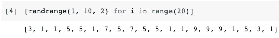

# 随机选择


由 [Pixabay](https://pixabay.com/photos/girl-crossroads-choice-way-2573111/) 上的[pix source](https://pixabay.com/users/pixource-3867243/)拍摄的照片

## 基本用法

随机选择是随机库中另一个基本而重要的功能。我们用它从列表中随机选择一个项目。例如，我们有如下列表。

```
my_list = ['a', 'b', 'c']
```

要从中随机选择一个项目，只需调用`choice()`函数。

```
choice(my_list)
```

如果我们想这样做 10 次，当然，只要循环它。

```
[choice(my_list) for i in range(10)]
```

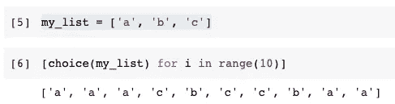

然而，最佳实践是使用`choices()`函数。注意它是复数。通过传递参数“k”，我们不必重新发明轮子。

```
choices(my_list, k=10)
```

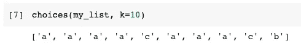

## 带权重的随机选择

如果我们想做一些有偏见的选择呢？这有时是必要的。使用`choices()`函数，我们可以通过`weights`参数很容易地做到这一点。

```
choices(my_list, weights=[1, 0, 0], k=10)
```

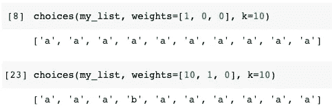

请注意，“权重”必须是一个与“我的列表”长度完全相同的列表。

在第一个例子中，我将项目“a”的权重设置为 1，而其他两个项目的权重都为 0。因此，“b”项和“c”项根本没有机会被选中。

在第二个例子中，我给项目“a”的权重为 10，“b”的权重为 1，“c”的权重为 0。所以“a”比“b”有 10 倍的机会被选中，而“c”没有机会。老实说，我不得不多次随机选择，以得到一个包含 10 个包含“b”的条目的列表

## 打乱名单

随机库还有另一个有用的特性。考虑以下两个问题

> 1.我们有一个按一定顺序排列的集合，但我们不希望它被排序。
> 2。我们想在“我的列表”上随机选择 3 次，但不想要重复的值。

以上两个问题，我们其实都需要洗牌。随机库中的`shuffle()`函数可以打乱列表。

```
shuffle(my_list)
```

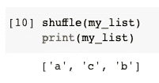

## 列表中的样本

然后，考虑上一节的第二个问题。我们想在“我的列表”上执行几次随机选择(小于它的长度)。我们仍然不希望有任何重复的值。

这相当于使用“my_list”作为人口，并对其进行随机抽样。随机库中有一个函数`sample()`可以帮我们做到这一点。

```
sample(my_list, k=2)
```

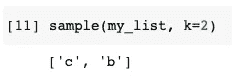

因此，在上面的代码中，我们从原始列表中抽取了 2 个项目。

# 具有特定分布的随机


[6689062](https://pixabay.com/users/6689062-6689062/) 在 [Pixabay](https://pixabay.com/photos/financial-analytics-blur-business-2860753/) 上拍摄的照片

现在，让我们做一些更高级和定制的随机数生成。为了测量我们生成的数字的分布，让我导入 Matplotlib 来绘制直方图中生成的数字。

让我们首先使用基本函数`random()`在一个列表中生成 10000 个数字。请注意，该函数将生成一个介于 0 和 1 之间的浮点数。

```
r1 = [random() for i in range(10000)]
```

然后，让我们画出数字。

```
plt.hist(r1, bins=20)
plt.show()
```

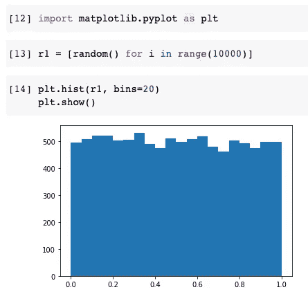

我们可以看到直方图显示这些数字分布非常均匀。这是默认设置。事实上，要显式生成均匀分布形状的数字，我们可以使用`uniform()`函数。

```
r2 = [uniform(1,100) for i in range(10000)]plt.hist(r2, bins=20)
plt.show()
```

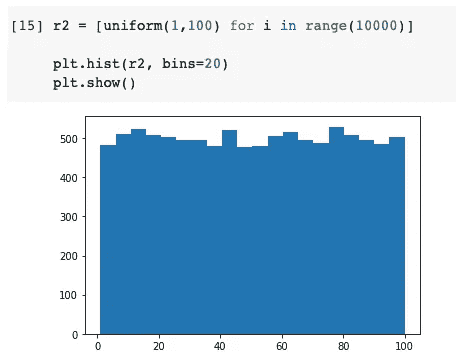

上面的代码生成了 10，000 个 1 到 100 之间的均匀分布的浮点数。

还有什么？每个人都喜欢正态分布。或者，我们也可以说是高斯分布。让我们在这个形状中生成 10，000 个数字。

```
r5 = [gauss(1, 1) for i in range(10000)]plt.hist(r5, bins=100)
plt.show()
```

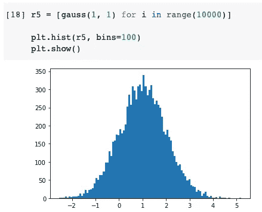

函数`gauss(mu, sigma)`有两个参数，代表我们想要的正态分布的均值和标准差。然后，我们可以把其他事情交给它。

最后，我还想介绍一下三角分布。这在我们的日常生活中确实不太常见。它不像随处可见的正态分布。但是，如果我们想要生成一个偏态分布，这是非常方便的。

`triangular()`功能的基本用法如下。

```
r3 = [triangular(1, 100) for i in range(10000)]plt.hist(r3, bins=50)
plt.show()
```

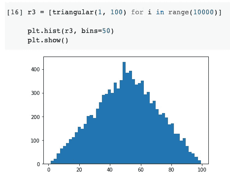

上面的代码生成 10，000 个 1 到 100 之间的三角形分布的数字。

正如我提到的，如果我想要一个偏态分布呢？比如我们希望顶点在 80 左右？我们可以将第三个参数传递给函数，如下所示。

```
r4 = [triangular(1, 100, 80) for i in range(10000)]plt.hist(r4, bins=50)
plt.show()
```

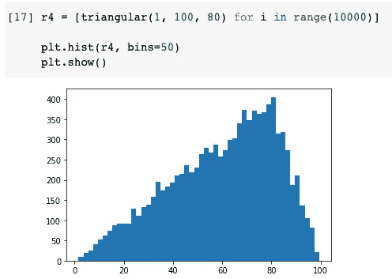

# 摘要


照片由[吉尔·威林顿](https://pixabay.com/users/jillwellington-334088/)在 [Pixabay](https://pixabay.com/photos/pears-lemons-apples-fruit-tea-6101067/) 上拍摄

在本文中，我介绍了如何使用 Python 中的内置随机库来获得我们想要的任何东西，比如随机整数、从列表中随机选择以及某种分布中的随机数。

而不是把重点放在基础知识上，一些高级的用法比如一气呵成的随机选择，加权，洗牌，抽样。希望你喜欢阅读。

[](https://medium.com/@qiuyujx/membership) [## 通过我的推荐链接加入灵媒-陶

### 作为一个媒体会员，你的会员费的一部分会给你阅读的作家，你可以完全接触到每一个故事…

medium.com](https://medium.com/@qiuyujx/membership) 

如果你觉得我的文章有帮助，请考虑加入 Medium 会员来支持我和成千上万的其他作者！(点击上面的链接)