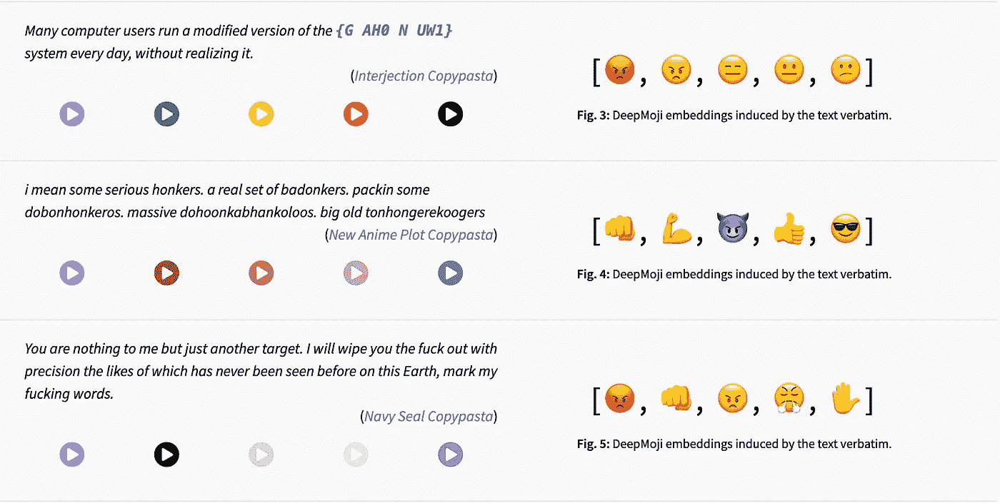

# 使用机器学习生成你最喜欢的角色的声线

> 原文：<https://towardsdatascience.com/generate-your-favourite-characters-voice-lines-using-machine-learning-c0939270c0c6?source=collection_archive---------2----------------------->

## 学习机

## 使用最少的数据进行自然情感、高质量、比实时更快的文本到语音合成

阿图尔·图马斯扬在 [Unsplash](https://unsplash.com?utm_source=medium&utm_medium=referral) 上的照片

一个美丽的周日早晨，我看到一个意外的视频被 YouTube 推荐。

这是一个关于团队堡垒 2 的视频，这是一个 2007 年的 FPS 游戏，我在高中期间花了 1300 个小时。

游戏中有 9 个可能的角色，每个角色都有自己独特的声线和独特的口音。侦察兵有波士顿口音，军医大部分时间讲德语，间谍带着法国口音，你明白了。

我非常熟悉游戏中的所有台词，也非常熟悉《堡垒》官方视频中的台词，所以在那段视频中听到这些角色说的新台词让我非常惊讶。

我的第一个想法是视频制作者用[cameo.com](http://cameo.com)来支付原声演员的新对白。我错了。

> 这些声音是用机器学习创造的

# 15.ai

15.ai 作者截图

该项目是作为麻省理工学院本科生研究机会项目的一部分而创建的，但目前没有人确切知道谁是其背后的支持者。

作者目前没有透露任何源代码或发表任何论文，但他/她声称这种新技术在数据效率和自然性方面击败了 [SV2TTS](https://arxiv.org/pdf/1806.04558.pdf) 。

> 使用最少的数据进行自然情感、高质量、比实时更快的文本到语音合成

那是作者对网站的描述。我不同意的一点是“比实时更快”的说法，因为语音生成非常慢，而且不是实时的。但是，这可能是由其他用户发送的请求队列造成的。

## 特性

在写作的时候，这个角色的声音阵容相当广泛，但是有限。

我们有来自海绵宝宝的海绵宝宝本人。《神秘博士》中的第十位医生。甚至 Undertale 的 Sans 也在。《堡垒 2 队》有全部 8 个角色，除了听起来总是闷闷不乐的派若，还有 TF2 剪辑中的管理员和鲍林小姐。

我看到的一个意想不到的阵容来自我的小马，它有 40 多个角色可供选择。

我本打算把它留在创作者肯定是 MLP 的超级粉丝，但我在常见问题下发现了这条题为“为什么有这么多 MLP 的声音？”

我以前从未看过任何 MLP，但我搜索了一个片段，他们的声音很有表现力。

你可以在这个页面中查看即将发布的[中有哪些角色。](https://15.ai/characters)

## 少量训练数据

与其他 TTS 技术相比，15.ai 能够用很少的数据模拟一个字符

> …只用短短 15 秒的数据，就可以令人信服地克隆出一个声音，包括情感和一切

我无法验证只有 15 秒数据的结果有多好，但传送门的哨兵炮塔的声音只有大约 100 秒的数据，它令人惊讶地听起来相当不错。

我的假设是，模型也可以从其他角色的训练数据中受益，这解释了为什么一个数据很少的角色仍然可以产生高质量的结果。

作者 15.ai 中 MLP 角色截图

但是，小训练数据和大训练数据的字符之间的质量差异仍然非常明显。

与只有 27 分钟训练数据的海绵宝宝相比，拥有超过 120 分钟训练数据的 MLP 角色，如紫悦和小蝶，听起来更好、更自然。

拥有大量训练数据的字符可以产生更自然的对话，单词之间的屈折和停顿更清晰，尤其是对于较长的句子。

作者还指出，由于技术原因(近似均匀分布的声音频率)，高音/女声效果最好。我认为这是由于大量的训练数据来自于 MLP 人物，这些人物一般都具有这些特征。

## 语调和情感

15.ai 的另一个有趣的事情是它如何使用 [DeepMoji](https://deepmoji.mit.edu/) 来预测句子的情绪。

目前，我们不能手动设置声音的情绪，因为情绪的唯一可用选择是使用 DeepMoji 的“上下文”。

作者在 15.ai 中使用 DeepMoji 的截图

就我个人而言，我很想知道它将如何处理手动设置的情绪，因为它可能会迫使机器人生成以前未知的数据，例如带着悲伤或愤怒的情绪说“今天是伟大的一天”。通常这个特殊的句子会带着快乐的情绪说出来，看看这个模型如何为其他情绪产生声音会很有趣。

15.ai 作者评论截图作者对文章的评论

跟随着 [@fifteenai](http://twitter.com/fifteenai) 的评论，原来那个功能已经可以用了！

通过在原句后添加一个“|”并提供一个额外的句子，我们可以控制原句说话时的情绪。换句话说，“text_1|text_2”会用 text_2 的情感产生 text_1 的声线。

我决定尝试这个功能，它实际上工作得很好，肯定超过了我的预期。紫悦会用悲伤的语气说“今天是伟大的一天”,这意味着讽刺。

# 最后的想法

我发现甘创造声线的能力是由[琴鸟](https://www.descript.com/lyrebird)完成的。看来这几年已经改变了，因为现在没有用你自己的声音训练模型的选项。

Lyrebird 也有自己的网站，但现在它似乎被 Descript 收购了[，并专注于创建文本到语音的模型，以帮助内容创作者。](https://techcrunch.com/2019/09/18/descript-audio/)

与我记忆中用 Lyrebird 创作语音时的情况相比，15.ai 完成的语音质量远远领先于它。语调相比当时的 Lyrebird 自然很多，尤其是训练数据很多的角色。

就像 DeepFake 一样，这项技术有可能成为一种制造虚假语音的危险工具，但我相信这将带来很多可能性，比如用你自己的声音取代谷歌助手、Siri 或 Alexa 的声音。

你可以[在这里](http://15.ai)自己尝试一下，但是请记住，你提出的任何要求都将由开发者支付。如果你想帮忙，这是开发者的[页面](https://www.patreon.com/15ai)。

*学习机是一系列关于我所学到的、我认为足够有趣的事情的故事，可以分享。有时也是关于机器学习的基础。* [*定期更新*](https://chandraseta.medium.com/subscribe) *新故事和* [*成为中等会员*](https://chandraseta.medium.com/membership) *阅读无限故事。*

<https://chandraseta.medium.com/membership> 