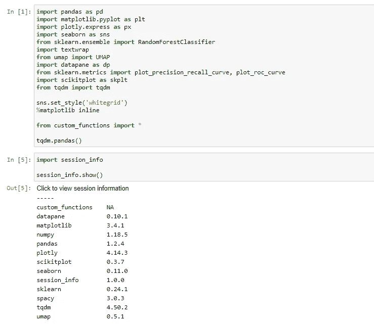

# 从 Jupyter 笔记本生成 Requirements.txt 文件

> 原文：<https://towardsdatascience.com/generating-a-requirements-file-jupyter-notebook-385f1c315b52?source=collection_archive---------4----------------------->

## 一个很容易被忽视的节省时间的方法。


伊恩·杜利在 Unsplash[上的照片](https://unsplash.com?utm_source=medium&utm_medium=referral)

# 介绍

[**想直接跳到最佳选项？点击这里。**](#3793)

创建 requirements.txt 文件是一个必要的过程，尤其是在共享代码、开发 MLOps 或者只是将一些东西放入 Docker 容器时。

从 Jupyter 笔记本中获取一个干净的 requirements.txt 文件是非常棘手的，所以我研究了不同的方法来完成它…

## Pythonic 式的方法:Pip 冻结

这是我见过的关于栈溢出最常见的方法，就是使用 pip 冻结。这将列出您当前虚拟环境中的每个包和版本。

只需打开一个终端，并导航到您希望您的需求文件所在的文件夹。

然后，您可以使用 *venv* 或 *conda* 激活虚拟环境。

```
conda activate myenvpip freeze > requirements.txt
```

**这种方法的问题**

它将获取您在该环境中安装的每个软件包。如果你想创建一些轻量级的东西，只使用你的导入，那么你需要手动修剪这个文件。

## Jupyter 方式:会话信息

如果你想只使用当前 jupyter 笔记本中的包，你可以使用 python 包*[*session-info*](https://pypi.org/project/session-info/)*。**

*安装使用:*

```
*pip install session-info*
```

*在 jupyter 笔记本中，导入包后，您可以写下:*

```
*import session_infosession_info.show()*
```

*你会得到类似这样的东西:*

**

*然后，您可以使用查找和替换功能复制、粘贴并替换空格为 *==* 。*

*这种方法的问题*

*它没有考虑来自我们*的依赖关系。py* 文件，*自定义 _ 函数*。但是，这些将与所有其他依赖项一起出现在较低的位置。*

*最大的问题是它采用了导入的名称，而不是包的名称。例如， *sklearn* 的命令实际上是`pip install scikit-learn`，这意味着它不会作为 requirements.txt 文件工作。*

## *可靠的方式:Pipreqs*

*如果您只想让 requirements.txt 文件与单个笔记本相关，而不是与您的整个环境相关，这是最好的方法。*

*首先打开一个终端并安装 *pipreqs* 和 *nbconvert* 。*

```
*pip install pipreqs
pip install nbconvert*
```

*然后，导航到 Jupyter 笔记本所在的文件夹。*

*如果我们假设笔记本叫“我的 nb”。您需要用反斜杠(\)对空格进行转义。*

```
*jupyter nbconvert --output-dir="./reqs" --to script my\ nb.ipynbcd reqspipreqs*
```

*如果成功了，您应该会收到一条成功消息。*

*所以我们在这里做的是把我们的笔记本转换成一个*。py* 文件放在一个名为 *reqs* 的新目录下，然后在这个新目录下运行 *pipreqs* 。原因是 *pipreqs* 只对*有效。py* 文件，当文件夹中有其他文件时，我似乎无法让它工作。requirements.txt 将在同一个文件夹中生成。*

*你将得到一个完美的需求文件，你可以用它来做任何事情！*

## *了解更多信息*

*[](/mlops-at-home-part2-3c4282df7714) [## 想在家里实现 MLOps？重构您的代码

### 首先让您的代码可重用，然后看看工具

towardsdatascience.com](/mlops-at-home-part2-3c4282df7714) 

## 将我的内容直接发送到您的收件箱！

[](https://adamsh.substack.com/p/coming-soon) [## Data Siens:机器学习技巧、诀窍和教程的资源。

### 欢迎来到亚当的数据西恩斯。我是一名数据科学家，有 5 年的分析经验。我喜欢谈论任何事情…

adamsh.substack.com](https://adamsh.substack.com/p/coming-soon)*