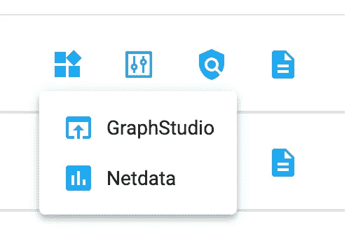
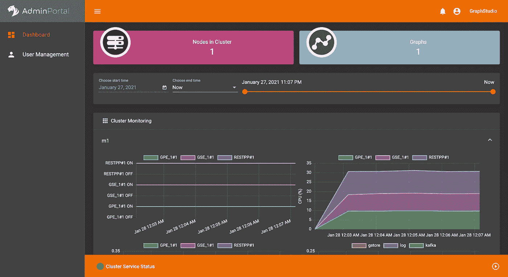
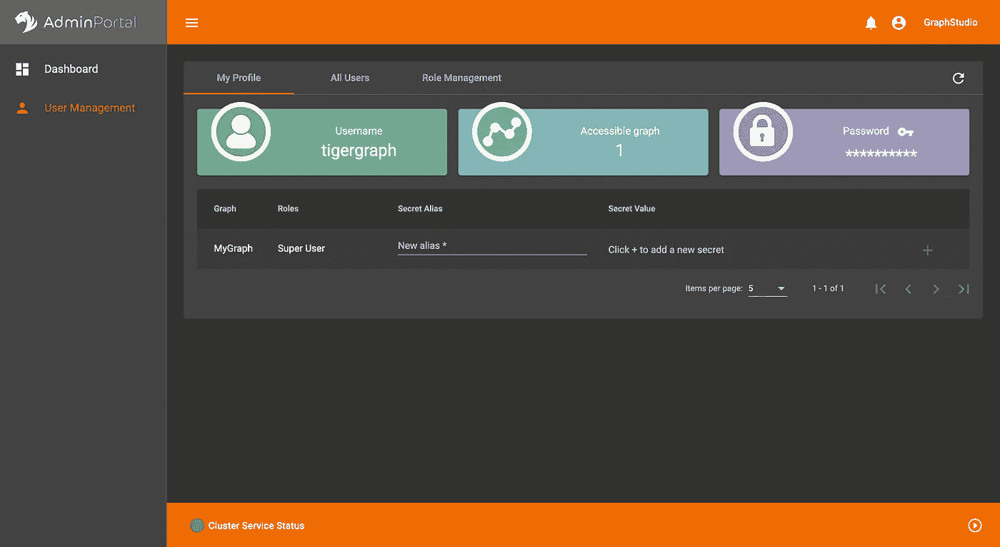

# 在 TigerGraph 中生成一个秘密

> 原文：<https://towardsdatascience.com/generating-a-secret-in-tigergraph-e5139d52dff6?source=collection_archive---------41----------------------->

## 关于在 TigerGraph 中生成秘密的一步一步的微博

[照片](https://unsplash.com/photos/HK8IoD-5zpg)来自 [Unsplash](https://unsplash.com) 由 [Stefan Steinbauer](https://unsplash.com/@usinglight) 拍摄

# 什么是秘密？

在 TigerGraph 中，秘密是允许外部脚本与您的图形交互的唯一代码。一些 TigerGraph 工具可能会要求您提供，但是生成一个秘密本身是很棘手的。

# 第一步:开始你的解决方案

如果您尚未创建或启动您的解决方案，您需要这样做。以下是如何做到这一点的步骤:

1.  在 [https://tgcloud.io](https://tgcloud.io) 创建账户。
2.  转到[https://tgcloud.io/app/solutions](https://tgcloud.io/app/solutions)。
3.  创建一个解决方案(如果您还没有)。
4.  如果您已经创建了一个解决方案，请确保它已经启动。如果关闭，请转到解决方案操作>开始。
5.  等待解决方案在状态下显示“就绪”。

# 第二步:登录 GraphStudio 并导航到 Admin

首先，导航到 GraphStudio。你可以去[https://tgcloud.io/app/solutions](https://tgcloud.io/app/solutions)，点击应用，然后按 GraphStudio。

按下应用程序(四个方块)后。单击 GraphStudio。

可能会要求您登录，也可能不会要求您登录。登录后，您将被定向到如下页面。在那里，点击右上角的“管理”。

点击右上角的管理

# 第三步:生成秘密！

太好了！现在你是管理员了。接下来，您需要切换到左侧边栏中的“用户管理”。

点击左侧的“用户管理”。

太好了！您应该会看到下面的屏幕。

用户管理屏幕

接下来，您需要为您的秘密创建一个别名。有一些对秘密的保留词，像“秘密”本身。在本例中，别名是“sec”完成后，单击绿色加号按钮。

在“别名”中键入您的别名，然后按绿色箭头

太好了！你的秘密应该出现了，现在你可以在你的代码中复制和使用它了！

# 后续步骤

恭喜你。你创造了一个秘密！现在，您可以加入 TigerGraph Discord 来了解更多信息并加入任何项目！

<https://discord.gg/gRHWBZNpxW> 