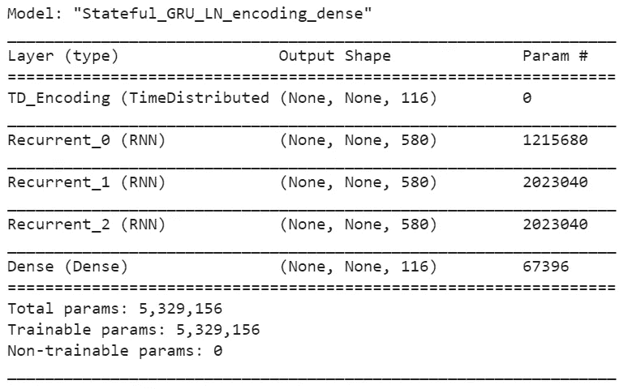

# 用 RNNs 生成“航空法规”

> 原文：<https://towardsdatascience.com/generating-aviation-regulations-with-rnns-698e9cd5222e?source=collection_archive---------40----------------------->

## [行业笔记](https://towardsdatascience.com/tagged/notes-from-industry)

## 使用递归神经网络生成美国民用航空条例样式的新文本

由[肖恩·达尔伍德](https://unsplash.com/@shaundarwood?utm_source=medium&utm_medium=referral)在 [Unsplash](https://unsplash.com?utm_source=medium&utm_medium=referral) 上拍摄的照片

# 介绍

递归神经网络太棒了！它们允许我们通过使用相对简单的神经网络架构并在序列的每一步重复它，基于序列数据进行预测。在这些步骤中的每一步，网络都输出一个预测(像任何其他架构一样)以及一个记忆状态(这就是创新)，该记忆状态被它在预测任务中的下一次迭代所使用。这种安排的结果是，我们最终得到一个重复单元的网格，这些重复单元共享它们的权重和偏好，同时通过交换存储单元的内容来相互通信。

RNNs 可以成功地应用于许多预测问题，从基于一系列数据点预测天气到基于历史数据预测未来股票价格。

由于 RNNs 能够估计数据序列中的下一个点，因此也可以用来生成原始数据点。如果我们用一个序列作为 RNN 的种子，并使用它来预测下一个条目的概率，我们就可以对这些概率进行采样，以获得数据的合理扩展。然后，我们可以把新扩展的序列再次输入到 RNN，得到另一个新的点。通过重复这一过程，一个经过精心训练的 RNN 可以用来基于从训练集中学习到的模式生成新内容，无论是莎士比亚戏剧的全部、[巴赫合唱团的 4 部分全集](https://fabio-a-oliveira.github.io/2021-03-10_Bach_chorales.html)、[维基百科文章的大集合](http://karpathy.github.io/2015/05/21/rnn-effectiveness/#wikipedia)，还是我们训练它的任何其他大型序列数据语料库。

在本文中，我将展示将递归神经网络应用于全套美国民航法规的一些结果。通过训练一个模型来读取一系列字符并预测下一个字符，我们最终得到了一个能够按照这些规则的风格生成原始文本的网络，一次一个字符。我选择联邦航空局发布的法规，是因为它们相当于一个庞大的文本语料库(超过 600 万个字符)，它们以一种易于解析的格式随时可以在网上获得，并且因为我在过去十年的大部分时间里都在确保飞机、运营和机组人员遵守这些法规。

# 模型描述

本文不会详细讨论 rnn 的方法和原因。如果你对解释和大量有趣的例子感兴趣，我怎么推荐 Andrej Karpathy 的[循环神经网络](http://karpathy.github.io/2015/05/21/rnn-effectiveness/)的不合理的有效性博客文章都不为过！

尽管如此，以下是模型特性的高级描述:

*   整套规则(超过 600 万个字符)以 98/2/2%的比例分为一个训练集、一个验证集和一个测试集。分区对文本组织并不敏感:条例的每一节都完整地保存在三个分区中的一个分区中。
*   该模型包括使用具有 116 个标记的标记化器的时间分布编码层，所述标记对应于在训练集中找到的每个字符，接着是 3 个门控循环单元的堆栈，每个单元具有 580 个单元，层标准化和丢弃正则化应用于存储器和输出，接着是具有 softmax 激活的密集连接层。以下是 keras 中 model.summary()方法的输出:

图一。model.summary()方法输出

*   使用具有内斯特罗夫动量的 Adam 优化器进行 100 个时期的优化，每次损失函数达到稳定水平时学习率降低。
*   在每个训练步骤中，模型被输入 32 批 256 个字符长的序列。
*   每个递归单元都被设置为有状态配置，因此存储单元的内容可以从一批延续到另一批。
*   这个问题是以多对多的方式提出的，这意味着在每一步，网络都要预测序列中的下一个字符。
*   完整的模型包含 500 多万个参数。

如果你想检查代码，可以在[这里](https://github.com/fabio-a-oliveira/14-CFR-FAA/blob/main/14_CFR_FAA.ipynb)找到一个带有 python 实现的 jupyter 笔记本。

现在，让我们终于看到一些例子！

# 结果

在对该模型进行训练后(在使用 GPU 加速的谷歌 Colab 会话中，我花了大约 20 个小时)，它在测试集中达到了大约 82%的准确率——这意味着它能够在 82%的时间里正确预测以下字符，这些字符是它在训练期间没有见过的监管文本。对于它在训练中看到的文本，准确率达到 86%多一点。

我使用该模型生成了一个由一百万个新字符组成的序列，并将其保存到一个文本文件中。这大约相当于美国联邦航空局规章总尺寸的 1/6。如果你想看看，并试图找到一些有趣的东西，你可以在这里看到完整的文件。

以下是一些亮点:

# 适当的词汇，但没有语义感:

该网络非常善于捕捉法规中的典型术语，甚至可以形成长句。尽管生成的文本对于熟悉航空法规的人来说非常熟悉，但它无法生成真正有意义的语句。

*121.447 按照类别和等级进行操作的人员。(一)总则。申请模型飞机的人必须接受并记录政府的地面和飞行训练——机动和程序中的问题可能包括在适航性限制部分。必须使用以下信息:*

*(ii)教员，指熟练掌握本节第(a)(1)(ii)段要求的实践考试所需的完美飞行经验的人员。*

*对于装有四台或四台以上发动机的每架飞机，直升机场上方的相同高度可能小于连续 3 小时的 3%的速度。*

# 结构恰当的长句和段落，但没有可辨别的主题:

该模型再现了句子、段落和小节的典型长度。它甚至抓住了文本的层次结构。但是它没有保留连贯的主题，并且经常在同一个句子中输出不相关的主题:

在这里，它混合了静压、操纵面、紧急出口、火灾等等:

23.2525 静压系统测试。如果发动机出现故障。必须通过确定有效载荷来指示分配给飞机表面运动和其他相关程序的每个油气球，必须通过分析或测试来表明符合性，以防止必须安装每个紧急出口，以便-
(1)选择用于干额定值的单个部件具有其较低或较高的系统功能。
(3)贯穿发动机的关键循环部件，以在打开位置投射任何可能发生火灾的元素。
(d)火。(c)由于非自动或动力操作系统的安全和烟雾可能竖立，将油箱油底壳分离到预计变形会首先用于自动或动力操作系统的区域。

在本节选中，它涉及到装载、无线电设备、复飞、发动机、维护和噪音:

*33.85 积载规定。第 121.310(e)节，第 121.337(b)(1)(viii)节，允许无线电设备在不超过两个未错过的进近中运行，以便在闭合基准点运行时辅助标志出现故障。
(7)自预期的直接卫星运行条件的最后一天起，接受此类非数量航空承运人保护的发动机有足够的燃料，考虑到进入点，但不限于限制，完成授权执行一架以上飞机或一组飞机的人员的识别所需的任何指令。飞行标准办公室给出以下程序:
(1)121.405 中所示文件的当前副本。
(d)根据本节，本子部分适用于经主管人员批准的每个证书持有人。
(k)维护和噪音限制。本节适用于外国航空承运人或持有在美国注册的涡轮机/飞机的外国人指挥飞机，如果该人:*

实际的 [23.2525](https://www.ecfr.gov/cgi-bin/text-idx?SID=dced45d7c9be663e6f1b9a04be026278&mc=true&node=se14.1.23_12525&rgn=div8) 针对普通类飞机的发电、储存和配电，而实际的 [33.85](https://www.ecfr.gov/cgi-bin/text-idx?SID=dced45d7c9be663e6f1b9a04be026278&mc=true&node=se14.1.33_185&rgn=div8) 针对动力装置校准测试。

该模型也未能采用排序模式:段落应遵循顺序(a)、(b)、(c)等，项目应遵循(I)、(ii)、(iii)、(iv)等，但正确的编号在生成的文本中随处可见。

# 拼写错误

总的来说，该模型在正确拼写单词方面非常出色，甚至可以识别其他模式，如大写字母的使用以及空格、逗号和句号的放置。然而，拼写错误或不存在的单词也很常见，这很大程度上是由于采样过程——为了确保新生成的文本不重复，根据其概率随机选择下一个字符(而不是只挑选最有可能的一个)。

*这些地方之间的关系 3500 美元以上的世界持有一架* ***nartoty*** *计划的飞机需要一艘海军 I*

*91.855 责任:与燃料* ***体积*** *或轮渡飞行时间相关的豁免权限。*

*25.509 特殊***控制。(a)全机最大起飞重量下的每次预定操作**

# *监管元数据*

*偶尔，模型输出看似随机的胡言乱语，但实际上对应于案卷号、法规修订和出版日期的法规参考。这些都正确地位于一节的末尾。*

**(1)根据批准的等效方法对每次飞行进行调查，调查由至少 3 小时有效的发动机运行限制的正常运行范围内的火灾引起。* ***【Doc。№2000–8114，66 FR 25036，2001 年 4 月 28 日]****

**27.933 整流罩系数。(a)系统的仪表编号必须确保出口到达，且发动机处于出口打开时可能出现的负载下。
(b)在可以抵抗的速度下:
(1)对警告的种类进行总结；和
(2)对于来自一个来源的燃油，或前起落架，必须设计成能承受-
(1)油箱操作的最小值；并且
(3)该结构必须设计用于仅具有旋转角度的水平着陆姿态的载荷。
(2)极限扭矩极限必须在存在的速度下确定(在海平面和设计条件下使用的配置，如失速，不得超过制造商相应的静态地面载荷条件；和
(2)以及每个发动机的控制系统功能指示器。
(b)每个要求楼层的紧急出口必须设计成恒定速度，完全断电，以防止结冰分类或故障。* ***【Doc。№5066，29 FR 18291，1964 年 12 月 24 日，由 Amdt 修订。25–38，41 FR 55466，1976 年 12 月 20 日]****

# *几个更长的例子*

*前面的摘录都是为说明特定特征而选择的短文。但是，当看整个文本时，它被清楚地分成与实际法规大小相同的部分和段落。以下是一些例子:*

**15.50 所有规则制定的货币。(a)农用飞机运营商。在完成发现请求后的 30 天内。(d)无论何时被申请人未能提供一份坐标函，仅当-
(a)其未能遵守 161.205；或
(2)考虑诉讼或收购项目，如果它有一个扩展到禁止的反应计划，规定的信息。适当时，以及任何其他法定证据，或在记录中，当它不在任何可忽略的问题中，或可能不提供 FAA 根据 161.305 (b)对提议项目的批准。
(2)DRO 还是特级大师，为什么最后的预告会透露一个次要情节。如果美国联邦航空局的决策人批准了一项内部发现请求，并应向当事人送达一份申诉书副本。但是，对于本合同的争议审查，报告的听证员和
(4)请求人提出的重新生效的法律动议的副本。如果需要两项赔偿。
【Doc。№18834，54 FR 34318，1989 年 8 月 18 日，由 Amdt 修订。91–296，72 FR 31679，2007 年 6 月 7 日]**

**47.80 禁止代表事故。要求使用 IFR 程序或非运输类飞机的人可以在重量大于本部分附录 F 中所列重量的情况下起飞飞机，而不是必须按照 25.21(g)、选择或高度操作 30 秒 OEI 额定功率。旋翼飞机的最大工作重量，连同旋翼飞机舱，必须在旋翼飞机在飞行条件下工作的气体温度之间，必须如此标记，以使其不能达到显示的舱，除非适当的天气报告或预报、温度和起落架，作为多发动机额定值，据报告是一个发动机不工作的学生，或在最大螺旋桨时间，因为最低重量允许预定的服务救生筏(圆筒除外)。
(三)吸烟。每个动力装置和辅助动力装置必须能够支持所使用的系统。
(c)成员们已经合格并完成了每台发动机、在每一个油箱、飞行甲板之间进行的起动和反作用其操作均无颤振、操纵以及燃油和油的任何组合的试验；和
(2)有可能造成伤害的危险情况。**

*这些只是从模型生成的大量文本中挑选出来的一小部分。如果你有兴趣自己寻找有趣的例子，你可以看看这个 100 万字符长的文本文件。*

# *结论*

*这是一个有趣的项目，我希望你觉得结果很有趣。*

*该模型生成了一些有趣的新文本，在术语、风格和结构上与美国联邦航空局出版的美国民用航空法规的实际语料库非常相似。但它没有产生有意义和有实际意义的东西。*

*这些严重的限制是合理的，因为很难从基于单个角色训练的模型中提取有意义的内容。意义取决于更大和更复杂的结构，如单词、句子和段落，能够通过一次看一个字符来学习这些需要更大的文本语料库和大量的计算资源。*

*同样值得注意的是，该模型没有任何先验知识，也没有接触过任何语言的任何文本。它所学的每一点英语都是基于这个法规文本。*

*这种实现的替代方案是使用预先训练的单词嵌入来将单个单词表示为特征或“特性”的向量。单词嵌入在捕捉文本语义方面要好得多。他们还携带了大量在自己培训期间获得的语言知识，这使得模型可以专注于更具体地针对手头任务的学习模式。*

*然而，我怀疑公开可用的预训练单词嵌入不太适合像航空法规这样的专业性质的文本。*

*如果你有兴趣更详细地了解 RNNs 或者看看其他一些有趣的应用例子，我强烈推荐[这篇博文](http://karpathy.github.io/2015/05/21/rnn-effectiveness/)。如果你想学习如何建立这种模型，[这本书](https://www.oreilly.com/library/view/hands-on-machine-learning/9781492032632/)就是你要去的地方。如果你想查看数据集并亲自尝试一下，你可以通过链接在 kaggle [上访问它。你也可以在这篇文章中查阅我的作品《以巴赫的四声部合唱曲风格创作新巴洛克音乐》。](https://www.kaggle.com/fabioaoliveira/14-cfr-faa-2021)*

*你觉得这个帖子有趣吗？伸手在 [Linkedin](https://www.linkedin.com/in/fabioarbacholiveira/) 上打个招呼！*

# *参考资料和相关链接*

*   *[1] [FAA 法规](https://www.ecfr.gov/cgi-bin/text-idx?c=ecfr&tpl=/ecfrbrowse/Title14/14tab_02.tpl) —用于训练神经网络的全套法规，可通过 e-CFR 网站获得*
*   *[2] [递归神经网络的不合理有效性](http://karpathy.github.io/2015/05/21/rnn-effectiveness/) —安德烈·卡帕西的经典博客文章，关于什么是 RNN 病以及它们能做什么*
*   *[3] [用 Scikit-Learn、Keras & Tensorflow](https://www.oreilly.com/library/view/hands-on-machine-learning/9781492032632/) 实践机器学习——学习如何使用 Tensorflow 和 Keras 实现这类模型的好书*