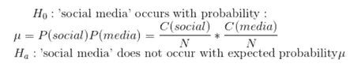
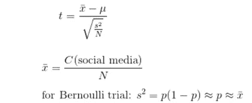
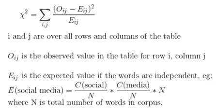
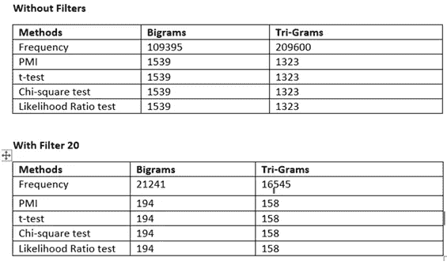

# 生成同位语/N 元语法的 5 种方法

> 原文：<https://towardsdatascience.com/generating-colocations-n-grams-6dd8bea31d13?source=collection_archive---------20----------------------->

## 使用 5 种方法生成 N 元图的完整指南。

布雷特·乔丹在 [Unsplash](https://unsplash.com?utm_source=medium&utm_medium=referral) 上的照片

## 什么是 N-gram 或搭配？

通俗地说，N-gram 或搭配只不过是两个或更多的词经常一起出现。

在搭配的情况下，需要做的第一件事就是将文档转换成标记/单词列表的形式。从这个单词列表中发现搭配意味着找到在整个文本中频繁出现的常见短语。

例如:美国，英国，铺床，去冒险。

大约有六种主要的搭配类型:形容词+名词、名词+名词**、T5(如集合名词)、动词+名词、副词+形容词、动词+介词短语(短语动词)、动词+副词。**

# 产生搭配的重要性

这个目标有助于将重要的和最频繁的单词保持在一起，这将进一步有助于良好的主题建模，并且也是用跨不同组的文章或文档获得的标签来标记数据集的主要步骤。

*   在我们开始使用不同的方法生成 N 元语法之前，有必要将文章转换成一个令牌列表(字母或数字)。所以下面的函数会为你做同样的事情。

*   接下来的事情是初始化 NLTK 的二元模型/三元模型查找器。要做到这一点，您可以使用下面提供的函数来实现。

# 用于生成 N 元文法的不同方法

**1。** **统计相邻词的频率:**

**主旨:**简单按频率排序。

这种方法将简单地计算相邻单词作为二元模型或三元模型或 n 元模型共出现的次数，而完全不考虑它们的关系、依赖性。

**问题:**对经常出现的对和代词/冠词/介词过于敏感。

**解决方案:**只过滤形容词和名词。用词性过滤器计算频率。

*   这里有一个按形容词和名词过滤的函数。

*   现在，我们将使用上面创建的过滤形容词和名词的函数来过滤使用频率计数函数生成的二元模型。

类似地，您可以使用相同的方法使用频率方法生成三元模型，也可以使用相同的方法过滤三元模型。

**2。** **PMI(逐点互信息):**

该方法分配一个统计度量来比较每个二元模型。该方法还允许过滤掉那些出现次数不超过最小次数的令牌。

在实际定义中，PMI 给出了一个单词在一段文本中出现的概率，前提是一些单词已经在它之前出现。

尽管 PMI 方法给出了相当好的 N-gram 集，但我仍然应用了与频率方法相同的滤波器，以查看结果的差异。我必须说，在过滤了 PMI 方法之后，结果是相当合理的，并且出现了相关的图表。

类似地，尝试用这种方法来生成三元模型，看看与频率计数方法的区别。

**假设检验** 3。 **T 检验:**

t 检验是比较两个样本平均值的统计检验。它用于假设检验。

现在，让我们理解使用它来生成有效的 N 元文法的想法。所以，考虑一个有 N 个词的语料库，社交和媒体分别有字数 C(社交)和 C(媒体)。假设社交媒体和媒体是独立的。

测试统计数据为:

这里也有同样的问题，经常与介词、代词、冠词等配对。是最重要的。此外，t 检验因假设正态分布而受到批评。因此，我们接下来应用了卡方检验。

**实用方法:**

下面的函数将告诉你如何使用 t-test 方法来生成 N-gram。

只是为了减少 N-grams 生成的无意义数量，我使用下面的函数在 T-test 方法上应用了过滤函数。

一定要尝试使用这种方法生成三元模型，看看三元模型的 t 检验是如何产生结果的。

4.**卡方检验:**

卡方检验是一种统计假设检验，假设(零假设)某一分类变量的观察频率与该分类变量的预期频率相匹配。

**假设:**卡方检验也像 t 检验一样在零假设中假设单词是独立的。卡方检验统计量计算如下:

**实用方法:**

下面的函数将告诉你如何实现卡方检验来生成二元模型。

用于过滤形容词和名词的卡方检验方法。

同样，对三元模型尝试这种方法，并以类似于上面说明的方式将结果与其他方法进行比较。

**5。** **似然比检验(LRT):**

在统计学中，似然比检验根据两个竞争统计模型的似然比来评估它们的拟合优度，具体来说，一个模型是通过在整个参数空间内最大化得到的，另一个模型是在施加一些约束后得到的。

**实施:**

使用 LRT 生成二元模型，这是我写的函数。

为了过滤 LRT 方法，下面的函数将帮助你。

类似地，对三元模型也尝试这种方法，并将结果与上面讨论的其他方法进行比较。这将给你一个综合的概念，哪种方法是最有效的。

你也可以在这里 查阅 google collab [**上托管的完整代码。在那里，我也对三元模型执行了这些方法。因此，请务必查看完整的代码。**](https://colab.research.google.com/drive/1J42zV57t44ITRzmyVJxoIybWJ7ijfm7D?usp=sharing)

**过滤和不过滤的区别:**

在执行了生成 N-gram 的所有方法后，我比较了所有方法的结果，下表将显示应用过滤器前后不同方法的结果差异。

从上表中可以看出，过滤后得到的 N-Grams 要少一些，这也是为什么会是最好的。然而，过滤前的 N 元语法列表是一个非常大的数字，这在将来将 N 元语法用于主题建模的目的时是有问题的。检查 [**完整代码**](https://colab.research.google.com/drive/1J42zV57t44ITRzmyVJxoIybWJ7ijfm7D?usp=sharing) 的功能实现，该功能比较所有带过滤器和不带过滤器方法的结果。

## 主要调查结果 1

为了检查 N-Grams 的结果，在预处理数据集时，我保留了两个文件，一个带有 _stopwords，另一个没有 _stopwords。

*   在为这两个文件生成 N-gram 时，我发现，即使不应用过滤器，with_Stopwords 文件也比 with _ stop words 文件提供更可靠的结果。
*   With_Stopwords 文件没有将撇号作为单独的字母，而将一些无意义的东西作为单独的字母，这就是为什么在清理数据时保留停用词是至关重要的。

您也可以进行同样的实验，并在您选择的数据集上检查结果的差异。

## 主要调查结果 2

在完成以上 5 个测试后，我发现了很多观察结果，同时也发现了最好的方法。

*   频率、t 检验、似然比检验有几乎相同的结果，在对两个文件应用了名词和形容词的过滤器后，结果非常好。
*   然而，PMI 和卡方检验的结果几乎相同。
*   带滤波器的似然比检验最适合这种情况。它还涵盖了各种关键字。

务必参考 [**完整代码**](https://colab.research.google.com/drive/1J42zV57t44ITRzmyVJxoIybWJ7ijfm7D?usp=sharing) 查看结果差异。

如果你已经走到了这一步，我希望这篇文章已经帮助你解决了你的疑问，并且你已经从我所做的实验中学到了一些新的东西。

您可以通过以下方式联系我:

1.  订阅我的 [**YouTube 频道**](https://www.youtube.com/channel/UCdwAaZMWiRmvIBIT96ApVjw) 视频内容即将上线 [**这里**](https://www.youtube.com/channel/UCdwAaZMWiRmvIBIT96ApVjw)
2.  跟我上 [**中**](https://medium.com/@TechyKajal)
3.  通过 [**LinkedIn**](http://www.linkedin.com/in/techykajal) 联系我
4.  跟随我的博客之旅:-[**https://kajalyadav.com/**](https://kajalyadav.com/)
5.  成为会员:[https://techykajal.medium.com/membershipT21](https://techykajal.medium.com/membership)

也可以看看我的其他博客:

</15-free-open-source-data-resources-for-your-next-data-science-project-6480edee9bc1>  </8-ml-ai-projects-to-make-your-portfolio-stand-out-bfc5be94e063> 