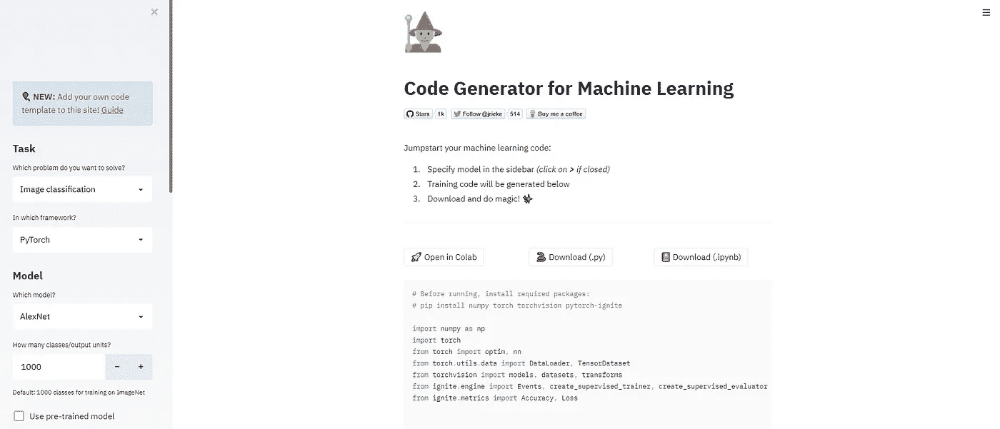

# 为机器学习生成自定义代码

> 原文：<https://towardsdatascience.com/generating-custom-code-for-machine-learning-b2d0a80f9133?source=collection_archive---------27----------------------->

## 使用 Traingenerator Streamlit 应用程序生成 Pytorch 和 Sklearn 代码

弗洛里安·奥利佛在 [Unsplash](https://unsplash.com?utm_source=medium&utm_medium=referral) 上拍摄的照片

如今，每个人似乎都对学习数据科学感兴趣，因为每个人都知道这是一个新兴领域，并且在过去的一段时间里蓬勃发展。有不同的教程和博客可以帮助你开始学习数据科学。但最重要的是接触机器学习或深度学习的不同框架。

创建对不同框架的理解不仅有助于我们使我们的档案多样化，而且有助于理解这些框架的利弊。在本文中，我们将讨论一个基于 streamlit 构建的 web 应用程序，它可用于生成自定义代码模板，我们可以根据自己的用途使用这些模板。

Traingenerator 是一个 web 应用程序，为 Pytorch 和 Sklearn 提供定制代码模板。我们可以使用这个 web 应用程序来定制。在这种情况下，我们可以为图像分类或对象检测生成代码，它支持不同的模型，如 Alexnet，Resnet 等。除此之外，它还支持公共数据集，如 MNIST 等。，以及我们自己选择的数据集或图像文件。我们将讨论 Traingenerator 支持的其他几个功能，同时探索如何使用它。

让我们开始吧…

# 打开应用程序

我们可以使用下面给出的链接来打开 Traingenerator，这是一个 streamlit 应用程序，用于生成自定义代码模板。

 [## 训练生成器 ML 的模板代码

### 为机器学习生成模板代码的 web 应用程序

traingenerator.jrieke.com](https://traingenerator.jrieke.com/) 

# 创建自定义代码

现在，我们将开始构建我们的自定义代码，只需选择下拉菜单和左侧边栏中给出的选项。下面给出的是该应用程序的登录页面，您将看到所有可以添加到代码中的功能。

来源:作者

如图所示，您可以通过选择以下不同选项来创建自定义代码:

1.  **任务**

在这里，我们将选择我们想要解决的问题的类型，并为此选择框架。

2.**型号**

在这里，我们将选择我们想要使用的模型和类的数量。我们也可以通过勾选复选框来使用预先训练的模型。

3.**输入数据**

在这里，我们可以选择想要使用的数据集，无论是公共数据集、NumPy 数组还是图像文件，它都支持。

4.**培训**

对于训练部分，我们可以选择不同的超参数，如损失函数、优化器、学习速率、时期等。

5.**可视化**

在这里，我们可以选择如何查看模型的指标。

使用 Traingenerator 最好的一点是，生成的代码可以直接在 collab 中打开，也可以在下载。py 或者。ipynb 格式。现在让我们为图像分类创建一个基本模型。

下面给出的视频将帮助您了解如何创建自定义模型，并下载以使用它。

来源:作者

因此，在这里我们看到了在 Pytorch 和 Sklearn 上创建不同的模型是多么容易和毫不费力。继续用不同的数据集、参数等进行尝试，并让我知道您在回复部分的评论。

如果您对创建自己的 streamlit 应用程序感兴趣，您可以查看下面的链接，在那里我解释了如何创建一个基本的 streamlit 应用程序。

 [## 从头开始创建 Streamlit 仪表板。

### Streamlit 是一个很棒的工具，可以轻松构建视觉上吸引人的仪表板。

towardsdatascience.com](/creating-streamlit-dashboard-from-scratch-59316a74fa1) 

本文是与[皮尤什·英加尔](https://medium.com/u/40808d551f5a?source=post_page-----b2d0a80f9133--------------------------------)合作完成的。

# 在你走之前

***感谢*** *的阅读！如果你想与我取得联系，请随时通过 hmix13@gmail.com 联系我或我的* [***LinkedIn 个人资料***](http://www.linkedin.com/in/himanshusharmads) *。可以查看我的*[***Github***](https://github.com/hmix13)**简介针对不同的数据科学项目和包教程。还有，随意探索* [***我的简介***](https://medium.com/@hmix13) *，阅读我写过的与数据科学相关的不同文章。**