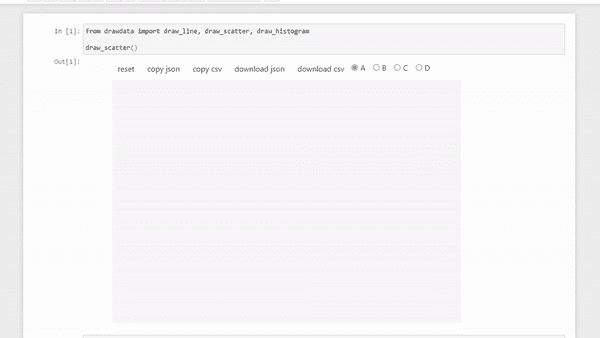
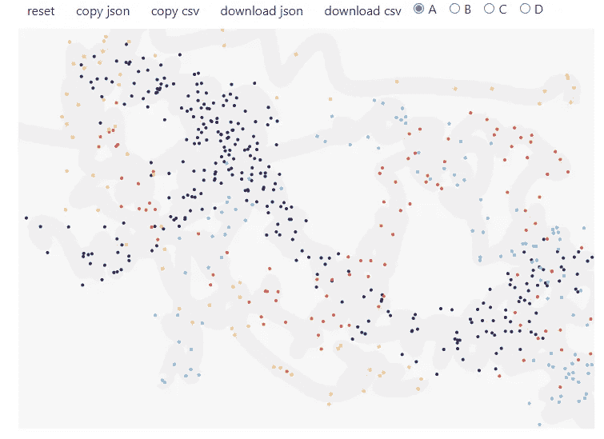
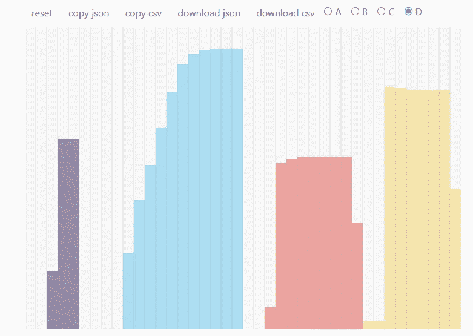

# 通过绘图生成数据

> 原文：<https://towardsdatascience.com/generating-data-by-drawing-c169fe10632?source=collection_archive---------24----------------------->

使用 drawdata 生成假数据



(来源:[作者)](https://www.linkedin.com/in/himanshusharmads/)

创建机器学习模型有助于理解不同列/数据点之间的交互。它向我们展示了如何计算数据点相对于特征数据点变化的偏差。

在学习数据科学时，通常每个人都是从 sklearn 中已经存在并使用了多年的数据集开始学习的，但为了更好地理解数据相关性以及数据在不同机器学习模型中的表现，我们需要更多的数据集。

**Drawdata** 是一个开源的 python 库，通过简单的绘制来帮助生成数据。它允许用户创建不同形状的多样化数据集，这有助于学习数据科学/机器学习。

在本文中，我们将探索使用 drawdata 生成数据的不同技术。让我们开始吧…！

# 安装所需的库

我们将从使用 pip 安装 drawdata 开始。下面给出的命令可以做到这一点。

```
python -m pip install drawdata
```

# 导入所需的库

在这一步，我们将导入所需的库，这些库将帮助我们使用不同的技术生成数据。

```
from drawdata import draw_line, draw_scatter, draw_histogram
```

# 创建数据集

现在我们将创建数据集，并使用 drawdata 创建的 GUI 下载它们。

1.  **使用散点工具**

```
draw_scatter()
```



绘制散点图(来源:[作者](https://www.linkedin.com/in/himanshusharmads/)

在这里，我们可以清楚地看到它如何创建一个 GUI，我们可以在其中创建不同的数据点，还可以下载不同格式的数据集。

2.**使用线条工具**

```
draw_line()
```


画线(来源:[作者](https://www.linkedin.com/in/himanshusharmads/)

3.**使用直方图工具**

```
draw_histogram()
```



绘制直方图(来源:[作者](https://www.linkedin.com/in/himanshusharmads/)

这就是我们如何使用 drawdata 创建不同的数据集，并下载数据集来创建机器学习模型。继续尝试并创建不同的数据集来学习机器学习/数据科学。请在回复部分告诉我您的意见。

本文是与[皮尤什·英格尔](https://medium.com/u/40808d551f5a?source=post_page-----a600379d0d22--------------------------------)合作完成的。

# 在你走之前

***感谢*** *的阅读！如果你想与我取得联系，请随时通过 hmix13@gmail.com 联系我或我的* [***LinkedIn 个人资料***](http://www.linkedin.com/in/himanshusharmads) *。可以查看我的*[***Github***](https://github.com/hmix13)**简介针对不同的数据科学项目和包教程。还有，随意探索* [***我的简介***](https://medium.com/@hmix13) *，阅读我写过的与数据科学相关的不同文章。**