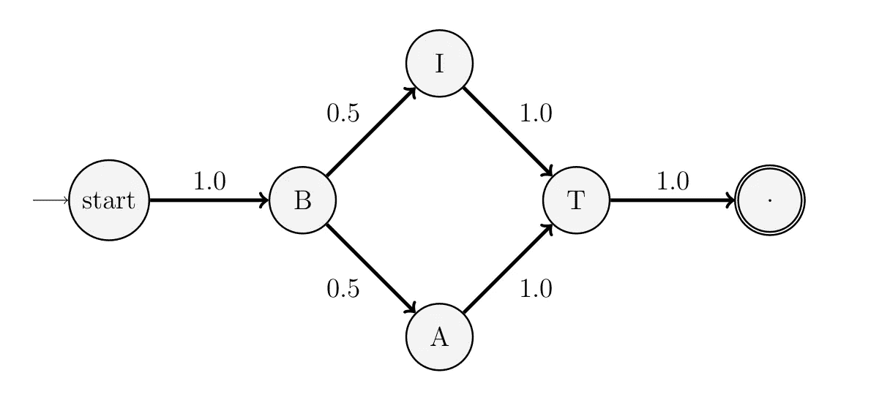
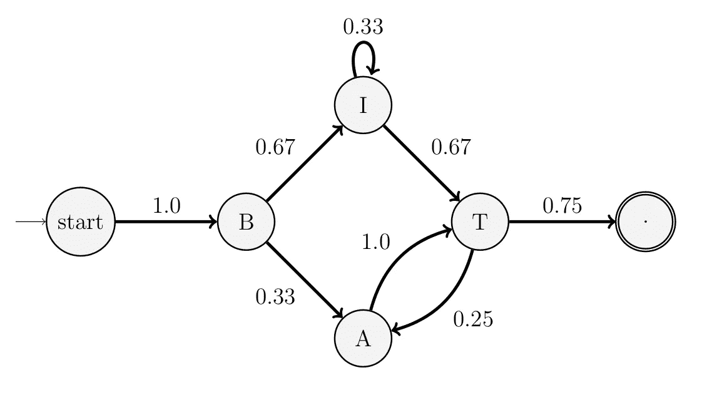

# 用马尔可夫链生成药品名称

> 原文：<https://towardsdatascience.com/generating-drug-names-with-a-markov-chain-49704dad8740?source=collection_archive---------20----------------------->

## 马尔可夫链的简单实用介绍。


在 [Unsplash](https://unsplash.com?utm_source=medium&utm_medium=referral) 上由 [Myriam Zilles](https://unsplash.com/@myriamzilles?utm_source=medium&utm_medium=referral) 拍摄的照片

马尔可夫链是通过从一种状态随机转移到另一种状态来生成值的概率模型。下一个状态仅由当前状态和转移到下一个状态的概率决定。它们的简单性使它们成为对预测模型的很好的介绍，而不需要了解任何专门的库，如 PyTorch 和 TensorFlow。

# 马尔可夫链是如何工作的？

在抽象层次上，马尔可夫链是有限数量的状态和转换的集合，描述了从一个状态到另一个状态的随机变化。它们可以用来模拟随机发生变化的事件，但仍然遵循某种概率分布。

当马尔可夫链在训练过程中记录从一种状态到另一种状态的转换时，它会调整转换的权重，以使该转换更有可能在预测过程中发生。如果模型是基于数据训练的，其中转换 A→B 的可能性是 A→C 的两倍，那么当模型处于状态 A 时，下一个状态可能是 B 或 C，但是它是 B 的可能性将是两倍。

## 简单的例子

假设我们用“蝙蝠”和“比特”这两个词来训练马尔可夫链。我们将使用句号(。)来表示单词的结尾。这是链条的样子:



图 1.1:用一次出现的“比特”和“蝙蝠”训练的马尔可夫链。箭头附近的数字显示了这种转变的概率。请注意，在每个状态下，转移概率总和为 1。

当该模型用于进行预测时，它会执行一次*随机漫步*。

在随机漫步中，我们从“开始”状态开始。有一定的概率把状态变成‘B’，所以它那样做了。在“B”处，下一个状态同样可能是“A”或“I”。变化是随机的(随机行走的“随机”部分)，但仍然遵循概率分布。假设它去了‘我’。然后，它转换到“T”(概率为 1.0)，最后转换到结束状态(“the”)状态)。模型组装了“比特”这个词，但也同样有可能组装“蝙蝠”。

这个特殊的马尔可夫链不能转移到以前的状态。它只能产生以前见过的单词。

## 一个更复杂的例子

马尔可夫链不需要遵循线性流动。让我们以前面例子中的链为例，对单词“BIITAT”进行训练:



图 1.2:用一次出现的“BIT”、“BAT”和“BIITAT”训练的马尔可夫链。

现在存在模型将停留在状态‘I’的概率，并且从状态‘T’转换回状态‘A’。该模型现在可以生成它从未见过的单词，如“BATATAT”和“BIIIIIIIT”！这些话不太可能发生，但还是有可能的。想象一下，如果我们给它更多的数据，它会做什么！

只要我们用来训练它的每个单词的末尾都有一个句号(结束状态)，随机游走最终会到达结束状态。

# 产生幻想的名字

马尔可夫链的一个有趣的应用是产生幻想的名字。给定足够的数据，他们将遵循训练数据的一般趋势，不断改变组成数据的模式。毕竟，生成的单词只是由以前看到的单词的模式组成的。

在我看来，药品的品牌名称总是有一种臧。它们没有字典意义，但通常具有可识别的模式，使它们听起来像“药物名称”。我们将使用马尔可夫链来生成这些名称

## 数据

FDA 保存了所有批准药物的[国家药物代码(NDC)目录](https://www.fda.gov/drugs/drug-approvals-and-databases/national-drug-code-directory)。在将“专有名称”从电子表格中分离出来并过滤掉含有特殊字符、数字和空格的名称后，我得到了一个包含 3403 个名称的列表，这些名称可以用于训练。

包含过滤数据和原始数据的 GitHub repo 的链接包含在本文的末尾。

# 实现马尔可夫链

在前面的例子中，我已经将马尔可夫链绘制成带有节点和链接的图。节点和链接使跟踪和可视化变得容易，但是实现起来不切实际。我们将把马尔可夫链实现为一个嵌套的 Python 字典。外部字典的关键字是“当前状态”；外部字典的值是表示转换的另一个字典，其中键是“下一个状态”,值是转换被观察到的频率。

这种方法更难可视化，通过简单地做`chain['state']`而不是遍历一个图来访问一个状态要容易得多。以下是图 1.2 中状态“T”条目的一个示例:

```
chain['T'] = {
    'A' : 1,  # T -> A transition in BIITAT
    '.': 3    # T -> '.' transition in BIT, BAT, BIITAT
}
```

存储跃迁的*频率*也是有意义的——它们只需要在训练期间递增，而*所有的*概率都需要重新计算。

## 构建链条

这就是我们在 Python 中构建链的方式:

# 随机游动

尽管在训练中已经看到了数以千计的名字，但如示例中所述，链中的简单随机行走会产生垃圾。生成的名字大多没有臧(比如:只有“AE”)；一些规则需要到位，使名字有一些 funk。

虽然我前面说过马尔可夫链的下一个状态完全取决于当前状态，但是对于这个应用程序来说，通过检查规则来考虑前一个状态以生成更好的名称更有意义。

我也在计算结束字符(' . '))和空字符(“”)作为元音；这可以防止单词以两个元音开头或结尾。

随机选择下一个状态的函数`pick_char()`是这样工作的:

1.  所有下一个状态的频率被相加。
2.  产生 0 和 1 之间的随机值，并乘以频率和。该值介于 0 和频率和之间。
3.  在频率字典的每个“下一状态”，从随机值中减去该状态的频率。如果随机值小于零，那么这个“下一个状态”*是*所选择的“下一个状态”，否则我们转到下一个“下一个状态”并做同样的事情。这将根据状态出现的概率随机选取一个状态。

函数`next_char()`是进行随机行走的函数。它是递归的。它调用`pick_char()`，直到返回一个满足规则的字符。然后，它递归，以新生成的“下一状态”作为新的“当前状态”，以前的“当前”状态作为前一状态。

## 将所有这些放在一起…

现在我们可以调用前面讨论过的函数来进行马尔可夫链的随机游走，并生成一些名字！

这是我们运行它时得到的结果:

```
flurimbin
kenzaidel
uvinaze
colmix
iluprarax
zelare
irevene
enxophir
trexin
hysesox
```

# 结论

建立一个马尔可夫链来生成虚构的名字是对随机过程的有趣介绍。除了虚构的名称，马尔可夫链和马尔可夫过程可以更广泛地用于进行“预测”和生成值，其中变化是随机的结果。我希望您尝试一下这个简单的项目，并可能扩展它的其他用途。

下面是包含该项目的代码和数据的 [GitHub repo](https://github.com/alexkalinins/crazy-pharmacist-generator) (生成器也是用 JavaScript 实现的！).数据可能有点过时了。