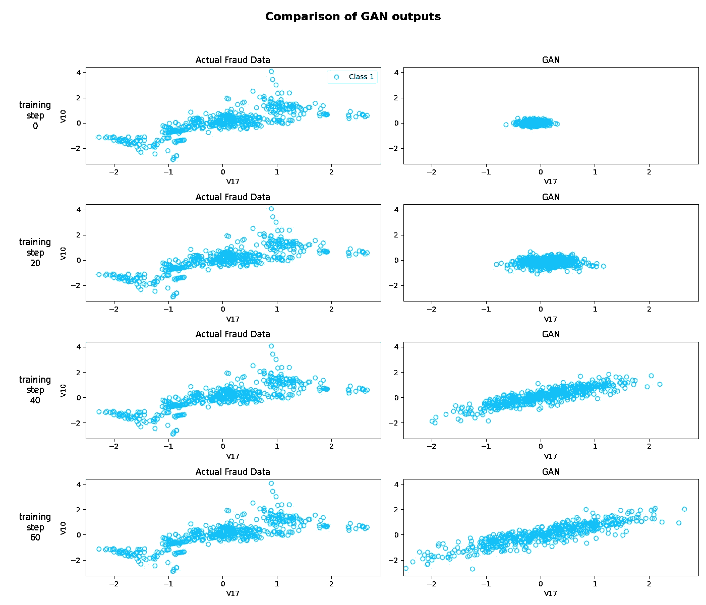

# 使用合成数据生成/扩展数据集

> 原文：<https://towardsdatascience.com/generating-expanding-your-datasets-with-synthetic-data-4e27716be218?source=collection_archive---------6----------------------->

## 本文旨在解决使用包含 GANs 的开源库来扩充/扩展现有数据集的需求


蒙罗工作室在 [Unsplash](https://unsplash.com?utm_source=medium&utm_medium=referral) 拍摄的照片

# 1.背景

作为一名 ML 从业者或数据科学家，当我们发现自己处于类似“如果我们有更多数据就好了”的情况时，这也许是可能的。很多时候，我们拥有的数据集非常有限，并且不确定如果给定更多数量的统计相似数据，我们的机器学习模型的性能会更好还是更差。当然，我们可以从与现有数据相同的来源中挖掘更多的数据，但这并不总是可能的。如果有一种方法可以从我们现有的数据中创造出更多的数据，那会怎么样？

# 2.简介—以数据为中心的方法

以数据为中心的方法正在成为这些天讨论的一个常见和热门的话题，像吴恩达这样的流行名字倡导需要拥有/建立以数据而不是模型本身为中心的人工智能解决方案。当然，拥有正确的模型也是必不可少的，并且应该牢记在心。关于[以数据为中心还是以模型为中心](/from-model-centric-to-data-centric-4beb8ef50475)的争论是一个重要的问题，因为我们不能完全偏爱一种方法。

# 3.为什么让 AI 扩展你的数据集？

让我们问自己两个基本问题-

1.  为什么我们要让一个本质上是模型(一段代码)的 AI 来扩展我们的数据集，为什么我们不能只拿我们现有的数据集，手动去做呢？
2.  ML 算法将基于我们现有的数据生成新的数据。让一个人工智能模型增加更多但(某种)冗余信息的数据集，而不是保留更少但更有用的信息，这难道不是毫无意义的吗？

第一个问题的答案相当明显，因为当我们处理数千(甚至数百万)规模的数据集时，手动干预变得几乎不可能，因为很难研究整个数据集并提取本质上构成数据集的重要特征。然后需要以特定的方式复制这些提取的特征，以便向数据集中添加更多的示例。一个简单的方法是寻找更多的数据。但是寻找往往并不容易，更具体地说，如果项目需要非常特殊或特定类型的数据集。此外，在当今世界，隐私是一个大问题，如果数据搜索过程涉及废弃用户的个人数据或身份，那么它可能不是最道德的方式。

至于第二个问题，马上回答有点棘手，它需要一些深刻的思考。这个问题的答案包括交叉检查负责生成新数据的 ML 算法。通常，这样做的需要取决于项目需求和最终结果。

考虑这一点的最简单方法如下。比方说，我们为最终测试留出一个特定的精心策划的测试数据集。现在，如果新生成的数据集与原始数据集相结合，能够在阈值范围内改进模型，它将满足我们的目的，并且将足够有用。换句话说，如果我们的模型的性能在我们看不见的数据集上有所改善，我们可以得出结论，将我们现有数据的增强版本添加到模型中可以改善它，并使系统对从未见过的数据更加稳健。

# 4.GANs——简要描述

一篇关于 GANs 的精彩而详细的文章可以在谷歌开发者的博客文章中找到，但是用非常简单的话来说，一个生成性的对抗网络由试图相互竞争的两方组成。其中一个试图愚弄另一个，另一个试图避免这种欺骗。

双方是一个生成器和一个鉴别器，两个神经网络都试图以下列方式相互竞争:

*   生成器试图生成理想情况下看起来像真实内容的内容，通常可以是图像、文本或数字数据。如果鉴别器能够区分真实内容和生成的内容，则生成器会受到惩罚
*   鉴别器试图区分生成的内容和真实的内容。如果鉴别器不能区分真实内容和生成内容，它就会受到惩罚

最终目标是让生成器能够生成看起来非常接近真实数据的数据，以至于鉴别器无法再避免欺骗，这给我们留下了比开始时更多的数据。


(重构)来自[谷歌开发](https://developers.google.com/machine-learning/gan/gan_structure)页面的框图

# 5.使用 ydata-synthetic 生成数据

ydata-synthetic 是一个用于生成合成数据的开源库。目前，它支持创建常规的表格数据，以及基于时间序列的数据。在本文中，我们将快速查看如何生成表格数据集。更具体地说，我们将使用[信用卡欺诈检测数据集](https://www.kaggle.com/mlg-ulb/creditcardfraud)并生成更多数据示例。在 ydata-synthetic 的存储库上提供了一个[示例笔记本](https://colab.research.google.com/github/ydataai/ydata-synthetic/blob/master/examples/regular/gan_example.ipynb)，可以在 Google Colab 中打开并跟随，以便基于信用卡数据集合成一个表格数据集。

让我们读取数据集，看看这个特定的数据集由哪些列组成

我们得到以下列:

```
Dataset columns: ['V1', 'V2', 'V3', 'V4', 'V5', 'V6', 'V7', 'V8', 'V9', 'V10', 'V11', 'V12', 'V13', 'V14', 'V15', 'V16', 'V17', 'V18', 'V19', 'V20', 'V21', 'V22', 'V23', 'V24', 'V25', 'V26', 'V27', 'V28', 'Amount', 'Class']
```

暂时不涉及太多特定领域的细节，这些基本上是描述信用卡交易的特性。数据集中有一个名为“Class”的最后一列，如果存在欺诈，该列的值为 1，否则为 0。与非欺诈案例相比，该数据集中的欺诈案例实际上非常少，我们希望增加欺诈案例的数据集。

因此，我们只从数据集中提取那些类别为 1 的条目，即欺诈值。然后，我们应用幂变换，以使分布类似高斯。

然后，我们可以继续训练我们的 GAN 模型，使其学习和了解欺诈值。对于这个例子，我们将使用一种特定类型的 GAN 模型，称为 WGAN-GP([wasser stein GAN with Gradient Penalty)](https://arxiv.org/abs/1704.00028)。超参数和训练设置以列表的形式定义，并提供给我们的模型进行训练。

最后，我们实际上可以从训练好的模型中生成数据，方法是给它一个随机值矩阵作为开始。

为了可视化和比较生成的输出，我们从 *g_z* 中选取任意两列(比如 V10 和 V17 ),并为多个时期的训练权重绘制散点图。



实际输出和 GAN 输出的比较

因此，我们看到 V17 和 V10 的值在我们的原始数据集中有一个模式(“实际欺诈数据”，左图)，GAN 试图在训练和预测过程中学习并尽可能复制该模式。在第 60 个历元结束时，V17 和 V10(以及其他特征)的最终值在一定程度上类似于原始数据集的值。

完整的实践演练可以在 Google Colab 笔记本中从 [ydata-synthetic](https://github.com/ydataai/ydata-synthetic#examples) 存储库中找到，之前也有链接。

# 6.结论，接下来呢？

我们根据我们的用例和最终目标来考虑生成合成数据的需求。我们简要介绍了 GAN 架构，还利用 ydata-synthetic 生成了表格数据。在以后的文章中，我们还可以探索生成时间序列数据的可能性。