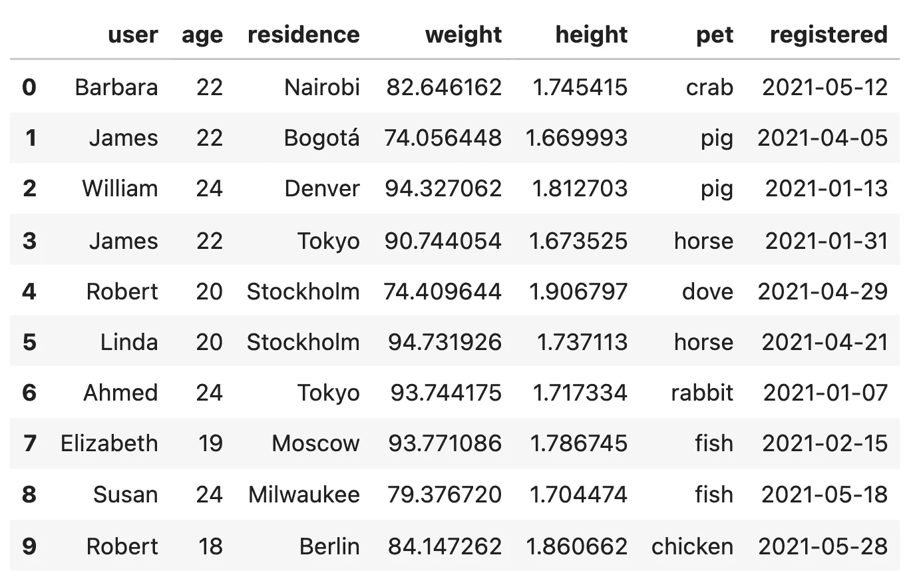
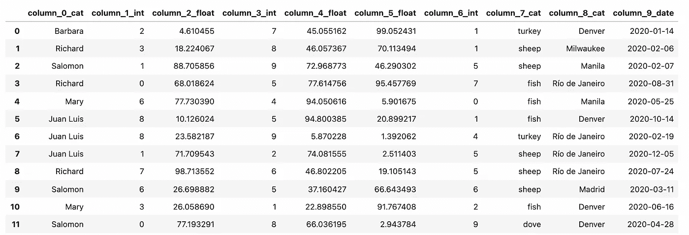
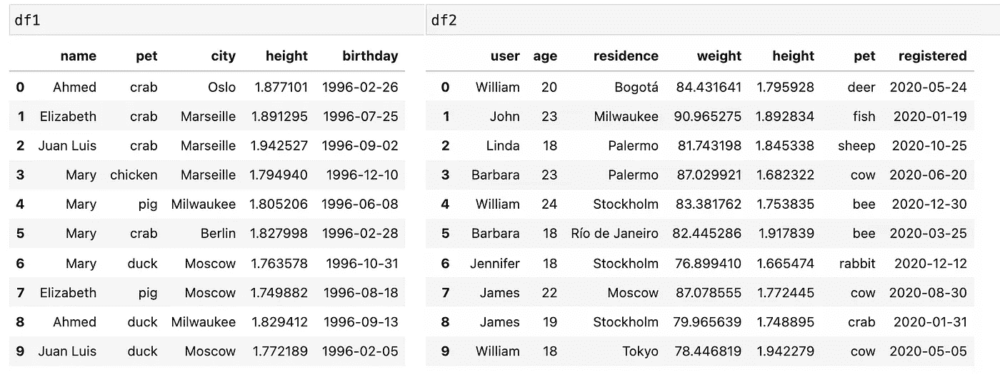
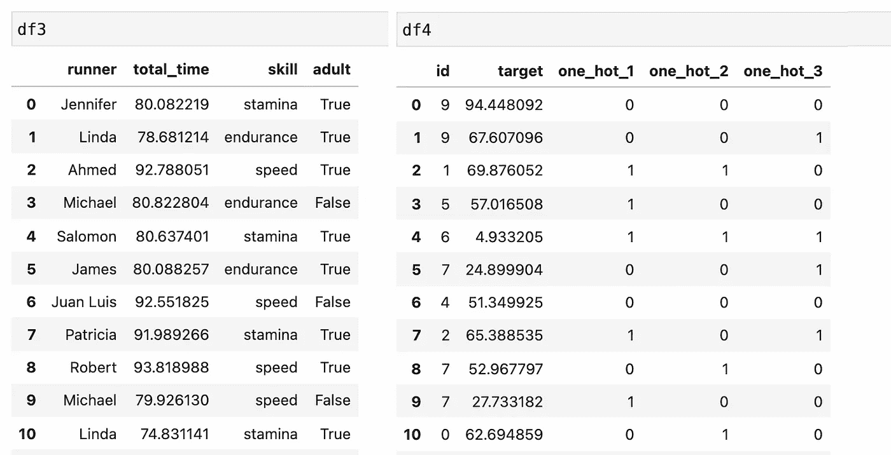

# 用熊猫快速生成假数据

> 原文：<https://towardsdatascience.com/generating-fake-data-with-pandas-very-quickly-b99467d4c618?source=collection_archive---------5----------------------->

## [小窍门](https://towardsdatascience.com/tagged/tips-and-tricks)

## 最后，以一种平稳、无痛苦的方式



作者图片

你可能因为各种各样的原因而最终阅读了这篇文章。如果你认为这篇文章是关于强迫熊猫用电脑做黑客的事情，请关闭这个标签，继续你的工作。你在帮你自己。这从未发生过。


照片由[巨浪 926](https://unsplash.com/@billow926?utm_source=medium&utm_medium=referral) 在 [Unsplash](https://unsplash.com?utm_source=medium&utm_medium=referral)

对于你们这些书呆子和离不开熊猫的数据科学家来说，今天可能是你们的幸运日。思考下面的问题:**你有多少次手工创建一个小的数据框架来测试你正在开发的新代码？**建立一个假数据集来快速测试一个机器学习模型怎么样？如果你和我一样，大概也有不少次吧。它通常看起来像这样:

```
**import** pandas as pddata **=** {'Name':['Tom', 'Brad', 'Kyle', 'Jerry'],
        'Age':[20, 21, 19, 18],
        'Height' : [6.1, 5.9, 6.0, 6.1]
        }

df **=** pd.DataFrame(data)
```

写这些行需要一点时间，结果是一个很小的 4x3 数据帧。我感觉你在那里，很痛苦。你认为你的宝贵时间应该用于更有价值的任务，我完全同意。这就是为什么我想向你介绍这段简短的代码，它可以帮助你找回属于你的东西。**请不要看**，复制粘贴到你的编辑器里就可以了(如果你信任我的话)。最好通过运行下面的例子来理解它是如何工作的。不管怎样，它来了:

## 一堆例子

那么你如何用它来生成东西呢？很简单，你可以这样:

```
generate_fake_dataframe(size = 1000, cols =  "cififficcd")
```

并生成:



作者图片

size 参数显然是行数。`cols = 'cififficcd'`没那么直白。它只是让您控制想要生成的列的类型和顺序，包括以下选项:

*   **c** :用于包含分类变量的列。
*   **i** :生成一列整数。
*   **f** :返回一个带有浮点数的列。
*   **d** :用于有日期值的列。

您可以看到这些列是如何按照以下模式命名的:`column_n_dtype`。关于类别特征，我们看到`**column_0_cat**` 填名字， `**column_7_cat**` 有动物，`**column_8_cat**` 有城市名。还有一系列分类特征(“颜色”)，可以通过编辑`categories_dict`添加更多。每个家族都有 15 个用于填充分类列的独特类别。

这里还有两个例子，df1 和 df2:



df1 和 df2 —作者图片

好的，有一些新的参数。`**col_names**`接受一个列表，其中包含您想要为列指定的名称，以防您不想要遵循`column_n_dtype`模式的列。当然，它应该与`cols`字符串的长度相同。`**seed**`参数控制随机数发生器，如果其他参数保持不变，您可以重现相同的结果。如果未设置(或设置为 *None* )，每次调用该函数时，将输出不同的数据帧。最后，还有`**intervals**` 参数，它允许微调每个列的生成方式。

当您不向 intervals 传递任何东西时，每个列类型都会生成一个默认配置**。**整数**值默认均匀分布在区间 **(0，10)，浮点数** get **(0，100)** 默认，**日期**在**(“2020–01–01”、“2020–12–31”)之间生成。默认情况下，类别值**由 **"names"** 系列的 **5** 元素生成，如果有多个类别列，则选择其他系列。**

****

**照片由[格雷森·乔拉蒙](https://unsplash.com/@greysonjoralemon?utm_source=medium&utm_medium=referral)在 [Unsplash](https://unsplash.com?utm_source=medium&utm_medium=referral) 上拍摄**

## **设置自定义间隔**

**如果每个数据类型的默认配置不符合您的需要，您可以通过 intervals 参数来更改它。您可能已经注意到了用于生成 **df1** 和 **df2** 的代码中的一些“不一致”。在 df1 中，我们将一个**字典**传递给 intervals 参数，在 df2 中，它是一个**列表**。这是为什么呢？嗯，我们可以使用字典来指定一个配置，该配置将影响所有相同类型的**列。例如，我们可以将间隔设置为:****

```
intervals = {"d" : ("1996-01-01","1996-12-31"),
             "c" : ("colors" , 7)}
```

**然后，我们将覆盖**日期列(" d")** 的默认配置，它现在将始终包含这些日期之间的值，并且覆盖**分类列(" c ")，**的默认配置，它现在将始终从 colors 族的 7 个不同值中进行选择(而不是 names 族的 5 个)。intervals 参数中不存在的列类型将保留其默认配置。**

**因此，为了澄清，如果我们调用`generate_fake_dataframe(20, “cccd", intervals = {"c" : ("colors",7)})`,我们将得到一个数据帧，其中有 3 个分类列，每个列最多有 7 种不同的颜色，还有一个默认配置的日期列。**

**另一方面，我们可以向区间传递一个列表，而不是一个字典。当**我们想要更多的控制**时，也就是说，当我们想要为每个单独的列进行特定的配置时，我们就这样做。列表的第**I 个元素包含了我们想要分配给第**I 列的区间。**让我们仔细看看用于创建 df2 的间隔。****

```
cols = "cicffcd",
intervals = [("names",10), (18,25),("cities", 15), (73.2,95.0),               (1.65,1.95), ("animals", 11), None]
```

**我们在`cols`中看到，我们有 7 列，intervals 列表包含 7 个引用每一列的元素。当然，根据列的类型，每个区间元组应该有适当的格式(如果我们把`("names", 15)`替换成`(13,20)`，函数会抛出一个错误，因为第一列被设置为“c”，即分类)。有了这个区间配置，我们就可以想多具体就多具体。第一列包含 10 种不同类型中的名称；第二，18 到 25 之间的整数；第三，15 个选项中的城市，等等。最后一列设置为 **None，**这意味着对于该列，我们希望使用默认间隔。**

## **我袖子里还有一张牌…**

****

**照片由[昆廷·雷伊](https://unsplash.com/@quentinreyphoto?utm_source=medium&utm_medium=referral)在 [Unsplash](https://unsplash.com?utm_source=medium&utm_medium=referral) 上拍摄**

**关于`generate_fake_dataframe`，还有一个技巧我还没有告诉你，它是关于在分类列中引入自定义类别族的。我们说过**所有的**区间都应该定义为一个二元元组，不管它的 **(int，int)，(float，float)，(date，date)** 还是 **(category_family，number_of_elements)。嗯，这并不完全正确，有一个，而且只有一个例外。对于分类列，我们可以用一个对象列表来替换(family，n)元组，我们希望从这个列表中填充列**。让我再给你看两个例子:**

****

**作者图片**

**注意，对于 **df3** 中的第三和第四列，我们传递的不是元组，而是元素列表(可能的技能列表，以及包含真和假的列表)。这对于 **df4** 中的字典也非常适用。我们可以从包含[0，1]的列表中设置所有分类列。**

## **包扎**

**我希望这篇文章对您有用，并随时将`generate_fake_dataframe`添加到您的工具箱中。我已经*斗胆*打开了一个关于熊猫的拉请求，看看这是否有可能包含在未来的版本中。目前存在的替代方案(`pd.util.testing.makeDataFrame`和 `pd.util.testing.makeMissingDataframe`)并没有真正完成任务。还有其他像 Faker 这样的库，具有更丰富的数据类型，但不是为输出数据帧而设计的( *afaik* )。所以我坚信熊猫有这个空间。**

**在此之前，可能需要做许多更改和改进，修改代码以遵循 pandas 自己的准则，重写代码以提高清晰度，重命名一些参数(甚至函数名本身)等等...如果你想把这个包含在熊猫里或者有什么建议，请在 [**公关讨论**](https://github.com/pandas-dev/pandas/pull/42782) **中畅所欲言。如有任何查询，你可以打电话到 juanluis.rto@gmail.com 找我****