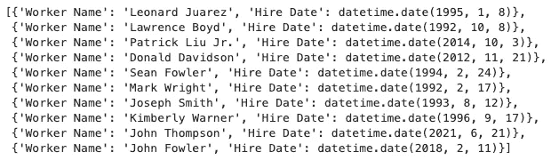
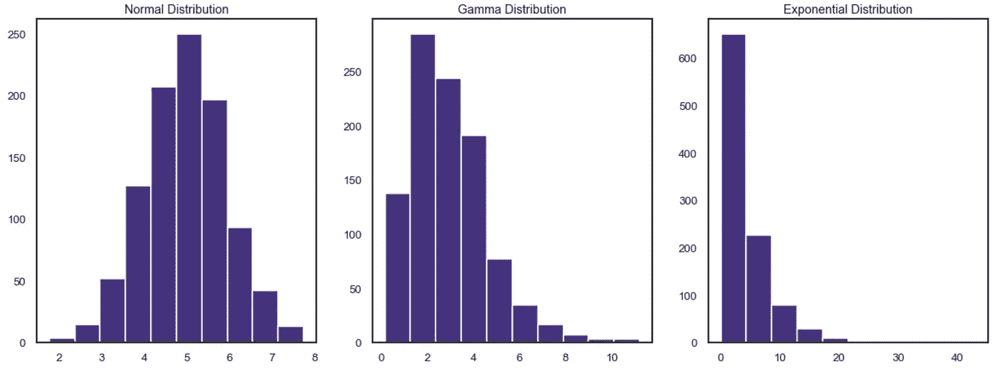
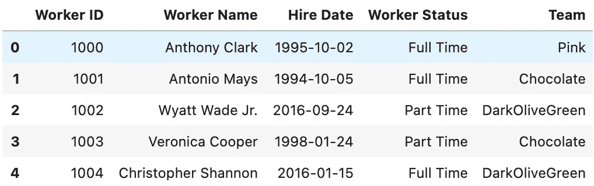
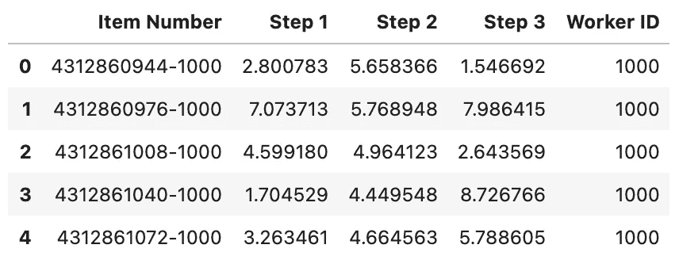

# 用 Python 生成假数据

> 原文：<https://towardsdatascience.com/generating-fake-data-with-python-c7a32c631b2a?source=collection_archive---------6----------------------->

## 使用 Faker 和 Numpy 创建假数据集


克里斯·利维拉尼在 Unsplash[上的照片](https://unsplash.com/s/photos/factory?utm_source=unsplash&utm_medium=referral&utm_content=creditCopyText)

数据分析的第一步是找到要分析的数据。

很多时候，这关键的第一步几乎是不可能的。满足我们需求的数据可能是专有的、昂贵的、难以收集的，或者根本不存在。

当我想尝试一个新的库或技术，或者开始写一篇新文章时，找到一个合适的数据集是我面临的最常见的问题。

在这里，我们通过创建自己的数据集来彻底解决这个问题！

## 小部件工厂

在这里，我们将为一个虚构的小部件工厂创建一个数据集。

我们的部件工厂有员工，他们的唯一工作就是制造部件。工厂通过统计生产的部件数量和工人的生产速度来监控部件生产效率。制作微件包括三个步骤，所有步骤都由微件监控系统计时。

让我们开始制作我们的假部件工厂数据集吧！

## 骗子

我们可以使用惊人的包， [Faker](https://faker.readthedocs.io/en/master/index.html) 来开始。Faker 自我描述为“一个为你生成虚假数据的 Python 包。”

Faker 可在 [PYPI](https://pypi.org/project/Faker/) 上获得，并可通过`pip install faker`轻松安装。

让我们初始化一个 faker 生成器，并开始制作一些数据:

```
# initialize a generator
fake = Faker()#create some fake data
print(fake.name())
print(fake.date_between(start_date='-30y', end_date='today'))
print(fake.color_name())>>> Bruce Clark
>>> 1996-08-24
>>> LimeGreen
```

Faker 还有一个方法可以快速生成假的个人资料！

```
print(fake.profile()>>> { 'address': '56393 Steve Lock\nNew Paul, FL 14937',
>>>  'birthdate': datetime.date(1968, 1, 2),
>>>  'blood_group': 'O+',
>>>  'company': 'Hernandez, Keller and Montes',
>>>  'current_location': (Decimal('66.6508355'),
>>>      Decimal('54.569691')),
>>>  'job': 'Museum education officer',
>>>  'mail': 'levyjoan@yahoo.com',
>>>  'name': 'Kim Stephens',
>>>  'residence': '0248 Patricia Street 
>>>       Apt. 507\nEast Dustin, WV 65366',
>>>  'sex': 'F',
>>>  'ssn': '248-78-5827',
>>>  'username': 'ruizdavid',
>>>  'website': ['[https://www.garcia-garza.org/](https://www.garcia-garza.org/)',
>>>      '[https://www.williamson.info/](https://www.williamson.info/)']}
```

虽然这很酷，但对我们的小部件工厂来说还不是很有帮助。

我们需要为每个元素创建多个示例。我们可以通过列表理解来做到这一点:

```
# create a list of color names
colors = [fake.color_name() for x in range(4)]
print(colors)>>> ['LightCoral', 'Yellow', 'WhiteSmoke', 'LightGray']
```

现在我们有进展了！profile 方法为每个工人提供了比我们需要的多一点的信息——我们的小部件工厂保留了每个工人的最少记录！

让我们开始创建一个工人的数据框架，只包含我们感兴趣的信息。我们将使用 list comprehension 来生成一个包含员工姓名和雇佣日期的员工信息字典:

```
fake_workers = [
    {'Worker Name':fake.name(), 
     'Hire Date':fake.date_between(start_date='-30y', end_date='today')
    } for x in range(10)]

print(fake_workers)
```



包含姓名和雇用日期的员工字典

这是一个很好的开始！但是，如果我们想将每个工人分配到一个团队中去呢？如果我们只是使用 Faker，我们会有大量的团队，每个团队可能只有一个工人。

假设我们想要创建四个团队，并在他们之间平均分配工人。我们可以使用 [NumPy 的随机采样](https://numpy.org/doc/stable/reference/random/index.html?highlight=random#module-numpy.random)来完成这个任务。

## numpy.random

Numpy 的随机采样模块包含许多生成伪随机数的方法。在这里，我们将探索几个可用的选项。

我们可以使用`numpy.random.choice`从我们用上面的 Faker 创建的颜色列表中随机选择一种颜色:

```
# numpys random choice to select a color from our colors list
np.random.choice(colors)>>> Yellow
```

单独来说，这不是非常有用，因为我们只有一种随机选择的颜色。让我们\使用列表理解随机选择几种颜色:

```
# generate an array of colors with a list comprehension
[np.random.choice(colors) for x in range(5)]>>> ['WhiteSmoke',
>>>   'WhiteSmoke', 
>>>   'Yellow', 
>>>   'WhiteSmoke', 
>>>   'LightGray']
```

现在我们有进展了！如果我们想从颜色列表中选择不同概率的颜色呢？

`numpy.random.choice`带一个可选参数`p`，它允许我们指定每一项的概率。(当 p 未指定时，假设为均匀分布。)

让我们指定颜色的概率:

```
# generate an array of colors with differing probabilities
[np.random.choice(colors, p=[0.1, 0.6, 0.1, 0.2]) for x in range(10)]>>>['LightGray',
>>> 'LightCoral',
>>> 'LightGray',
>>> 'LightGray',
>>> 'LightCoral',
>>> 'WhiteSmoke',
>>> 'Yellow',
>>> 'Yellow',
>>> 'Yellow',
>>> 'Yellow']
```

我们可以看到黄色和浅灰色在输出中更常见！由于样本量小，分布并不完全符合规定。我们需要增加样本量来接近我们指定的概率。

我们还可以基于指定的分布生成数据。这里，我们随机生成几个分布，并用直方图可视化:

```
# generate normal distribution
normal_dist = np.random.normal(loc=5, scale=1, size=1000)# generate gamma distribution
gamma_dist = np.random.gamma(shape=3, scale=1, size=1000)# generate exponential distribution
exp_dist = np.random.exponential(scale=4, size=1000)# histograms to visualize the distributions
fig, [ax1, ax2, ax3] = plt.subplots(1,3)
ax1.hist(normal_dist)
ax1.set_title('Normal Distribution')ax2.hist(gamma_dist)
ax2.set_title('Gamma Distribution')ax3.hist(exp_dist)
ax3.set_title('Exponential Distribution')plt.show()
```



随机生成的分布直方图

这些看起来不错！让我们把所有东西放在一起，创建我们的假部件工厂数据集！

## 把所有的放在一起

我们将创建两个数据帧:一个用于工人数据，一个用于小部件数据。

我们将使用 Faker、Numpy 和 list comprehensions 创建一个包含员工 id、姓名、雇佣日期、状态和团队的员工花名册数据集。

首先，我们创建一个函数，`make_workers()`。该函数将接受一个参数`num`，它将代表要生成的雇员数量。

我们使用`np.random.choice`将每个员工分配到一个团队，使用默认的统一分布，并通过指定概率将每个员工分配到全职、兼职或每日津贴状态。



使用 Faker 和 Numpy 生成的假工人数据示例

这看起来棒极了！现在让我们创建一些小部件数据。

我们将开始使用内置的`[id()](https://docs.python.org/3/library/functions.html#id)`方法为每个小部件随机分配一个项目编号。

从文档中，`id()`返回对象的“身份”。这是一个整数，保证在这个对象的生命周期内是唯一和恒定的”。因为我们每次调用`make_widget_data()`函数时都在同一范围内迭代，所以我们将创建重复的项目编号。为了解决这个问题，我们将工人 id 附加到项目编号上，以保证唯一性。

接下来，我们将假设在小部件创建中有三个步骤。对于每个步骤，我们将生成一个不同的随机分布，该分布将表示完成该步骤所花费的时间。

接下来，我们假设员工并不都以相同的速度工作——全职员工比兼职员工完成更多的小部件。

为了在数据中反映这一点，我们迭代上面创建的 worker_df，并根据每个工人的状态随机选择他们创建的一些小部件。

我们将创建一个空列表来存储每个工作小部件的数据帧，然后最终将数据帧列表连接成一个最终的小部件数据帧:



使用 Faker 和 Numpy 生成的虚假小部件数据

小部件工厂的工人很忙！他们创建了 2817285 个小部件！

最后，我们可以保存我们的数据集，用于未来的分析:

```
worker_df.to_csv('data/workers.csv', index=False)
widget_df.to_csv('data/widgets.csv', index=False)
```

## 结论

在这里，我们探索了 Python 包 Faker 和 Numpy 的随机采样模块。

Faker 可以很容易地生成各种各样的数据，包括姓名、地址和日期。

Numpy 的随机抽样模块允许我们生成特定的分布，并从列表中伪随机选择项目。

我们能够为一个想象中的小部件工厂生成假数据。我们创建了两个数据集，一个包含工作人员详细信息，另一个包含小部件创建数据。

在未来的文章中，我们将探索这些假数据，执行探索性分析，并为小部件管理器生成报告。