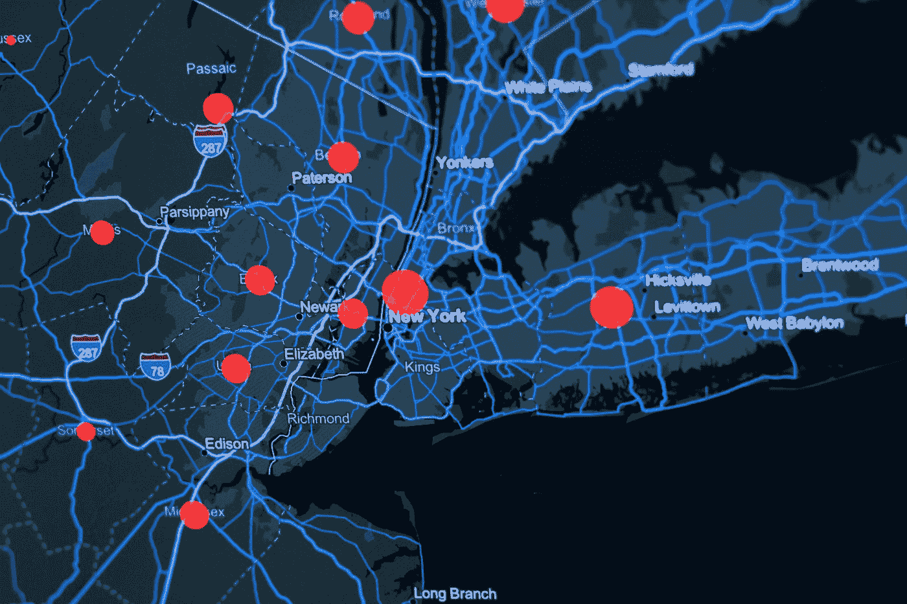
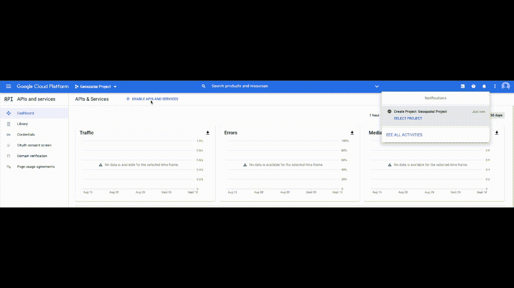
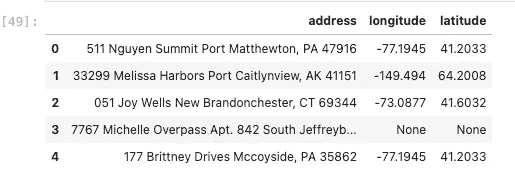

# 使用 Google Maps API 生成地理编码

> 原文：<https://towardsdatascience.com/generating-geocodes-using-google-maps-api-eb56028821a6?source=collection_archive---------16----------------------->

## 地理空间分析。数据科学。ANALYTICS.PYTHON

## 使用 Python 快速获取地址的地理编码



由 [KOBU 机构](https://unsplash.com/@kobuagency?utm_source=medium&utm_medium=referral)在 [Unsplash](https://unsplash.com?utm_source=medium&utm_medium=referral) 拍摄的照片

# 介绍

地理编码是将文本地址转换为地理纬度和经度坐标的过程，这反过来使得操纵和分析大量地理空间数据变得容易。

对于数据科学家来说，了解地理编码有助于以可视化方式绘制地理编码并创建其他要素，例如两点之间的距离和时差。

与其他类型的数据不同，地理空间数据极大地受益于可视化，因为它使邻域或本地网络中模式的出现变得明显。

因此，企业从使用它中获利，但如果该过程涉及手动获取地理编码，则不会。

虽然这个过程可以使用开源包来完成， *OpenStreetMap，* Google Maps API 可能会为更广泛的地址生成更准确的数据。

在本文中，让我们研究如何通过 Python 和 Google Maps API 获得这些地理编码，以加速我们的数据项目。

# 初步:谷歌 API 密钥

使用谷歌地图 API 是要收费的，数据科学家在使用它之前需要了解价格。

为了使用 google maps API，我们需要生成自己的 **API 键**来使用它。

## 第 1 步—转到[谷歌开发者控制台](https://console.developers.google.com/)

您将在这里看到您的仪表板。

## 步骤 2 —创建新项目


作者准备的 GIF

要创建一个新项目，请遵循上面的 GIF。右上角有一个“选择一个项目”的文本。命名项目以更好地管理当前和未来涉及 Google APIs 的项目。

## 步骤 3-启用谷歌地理编码



作者准备的 GIF

浏览 API 库以启用地理编码服务。这被命名为“地理编码 API”。

## 步骤 4 —创建凭据以生成 API 密钥


作者准备的 GIF

启用地理编码 API 服务后，转到**凭证**选项卡并选择“+创建凭证”。创建 API 密钥后，将其复制到 Python 代码中使用。

*您可以重命名 API 并对其进行限制，以确保其安全。对于每个 API 键(铅笔符号)，在“API 键”表下有一个编辑选项来完成此操作。*

# 用于地理编码的 PYTHON 代码

要使用 API 密钥，请确保您已经安装了`googlemaps`包:

```
pip install googlemaps
```

## 步骤 1 —将 GOOGLE MAPS API 密钥存储为变量

```
import googlemaps#Set Google MAPS API_Key
g_API = "API-Key Copied"gmaps_key = googlemaps.Client(key=g_API)
```

## 步骤 2-遍历地址并获取地理编码

在我们的练习中，让我们创建假地址来使用我们的代码:

```
from faker import Faker
import pandas as pdfake = Faker()df = pd.DataFrame(data=[fake.address().replace('\n', " ") for i in range(100)], columns=["address"])# Create columns to store longitude and lattitudedf["longitude"] = None
df["latitude"] = Nonefor i in df.index:
    geocode_obj = gmaps_key.geocode(df.loc[i, "address"])
    try:
        lat = geocode_obj[0]['geometry']['location']['lat']
        lon = geocode_obj[0]['geometry']['location']['lng']
        df.loc[i,'latitude'] = lat
        df.loc[i,'longitude'] = lon
    except:
        lat = None
        lon = None
```

瞧，我们完成了！



图片由作者提供。

# 结束语

地理编码很重要，因为它允许计算机理解我们的参考点。这意味着，有了地理编码，分析和地理空间可视化(geovisualization)成为可能。除此之外，地理编码是独一无二的。

使用我们上面的方法是为我们的地址对象生成地理编码的最快和最可靠的方法之一。但是，有些地址偶尔会显示“无”，因此需要手动检查。然而，根据经验，当地址变量是干净的时，这种情况很少发生，所以在运行上面的代码之前，我们可能想看看我们是如何生成数据的。

查看我的其他与此相关的文章:

[使用谷歌地图应用编程接口和树叶在菲律宾绘制你最喜欢的咖啡店地图](/mapping-your-favorite-coffee-shop-in-the-philippines-using-google-places-api-and-folium-2f9d5ad697bf?source=your_stories_page-------------------------------------)

[空间距离和机器学习](/spatial-distance-and-machine-learning-2cab72fc6284?source=your_stories_page-------------------------------------)

让我知道你的想法！