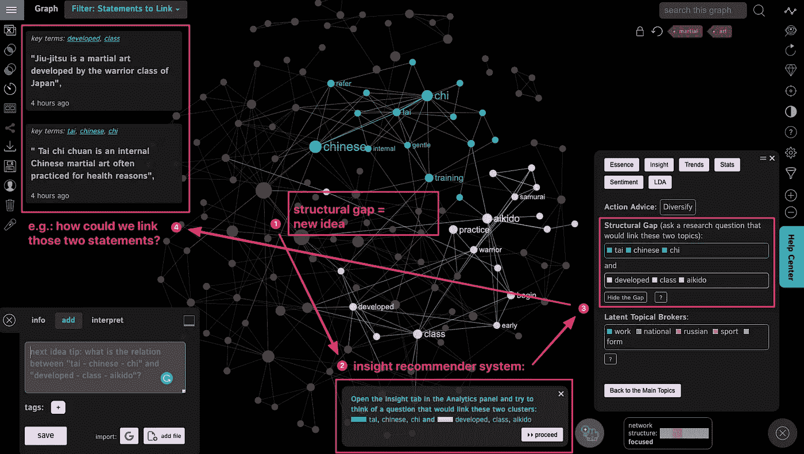
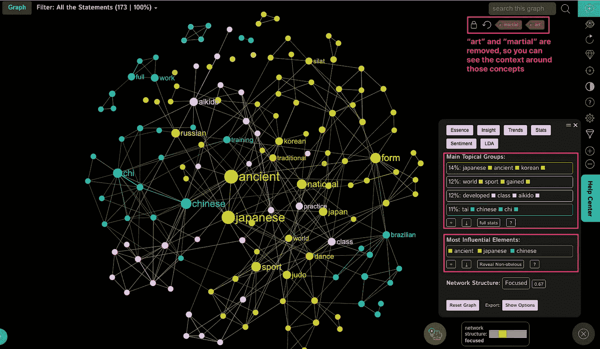
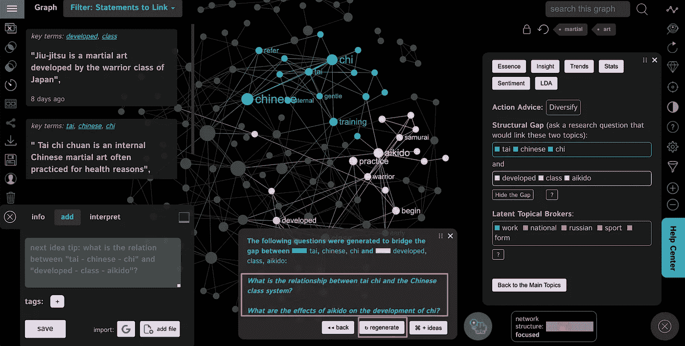
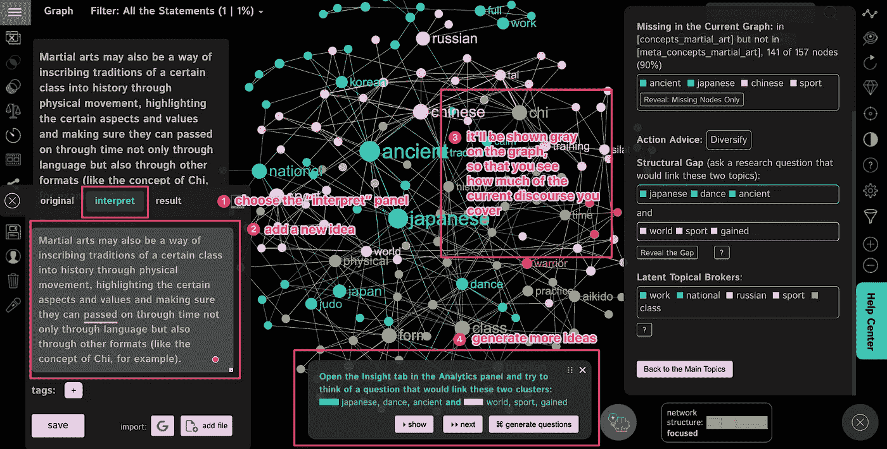
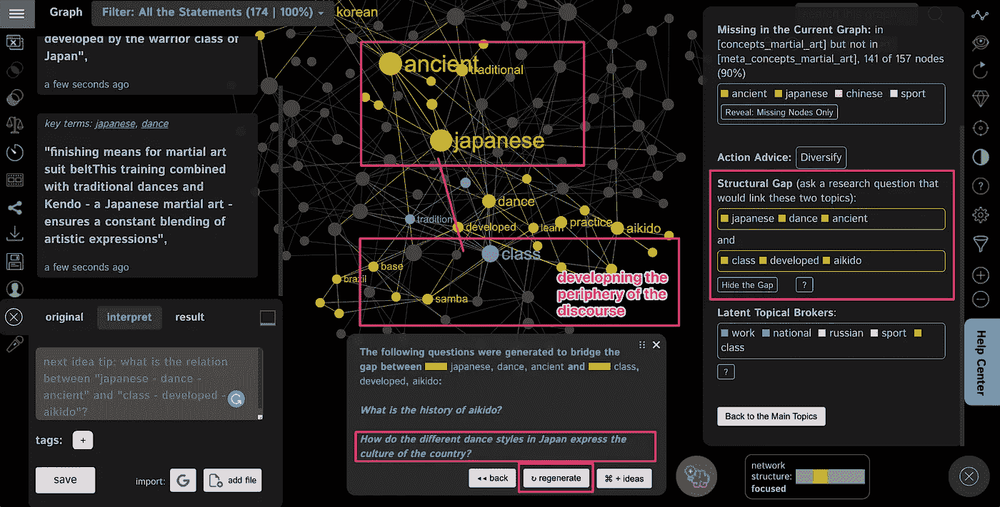
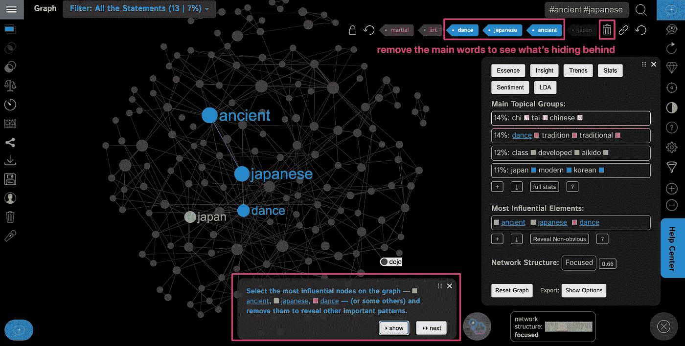
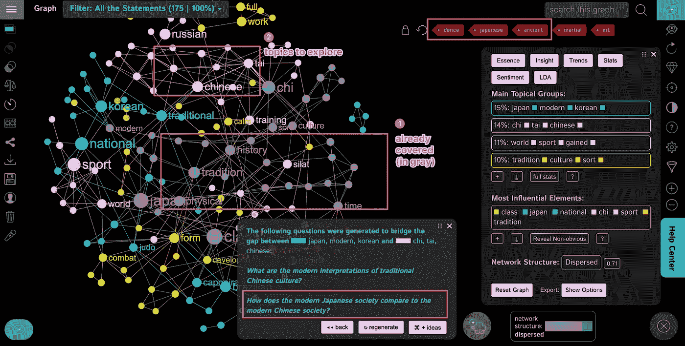
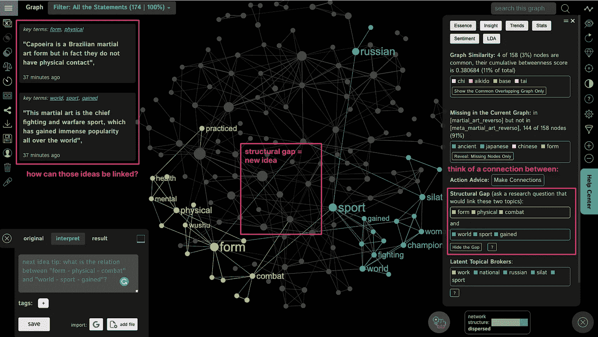
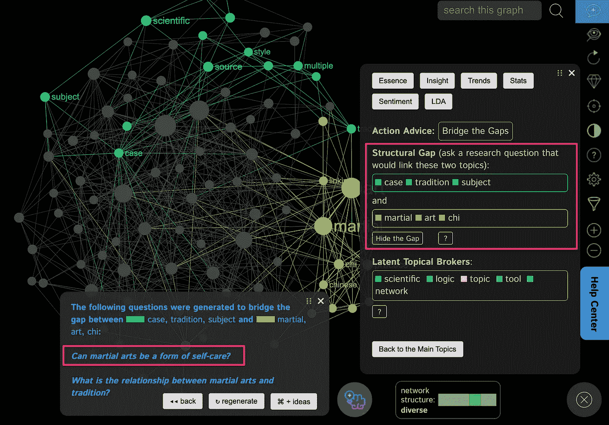

# 通过文本分析和 GPT-3 产生想法

> 原文：<https://towardsdatascience.com/generating-ideas-with-text-analysis-and-gpt-3-687014a0cef1?source=collection_archive---------7----------------------->

## 文本分析通常用于分类任务。然而，我们可以利用对文本结构和内容的洞察，为任何话语产生相关的研究问题和想法。这里是你如何使用 GPT-3 的一点点帮助(如果需要的话)使用 [InfraNodus 文本分析工具](https://infranodus.com)来做到这一点。

使用[文本网络分析工具，如 InfraNodus，](https://infranodus.com)我们可以可视化文本的结构，以揭示话语中存在的差距。用研究问题和假设弥合这些差距将产生新的相关想法，因为它们触及相关主题，并提出它们之间的新联系。

# 新想法=新联系

最令人兴奋的情绪之一是当一个新的想法出现时。这种“灵光一现”的时刻，事情突然以一种前所未有的方式联系起来，通常会带来顿悟和新的理解。有趣的是，这个看似难以捉摸的创作过程实际上可以在文本分析、网络科学的帮助下，以及 GPT-3 人工智能语言生成工具(如 OpenAI 的 Playground(或 API)，Copy)的一些帮助下“按需”执行。艾，或者贾维斯。

一个想法永远不会凭空出现。总会和某件事有关。如果我们用语言来思考，一个想法会把已经存在的概念联系起来。一个新的想法是一种从未有过的联系。

一个**话语**可以表示为一个**网络**，其中****概念**是**节点，**和它们的**同现**是它们之间的**连接**。这是像 [LDA](/latent-dirichlet-allocation-15800c852699#:~:text=Latent%20Dirichlet%20Allocation%20(LDA)%20is%20a%20%E2%80%9Cgenerative%20probabilistic%20model,phrases%20(n%2Dgrams).&text=LDA%20defines%20each%20topic%20as,topics%20as%20you%20deem%20fit.) 这样久经考验的主题建模方法以及像 [word2vec](/introduction-to-word-embedding-and-word2vec-652d0c2060fa) 这样的现代机器学习方法背后的原理。虽然这些模型可能很难直观地理解，但逻辑非常简单。单词一起出现的频率越高，它们在语义上就越接近。经常出现在话语路径上的词在网络中会更有影响力。这种方法在**文本网络分析**中使用，提供了这种工作原理的可视化表示:**

****

**使用 [InfraNodus](https://infranodus.com) 制作的围绕“武术”话题的话语的文本网络可视化。这两个概念都从图中删除了，所以我们可以看到它们周围的环境。你可以[在这里](https://infranodus.com/concepts/martial_art_reverso?background=default&most_influential=bc&maxnodes=150&labelsize=proportional&labelcolor=node&edgestype=line&drawedges=true&drawnodes=true&defaultlabelsize=14&labelsizeratio=2&dynamic=accumulate&cutgraph=1&selected=highlight&stopwords=art+martial)看到现场互动图。**

# **在现有的话语中寻找新的联系**

**假设，我们想要了解更多关于某个主题的知识，比如武术，并生成一个相关的文本，同时提供一个新的视角。**

**首先，我们可以使用多种来源，从简单的谷歌搜索和维基文章开始，到关于该主题的科学出版物的文献综述或关于该主题的深度 SEO 分析。然而，在这种情况下，**我们使用了来自** [**Reverso 的数据。Context**](https://context.reverso.net/translation/english-french/martial+arts) —一个翻译和参考工具，显示使用某个概念的短语。**

> **使用 Reverso 这样的工具的好处在于，它不仅可以用于翻译，还可以用于研究特定查询的上下文。可能最强大的翻译应用 DeepL 是基于 Linguee 开发的，这并不是巧合，Linguee 是一种基于数十亿人工翻译数据库的类似工具。输入一个查询，您将看到使用该查询的短语。**

**上面显示的图表是当前围绕“武术”主题的话语的可视化**，使用上述方法使用 [InfraNodus 文本分析工具](https://infranodus.com)制作(在 [InfraNodus 的白皮书](https://dl.acm.org/doi/10.1145/3308558.3314123)中阅读更多关于其背后的科学)。使用此图表([探索交互式可视化](https://infranodus.com/concepts/martial_art_reverso?background=default&most_influential=bc&maxnodes=150&labelsize=proportional&labelcolor=node&edgestype=line&drawedges=true&drawnodes=true&defaultlabelsize=14&labelsizeratio=2&dynamic=accumulate&cutgraph=1&selected=highlight&stopwords=art+martial)，我们可以看到围绕“武术”主题有 **4 个不同的主题群**(全部用不同的颜色表示):****

*   ****日语、古代语、朝鲜语(地理和时间背景)****
*   ****世界，体育，获得(武术作为一个世界范围的战斗现场)****
*   ****发达，阶级，合气道，实践(武术作为一个战士/社会/实践)****
*   ****太极，中文，气(内部武术，如太极)****

****这让我们很好地理解了当前围绕这一主题的讨论。****

******现在，我们如何增强这种话语？******

****这就是网络表示派上用场的地方。****

****这一论述中的一些概念比形成上述主题群的其他概念彼此更接近。然而，其中一些星团相距甚远。****

> ****如果我们确定了主题群和它们之间的结构间隙，我们就会找到当前话语中缺失的部分。然后，我们可以提出一个研究问题，或者提出一个可以弥合这些差距的假设。****

****因此，我们获得了一个与话语相关的新想法(因为它连接了已经存在的主题)，但也是创新的，因为它提出了一个以前不存在的新连接。****

****我们可以手动或使用类似于 [InfraNodus](https://infranodus.com) 的工具来完成这项工作，该工具具有“洞察”面板，可揭示话语中的结构差距:****

********

****太极(可能是为了健康和幸福而练习的)等内部武术的想法与武术作为战士练习的想法之间存在结构性差距。如果我们问一个问题或提出一个假设，将这些想法(话题群)联系在一起，我们将产生一个与这个特定话语相关的新想法。****

****在我们的特殊情况下，日本“武士/阶级练习”如“合气道”或“柔术”与中国内部练习如“太极”之间存在结构性差异。****

****因此，我们可以自己想出这两组主题之间的联系，提出一个有趣的想法，或者使用 InfraNodus 的基于 GPT-3 的研究问题生成工具来激发我们的想象力:****

********

****使用 InfraNodus 中的自然语言生成器，我们可以生成相关的研究问题，帮助我们进一步探索这个主题。****

****有趣的问题:*“太极与中国的阶级制度有什么关系”**“合气道对气的发展有什么影响”——*做的正是我们之前描述的:把之前没有联系起来的话题串起来。****

> ****在这种情况下，不同之处在于，你不是在使用人工智能为你写作，而是问自己一些有趣的问题，这些问题可以帮助你推进你的想法。****

****基于这些问题，我们可以这样说:****

*****“武术也可能是一种通过身体运动将某个阶级的传统写入历史的方式，突出某些方面和价值观，并确保它们不仅可以通过语言，还可以通过其他形式(如气的概念)通过时间传承。”*****

****为了不打断原始的论述，我们将选择“解释”功能，在这里我们可以在现有图表的顶部进行书写。这让我们看到我们覆盖了多少当前话语，也让我们能够分别分析不同的话语:****

********

****在我们添加这个想法后，推荐系统检测到现在内容有变化，找到当前话语外围的主题，并建议进一步发展它，将它与文本内的相关概念链接起来:****

********

****InfraNodus 现在检测到外围的主题群，并建议链接到与一般话语更相关的另一个主题群。****

****在这种情况下，建议是考虑来自日本的不同舞蹈风格，并想象它们如何也是该国的文化(就像武术一样)。****

****这是一个非常相关和令人兴奋的问题，因为日本确实有多种舞蹈传统，如 Noh theater，但也有更现代的 Butoh 舞蹈，它实际上打破了传统，并提出了一种新的文化，这种文化不是社会编纂的，而是来自情感和精神身体。****

****把这个想法加到图表里。(我们已经覆盖的)灰色区域变得更大，InfraNodus 建议我们删除最流行的术语，看看它们背后隐藏着什么:****

********

****在某一点上， [InfraNodus](https://infranodus.com) 会建议你删除最流行的节点，这样你就可以看到隐藏在它们背后的内容。这将有助于你将注意力集中在文章/话语中不太成熟的概念上。****

****在我们从图表中删除这些节点后，我们可以重新生成研究问题，这些问题现在将帮助我们探索较少被代表的概念和主题(尚未以灰色覆盖)，例如日本和中国文化之间的差异，以及如何通过武术练习反映出来:****

********

****在我们移除了更受欢迎的话题后，我们将注意力集中在代表性较低的话题上，将我们引向不一定与“武术”概念相关的研究问题，但事实上，这些问题可以以一种非常有趣的方式对话语做出贡献(例如，国家之间的文化差异如何通过武术练习表达出来)****

****之后，我们可以跟随 InfraNodus insight 推荐系统，在图表中导航，一路生成研究问题:****

********

****另一个发现的结构性缺口可以用新的想法来弥补。****

****这个过程重复了无数次，也使用了多种话语来源(更多细节见我们关于文本分析的[案例研究](https://noduslabs.zendesk.com/knowledge/articles/4403600333330/en-us?brand_id=360001285019))。****

****基本工作流程是:****

1.  ****找到结构差距(使用图表、洞察推荐器或分析>洞察面板)****
2.  ****查看尚未连接的主题集群****
3.  ****想一个能以新的方式连接这些集群的问题****
4.  ****写下你想法或假设****
5.  ****图表和统计数据将重新加载，新的结构性缺口将被识别。****
6.  ****重申****
7.  ****从图中删除最受欢迎的节点，看看新的命题****
8.  ****将删除的节点放回图中。****
9.  ****为你的主题添加更多的数据源(例如，科学研究，谷歌搜索结果)****
10.  ****比较您创建的不同图表，找出它们之间的差距。****

****最后，一旦你完成了，你可以导出你的文本来编辑它，并在你选择的文本编辑器中进行最后的润色。****

****在我们的案例中，作为探索“武术”理念的过程的结果，我们得出了一个有趣的结论，这是我们参与的一个艺术项目的一个组成部分，该项目将编舞、技术和武术联系在一起。然后我们将结论导出为文本，编辑语法和风格，并作为一篇文章发布在我们项目 [8os.io](https://8os.io) 的网站上。****

****如你所见，对话语的结构性洞察可以提供关于缺失部分的无价信息。利用我们的创造力(在 AI 的帮助下:)我们可以提出一些有趣的想法，这些想法可以增强现有的话语，并带来一些新的东西。****

> ****这里的优势在于，我们的方法还将通过视觉网络界面揭示它正在做什么的逻辑——这是我们今天经常遇到的许多基于人工智能的黑匣子所缺少的。****

****另一个优势是，你不是用人工智能取代你自己的大脑，而是将人工智能用作智能对话伙伴，帮助你提出正确的问题，帮助你探索想法和学习新的东西。****

****附言（同 postscript）；警官（police sergeant）****

****如果不对这篇文章进行同样的处理，那就不公平了，所以我们开始吧:****

********

****正如我们所看到的，系统提出了一个需要进一步探索的研究问题:*武术如何成为一种自我保健的形式？*****

****有趣的是，也许这是一个全新讨论武术的话题，不仅关注自卫和传承传统，还关注自我护理和治疗实践的想法。****

## *******如果你喜欢这种方法，你可以用自己的文本和想法在***[***【InfraNodus.Com】***](https://infranodus.com)***上尝试一下。如果您想激活*** GPT-3 研究问题生成器，您可以 ***联系我们(通过 Twitter***[***@ noduslabs***](https://twitter.com/noduslabs)***或*** [***直接***](https://support.noduslabs.com)***)——我们将很高兴地向所有致力于数据科学的读者开放！*******