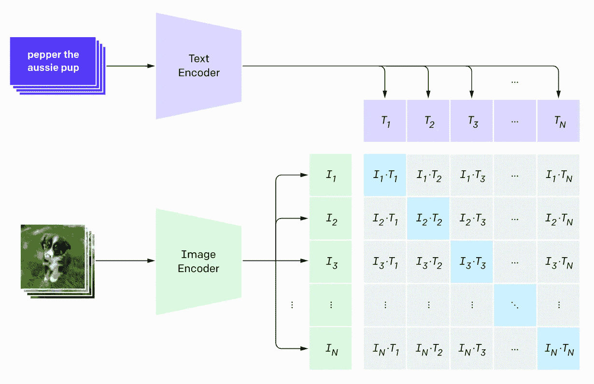
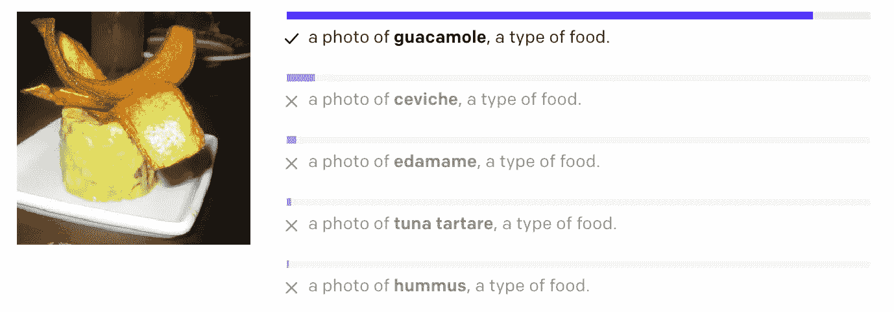
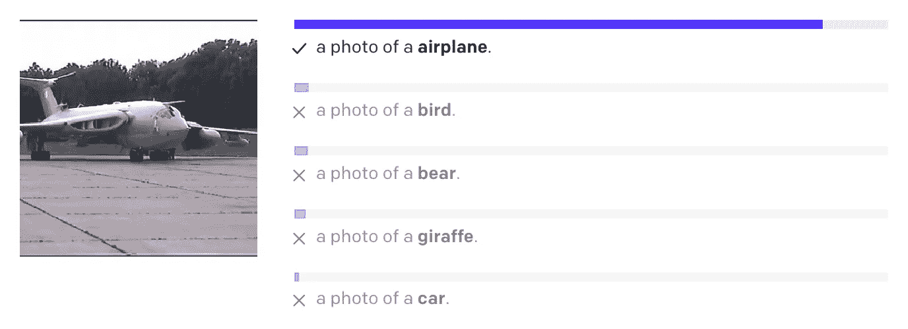
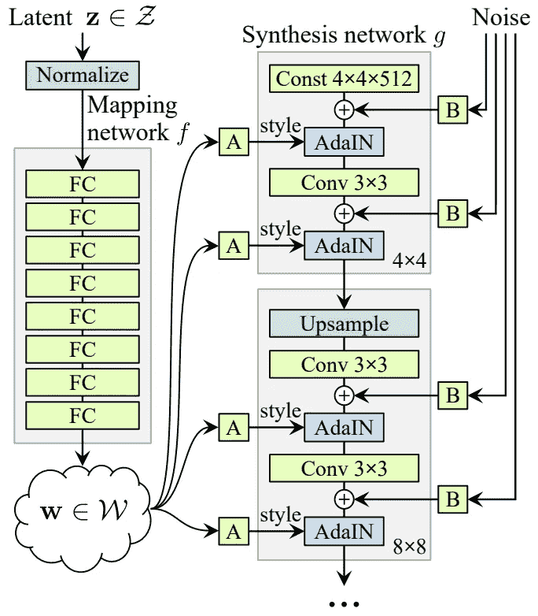
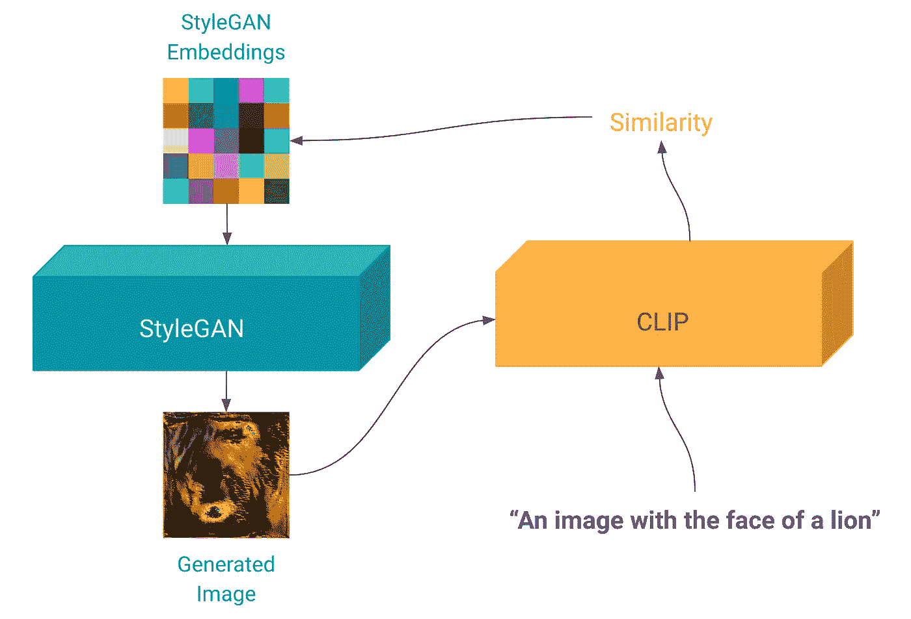
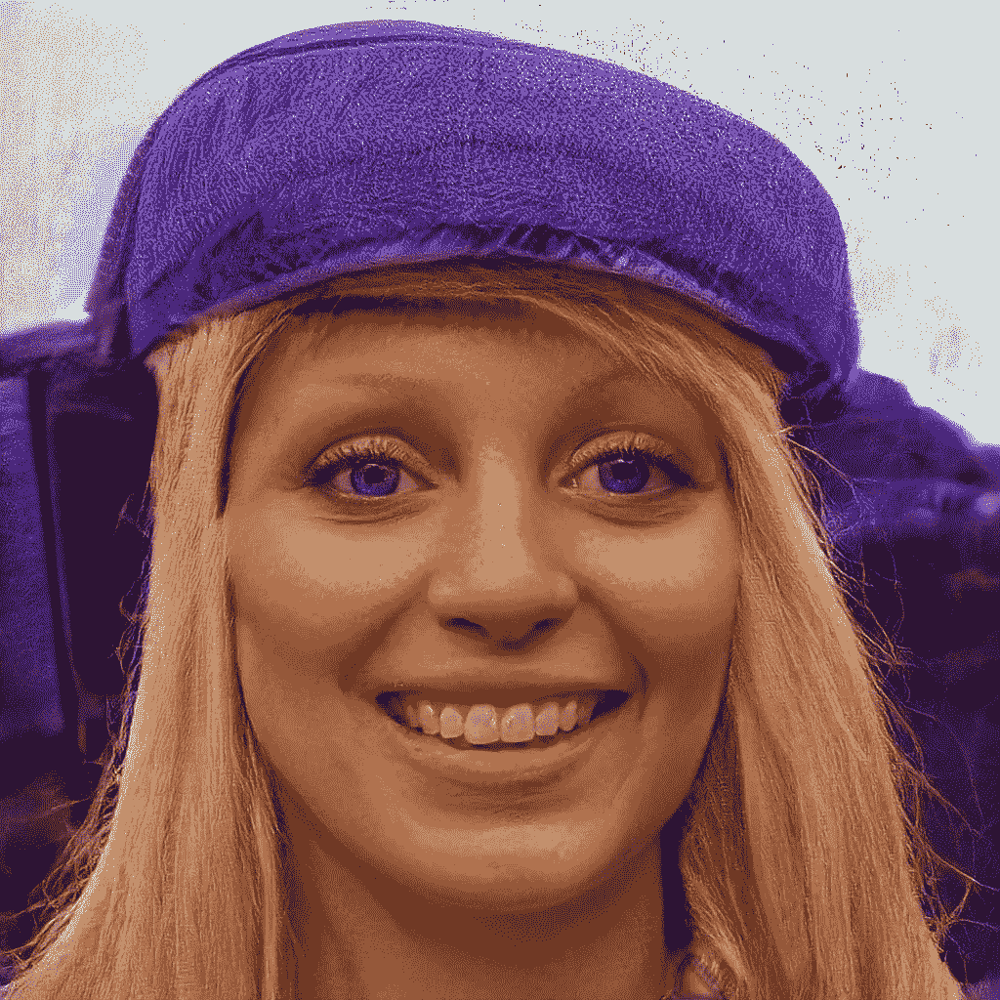
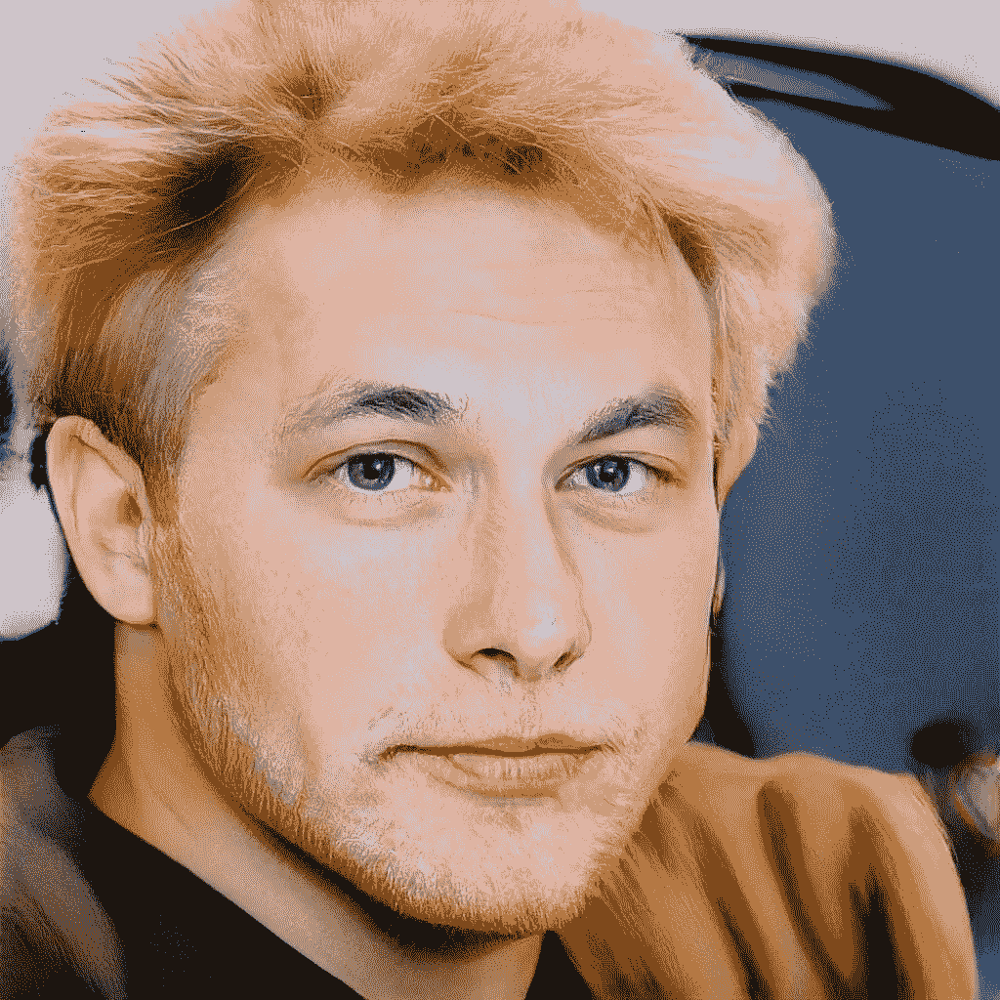
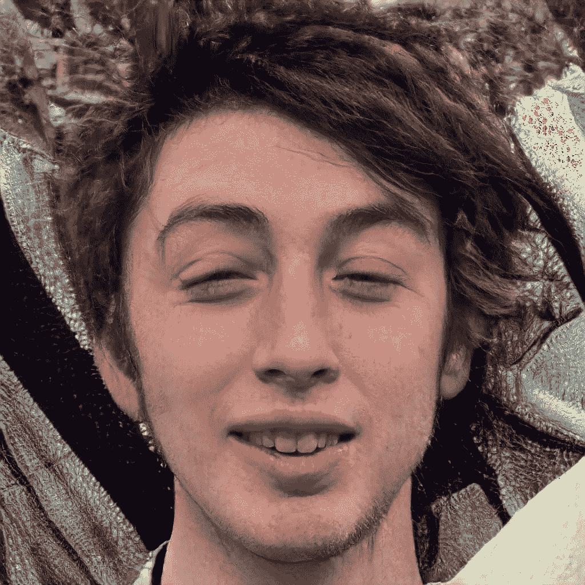
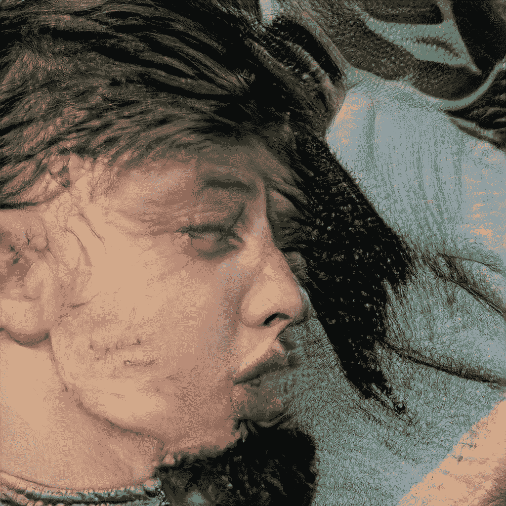

# 使用 CLIP 和 StyleGAN 从提示生成图像

> 原文：<https://towardsdatascience.com/generating-images-from-prompts-using-clip-and-stylegan-1f9ed495ddda?source=collection_archive---------7----------------------->

读完这篇文章你会知道…

*   CLIP 如何工作一目了然。
*   StyleGAN 工作原理一览。
*   …如何将它们组合起来，根据提示生成面。

你可以在这里找到这篇文章中使用的代码。

# 夹子

[*对比语言——图像预训练*](https://openai.com/blog/clip/) *(剪辑)——*呈现于[从自然语言监督中学习可转移视觉模型](https://cdn.openai.com/papers/Learning_Transferable_Visual_Models_From_Natural_Language_Supervision.pdf)——由 OpenAI 于 2021 年 1 月出版。他们的方法提出利用自然语言来提高图像分类任务的深度学习模型的通用性和鲁棒性。他们能够在零射击设置的情况下，在多个基准测试中产生最先进的性能，这确实令人印象深刻。

CLIP 背后的主要思想是预先训练一个神经语言模型和一个图像分类模型，联合使用从互联网上提取的大量图像数据及其各自的标题。在下图中,“文本编码器”代表语言模型,“图像编码器”代表图像分类模型。

图片来自 OpenAI 的原[博客](https://openai.com/blog/clip/)。

他们的目标是构建一个矩阵，其中每个值代表每个提示图像对之间的相似性得分——在图像中计算为 I * T——并使用它来训练语言和视觉模型，以便它们最大化对应于正确对的位置的值，即图像中的对角线值。例如，如果位置 0 处的文本是“pepper the aussie pup ”,而位置 0 处的图像表示该特定内容，则 CLIP 将训练这两个模型来创建最大化其相似性的表示。

一旦该预训练过程完成，他们可以使用预训练的视觉模型来生成任何给定输入图像的表示，并将其与使用语言模型从几个提示获得的几个文本嵌入进行比较。具有最大相似性值的文本表示将被选为更好地表示图像内容的文本表示。使用这种技术，您可以使用 ImageNet 的一千个类别作为句子，并在零镜头设置中解决分类任务。

以下是模型如何在给定这组提示的情况下成功分类图像的一些示例。

图片来自 OpenAI 的原[博客](https://openai.com/blog/clip/)。

图片来自 OpenAI 的原[博客](https://openai.com/blog/clip/)。

# StyleGAN

StyleGAN 是一个著名的生成对抗网络模型，能够生成高分辨率的超逼真图像。下面是这个模型的结构。

图片来源于 StyleGAN [报](https://arxiv.org/pdf/1812.04948.pdf)。

从这个模型中主要得到的是，给定一个潜在向量 **z** ，我们可以使用映射网络来生成另一个潜在向量 **w** ，它可以被馈送到合成网络中，并产生最终的图像。出于我们的目的，我们将使用一个经过训练的 StyleGAN 来生成人脸。

# 根据提示生成图像

下面是我使用 CLIP 和 StyleGAN 从提示中生成人脸的架构。

图片作者。

这个想法很简单，我们将从 StyleGAN 的 **w** 潜在向量的随机值开始生成一幅图像。结果将与任意提示一起传递给 CLIP。CLIP 将生成一个分数，表示该图像在提示中表现内容的程度。该值将用于更新 **w** ，这将生成另一个图像，该图像将反复重复该循环，直到我们确定生成的图像与提示足够相似。

*编辑*:将使用梯度下降和反向传播更新 **w** 的值，如同它们是神经网络中的权重。

# **结果**

以下是使用这种简单方法获得的一些结果。

> “一个有着金发紫眼的女人的脸的图像”

图片作者。

> “一张埃隆·马斯克的脸和一头金发的照片”

图片作者。

最后，为了给这个模型带来一些乐趣:

> "一张瘾君子的脸"

图片作者。

有趣的是，前一个提示符的最终结果出现在下图中——这种应变可能是好的！

图片作者。

你可以在我的推特账号上找到更多的样本。

# 结论

语言模型的力量不仅限于文本问题。他们从大量数据中提取概念的能力可以扩展到其他领域，并产生令人惊讶的结果，就像本文中介绍的那样，而且方法非常简单！

在看到像 GPT-3 这样的模型后，想想计算机视觉领域将会出现什么是令人兴奋的。