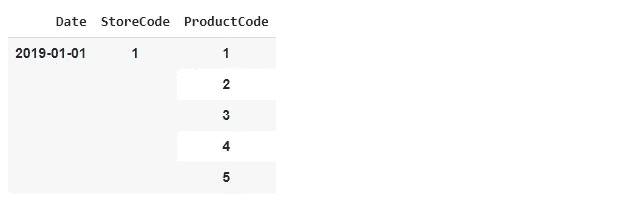
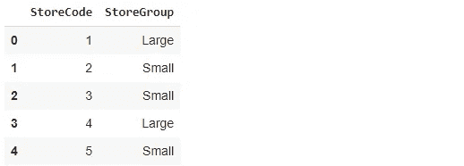
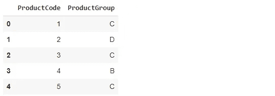
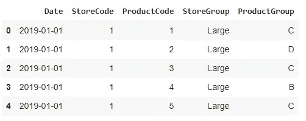
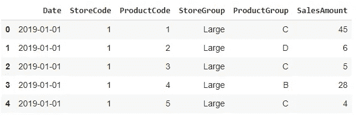
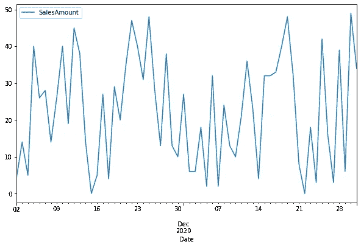

# 使用 Python Pandas 生成模拟销售数据

> 原文：<https://towardsdatascience.com/generating-mock-sales-data-with-python-pandas-c904035782fe?source=collection_archive---------20----------------------->

## 数据科学的一切都是从数据开始的


照片由 [Unsplash](https://unsplash.com/s/photos/grocery?utm_source=unsplash&utm_medium=referral&utm_content=creditCopyText) 上的[实体模型图形](https://unsplash.com/@mockupgraphics?utm_source=unsplash&utm_medium=referral&utm_content=creditCopyText)拍摄

数据科学生态系统中有几个软件工具和软件包。这些工具加速了日常流程，并帮助我们管理、探索和分析数据。

无论您使用什么工具，无论您从事什么项目，数据科学中的一切都始于数据。没有适当的数据，您的数据产品很可能会失败。

在学习数据科学和实践软件工具时，寻找数据来玩有时会成为一个挑战。虽然网上有一些免费的数据资源，但它们可能并不总是符合你的需求。

在本文中，我们将使用 Pandas 库生成模拟销售数据。该数据将包含一家连锁店的每日销售数据。我们将使用随机数来分配商店和产品的销售值。

数据可能无法展示在现实生活销售数据中可以观察到的典型特征，如季节性或趋势。但是，您可以用它来练习许多工具和技术。

此外，在生成数据时，我们将使用几个 Pandas 函数和方法。因此，这对熊猫来说也是一个很好的练习。

您将有机会练习以下主题:

*   如何创建熊猫数据框
*   创建 NumPy 数组的不同方法
*   取数组和列表的笛卡尔积
*   合并熊猫数据框
*   用熊猫创建线形图

让我们从导入所需的库开始。

```
import numpy as np
import pandas as pd
from random import shuffle
```

Python 随机包中的洗牌模块可以用来洗牌。

下一步是创建商店和产品代码。

```
store_codes = np.arange(1,10)
product_codes = np.arange(1,101)
```

商店代码从 1 开始，一直到 9。我们有 100 种产品，从 1 开始，一直到 100。

我们还需要一个日期范围，因为这是一个时间序列数据。有许多不同的方法来执行这项任务。我会用熊猫的 date_range 函数。

```
date_range = pd.date_range(start = "2019-01-01", end = "2020-12-31", freq="D")
```

我们的产品系列涵盖了两年的时间。freq 参数用于确定增量大小。“D”代表日，因此我们将拥有 2019 年和 2020 年的每日销售数据。

我们有 2 年的时间，9 家商店，100 种产品。每天，我们的数据将包含每个产品-商店对的销售额。因此，我们需要生成日期范围、商店代码和产品代码数组的笛卡尔乘积。

一种方法是通过取这些数组的笛卡尔积来创建一个多重索引。然后，我们可以使用它来创建数据框。

```
index = pd.MultiIndex.from_product(
   [date_range, store_codes, product_codes],
   names = ["Date", "StoreCode", "ProductCode"]
)sales = pd.DataFrame(index = index)sales.head()
```



(图片由作者提供)

这是销售数据框架的索引。为了从这个多索引创建列，我们只需要使用 reset_index 函数。

```
sales.reset_index(inplace=True)sales.head()
```


(图片由作者提供)

销售数据框包含每个日期、商店代码和产品代码组合的一行。因此，行数应该等于每个数组中项目数的乘积。

```
len(sales) == len(store_codes) * len(product_codes) * len(date_range)
Truelen(sales)
657900
```

我们刚刚证实了我们的预期。我们有一个 657k 行的数据帧。

在零售业中，对商店和产品进行分组是一种常见的做法。让我们从商店开始。

```
store_groups = ["Small","Medium","Large"]*3
shuffle(store_groups)stores = pd.DataFrame({
   "StoreCode": np.arange(1,10),
   "StoreGroup": store_groups
})stores
```



商店组(作者图片)

由于有 9 家商店，我们创建了一个包含 9 个元素的列表，分为 3 个类别。shuffle 函数在适当的位置打乱这个列表。否则，将保留基本列表的顺序。

我们可以类似地分配产品组。

```
product_groups = ["A","B","C","D"] * 25
shuffle(product_groups)products = pd.DataFrame({
   "ProductCode": np.arange(1,101),
   "ProductGroup": product_groups
})products.head()
```



产品组(图片由作者提供)

我们有 100 种不同的产品代码，分为 4 类。

我们可能需要分析不同商店和产品组的销售业绩。因此，这些类别需要合并到销售数据框架中。

熊猫的合并功能可以用来完成这个任务。

```
sales = pd.merge(sales, stores, on="StoreCode", how="left")sales = pd.merge(sales, products, on="ProductCode", how="left")sales.head()
```



销售数据框(作者图片)

我们已经到了数据生成的最后一步，我认为这是最重要的一步。我们需要增加销售额。

你的选择是无限的。一个简单的方法是用随机整数创建一个 NumPy 数组，并将其添加到销售数据框架中。

```
size = len(sales)sales_amount = np.random.randint(0, 50, size=len(sales))sales["SalesAmount"] = sales_amountsales.head()
```



销售数据框(作者图片)

“销售额”列由 0 到 50 之间的随机整数组成。这完全是随机的，所以我们无法观察到我们销售的任何趋势或季节性。

您可以使用 to_csv 函数将此数据框保存为 csv 文件:

```
sales.to_csv("mock_sales.csv", header=True, index=False)
```

让我们通过绘制一个产品商店对的销售额来检查一下。下面的代码创建了一个特定对在过去两个月的销售额的折线图。

```
sales[
     (sales.StoreCode==1) &
     (sales.ProductCode==5) &
     (sales.Date > "2020-11-01")
     ].plot(x="Date", y="SalesAmount", kind="line", figsize=(10,6))
```



(图片由作者提供)

我们可以清楚地观察到销售额的随机性。

## 结论

在创造销售额时，我们可以更有创意一点。一些随机噪声或季节性可以添加到这些值中。我把那部分留给你。

我们有模拟销售数据，但我们还没有对它进行任何探索性的数据分析。这将是下一篇文章的主题。敬请期待！

感谢您的阅读。如果您有任何反馈，请告诉我。