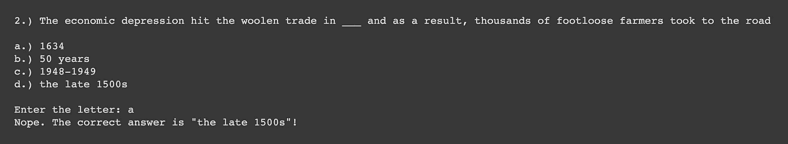

# 用 TigerGraph 从一篇文章中生成选择题

> 原文：<https://towardsdatascience.com/generating-multiple-choice-questions-from-a-passage-with-tigergraph-9dbb473bb505?source=collection_archive---------36----------------------->

## 如何使用 TigerGraph 生成选择题

> 注意:在这篇博客中，我们将使用在[这篇博客](https://shreya-chaudhary.medium.com/creating-a-google-drive-notes-graph-using-tigergraph-and-spacy-75fe5334a31)中创建的图表。

# 概观

我最喜欢的为考试和测验学习的方法之一是制作练习题和/或虚拟抽认卡。然而，提出问题通常是乏味的，而且会占用我大部分时间。因此，我认为根据一篇文章自动创建问题的过程会有所帮助。当然，我能够利用图形数据库的力量把它们放在一起。所以，让我们开始讨论如何去做吧！

# 第一部分:连接到您的图表

## 第一步:开始你的解决方案

首先，如果您的解决方案尚未启动，您需要启动它。为此，请前往 https://tgcloud.io/的[并导航至“我的解决方案”选项卡。然后按下“动作”下的方框，并按下“开始”按钮。](https://tgcloud.io/)

> 注意:这可能需要几分钟来加载。

一旦你在状态下得到“准备好”，那么你就准备好继续前进了！

## 第二步:连接到您的解决方案

接下来，导航到一个 Google Colab 笔记本。

<https://colab.research.google.com/>  

首先，安装并导入 pyTigerGraph。

```
!pip install pyTigerGraphimport pyTigerGraph as tg
```

接下来，创建您的 TigerGraphConnection。在参数中，传递您在创建解决方案时设置的子域和密码。图形名称将是我们之前设置的(NotesGraph ),然后我们将生成一个 API 令牌。

> 注意:从 7 月 28 日起，你需要包含一个 beta=True 来运行它。在未来的 pyTigerGraph 版本中，这种情况可能会有所改变。

```
conn = tg.TigerGraphConnection(host="https://SUBDOMAIN.i.tgcloud.io/", password="PASSWORD", graphname="NotesGraph", beta=True)conn.apiToken = conn.getToken(conn.createSecret())
```

太好了！现在我们已经准备好编写查询了！

# 第二部分:创建完整图表的问答

这里，我们将编写几个问题来生成一些查询。

## 查询 I:查找选项

我们将创建的第一个查询将为一个问题查找其他多项选择选项。在过去的博客中，我们用 SpaCy 来标识每个词的“类型”；我们将使用这种类型来获取相同或相似类型的单词。

```
conn.gsql('''USE GRAPH NotesGraphDROP QUERY findOptionsCREATE QUERY findOptions(Vertex<Entity_Name> word) FOR GRAPH NotesGraph {Seed = {word};Res = SELECT tgt FROM Seed:s - (ENTITY_NAME_ENTITY:e) - Entity:tgt;Options = SELECT tgt FROM Res:s - (ENTITY_NAME_ENTITY:e) - Entity_Name:tgt
          WHERE word.entity_name != tgt.entity_name;PRINT Options;PRINT Seed;}INSTALL QUERY findOptions''')
```

我们来分析一下。在标题中，我们接受一个顶点实体名称的输入。

```
CREATE QUERY findOptions(Vertex<Entity_Name> word) FOR GRAPH NotesGraph
```

我们将使用输入作为种子，或者我们开始的地方。

```
Seed = {word};
```

接下来，我们将缩小以获取实体顶点。

```
Res = SELECT tgt FROM Seed:s - (ENTITY_NAME_ENTITY:e) - Entity:tgt;
```

然后，我们将找到连接到实体的其他实体名称顶点，不包括实体名称本身。

```
Options = SELECT tgt FROM Res:s - (ENTITY_NAME_ENTITY:e) - Entity_Name:tgt
          WHERE word.entity_name != tgt.entity_name;
```

最后，我们将打印出选项和输入。

```
PRINT Options;PRINT Seed;
```

而且完美！这将返回选项和输入的值。

总之，该查询将从任何文档中获取任何相似的潜在答案选择。稍后，我们将筛选答案选项，以防有人只想研究一个文件夹或一个文档。

## 查询二:获取句子

现在，让我们用不同的句子来创造填空题。我们将传递一个限制参数，即我们想要生成的句子数量。

```
conn.gsql('''USE GRAPH NotesGraphDROP QUERY getSentencesCREATE QUERY getSentences(INT lim) FOR GRAPH NotesGraph {TYPEDEF TUPLE<STRING sentence, STRING entity> OPTIONS;
HeapAccum<OPTIONS> (lim, entity DESC) @@opt;
SumAccum<INT> @connected_entities;Seed = {Entity_Name.*};Res = SELECT tgt FROM Seed:s - (SENTENCE_ENTITY_NAME:e) - Sentence:tgt
      ACCUM tgt.@connected_entities+=1, @@opt+=OPTIONS(tgt.setence, s.entity_name)
      HAVING tgt.@connected_entities > 0;PRINT @@opt AS Sentence_Options;}INSTALL QUERY getSentences''')
```

再一次，让我们来分析一下。

首先，我们将创建一个 HeapAccum。HeapAccum 必须接受一个 TYPEDEF 元组，我们将把它作为一个句子和一个实体。

```
TYPEDEF TUPLE<STRING sentence, STRING entity> OPTIONS;
HeapAccum<OPTIONS> (lim, entity DESC) @@opt;
```

接下来，我们将创建一个 SumAccum，我们将使用它来计算每个句子连接了多少个实体。为此，我们要做的就是确保我们提取的句子中至少有一个实体。

```
SumAccum<INT> @connected_entities;
```

我们将从抓取所有的实体名称顶点开始。

```
Seed = {Entity_Name.*};
```

然后我们将抓取所有连接到 Entity_Name 顶点的句子。然后我们将有两个累加器。第一个将计算有多少实体连接到句子(以确保不止一个，如 having 子句所示)。第二个将向 HeapAccum 添加实体和句子。

```
Res = SELECT tgt FROM Seed:s - (SENTENCE_ENTITY_NAME:e) - Sentence:tgt
      ACCUM tgt.@connected_entities+=1, @@opt+=OPTIONS(tgt.setence, s.entity_name)
      HAVING tgt.@connected_entities > 0;
```

完美！最后，我们将把 HeapAccum 作为句子选项打印出来。

```
PRINT @@opt AS Sentence_Options;
```

现在我们有了获取句子和多项选择选项的查询，让我们把它们放在一起。

## Python 函数:提出问题

最后，让我们将这两个查询放在一起，创建一个基于文本的交互式 Python 函数。

```
import randomres = conn.runInstalledQuery("getSentences", params={"lim": 100})[0]["Sentence_Options"]
random.shuffle(res)pref = ["a", "b", "c", "d"]
let_to_num = {let: num for num, let in enumerate(pref)}for num in range(5): sentence = res[num]["sentence"]
   entity = res[num]["entity"]
   opts = conn.runInstalledQuery("findOptions", {"word": entity}) similar_words = [i["v_id"] for i in opts[0]["Options"]]
   random.shuffle(similar_words)
   similar_words = similar_words[:3]
   similar_words.append(opts[1]["Seed"][0]["v_id"])
   random.shuffle(similar_words) print(f'{num+1}.) {sentence.replace(entity, "___")}')
   print("\n".join([f"{let}.) {opt}" for let, opt in zip(pref, similar_words)]))
   print("")
   ans = input("Enter the letter: ").lower() if similar_words[let_to_num[ans]] == entity:
      print("Correct!")
   else:
      print(f"Nope. The correct answer is \"{entity}\"!") print("\n\n\n")
```

我们来分析一下。首先，我们将抓取一定数量的句子，然后使用 Python 的随机函数将它们打乱。

```
import randomres = conn.runInstalledQuery("getSentences", params={"lim": 100})[0]["Sentence_Options"]
random.shuffle(res)
```

接下来，我们将为答案选项创建一个前缀数组，然后创建一个字典。

```
pref = ["a", "b", "c", "d"]
let_to_num = {let: num for num, let in enumerate(pref)}
```

然后我们将循环所有的句子选项。

```
for num in range(5):
```

接下来，我们将抓住句子、实体和选项。

```
sentence = res[num]["sentence"]
entity = res[num]["entity"]
opts = conn.runInstalledQuery("findOptions", {"word": entity})
```

然后，我们将混合答案选项，选择三个，然后添加我们的选择，并洗牌。

```
similar_words = [i["v_id"] for i in opts[0]["Options"]]
random.shuffle(similar_words)
similar_words = similar_words[:3]
similar_words.append(opts[1]["Seed"][0]["v_id"])
random.shuffle(similar_words)
```

最后，我们将开始打印出这些值。我们将提出问题，然后打印出答案并提示答案。

```
print(f'{num+1}.) {sentence.replace(entity, "___")}')
print("\n".join([f"{let}.) {opt}" for let, opt in zip(pref, similar_words)]))
print("")
ans = input("Enter the letter: ").lower()
```

如果答案是正确的，那么我们就说正确。如果不是，我们就说正确答案。

```
if similar_words[let_to_num[ans]] == entity:
   print("Correct!")
else:
   print(f"Nope. The correct answer is \"{entity}\"!")
```

完美！现在，您可以运行单元并与您的问答脚本进行交互。



示例问题

# 第三部分:祝贺你！

恭喜你。如果你完成了这个，你现在可以从你的笔记中创建选择题！

点击此处查看完整的 Colab:

<https://colab.research.google.com/drive/12az8ahoX5FQu6-ARGYiwbyFD7B3LPIZV?usp=sharing>  

如果你有任何问题，发布到 TigerGraph 的社区页面。

<https://community.tigergraph.com/>  

谢谢大家！期待这个系列的下一篇博客！