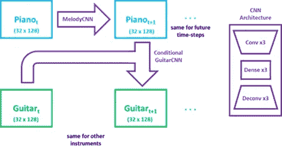
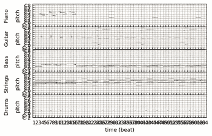
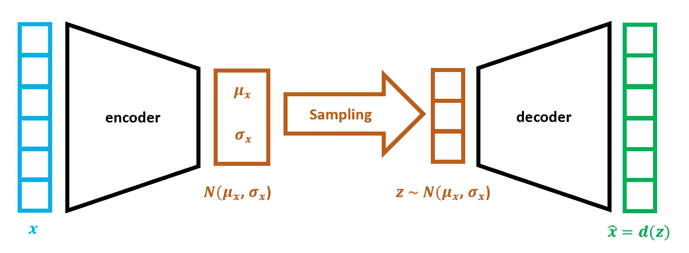
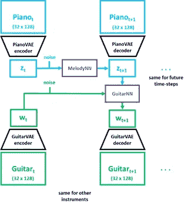
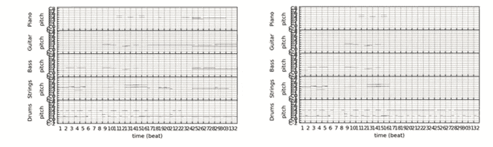
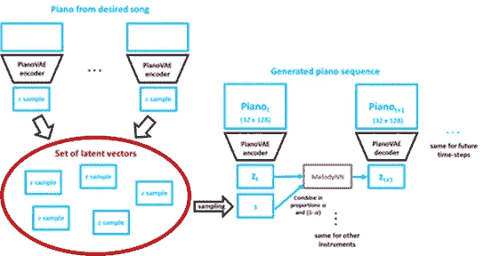
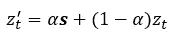

# 使用深度学习生成音乐

> 原文：<https://towardsdatascience.com/generating-music-using-deep-learning-cb5843a9d55e?source=collection_archive---------0----------------------->

## [思想和理论](https://towardsdatascience.com/tagged/thoughts-and-theory)

## 引入新的基于 VAE 的架构来生成新颖的音乐样本

照片由[雷兹利](https://unsplash.com/@rezli?utm_source=medium&utm_medium=referral)在 [Unsplash](https://unsplash.com?utm_source=medium&utm_medium=referral) 上拍摄

*深度学习从根本上改变了计算机视觉和自然语言处理领域，不仅在分类方面，而且在生成任务方面，使人们能够创建令人难以置信的逼真图片和人工生成的新闻文章。但是音频领域——或者更具体地说——音乐领域呢？在这个项目中，我们的目标是创建新的神经网络架构来生成新的音乐，使用来自 Lakh Piano 数据集的 20，000 个不同流派的 MIDI 样本，Lakh Piano 数据集是最近音乐生成任务的流行基准数据集。*

这个项目是由宾夕法尼亚大学大四学生艾萨克·塔姆 *和* [*马修·金*](https://medium.com/@mattmkim) *共同完成的。*

**背景**

使用深度学习技术的音乐生成在过去二十年中一直是一个有趣的话题。与图像相比，音乐在三个主要方面被证明是一个不同的挑战:首先，音乐是时间性的，具有跨时间依赖的层次结构。其次，音乐由多种乐器组成，这些乐器相互依存，并随着时间的推移而展开。第三，音乐被分为和弦、琶音和旋律——因此每个时间步长可能有多个输出。

然而，音频数据有几个属性，使它们在某些方面熟悉深度学习中的传统研究(计算机视觉和自然语言处理，或 NLP)。音乐的序列性质让我们想起了 NLP，我们可以用递归神经网络来处理它。还有多个音频“通道”(就音调和乐器而言)，这让人想起卷积神经网络可以用于的图像。此外，深度生成模型是令人兴奋的新研究领域，具有创建真实合成数据的潜力。一些例子是变分自动编码器(VAEs)和生成对抗网络(GANs)，以及 NLP 中的语言模型。

大多数早期音乐生成技术都使用递归神经网络(RNNs)，它自然地包含了时间上的依赖性。 [Skuli](/how-to-generate-music-using-a-lstm-neural-network-in-keras-68786834d4c5) (2017)使用 LSTMs 以与语言模型相同的方式生成单乐器音乐。同样的方法也被[尼尔森](https://ai.plainenglish.io/building-a-lo-fi-hip-hop-generator-e24a005d0144) (2020)使用，他改编这种方法来产生高保真音乐。

最近，卷积神经网络(CNN)被用于生成音乐，并取得了巨大的成功，2016 年 DeepMind 展示了 WaveNet 的有效性，它使用扩张卷积来生成原始音频。[杨](https://arxiv.org/abs/1703.10847) (2017)创建了 MidiNet，它使用深度卷积生成对抗网络(DCGANs)来生成多乐器音乐序列，这些音乐序列可以基于前一小节的音乐以及当前小节的和弦。董在 2017 年的 MuseGAN 中进一步发展了 GAN 的概念，使用多个发生器来实现尊重乐器之间依赖关系的合成多乐器音乐。董使用 Wasserstein-GAN 与梯度惩罚(WGAN-GP)更大的训练稳定性。

最后，随着注意力网络和变形金刚在自然语言处理方面的最新进展，人们也尝试将变形金刚应用于音乐生成。Shaw (2019)创建了 MusicAutobot，它使用 BERT、Transformer-XL 和 Seq2Seq 的组合来创建一个多任务引擎，既可以生成新的音乐，也可以在其他乐器的条件下创建和声。

**数据集**

我们的数据来自 [Lakh Pianoroll 数据集](https://salu133445.github.io/lakh-pianoroll-dataset/)，这是一个由 174，154 个多轨道 Pianoroll 组成的集合，来自 Lakh MIDI 数据集，由中央研究院 IT 创新研究中心的音乐和人工智能实验室管理。我们使用了数据集的 LPD 5 版本，其中包括钢琴、鼓、吉他、贝斯和弦乐的曲目，使我们能够生成复杂而丰富的音乐，并展示我们的生成模型在不同乐器之间编排音乐的能力。我们使用 Lakh Pianoroll 数据集的净化子集，其中包括 21，245 个 MIDI 文件。每个文件都有相应的元数据，允许我们确定每个文件的信息，如艺术家和标题名称。

**基线法:用 RNNs 进行下一次笔记预测**

为了建立一个我们可以改进的音乐生成的基线，我们使用了递归神经网络(RNN)，这是一种现有的易于复制的方法。生成音乐被公式化为下一个音符预测问题。(这种方法非常类似于 NLP 中使用的基于递归的语言模型。[点击此处了解更多信息](https://d2l.ai/chapter_recurrent-neural-networks/rnn.html))这将允许我们通过不断将生成的音符传回到模型中来生成我们想要的任意多的音乐。

在实现方面，我们使用了门控循环单元(GRU)而不是普通的 RNN，因为它能够更好地保留长期依赖性。每个 GRU 将接受前一层的激活和输出作为输入，输出将是给定前一激活和输入的下一个音符。

为了创建训练我们的递归神经网络所需的数据，我们首先解析数据集的钢琴音符，将每个文件表示为在文件中找到的音符列表。然后，我们通过获取每首歌曲的列表表示的子集来创建训练输入序列，并通过简单地获取每个子集的下一个音符来创建相应的训练输出序列。有了这种训练输入和输出，模型将被训练来预测下一个音符，这将允许我们传递任何音符序列，并获得下一个音符的预测。每个输入序列被传递到一个嵌入层，该嵌入层创建大小为 96 的嵌入。然后，该嵌入被传递到具有单层的门控循环单元中，该单元然后被传递到完全连接的层，以输出下一个音符的概率分布。我们可以选择概率最高的音符作为下一个预测音符，但这将导致没有变化的确定性序列。因此，我们从带有输出概率的多项式分布中抽取下一个音符。

虽然 RNN 下一个音符预测模型实现起来简单明了，但生成的音乐听起来远非理想，而且效用非常有限。因为我们将每个音符编码到一个标记中，并预测编码的概率分布，所以我们只能对一个乐器这样做，因为对于多个乐器，音符组合的数量呈指数增长。还有，假设每个音符都是一样长的，肯定不能反映大多数音乐作品。

为 RNN 下一个音符预测模型生成的音乐

**多乐器 RNN**

因此，我们试图探索同时为多种乐器创作音乐的其他方法，并提出了**多乐器 RNN。**

我们没有像最初的想法那样将音乐编码成独特的音符/和弦，而是在每个时间步直接处理 5 x 128 多乐器钢琴卷，将其展平成为一个 640 维的向量，代表每个时间步的音乐。然后，我们训练一个 RNN 来预测下一个时间步的 640 维向量，给定前面的 640 维向量的长度为 32 的序列。

虽然这种方法在理论上是有意义的，但要产生令人满意的结果是有挑战性的，因为很难在所有工具之间产生互补的多样性。

*   在单乐器设置中，我们通过输出 softmax 分数对概率加权的多项式分布进行采样，以生成下一个音符。然而，由于所有乐器被一起放置在 640 维向量中，所以在整个 640d 向量上使用 softmax-ed 分数来生成下一个音符可能意味着一些乐器可能具有多个音符，而一些乐器没有音符。
*   我们试图通过对 5 种乐器的 128 维向量分别运行 softmax 函数来解决这个问题，这样我们可以确保为每种乐器生成一定数量的音符。
*   然而，这意味着每个仪器的采样是相互独立的。这意味着生成的钢琴序列不会与其他乐器的序列互补。例如，如果 C-E-G 和弦是从序列中采样的，那么低音就没有办法合并它，并且可以采样 D-F-A 和弦，因为 D-F-A 和弦是不和谐的，不是互补的。

此外，还有一个问题是不知道每次每种乐器要采样多少个音符。这个问题在单乐器设置中不存在，因为单音符和多音符和弦都被编码为整数表示。我们通过从多项式中为每个时间步长采样指定数量的音符(例如钢琴 2 个，吉他 3 个)来解决这个问题。但是这是不成功的，因为生成的音乐听起来非常随机和不音乐。

为多乐器 RNN 模型生成的音乐

**从递归到卷积**

从这一点开始，我们决定专注于**卷积神经网络(CNN)**而不是 RNNs 来生成音乐序列。CNN 将通过输出 5×32×128 的三维张量直接生成长度为 32 的序列。这将解决不知道要生成多少音符以及必须使用多项式采样的问题。在序列生成方面，CNN 架构(如 WaveNet)已经显示出与 RNNs 一样好(如果不是更好的话)的性能。此外，由于卷积运算的性能优化，它们的训练速度更快。

**MelodyCNN 和条件性和谐 CNN**

为了生成多个彼此兼容的乐器轨道，我们尝试了一个两部分生成模型，包括用于下一时间步旋律生成的 **MelodyCNN** ，以及用于生成非钢琴乐器的**条件和声 CNN** ，给定相同时间步的旋律以及上一时间步的乐器音乐。

用于生成音乐的 MelodyCNN +条件和声 CNN 的架构。(*图片作者*)

由于输入和输出大小相同(32 x 128)，所用的 MelodyCNN 架构是对称的，具有 3 个卷积层、3 个密集层和 3 个去卷积层。条件谐波 CNN 对每个输入(钢琴和乐器的先前输入)使用 3 个卷积层，然后在通过密集层和去卷积层之前连接结果张量。

因此，MelodyCNN 学习连续时间步长中钢琴序列之间的映射，而条件和声 CNN 从钢琴音乐空间映射到其他乐器。

总共使用 5 个 CNN(每个乐器一个)，给定起始多乐器序列，可以迭代地生成新音乐。首先，MelodyCNN 用于预测下一个钢琴序列，条件和声 CNN 用于预测其他乐器。

钢琴音乐产生的旋律。(*图片作者*)

这个框架成功地生成了多种乐器的音乐序列，这些乐器的声音在音乐上是互补的。然而，改变生成音乐的起始序列只会导致生成的音乐有很小的变化，如上面的钢琴卷所示:三个生成的序列几乎彼此相同。

这表明 CNN 很可能集中于仅输出训练数据中的公共序列的一个小子集，这最小化了训练损失。需要找到另一种方法，在给定相同输入的情况下，在输出音乐中产生一些变化，为了实现这一点，我们转向 VAEs。

为旋律 CNN +条件和声 CNN 模型生成音乐

**使用可变自动编码器(VAEs)**

*VAEs 的背景*

变分自动编码器(VAE)是一种自动编码器，其中训练被正则化以确保潜在空间具有允许生成过程的良好属性。两个这样的特性是连续性——潜在空间中的接近点一旦被解码应该给出相似的点，以及完整性——从潜在空间采样的点一旦被解码应该给出有意义的内容。

标准的自动编码器将输入编码成潜在空间中的向量，但是不能保证潜在空间满足允许产生新数据的连续性和完整性。相反，VAE 将输入编码为潜在空间上的分布。具体来说，我们假设潜在分布是高斯分布，因此编码分布的编码器相当于输出正态分布的均值和标准差参数的编码器。

为了训练 VAE，使用了两项损失函数:重构误差(解码输出和输入之间的差异)，以及正则化项(潜在分布和标准高斯分布之间的 KL 散度)，以将潜在分布正则化为尽可能接近标准正态。

变分自动编码器(VAE)如何工作的图示。(图片由作者提供)

*应用*

因此，我们将 VAEs 应用于音乐生成任务。先前的钢琴输入由钢琴值编码成 zₜ. k 维的潜在钢琴编码然后，随机噪声被添加到编码的潜在分布的平均参数。这种随机噪声的标准差是一个超参数，用户可以根据自己想要的变化量进行调整。然后，潜在参数 zₜ被输入到多层感知器 MelodyNN，该感知器学习从前一钢琴序列的潜在分布到下一钢琴序列的潜在分布的映射。然后，输出 z_t+1 被解码，成为生成的下一个钢琴输出。

针对特定乐器的 vae 也在其他四种乐器(吉他、贝斯、弦乐、鼓)上接受培训。

然后，类似于前面的 ConditionalNN，我们使用另一个 MLP conditional nn，其接受生成的下一周期钢琴潜在参数以及前一周期吉他潜在参数 z_t+1，并学习到下一周期吉他潜在参数 w_t+1 的映射。w_t+1 然后由特定于乐器的 VAE 解码器解码，以产生下一个周期的吉他输出。训练 4 个条件神经网络，每个非钢琴乐器一个，这允许生成下一个 5 乐器序列。

因此，通过用 VAEs 将音乐输入映射到潜在分布，我们可以通过将随机噪声添加到编码的潜在分布的参数来将变化引入到生成的音乐输出中。由于连续性，这确保了在添加随机噪声之后，解码的输入与原始输入相似但不同，并且由于完整性，这确保了它们给出与输入音乐分布相似的有意义的音乐输出。

该架构的可视化指南如下所示。

建筑的 VAE-NN 用来产生音乐。(*图片作者*)

*结果*

从同一起始序列生成的两个钢琴演奏者。音乐输出中显示的一个变化示例如上所示。上面的两个音轨有相同的开始序列，但是产生的鼓点略有不同。此外，第一首曲目接近尾声时有钢琴部分，而第二首曲目没有，条件神经网络通过改变生成的伴奏乐器曲目来做出响应。(图片由作者提供)

训练了潜在维数为 8、16、32 和 64 的值。最后，由于音乐样本在音乐空间中相对稀疏，所以使用 16 维的潜在空间来训练条件神经网络。

在训练条件神经网络之后，我们发现 VAE+神经网络方法在创建听起来连贯的多乐器输出方面是成功的，并且具有美学上令人愉悦的适当变化量。发现标准偏差在 0.5 到 1.0 之间的随机噪声产生最佳的变化量。

一些使用 VAE 神经网络生成音乐的好例子。

*生成特定风格的音乐*

根据特定风格生成音乐的方法(图片由作者提供)

上面解释的 VAE-神经网络框架允许我们基于特定的风格，例如某个艺术家、流派或年份，用一种简单的方法来生成音乐。例如，如果我们想创作迈克尔杰克逊的*惊悚片*风格的音乐，我们可以:

1.将歌曲分成 32 步序列，并使用每个乐器的 VAE 编码器将每个序列的钢琴声编码到潜在空间中。将每个乐器的独特序列存储在**组**中。

2.当从开始序列生成音乐时，从该集合中对每个乐器的一个潜在向量进行采样。这个采样的潜在向量(来自我们想要的歌曲) ***s*** 然后与先前序列的潜在向量内插以生成新的潜在向量，

其中α是**潜在样本因子**，它是一个可以调整的超参数。(为生成的音乐选择较高的α值，以更好地适应所需的风格)

3.使用 z'ₜ而不是 zₜ作为 MelodyNN 的输入来生成新的潜在向量，从而生成钢琴序列。

使用这种方法，α=0.5，我们根据几首歌曲生成了新的音乐，一些例子是迈克尔杰克逊的 *Thriller* 和后街男孩的 *I Want It That Way* 。这成功地生成了与原始歌曲有些相似但也有一些变化的音频样本。(同样，变化的程度也可以用 *noise_sd* 超参数来调节)。人们甚至可以根据不同艺术家或风格的混合样本来创作音乐，从而使音乐爱好者能够结合不同音乐明星的风格来合成音乐。

使用 VAE 神经网络风格条件生成音乐。

**大失败:甘斯**

受到使用深度卷积生成对抗网络(DCGANs)来产生听起来真实的音乐的成功的启发，我们试图使用 GANs 来产生音乐。众所周知，GANs 可以在计算机视觉领域生成高度逼真的合成样本，比 VAEs 更好。这是因为 gan 不估计底层分布的显式概率密度，而 vae 试图优化较低的变分界限。然而，众所周知，GANs 很难训练成功。

我们使用了一个具有 6 个去卷积层的生成器，接收一个噪声 100 维向量，并生成一个 5 x 32 x 128 的多乐器音乐序列。鉴别器具有相反的架构，接收 5 x 32 x 128 的音乐序列，使其通过 6 个卷积层，并输出样本为真实的概率。

对于生成器和鉴别器，使用了 PReLU 激活，以及卷积层的批量归一化。两者都使用了 Adam optimizer。

尝试了以下方法来提高 GAN 的稳定性:

*   标签平滑:我们不是对生成图像或真实图像分别使用硬标签 0 或 1，而是在标签中添加随机噪声(这样生成图像的标签在 0 和 0.1 之间，真实图像的标签在 0.9 和 1 之间)。
*   特征匹配:添加 L2 正则化子以使真实数据和生成数据的分布更接近。使用两个正则化器:第一个正则化器基于真实图像输入与生成图像输入的期望值的绝对差，第二个正则化器基于真实图像输入和生成图像输入的第一卷积层的输出的期望值的绝对差。
*   双时标更新规则(TTUR):对鉴别器使用比生成器更高的学习速率。
*   调整学习率

尽管进行了几次尝试，训练甘在产生各种听起来逼真的音乐方面证明是不成功的。存在模式崩溃的实例，例如下面生成的音频样本，它是从不同的噪声向量连接在一起生成的 100 个样本。生成的样本大多相似。其他尝试都未能学到任何实质性的东西。

失败的 GAN 实验带来的失误

**另一条基线:变形金刚**

我们使用的第二种更复杂的基线方法是变压器架构。变形金刚在自然语言处理方面取得了很大的成功，它能够比旧的基于递归的语言模型更快地训练，并具有更好的长期记忆。我们使用了**音乐汽车人项目的 Transformer-XL 架构**,因为它的代码非常容易复制——我们为此感谢安德鲁·肖，并鼓励您查看他的[精彩系列文章](/creating-a-pop-music-generator-with-the-transformer-5867511b382a)!

在普通的 transformer 模型中，数据单元之间的直接连接提供了获取长期依赖关系的机会。然而，这些普通的转换器是用固定长度的上下文实现的，因此转换器不能对长于固定长度的依赖关系建模，并且会出现上下文碎片。

Transformer-XL 架构提供了解决这些问题的技术。第一，它有段级的递归机制。在训练时，为前一段计算的表示被缓存，使得它们可以在模型处理下一段时用作扩展上下文。因此，信息现在可以流经段边界，并解决了上下文碎片问题。其次，它具有相对位置编码方案。这使得模型不仅可以理解每个标记的绝对位置，还可以理解每个标记相对于另一个标记的位置，这在音乐中非常重要。

与文本不同，标记音乐要复杂得多。一个音符代表两个不同的值——音高和持续时间(它也可以代表更多的东西，如响度和时间，但这些对我们的目的来说不太重要)。因此，每个音符都需要被编码成一系列的记号。幸运的是，*音乐汽车人*项目处理了 MIDI 文件的符号化。

我们发现生成的音乐也相对不错——看看下面吧！

  

**结论**

总的来说，我们已经实现了各种深度学习方法来解决音乐生成问题，并取得了不同程度的成功。我们的基线方法对单个轨迹和多个轨迹都使用了递归神经网络模型。虽然这种模型在产生的音符的音乐性方面更成功，但它的实用性非常有限，因为它只能产生四分音符节拍的音符。然后，我们转向卷积神经网络模型，使用普通 CNN 产生钢琴音轨，使用条件 CNN 产生其他乐器音轨。我们发现由 CNN 模型产生的安排更有条理和连贯性，因为我们使用了条件模型。

我们设计的新颖的 VAE 建筑是我们项目最成功的贡献。通过使用 VAE 将序列编码到潜在空间中，我们可以在潜在空间中添加噪声，以可控的方式增加生成的输出的变化，同时保持先前序列之间的相似性，最终提高我们生成的音乐的独特性。

你可以在我们的 [Github 库](https://github.com/thamsuppp/MusicGenDL)中找到我们所有的代码——在你自己的音乐创作冒险中随意使用它。如果你有任何问题，请在 [LinkedIn](https://www.linkedin.com/in/isaac-tham-19861717a/) 上留言或联系我，我很乐意帮助你！

真正让深度学习领域令人惊叹的是开源合作文化——如果没有我们之前许多慷慨的贡献者，我们的工作永远不可能实现，我们希望这个项目是对深度学习领域的一个微小但有意义的贡献。

特别感谢教授这门深度学习课程(cis 522——宾夕法尼亚大学数据科学中的深度学习)的 Lyle Ungar 和 Konrad Kording 教授，以及 TA Pooja Counsul 整个学期的指导。