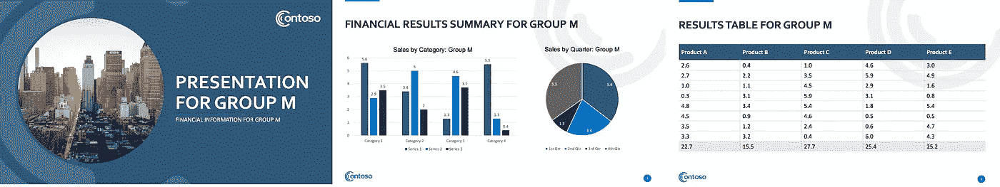

# 用 Python 和 R 生成参数化的 Powerpoint 文档

> 原文：<https://towardsdatascience.com/generating-parameterized-powerpoint-documents-in-python-and-r-333368479038?source=collection_archive---------3----------------------->

## 通过自动生成 Powerpoint 控制您的报告工作流程

许多商业报告领域的数据科学家被要求将他们的数据转换成 Powerpoint 演示文稿(不管他们喜不喜欢！).最常见的是许多参数化的演示，其中格式、图表和内容都是相同的，但数据会发生变化，例如按组织单位。经常需要从指定的示例模板生成数十、数百甚至数千个这样的报告。本教程给出了一个如何编写和自动化这样一个工作流的例子。

本教程的所有代码都可以在我的 [Github repo](https://github.com/keithmcnulty/ppt-generation) 中找到，整篇文章都引用了它。

# 背景和先决条件

本教程涉及以下场景:

*   用户群需要以包含图表和表格的可编辑 Powerpoint 文档的形式交付结果。
*   存在完全填充有虚拟数据或示例数据的示例文档。
*   同一文档需要用不同组的不同数据重新创建，并用不同的文件名保存，以便在整个组织内分发。该工作流有助于创建任意数量的这种参数化文档。

使用开源技术，这个工作流程是完全可执行的。对于 Python 中的执行，建议使用基于 Python 3.7 的 conda 环境或虚拟环境，并安装`pandas`和`python-pptx`包。为了进口到 R，将需要`reticulate`包。

本教程分为三个部分:

1.  如何使用`python-pptx`包编写一个函数来替换现有 Powerpoint 演示文稿中的数据。
2.  如何在 Python 中使用它来批量生成任意数量的参数化 Powerpoint 文档。
3.  如何将函数导入到 R 中，并使用 tidyverse 批量生成任意数量的参数化 Powerpoint 文档。

# 入门指南

假设我们为一个组织工作，该组织由 20 个销售小组组成，从 A 组到 t 组依次命名。一个名为`ppt-template.pptx`的现有 Powerpoint 文档存在于回购的`templates`文件夹中，其中的虚拟数据包含以下内容:

*   一个标题页，我们希望根据特定的销售组名称对其进行定制。
*   包含两个图表(条形图和饼图)的页面。我们将需要替换数据并重新命名这两个图表，以引用特定的销售组。
*   带有销售数据表的页面。我们希望用特定销售组的数据替换该表中的数据。


我们需要编辑的幻灯片(作者生成)

我们需要替换到该文档中的数据可以在`data`文件夹中找到。这是出于演示目的随机生成的数据。文件`chart_df.csv`包含条形图和饼图的数据，以`table_`为前缀的各种文件包含每个销售组的数据，这些数据将放入最后一张幻灯片的表格中。

# 使用`python-pptx`包替换 Powerpoint 演示文稿的元素

我们从 Python 开始，从`python-pptx`包中导入一些我们需要的函数。在这个例子中，我们只需要几个简单的函数，但是我鼓励您探索这个包中广泛可用的函数来编辑和定制 Powerpoint 元素。

```
from pptx import Presentation
from pptx.chart.data import CategoryChartData
```

接下来，我们将现有的虚拟演示加载到 Python 会话中:

```
pres = Presentation("templates/ppt-template.pptx")
```

通过检查`pres`，我们可以看到它是一个 Powerpoint 演示对象。

```
pres## <pptx.presentation.Presentation object at 0x7fb40af62140>
```

`pres`实际上是一个复杂的嵌套 XML 对象。但是正如你所料，它包含了一些幻灯片。我们可以创建一个幻灯片列表，并检查该列表是否包含我们期望的三张幻灯片。

```
slides = [slide for slide in pres.slides]
len(slides)## 3
```

看起来不错。现在，每张幻灯片都包含一些形状，可以是从文本框到图表、表格或图示的任何形状。

# 编辑形状中的文本框

让我们看看标题幻灯片上有多少个形状:

```
slide0 = slides[0]
slide0_shapes = [shape for shape in slide0.shapes]
len(slide0_shapes)## 3
```

所以标题幻灯片上有三个形状。我们知道其中一个是标题占位符文本框，另一个是副标题占位符文本框，我们可以识别并抓取它们，因为它们都包含一个`text_frame`(文本框的 XML 术语)。

```
title_shapes = [shape for shape in slide0.shapes if shape.has_text_frame]
len(title_shapes)## 2
```

现在，由于这些是占位符对象，占位符文本可能会由于模板格式而与模板中的可见内容不匹配，因此我们需要查看每个占位符的文本:

```
placeholder_text = [shape.text for shape in title_shapes if shape.has_text_frame]
placeholder_text## ['Presentation title Alt', 'Subtitle comes here']
```

我们现在可以使用这些信息来替换这些文本框中的文本。让我们对 A 组演示文稿的标题文本也这样做，以检查它是否有效:

```
title = [shape for shape in title_shapes if shape.has_text_frame and shape.text == 'Presentation title Alt']
title[0]. text = "Presentation for Group A"
```

我们可以检查这是否有效:

```
new_placeholder_text = [shape.text for shape in title_shapes if shape.has_text_frame]
new_placeholder_text## ['Presentation for Group A', 'Subtitle comes here']
```

成功了！我们可以用类似的方法来编辑字幕。

# 将新数据加载到图表中

我们可以使用形状的`has_chart`属性来识别图表对象。让我们检查一下第二张幻灯片上是否有两张图表:

```
slide1 = slides[1]
slide1_charts = [shape for shape in slide1.shapes if shape.has_chart]
len(slide1_charts)## 2
```

我们不能完全确定这些图表是按照它们在幻灯片上出现的顺序排列的，但是我们可以通过标题来识别特定的图表，标题嵌套在 chart 对象的标题文本框架中。

```
bar_chart = [shape.chart for shape in slide1_charts if shape.chart.chart_title.text_frame.text == 'Statistics here']
```

现在我们有了条形图，我们需要重写它的数据。我们注意到条形图有三个系列的条，每个代表四个类别中的一个。当我们重写此图表中的数据时，我们需要重写所有数据—不可能只重写其中的一部分。因此，我们从头开始定义类别，并将三个系列的数据写入一个`CategoryChartData`对象。这里我就用一些随机的例子数据来说明。

```
chart_data  = CategoryChartData()
chart_data.categories = ['Category ' + str(i) for i in range(1,5)]
chart_data.add_series('Series 1', range(1, 5))## <pptx.chart.data.CategorySeriesData object at 0x7fb40b15df50>chart_data.add_series('Series 2', range(2, 6))## <pptx.chart.data.CategorySeriesData object at 0x7fb40af9bc50>chart_data.add_series('Series 3', range(3, 7))## <pptx.chart.data.CategorySeriesData object at 0x7fb40af9bf90>
```

我们现在用这个数据替换条形图中的数据，并给它一个新的标题。

```
bar_chart[0].replace_data(chart_data)
bar_chart[0].chart_title.text_frame.text = "Sales by Category: Group A"
```

此时，我们可以保存我们的演示文稿并查看其中一页，看看这是否有效。

```
pres.save("test1.pptx")
```

通过检查第二张幻灯片，我们可以看到我们的条形图已经成功地用新数据进行了更新。


条形图已成功更新(作者生成)

使用类似的方法，我们也能够更新这张幻灯片的饼图和标题。

# 编辑表格

让我们使用与获取图表和文本框类似的方法获取上一张幻灯片中的表格。我们只想要一张桌子。

```
slide2 = pres.slides[2]
table = [shape for shape in slide2.shapes if shape.has_table]
len(table)## 1
```

太好了！现在表格需要一个单元格一个单元格地编辑，这听起来很痛苦，但实际上使用索引很容易。我们注意到有一行列名，然后是八行数据，然后是一行总计。让我们从数据集中引入一个表格。

```
import pandas as pd
table_A = pd.read_csv("data/table_A.csv")
table_A##      A    B    C    D    E
## 0  2.2  4.8  0.9  5.1  5.4
## 1  3.1  4.4  3.4  4.0  3.8
## 2  1.6  3.8  4.3  6.0  2.7
## 3  5.4  5.1  0.7  0.3  2.8
## 4  4.8  2.1  5.0  2.9  2.1
## 5  5.3  5.8  3.9  5.5  4.1
## 6  2.4  4.9  1.9  5.7  5.8
## 7  4.7  3.1  3.7  1.3  0.6
```

现在我们的表的第一行是一组列名，所以我们可以编辑文本以匹配我们的`table_A`数据框架中的列名:

```
for j in range(0,5):
    table[0].table.cell(0, j).text = "Product " +    table_A.columns.values[j]
```

然后，我们可以直接从数据框中更新每个单元格中的值:

```
for i in range(1,9):
    for j in range(0,5):
      table[0].table.cell(i,j).text = str(table_A.iloc[i-1, j])
```

最后，我们将一些总数放在最后一行(确保我们格式化以避免任何 Python 的浮点行为):

```
for j in range(0,5):
    table[0].table.cell(9,j).text = "{:.1f}".format(sum(table_A.iloc[:,j]))
```

让我们再次保存并检查该表是否更新了新数据:

```
pres.save("test2.pptx")
```

经过检查，我们似乎成功地更新了该表:


该表已成功更新(由作者生成)

# 创建一个函数来更新演示

既然我们已经了解了编辑此演示文稿的基本知识，我们可以通过编写一个 Python 函数来实现这一切，该函数需要五个输入，如下所示:

*   `group`:单据的集团参数。
*   `data_chart`:包含各种图表统计数据的数据帧
*   `data_table`:用来替换表格的数据帧
*   `input file`:待编辑文件的路径
*   `output_file`:新文件将被写入的路径

你可以在回购的`edit_pres.py`文件中看到这个函数。让我们找到这个函数，并通过为销售组 m 生成一个文档来测试它。

```
# load data
chart_df = pd.read_csv("data/chart_df.csv")
table_M = pd.read_csv("data/table_M.csv")# load function
exec(open('edit_pres.py').read())# write Group M presentation
edit_pres("M", chart_df, table_M, "templates/ppt-template.pptx", "test3.pptx")## 'Successfully saved version M!'
```

我们可以检查看看结果:



所有幻灯片都已成功更新(作者生成)

太好了！我们现在已经具备了开始批量生产参数化 Powerpoint 所需的一切。

# Python 中的批量生产

既然我们已经设置了 Python 函数，我们只需要将它与所有数据一起加载到我们的会话中，我们将使用这些数据为每个销售组更新到 twenty 版本中。

```
import glob
import os# load function
exec(open('edit_pres.py').read())# load all dataframes in data folder into a dict
path = "data/"
data_files = glob.glob(os.path.join(path, "*.csv"))
dataframes = dict()
for i in data_files:
    path = os.path.basename(i)
    name = path.split('.')[0]
    dataframes[name] = pd.read_csv("data/" + name + ".csv")
```

现在让我们为每个组运行我们的函数，并将输出的 Powerpoint 作为一个适当命名的文件写在一个`outputs`目录中。

```
# create outputs directory if it doesn't exist
if not os.path.isdir("outputs"):
  os.mkdir("outputs")# generate a ppt for each group
for group in dataframes['chart_df'].group.values:
  tables_data = dataframes['table_' + group]
  edit_pres(group, dataframes['chart_df'], tables_data, 
  'templates/ppt-template.pptx', 'outputs/results_group_' + group + '.pptx')## 'Successfully saved version A!'
## 'Successfully saved version B!'
## 'Successfully saved version C!'
## 'Successfully saved version D!'
## 'Successfully saved version E!'
## 'Successfully saved version F!'
## 'Successfully saved version G!'
## 'Successfully saved version H!'
## 'Successfully saved version I!'
## 'Successfully saved version J!'
## 'Successfully saved version K!'
## 'Successfully saved version L!'
## 'Successfully saved version M!'
## 'Successfully saved version N!'
## 'Successfully saved version O!'
## 'Successfully saved version P!'
## 'Successfully saved version Q!'
## 'Successfully saved version R!'
## 'Successfully saved version S!'
## 'Successfully saved version T!'
```

看起来成功了！我已经将这些输出放在 repo 的`outputs_example`文件夹中。

# 将它导入到 R 中，并使用 Tidyverse 完成一个简洁的更新工作流

为了在 R 中使用我们伟大的 python 函数`edit_pres.py`，R 需要知道在哪里可以找到包含它所使用的安装包的 Python 环境。最简单的方法是在 R 项目中创建一个名为`.Rprofile`的文件，并用它来设置`RETICULATE_PYTHON`环境变量。这将需要设置为 Python 环境中编写该函数的 *Python 可执行文件*的路径。下面是我的`.Rprofile`中的一个例子:

```
Sys.setenv(RETICULATE_PYTHON="/home/rstudio/.local/share/r-miniconda/envs/pptx/bin/python3")
```

为了让这个新变量生效，您需要重启 R。一旦 R 重启，项目中的任何 Python 代码都将由`RETICULATE_PYTHON`定义的 Python 可执行文件执行。

设置好 Python 环境后，我们可以使用`reticulate`包将 Python 函数加载到 R 中。这样，它立即成为一个 R 函数，可以处理 R 输入。

```
library(reticulate)source_python("edit_pres.py")edit_pres## <function edit_pres at 0x7fb40af17ef0>
```

我们可以将所有数据作为数据帧载入，并测试该功能是否有效:

```
# load in data files
for (file in list.files("data")) {
  splits <- strsplit(file, "\\.")
  assign(splits[[1]][1],
         read.csv(paste0("data/", file)))
} # test edit_pres function on Group M
edit_pres("M", chart_df, table_M, "templates/ppt-template.pptx", "test4.pptx")## [1] "Successfully saved version M!"
```

# 使用`dplyr`在一个整洁的表格中完成这一切

我们的`chart_df`对象是一个常规的 dataframe，其中每一行代表每个销售组的图表数据。然而，我们的表数据都存储在不同的数据帧中。我们可以添加一个*列表列*,通过在`group`列上使用 mutate 来捕获所有不同的表数据集，使其与我们的图表数据保持一致:

```
library(dplyr)full_data <- chart_df %>% 
  dplyr::rowwise() %>% 
  dplyr::mutate(
    table = list(get(paste0("table_", group)))
  )
```

如果我们检查一些列，我们可以看到我们的表存储在`full_data`数据帧的行中。

```
full_data %>% 
  dplyr::select(group, starts_with("pie"), table)## # A tibble: 20 x 6
## # Rowwise: 
##    group  pie1  pie2  pie3  pie4 table           
##    <chr> <dbl> <dbl> <dbl> <dbl> <list>          
##  1 A       4.3   5.5   1.8   1.2 <df[,5] [8 × 5]>
##  2 B       2.2   2.7   4.6   2.3 <df[,5] [8 × 5]>
##  3 C       4.1   5.1   3.2   4.4 <df[,5] [8 × 5]>
##  4 D       5     5.7   1.3   5.9 <df[,5] [8 × 5]>
##  5 E       5.1   5     0.4   5.3 <df[,5] [8 × 5]>
##  6 F       3.9   1.2   5.2   1.9 <df[,5] [8 × 5]>
##  7 G       5.7   5.3   5.4   5   <df[,5] [8 × 5]>
##  8 H       3.5   1.5   4.5   3.5 <df[,5] [8 × 5]>
##  9 I       4.4   5.4   4     0.7 <df[,5] [8 × 5]>
## 10 J       0.7   6     2.7   5.5 <df[,5] [8 × 5]>
## 11 K       2     4.8   4.4   1.6 <df[,5] [8 × 5]>
## 12 L       2.8   1.6   1.1   0.5 <df[,5] [8 × 5]>
## 13 M       3.3   3.9   0.6   2.4 <df[,5] [8 × 5]>
## 14 N       4.2   2.2   2.5   5.7 <df[,5] [8 × 5]>
## 15 O       5.6   4.5   5     2.7 <df[,5] [8 × 5]>
## 16 P       0.5   2.3   3.5   2.1 <df[,5] [8 × 5]>
## 17 Q       1     2.4   0.5   3.4 <df[,5] [8 × 5]>
## 18 R       2.4   2.1   1.2   0.9 <df[,5] [8 × 5]>
## 19 S       3.8   0.1   2.2   0.1 <df[,5] [8 × 5]>
## 20 T       1.1   4     2     3.1 <df[,5] [8 × 5]>
```

现在是最后的魔术步骤。我们可以做进一步的改变，在这个数据帧的行上运行我们的 Python 函数，以编写我们所有的 Powerpoint 文档:

```
# create outputs directory if it doesn't exist
if (!dir.exists("outputs")) {
  dir.create("outputs")
}# rowwise mutate to run function for all groups
write_pptx <- full_data %>% 
  dplyr::rowwise() %>% 
  dplyr::mutate(
    pptx = edit_pres(group, ., table, 
                     "templates/ppt-template.pptx", 
                     paste0("outputs/results_group_", group, ".pptx" ))
  )
```

这个新的数据框将包含一个新列，其中包含写入文件的确认，您可以在`outputs`文件夹中查找并检查它们。

```
write_pptx %>% 
  dplyr::select(group, starts_with("pie"), table, pptx)## # A tibble: 20 x 7
## # Rowwise: 
##    group  pie1  pie2  pie3  pie4 table            pptx                         
##    <chr> <dbl> <dbl> <dbl> <dbl> <list>           <chr>                        
##  1 A       4.3   5.5   1.8   1.2 <df[,5] [8 × 5]> Successfully saved version A!
##  2 B       2.2   2.7   4.6   2.3 <df[,5] [8 × 5]> Successfully saved version B!
##  3 C       4.1   5.1   3.2   4.4 <df[,5] [8 × 5]> Successfully saved version C!
##  4 D       5     5.7   1.3   5.9 <df[,5] [8 × 5]> Successfully saved version D!
##  5 E       5.1   5     0.4   5.3 <df[,5] [8 × 5]> Successfully saved version E!
##  6 F       3.9   1.2   5.2   1.9 <df[,5] [8 × 5]> Successfully saved version F!
##  7 G       5.7   5.3   5.4   5   <df[,5] [8 × 5]> Successfully saved version G!
##  8 H       3.5   1.5   4.5   3.5 <df[,5] [8 × 5]> Successfully saved version H!
##  9 I       4.4   5.4   4     0.7 <df[,5] [8 × 5]> Successfully saved version I!
## 10 J       0.7   6     2.7   5.5 <df[,5] [8 × 5]> Successfully saved version J!
## 11 K       2     4.8   4.4   1.6 <df[,5] [8 × 5]> Successfully saved version K!
## 12 L       2.8   1.6   1.1   0.5 <df[,5] [8 × 5]> Successfully saved version L!
## 13 M       3.3   3.9   0.6   2.4 <df[,5] [8 × 5]> Successfully saved version M!
## 14 N       4.2   2.2   2.5   5.7 <df[,5] [8 × 5]> Successfully saved version N!
## 15 O       5.6   4.5   5     2.7 <df[,5] [8 × 5]> Successfully saved version O!
## 16 P       0.5   2.3   3.5   2.1 <df[,5] [8 × 5]> Successfully saved version P!
## 17 Q       1     2.4   0.5   3.4 <df[,5] [8 × 5]> Successfully saved version Q!
## 18 R       2.4   2.1   1.2   0.9 <df[,5] [8 × 5]> Successfully saved version R!
## 19 S       3.8   0.1   2.2   0.1 <df[,5] [8 × 5]> Successfully saved version S!
## 20 T       1.1   4     2     3.1 <df[,5] [8 × 5]> Successfully saved version T!
```

# 扩展这项工作

您可以扩展这项工作，创建一个非常强大的报告基础结构，如下所示:

*   使用数据库连接来查询 Powerpoint 文档所需的数据
*   使用 web 前端(例如在 Shiny 或 Django 中),通过查询后端数据库、写入模板和提供下载的新文件，按需生成 Powerpoint。

最初我是一名纯粹的数学家，后来我成为了一名心理计量学家和数据科学家。我热衷于将所有这些学科的严谨性应用到复杂的人的问题上。我也是一个编码极客和日本 RPG 的超级粉丝。在 [*LinkedIn*](https://www.linkedin.com/in/keith-mcnulty/) *或*[*Twitter*](https://twitter.com/dr_keithmcnulty)*上找我。也可以看看我在*[*drkeithmcnulty.com*](http://drkeithmcnulty.com/)*的博客。*


pixabay.com 的好意