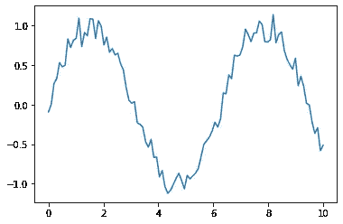

# 用 OpenAi 的 Github Copilot 生成 Python 脚本

> 原文：<https://towardsdatascience.com/generating-python-scripts-with-openais-github-copilot-da0b3fdd989?source=collection_archive---------14----------------------->


照片由[约书亚·阿拉贡](https://unsplash.com/@goshua13?utm_source=medium&utm_medium=referral)在 [Unsplash](https://unsplash.com?utm_source=medium&utm_medium=referral) 拍摄

## 使用人工智能为简单的神经网络、数据可视化等生成 Python 脚本

我已经有一段时间没有接触到 OpenAi 的 [Github copilot](https://copilot.github.com/) 的技术预览了。从那以后，我开始喜欢以函数名和描述的形式问它各种各样的问题，看看它能写出什么样的代码。

***在本文中，我将分享我是如何使用 Github Copilot extension for VS Code(技术预览版)生成 Python 脚本的，从 Keras 中简单的神经网络和数据可视化脚本到关于存在秘密的备注***

# 使用 Github Copilot 生成脚本

当你去掉所有关于像 GPT 3 这样的语言模型的天花乱坠和启示录式的谈论，并真正开始使用它们时，你会意识到这种应用范围的好、坏和丑陋。

通过揭示它们的真正潜力，我们可以评估这个令人难以置信的工具，它可能对无数不同的问题有潜在的用处(假设[有效的关注得到解决](https://www.infoworld.com/article/3627319/github-copilot-is-unacceptable-and-unjust-says-free-software-foundation.html))，以及了解它的技术限制，例如它缺乏对基本句子的真正的人类上下文理解。

## 带有 Keras 的简单神经网络

让我们从 Keras 中的一个简单的神经网络开始。对于第一个脚本，我给模型的输入是:

```
def SimpleNeuralNetKeras():
    pass
```

人工智能生成的自动完成的输出是这样的:

```
def SimpleNeuralNetKeras():
    net_net = Sequential()
    net_net.add(Dense(units=1, input_dim=1))
    net_net.compile(loss='mean_squared_error', optimizer='adam')
    net_net.fit(x_train, y_train, epochs=100, batch_size=1, verbose=0)
    net_net.evaluate(x_test, y_test, batch_size=1, verbose=0)
    net_net.predict(x_test, batch_size=1, verbose=0)
    net_net.save('my_model.h5')
    net_net = load_model('my_model.h5')
    net_net.predict(x_test, batch_size=1, verbose=0)
    net_net.evaluate(x_test, y_test, batch_size=1, verbose=0)
    net_net.fit(x_train, y_train, epochs=100, batch_size=1, verbose=0)
    net_net.evaluate(x_test, y_test, batch_size=1, verbose=0)
    net_net.predict(x_test, batch_size=1, verbose=0)
    net_net.save('my_model.h5')
    """....it goes on and on"""
```

尽管它继续建议对相同的模型进行再训练，但如果我们去掉脂肪，我们得到的是:

```
def SimpleNeuralNetKeras():
    net_net = Sequential()
    net_net.add(Dense(units=1, input_dim=1))
    net_net.compile(loss='mean_squared_error', optimizer='adam')
    net_net.fit(x_train, y_train, epochs=100, batch_size=1, verbose=0)
    net_net.evaluate(x_test, y_test, batch_size=1, verbose=0)
    net_net.predict(x_test, batch_size=1, verbose=0)
    net_net.save('my_model.h5')
```

老实说！一点都不差！让我们看看当我要求它创建一个假数据集来匹配这个神经网络设置时会发生什么:

我在这里的输入很简单:

```
x_train,
```

我得到的回答是:

```
x_train,y_train,x_test,y_test = get_data()
```

有意思。让我们看看这个模型是否能为我们写出`get_data()`函数。

我对此的看法是:

```
def get_...
```

实际上就是这样，我自动得到的是:

```
def get_data():
    """
    This function is used to get the data for the neural network.
    """
    # Load the data
    data = np.loadtxt('data.csv', delimiter=',')
    # Split the data
    x = data[:, :-1]
    y = data[:, -1]
    # Split the data
    x_train, x_test, y_train, y_test = train_test_split(x, y, test_size=0.2, random_state=42)
    return x_train,y_train,x_test,y_test
```

它看起来确实很整洁，虽然在其他小细节中，`x`和`y`的解包看起来有点奇怪，但是，它看起来确实像一段只需稍加调整就可以运行的代码。

## 数据可视化

密谋怎么样？我们能得到一些合成数据的图表吗？

这也是我对模型的输入:

```
def plotFakeData():
    """
    This function creates a fake dataset of some 
    normally distributed data and plots the result
    of passing it through a sin function.
    """
```

这是我得到的:

```
def plotFakeData():
    """
    This function creates a fake dataset of some 
    normally distributed data and plots the result
    of passing it through a sin function.
    """
    import numpy as np
    import matplotlib.pyplot as plt
    # Create some fake data
    x = np.linspace(0, 10, 100)
    y = np.sin(x) + np.random.normal(0, 0.1, 100)
    # Plot the data
    plt.plot(x, y)
    plt.show()
```

看起来很近！我们要测试一下吗？

```
plotFakeData()
```



它真的跑了！多酷啊。


米 PHAM 在 [Unsplash](https://unsplash.com?utm_source=medium&utm_medium=referral) 上的照片

虽然创建的数据不是正态分布的(我的意思是这只是我脑海中出现的随机现象)，但该模型在将数据点通过 sin 函数后，确实向数据点序列添加了正态分布的噪声，之后它成功绘制了数据。

## 写作测试

现在，为已经定义的函数编写测试怎么样？

这里我的输入是:

```
def sum_Square(a,b):
    return (a+b)**2

def test_sum_Square():
    pass
```

我得到了什么:

```
def test_sum_Square():
    assert sum_Square(2,3) == 25
    assert sum_Square(3,5) == 55
    assert sum_Square(3,5) != 56test_sum_Square()# Output (from running it on a jupyter notebook)

AssertionError                            Traceback (most recent call last)

<ipython-input-94-b8fb676bf724> in <module>
----> 1 test_sum_Square()

<ipython-input-93-bf52191596f9> in test_sum_Square()
      1 def test_sum_Square():
      2     assert sum_Square(2,3) == 25
----> 3     assert sum_Square(3,5) == 55
      4     assert sum_Square(3,5) != 56

AssertionError: 
```

还不错！实际上，第一个和第三个测试是正确的，第二个就不那么正确了，因为对于 3 和 5，预期的结果应该是 64。然而，令人印象深刻的是，这个模型实际上仅仅从一个简单的函数定义就可以做这种开箱即用的事情。


照片由[加布里埃拉·克莱尔·马里诺](https://unsplash.com/@gabiontheroad?utm_source=medium&utm_medium=referral)在 [Unsplash](https://unsplash.com?utm_source=medium&utm_medium=referral) 拍摄

## 使用 github copilot 获得哲理

在玩了模型的潜在有用应用程序后，我决定，只是为了好玩，问一些随机的伪哲学问题，看看模型会得出什么样的答案。

我的意见:

```
def writeArticleAboutSecretOfExistence():
    pass
```

我得到了什么:

```
def writeArticleAboutSecretOfExistence():
    """
    The secret of existence is to be one.
    """
```

这是一篇短文，但至少作为一个句子，它确实有一定的意义。我绝对能想象出一个老哲学家或僧侣给一个在假想的智慧山中某处寻求知识的旅行者提这个建议。


Holly Mandarich 在 [Unsplash](https://unsplash.com?utm_source=medium&utm_medium=referral) 上拍摄的照片

当然，这些函数应该是代码，但我只是玩玩而已；).

另一个:

```
def writeArticleAboutHowToSolveAnyProblem():
    pass
```

我有:

```
def writeArticleAboutHowToSolveAnyProblem():
    """
    The secret of solving any problem is to think about it in another way.
    """
    pass
```

好了，现在你知道了，换个方式想想你的问题，嘣！你解决了！

## 关于人工智能辅助编程的最后评论

我认为人工智能辅助编程的未来看起来是光明的，[尽管要成为现实世界的解决方案还需要解决一些问题](https://www.infoworld.com/article/3627319/github-copilot-is-unacceptable-and-unjust-says-free-software-foundation.html)。

随着像这样的模型越来越多地了解程序员关于代码的意图，编写好代码所需的时间可能会减少很多，我认为这可能会有惊人的好处，允许程序员专注于更重要的全局问题。

如果你想开始玩 github copilot，注册他们的[等待列表](https://github.com/features/copilot/signup)以获得技术预览。

如果你喜欢这篇文章，请在[媒体](https://lucas-soares.medium.com/)、[上关注我，订阅我的简讯](https://lucas-soares.medium.com/subscribe)，在[推特](https://twitter.com/LucasEnkrateia)、 [LinkedIn](https://www.linkedin.com/in/lucas-soares-969044167/) 、 [Instagram](https://www.instagram.com/theaugmentedself/) 、[加入媒体](https://lucas-soares.medium.com/membership)与我联系！谢谢，下次再见！:)

# 参考

*   [https://copilot.github.com/](https://copilot.github.com/)
*   [https://github.com/features/copilot/signup](https://github.com/features/copilot/signup)
*   [https://www . infoworld . com/article/3627319/github-copilot-is-acceptable-and-unright-says-free-software-foundation . html](https://www.infoworld.com/article/3627319/github-copilot-is-unacceptable-and-unjust-says-free-software-foundation.html)