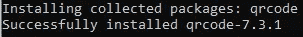
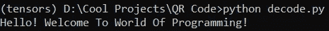

# 用 Python 生成二维码，不到 10 行

> 原文：<https://towardsdatascience.com/generating-qr-codes-with-python-in-less-than-10-lines-f6e398df6c8b?source=collection_archive---------2----------------------->

## 构建一个简单的 Python 项目，用 QR 码加密您的信息


马库斯·温克勒在 [Unsplash](https://unsplash.com?utm_source=medium&utm_medium=referral) 上的照片

在现代世界中，我们的目标是始终拥有一种安全便捷的访问方式。没有人想阅读和点击拉长的 URL 链接或冗长的单词序列。此外，在最近的疫情世界中，人们通常认为最好避免接触，在没有太多身体接触的情况下完成交易。

这一目标是借助条形码和 QR 码实现的。条形码受到一些间距限制，这通过引入 QR 码来解决。QR 码是典型的二维象形码，以在白色背景上排列成正方形图案的黑色模块的形式，为用户提供大存储容量和快速可读性。

二维码是一种极好的资源，可用于跟踪众多产品的信息、交换数据、引导客户访问登录页面或网站、下载应用程序、支付账单(在餐馆或其他地方)、购物、电子商务等等！

在本文中，我们将学习如何利用 Python 编程来创建用于任何特定目的的 QR 码。我们将生成一些用于特定目的的条形码，并通过一些解码步骤了解如何解码这些生成的代码。最后，我们将看看一些额外的东西，你可以完成的编码和解码二维码。

# 安装所有必需的库:

为了开始这个项目，Python 中有一些库要求，我们将确保在我们的系统上成功安装，以创建、生成和解码 QR 码。我们将安装的第一个二维码编码库是二维码库。

开始安装 qrcode 库模块的命令非常简单，可以使用以下 pip 命令进行安装。如果您相应地设置了环境变量的路径，您可以在您选择的虚拟环境中或者直接在命令提示符(或 windows shell)中添加以下命令行。

```
pip install qrcode
```



确保在特定的 Python 环境中也安装了 Pillow 库。这个库是操作图像和处理与视觉美学相关的大多数功能的最佳选择之一。以下命令块中显示的替代命令将安装两个基本库和附加枕形库，用于生成将被存储的 QR 码图像。

```
pip install qrcode[pil]
```

我们成功完成这个项目所需的最后一个库是计算机视觉库 Open-CV。下面的库是大多数与图像处理和计算机视觉相关的任务的重要元素之一。本项目的这个模块的目的是利用它的一个重要功能来解码生成的 QR 码中的隐藏信息。该库可以用下面的命令安装。

```
pip install opencv-python
```

计算机视觉是数据科学和人工智能最有趣的方面之一。这个主题一直在蓬勃发展，并且在未来几年将会越来越受欢迎。因此，我建议对这一领域感兴趣的观众从下面的链接查看我的 Open-CV 初学者入门指南，开始学习计算机视觉的所有基本概念。

[](/opencv-complete-beginners-guide-to-master-the-basics-of-computer-vision-with-code-4a1cd0c687f9) [## OpenCV:用代码掌握计算机视觉基础的完全初学者指南！

### 包含代码的教程，用于掌握计算机视觉的所有重要概念，以及如何使用 OpenCV 实现它们

towardsdatascience.com](/opencv-complete-beginners-guide-to-master-the-basics-of-computer-vision-with-code-4a1cd0c687f9) 

# 编码您的秘密二维码:

在本文的这一部分，我们将利用 qrcode 库对我们的信息进行编码，并生成一个快速响应代码，我们可以通过一些解码来访问它。要生成二维码，请遵循下面提供的代码片段，您将获得特定二维码的图像以及存储在其中的相关数据。

```
import qrcode# Create The variable to store the information
# link = "[https://bharath-k1297.medium.com/membership](https://bharath-k1297.medium.com/membership)"
data = "Hello! Welcome To World Of Programming!"# Encode The Link
img = qrcode.make(data)
print(type(img))# Save the QR Code
img.save("test1.jpg")
```

编码所需代码的第一步是导入我们之前安装的 qrcode 库。导入库后，我们可以创建一个变量来存储特定网站的链接，也可以创建一个变量来存储一些以 QR 码形式嵌入的有用信息。将链接编码成图像的形式，并将现在生成的 QR 码保存在您想要的文件名中。当您打印生成的图像的类型或格式时，您应该注意到显示的以下类—

```
<class 'qrcode.image.pil.PilImage'>
```

现在，我们已经学习了如何以 QR 码图像的形式对数据进行编码，让我们探索一些可以解码以下数据的方法。

# 解码秘密二维码:


作者图片

上面的图像表示是包含链接的 QR 码的表示。如果您试图访问带有 URL 链接的二维码，请尝试使用手机应用程序来解码此类二维码或任何其他应用程序来读取二维码。上面的二维码，当被一个应用程序读取时，会引导你到提供的 URL 网站。(以下链接支持其他作者和我如果申请会员)。

要解码如上图所示的 URL 链接，您可以使用 QR 码扫描仪。但是，如果您试图访问加密数据，您可以在 Open-CV 的帮助下解码信息。QR 码检测器功能为用户提供了解码特定 QR 码图像和检索 QR 码中存储的数据的选项。请查看下面的代码片段，了解您可以执行以下操作的简要想法。

```
import cv2# Create The Decoder
decoder = cv2.QRCodeDetector()# Load Your Data
file_name = "test1.jpg"
image = cv2.imread(file_name)# Decode and Print the required information
link, data_points, straight_qrcode = decoder.detectAndDecode(image)
print(link)
```

这里，我们导入 cv2 库并创建一个变量，该变量将作为解码特定 QR 码图像的解码器。然后，我们将继续加载数据，并在 cv2 库的帮助下读取数据。然后我们可以访问数据并相应地打印信息。下面的截图显示了我的输出。注意，我在 tensors 虚拟环境中运行 decode.py 文件中的解码器代码。



# 其他构建模块:

在本节中，我们将了解您可以对这个 Python 项目进行的一些改进。首先，如果你正在为一个特定的目的开发你的项目，如启动或任何其他服务，或者只是为了好玩，你可以添加一个产品、品牌或你自己的迷你标志作为 QR 码的一个组成部分，以避免混淆，并有一个清晰的项目表示。

我们可以对项目进行的下一个改进是控制生成的 QR 码。下面显示的代码块演示了如何相应地执行这样的过程。版本属性决定了二维码的矩阵大小。使用错误连接属性来分析用于 QR 码扫描的错误校正。方框大小是每个方框的像素大小，边框控制粗细。我建议尝试下面的代码块。

```
import qrcodeqr = qrcode.QRCode(
    version=1,
    error_correction=qrcode.constants.ERROR_CORRECT_L,
    box_size=10,
    border=4,
)
```

# 结论:


在 [Unsplash](https://unsplash.com?utm_source=medium&utm_medium=referral) 上由 [Toa Heftiba](https://unsplash.com/@heftiba?utm_source=medium&utm_medium=referral) 拍摄的照片

QR 码在当今的现代世界中非常重要，在这里，大多数交易和有用的数据都是通过最技术化的机制以最少的物理接触来传递的。无论您是想要交换信息、进行交易，还是简化指定特定网站的基本 URL 链接，这些二维码都是非常有用的资源。

在本文中，我们了解了借助 Python 编程，用不到十行代码生成 QR 码是多么容易。安装所需的库后，您可以生成自己的二维码，并对其进行相应的解码。您可以在这些二维码中嵌入有用的 URL 链接或重要信息，并以简单、高度结构化的格式传达给其他人。

如果你想在我的文章发表后第一时间得到通知，请点击下面的[链接](https://bharath-k1297.medium.com/membership)订阅邮件推荐。如果你希望支持其他作者和我，请订阅下面的链接。

[](https://bharath-k1297.medium.com/membership) [## 通过我的推荐链接加入媒体

### 作为一个媒体会员，你的会员费的一部分会给你阅读的作家，你可以完全接触到每一个故事…

bharath-k1297.medium.com](https://bharath-k1297.medium.com/membership) 

二维码的技术相当具有革命性，它将继续存在，直到有更好的发现取代它。因此，现在是开始探索这个话题的好时机。如果你对这篇文章中提到的各点有任何疑问，请在下面的评论中告诉我。我会尽快给你回复。

看看我的其他一些文章，你可能会喜欢读！

[](/how-to-write-code-effectively-in-python-105dc5f2d293) [## 如何有效地用 Python 写代码

### 分析使用 Python 编写代码时应该遵循的最佳实践

towardsdatascience.com](/how-to-write-code-effectively-in-python-105dc5f2d293) [](/5-best-python-projects-with-codes-that-you-can-complete-within-an-hour-fb112e15ef44) [## 5 个最好的 Python 项目，代码可以在一小时内完成！

### 用完整的代码构建五个很酷的 Python 项目，开发人员可以在一个小时内构建这些项目，并添加到您的…

towardsdatascience.com](/5-best-python-projects-with-codes-that-you-can-complete-within-an-hour-fb112e15ef44) [](/7-best-ui-graphics-tools-for-python-developers-with-starter-codes-2e46c248b47c) [## 7 款面向 Python 开发人员的最佳 UI 图形工具，带入门代码

### Python 中用于开发酷用户界面技术的七个最佳 UI 图形工具

towardsdatascience.com](/7-best-ui-graphics-tools-for-python-developers-with-starter-codes-2e46c248b47c) 

谢谢你们坚持到最后。我希望你们都喜欢这篇文章。祝大家有美好的一天！