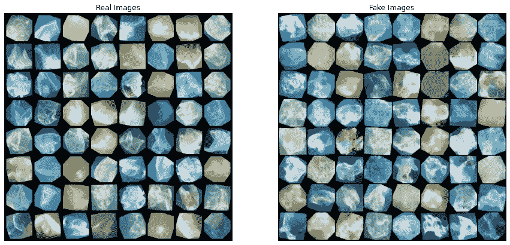
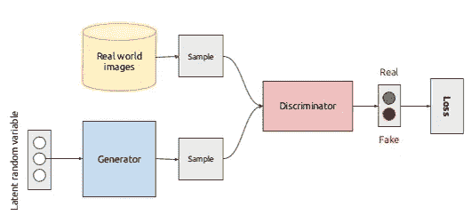
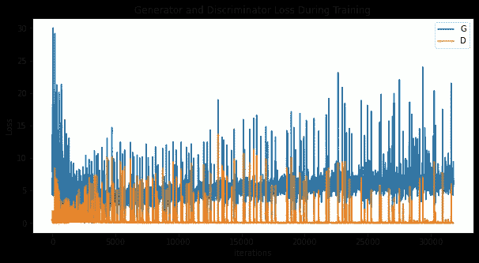

# 使用深度卷积生成对抗网络生成海洋塑料的合成图像

> 原文：<https://towardsdatascience.com/generating-synthetic-images-of-marine-plastic-using-deep-convolutional-generative-adversarial-60e6178c5aa6?source=collection_archive---------21----------------------->

## 建立一种能够使用 GANs 合成海洋塑料图像的生成方法

训练我们的 DCGAN 模型后生成的合成图像

# 问题陈述

过去十年，海洋塑料污染一直处于气候问题的前沿。海洋中的塑料不仅能够通过窒息或饥饿杀死海洋生物，而且也是通过捕集二氧化碳使海洋变暖的主要因素。近年来，已经有很多尝试来清理环绕我们海洋的塑料，例如非营利组织海洋清理。大量清理过程的问题是，它需要人力，并且不具有成本效益。已经有很多研究通过使用计算机视觉和深度学习来自动完成这一过程，以检测海洋废弃物，利用 ROV 和 AUV 进行清理。

注意:这是理论上的，我们正在努力发表我们的论文。一旦它被同行评审并在杂志上发表，我会更新这篇文章。所以，请关注我们学术论文的发布空间！

**阅读资源** : [我们关于使用 CV 和 DL 检测表层塑料的论文](https://arxiv.org/abs/2105.01882)，[明尼苏达大学关于通用海洋垃圾检测算法的论文](https://arxiv.org/abs/1804.01079)，以及[海洋清洁组织关于河流上漂浮塑料检测的论文。](https://agupubs.onlinelibrary.wiley.com/doi/full/10.1029/2019EA000960)

这种方法的主要问题是关于训练计算机视觉模型的数据集的可用性。JAMSTEC-JEDI 数据集是日本沿海海底海洋废弃物的良好集合。但是，除了这个数据集之外，数据集的可用性存在巨大差异。为此，我利用了生成性对抗网络的帮助；具体来说，DCGAN 可以筛选合成数据集，这些数据集在理论上可以是真实数据集的近似副本。(我是从理论上写的，因为有很多变量，如可用的真实图像的质量、GANs 的进展、培训等)。

## GAN 和 DCGAN

GANs 或生成对抗网络是由 Ian Goodfellow 等人在 2014 年提出的。GANs 由两个简单的组件组成，称为生成器和鉴别器。该过程的一个过度简化如下:生成器的作用是生成新数据，鉴别器的作用是区分生成的数据和实际数据。在理想情况下，鉴别器无法区分生成的数据和真实数据，从而产生理想的合成数据点。

DCGAN 是上述 GAN 架构的直接扩展，只是它分别在鉴别器和发生器中使用了深度卷积层。最早是由拉德福德等人描述的。al 在论文[中用深度卷积生成对抗网络进行无监督表示学习](https://arxiv.org/pdf/1511.06434.pdf)。鉴别器由步进卷积层组成，而发生器由卷积转置层组成。

甘建筑(来源:[此处](https://sigmoidal.io/beginners-review-of-gan-architectures/))

# PyTorch 实现

在这个方法中，我们将在 [DeepTrash](https://zenodo.org/record/5562940#.YWSaTNnMK3I) 数据集**(引用链接:**[**https://zenodo.org/record/5562940#.YZa9Er3MI-R**](https://zenodo.org/record/5562940#.YZa9Er3MI-R)**)上应用 DCGAN 架构，在** [**知识共享署名 4.0 国际**](https://creativecommons.org/licenses/by/4.0/legalcode) **许可下发布**。如果你不熟悉 DeepTrash 数据集，可以考虑阅读我的论文[一种使用深度视觉模型量化表层绑定塑料的机器人方法](https://arxiv.org/abs/2105.01882)。DeepTrash 是海洋表层和深海层塑料图像的集合，用于使用计算机视觉进行海洋塑料检测。

让我们开始编码吧！

# 代码

## 安装要求

我们首先安装构建 GAN 模型的所有基本需求，比如 Matplotlib 和 Numpy。我们还将利用 Pytorch 的所有工具(如神经网络、转换)。如果您不熟悉 PyTorch，我建议您阅读这篇文章:

基本安装要求

## 初始化我们的超参数

这一步相当简单。我们要设置超参数来训练神经网络。这些超参数直接从论文和 PyTorch 关于训练 GANs 的教程中借用。

## 发生器和鉴别器架构

现在，我们定义生成器和鉴别器的架构。

## 定义培训功能

在定义了生成器和鉴别器类之后，我们继续定义训练函数。训练函数接受生成器、鉴别器、优化函数和历元数作为参数。我们通过递归调用训练函数来训练生成器和鉴别器，直到达到所需的历元数。我们通过遍历数据加载器，用来自生成器的新图像更新鉴别器，并计算和更新损失函数来实现这一点。

## 监控和培训 DCGAN

在我们建立了生成器、鉴别器和 train 函数之后，最后一步是简单地调用 Train 函数来获得我们定义的历元数。我还使用了 [Wandb](https://wandb.ai/site) 来监控我们的训练。

## 结果

我们绘制了培训过程中发生器和歧视造成的损失。

训练期间发生器和鉴别器损耗

我们还可以调出生成器如何生成图像的动画，看看真实图像和虚假图像之间的区别。

大概是这样的:

以及训练后的最终结果图像(与上述图像相同)。

# 结论

在本文中，我们讨论了使用深度卷积生成对抗网络来生成海洋塑料的合成图像，研究人员可以使用这些图像来扩展他们当前的海洋塑料数据集。这有助于让研究人员能够通过混合真实和合成图像来扩展他们的数据集。正如你所看到的结果，GAN 仍然需要大量的工作。海洋是一个复杂的环境，具有变化的光照、混浊度、模糊度等。但这是一个理论起点，其他研究人员可以以此为基础。如果您对改善结果和构建更好的网络架构感兴趣，请联系 gautamtata.blog@gmail.com 大学的我。