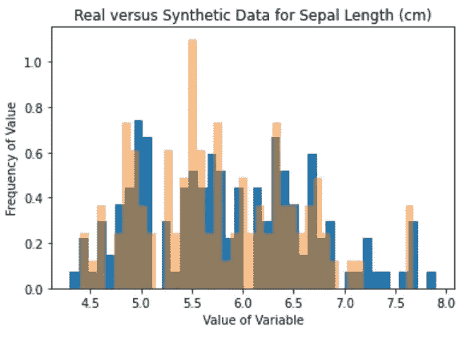
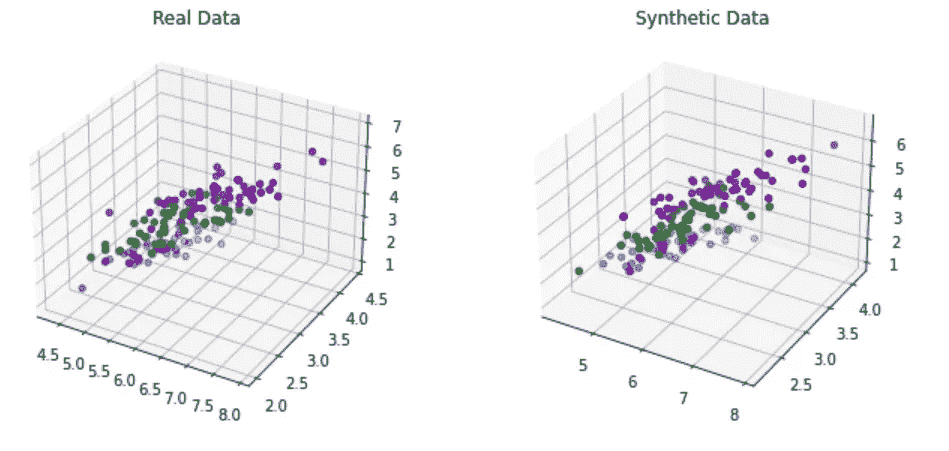
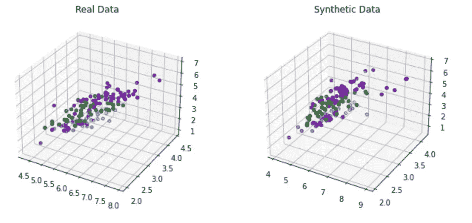
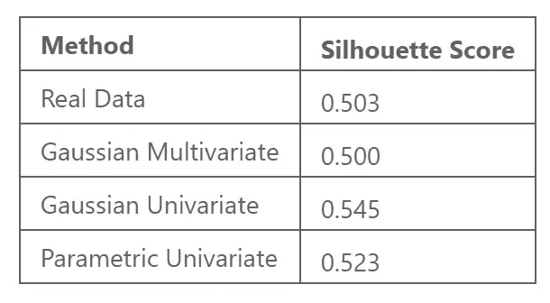

# 用 Copulas 生成综合多元数据

> 原文：<https://towardsdatascience.com/generating-synthetic-multivariate-data-with-copulas-edd1c4afa1bb?source=collection_archive---------17----------------------->

## 创建更多与您的数据具有相同要素依赖关系的数据


五月在 [Unsplash](https://unsplash.com?utm_source=medium&utm_medium=referral) 拍摄的

A Copula 是多元累积分布函数，其中每个变量的边际概率分布在区间[0，1]上是均匀的。

> 但是这到底是什么意思呢？

当您需要对多元分布的依赖结构进行建模时，可以使用 Copulas。例如，**在金融中经常使用**来捕捉多个时间序列之间的依赖结构。然而，copulas 在非平稳数据上不是很好定义的。

Copulas 用于模拟随机变量之间的相关性。Copulas 的基础是围绕 Sklar 定理展开的。

## **斯克拉尔定理:**

任何多元联合分布都可以用一元边际分布函数和描述变量相关结构的 copula 来表示。


Sklar 定理(作者供图)

这是什么意思？这意味着数据的多元联合分布可以使用边际和 Copula 进行建模。

好吧，当然，但我为什么要知道这个？为什么理解多元联合分布有帮助？

# 生成多元数据

在 python 中为单个变量创建概率密度函数非常容易。例如，Scipy 的函数“rv_histogram”生成一个概率分布，您可以根据一些数据从中进行采样。

下面我有一个这样做的例子。首先，我使用虹膜数据集中带有“萼片长度”的 NumPy 直方图生成一个直方图。接下来，使用‘RV _ histogram’函数，我从直方图中创建一个概率分布。最后，利用这种分布，对 100 个值进行采样，并与原始数据集进行比较。

```
import scipy.stats
import numpy as np
import matplotlib.pyplot as pltbins= 40
hist = np.histogram(df[cols[0]], bins=bins)
hist_dist = scipy.stats.rv_histogram(hist)
synthetic_data = hist_dist.rvs(size=100)
```



创建萼片长度的概率分布(作者照片)

但是当你想生成多元数据的时候呢？

希望很明显，为每个特征创建数据并将其组合是非常有缺陷的。这里我们可以使用' **Copulas** '，专门研究 Copulas 的 python 库。这个库提供了相关的函数来为你所拥有的数据创建一个 copula。**copula 表示每个特征之间的依赖关系。**

使用分类任务，可以在类级别上生成数据。在下面的代码块中，根据每个类的分布开发了不同的多元数据分布。最后，使用这些分布创建新的合成数据。

```
def generate_multivariate_data(df, dist, samples=50):
    df_sample = pd.DataFrame({})
    for t in df['target'].unique():
        dist.fit(df[df['target']==t].drop(['target'],axis=1))
        sampled = dist.sample(samples)
        sampled['target'] = t
        df_sample = df_sample.append(sampled)
    return df_sample
```

copula 软件包提供了一些有用的可视化工具来比较实际数据和生成的数据。但是，它不支持给每个类添加颜色。

我已经调整了 GitHub 的功能，为每个职业保留了一个彩色地图。以下两个函数为实际数据和合成数据创建了两个 3D 散点图。

```
from copulas.multivariate import GaussianMultivariatedef scatter_3d_color(data, columns=None, fig=None, title=None, position=None):
    """Plot 3 dimensional data in a scatter plot."""
    fig = fig or plt.figure()
    position = position or 111
    ax = fig.add_subplot(position, projection='3d')
    ax.scatter(*(
        data[column] for column in columns or data.columns
    ), c=color_indices, cmap=colormap)
    if title:
        ax.set_title(title)
        ax.title.set_position([.5, 1.05])
    return axdef compare_3d_color(real, synth, columns=None, figsize=(10, 4)):
    columns = columns or real.columns
    fig = plt.figure(figsize=figsize)
    scatter_3d_color(
        real[columns], fig=fig, 
        title='Real Data', position=121
    )
    scatter_3d_color(
        synth[columns], fig=fig, 
        title='Synthetic Data', position=122
    )
    plt.tight_layout()colors = ["blue", "green", "purple"]
color_indices = [0]*50 + [1]*50 + [2]*50
colormap = matplotlib.colors.ListedColormap(colors) dist=GaussianMultivariate()
df_s = generate_multivariate_data(df, dist)
compare_3d_color(df[cols[0:3]], df_s[cols[0:3]])
```



高斯多元 Copula(作者供图)

如果每个特征的单变量分布是已知的，则这些分布被传递到 Copula 中。随后的数据样本用单变量高斯分布估计分布。


高斯单变量 Copula(作者供图)

然而，准确地确定数据的分布是相当具有挑战性的。

幸运的是，Copulas 库还为一类分布中的单变量分布估计提供了实用工具。例如，最终图使用参数单变量来生成合成数据。



参数单变量 Copula(作者图片)

# 数据有多好？

为了比较真实数据和合成数据，我使用剪影分数。轮廓分数是对每个聚类被定义得有多好的度量。当真实标签未知时，该分数用于聚类任务。虽然在这种情况下，标签是已知的，但不执行任何预测。因此，我展示了原始数据的侧影得分与合成数据的得分。


剪影评分 S(作者照片)

根据底层数据的分布，有几种不同的方法来模拟合成数据。



剪影评分比较(作者照片)

当剪影得分为 1 时，聚类的定义最为清晰。然而，即使对于实际数据来说，情况也并非如此。高斯单变量和参数单变量方法得分较高。尽管如此，这里的数据可能不太能代表实际数据。

该过程旨在生成与原始数据集相似的数据。虽然这两种方法表现更好，但多元高斯方法是理想的，因为分数更接近实际数据。目的是模拟实际数据，即使原始数据不是那么可分的。

# 结论

连接函数是一个迷人的统计函数。对变量之间的依赖结构进行建模的能力对于理解和处理数据是一个有价值的属性。

这些函数还能够生成有效模拟预先存在的多元数据的合成数据。当您想要对多元数据建模或创建一些自定义合成数据时，请考虑使用 copulas。

如果你有兴趣阅读关于新颖的数据科学工具和理解机器学习算法的文章，可以考虑在 Medium 上关注我。

*如果你对我的写作感兴趣，想直接支持我，请通过以下链接订阅。这个链接确保我会收到你的会员费的一部分。*

[](https://zjwarnes.medium.com/membership) [## 通过我的推荐链接加入 Medium-Zachary Warnes

### 阅读扎卡里·沃恩斯(以及媒体上成千上万的其他作家)的每一个故事。您的会员费直接支持…

zjwarnes.medium.com](https://zjwarnes.medium.com/membership)